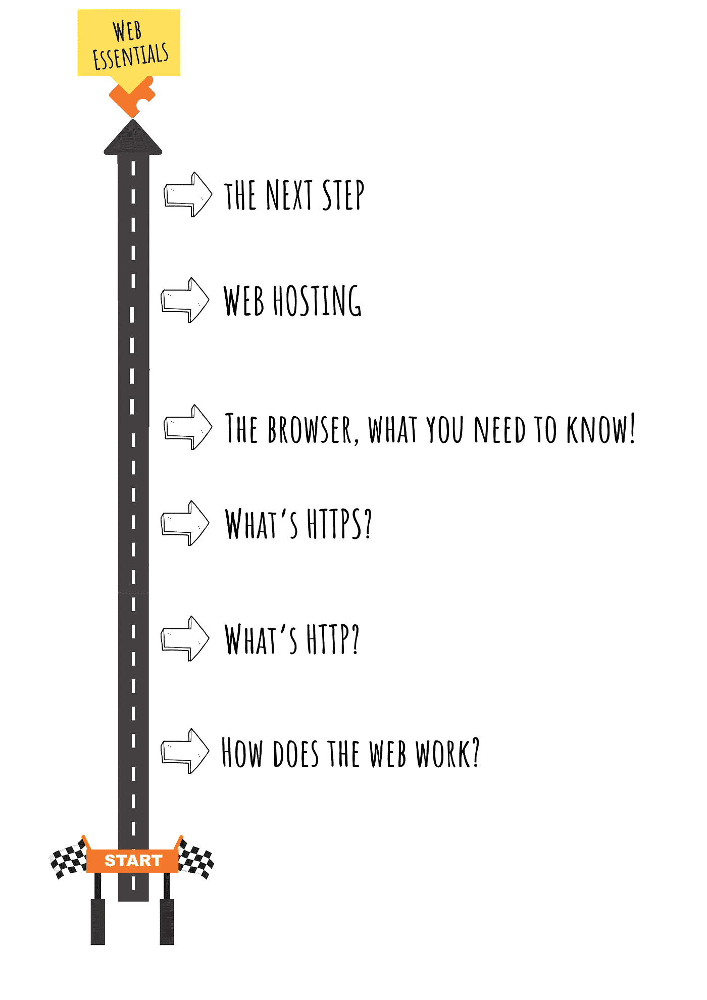
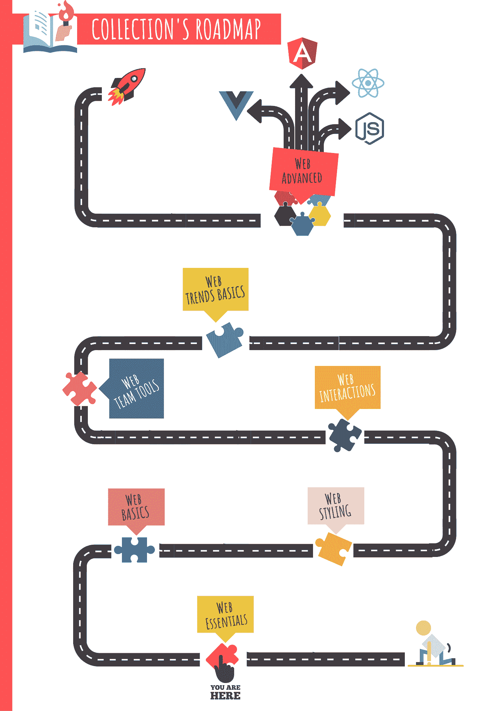
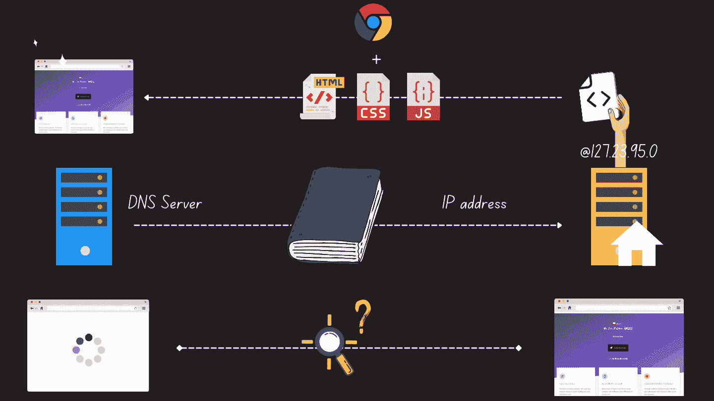

# 我的第一个前端收集的电子书是免费的！

> 原文：<https://levelup.gitconnected.com/my-first-frontend-collections-e-book-is-out-and-free-92da24543f98>

## 通过例子、插图和具体有用的总结来学习

作者:FAM

嗨，

通过我的 web 开发之旅，我了解到一些 web 开发人员缺乏关于 web 的一般文化。

我创作这本电子书是为了给出一个简短而有效的故事，讲述网络是如何工作的，以及每个网络开发者都应该学习和理解的关键词。

这个想法来自我帮助学习现代 web 开发的一群学生。他们发现我的解释很直观，很容易想象事物是如何运作的，因此很容易记住。这些学生建议为现代网络开发做一个收集。我那时没有找到时间，但是现在我的收藏来到了这个世界😜

电子书是完全免费的。我想和每个人分享我的知识。

作者:FAM

# 电子书有什么？

在这本电子书中，我们将遵循以下路线图:

*   ***网络是如何工作的？***
*   **T5【什么是 HTTP**
*   ***什么是 HTTPS***
*   ***浏览器，你需要知道什么***
*   ***虚拟主机***
*   ***下一步***

作者:FAM

# 整体情况是怎样的？

Web essentials 电子书是一个集合的一部分，涵盖了您需要了解的关于现代 Web 开发的所有内容。这本电子书是第一步。

作者:FAM

如你所见，旅程很长，但绝对值得！

这是一个简短的预告片😁对于我即将推出的电子书视频:

作者:FAM

# 哪里可以找到电子书？

[电子书](http://www.fam-front.com/e-books/essentials)在我的网站 [FAM 锋](http://www.fam-front.com/)上有。正如我前面所说，你可以免费得到它。这段视频一发布到 Youtube 上就会被添加到这篇文章中。

网络基础电子书:

 [## 前面

### 欢迎来到❤家庭前线

www.fam-front.com](http://www.fam-front.com/e-books/essentials) 

> 一如既往，任何反馈都是受欢迎的(*窃窃私语:积极或消极的 Hihihi …尽管从积极开始*😂)

亲爱的读者，感谢你在我生命中的存在。

**让我们在** [**上取得联系**](https://medium.com/@famzil/)**[**Linkedin**](https://www.linkedin.com/in/fatima-amzil-9031ba95/)**[**脸书**](https://www.facebook.com/The-Front-End-World)**[**insta gram**](https://www.instagram.com/the_frontend_world/)**[**Youtube**](https://www.youtube.com/channel/UCaxr-f9r6P1u7Y7SKFHi12g)**或**********

******参见我的新电子书[关于网络要素和一般文化。](http://www.fam-front.com/)******