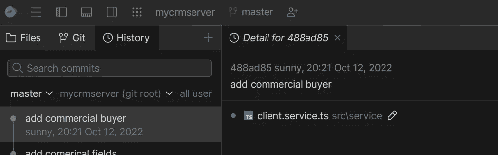
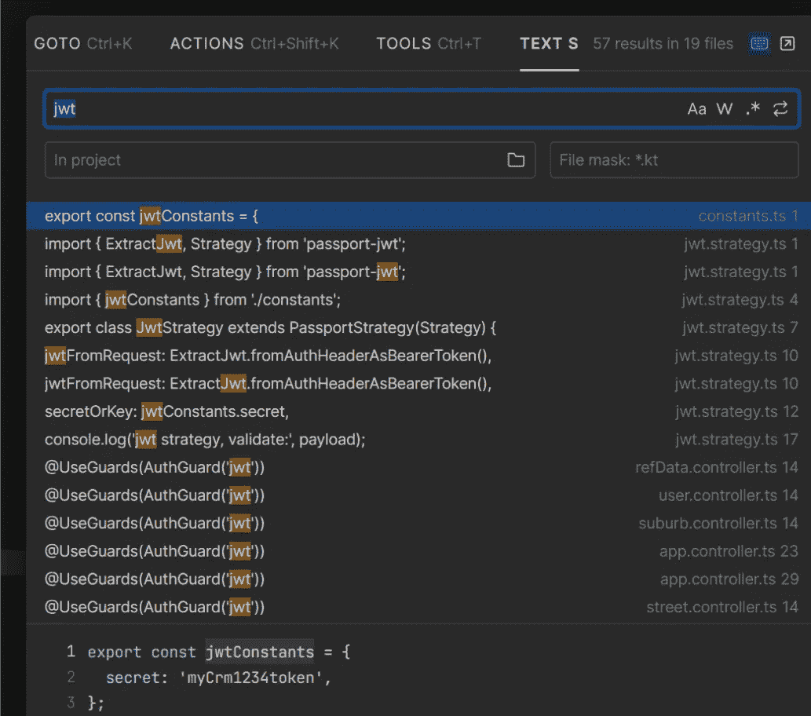

# 我对 JetBrains 舰队的第一印象

> 原文：<https://levelup.gitconnected.com/my-first-impression-of-jetbrains-fleet-c0f2d9a89d91>

## 它能代替 VSCode 吗？

快速的

2022 年 10 月 12 日，JetBrain [宣布](https://blog.jetbrains.com/fleet/2022/10/introducing-the-fleet-public-preview/)舰队的首次公开预览。如果你没有听说过 Fleet，它是一个免费的、轻量级的、功能齐全的 IDE。换句话说，它是一个 VSCode 替代项。

作为一个长期的 VSCode 用户，我很想知道它到底有多好。我来分享一下我的第一印象。

首先，让我们导航到 JetBrain 网站[下载](https://www.jetbrains.com/fleet/download/)它。

## 装置

舰队目前只能通过[工具箱应用](https://www.jetbrains.com/toolbox-app/)获得。所以我下载了工具箱 App，从工具列表安装 Fleet 就开始了。

JetBrain 工具箱

下载和安装需要几分钟时间。第一次打开后，界面如下图所示。如您所见，有几个选项(SSH、GIT、Docker)可用于连接。

第一屏

点击打开按钮，我打开了一个我目前正在做的 NestJS 项目。打开和加载项目的速度快得惊人。

在窗口的左侧，有“文件”、“Git”和“历史”选项卡。选项卡之间的切换很流畅，没有任何明显的延迟。Git 和 History 选项卡的设计简单、干净、直观。我真的很喜欢。

## 智能模式

当我点击打开第一个源文件时，会弹出下面的“智能模式”提示。

根据 JetBrain 的说法，以下功能需要智能模式:

*   语义突出显示(没有智能模式时部分可用)
*   代码完成(没有智能模式时部分可用)
*   代码重构
*   导航和搜索(没有智能模式时部分可用)
*   查找用法
*   参数和表达式的类型信息检索

点击“启用”按钮，需要一段时间来加载和更新一些东西，如依赖关系，索引等。

加载完所有内容后，源代码以不同的颜色显示，IntelliSense 也可用。我确实注意到当我第一次尝试调用 Intellisense 时有一点延迟。过一段时间就顺利了。值得注意的是，TypeScript 支持似乎相当不错。

## 主题、搜索和设置

默认主题是“黑暗舰队”模式，看起来还不错。还有其他选择。“深紫色”是我的最爱。

作为一个 VSCode 用户，我想搜索的时候自然会键入“Ctrl + P”。正如我对 Fleet 所做的那样，会显示一个搜索弹出窗口！

有四个选项卡:转到、操作、工具和文本(全文搜索)选项卡。您可以快速查找文件、符号和工具，并查找动作。与 VSCode 相比，即使不比它更好，也和它一样好。

键入“Ctrl + Alt + S”进入设置屏幕。您可以在设置中更改许多编辑器配置。但与 VSCode 相比非常有限。比如你去“编辑器:重构”，只有一个选项可用。

## 内存使用

到目前为止，舰队似乎非常敏感。但是舰队需要多少记忆呢？

打开任务管理器，我惊讶的发现它消耗了 3 G 内存。

打开同一个项目时，VSCode 消耗大约 1.63 G 内存。

这可能是产品仍处于预览阶段的原因之一。让我们期待它在最终版本中会有所改进。

## 缺少什么

一个明显缺失的功能是 VSCode 扩展的等效功能。经过一番搜索，看起来 Fleet 还没有可用的插件功能。

不幸的是，这对我来说是一个交易破坏者。我无法想象我会在无法使用我的 copilot 和其他一些我日常使用的扩展的情况下使用这个工具。

我也很好奇在即将到来的版本中会有什么改进。JetBrain rider 以其强大的重构功能而闻名。他们会给 Fleet 带来更多的重构特性吗？

## 摘要

Fleet 是一个非常好的 IDE 工具。这是愉快的使用，具有良好的性能，并具有良好的用户界面。我真正喜欢的是它的 Git 集成和可搜索性。

但是它还不能取代 VSCode，至少目前是这样。插件功能的缺乏是一个主要问题。

我很高兴看到 VSCode 有一个强大的潜在竞争对手。我会继续关注它，希望它很快成为对 VSCode 的真正威胁。