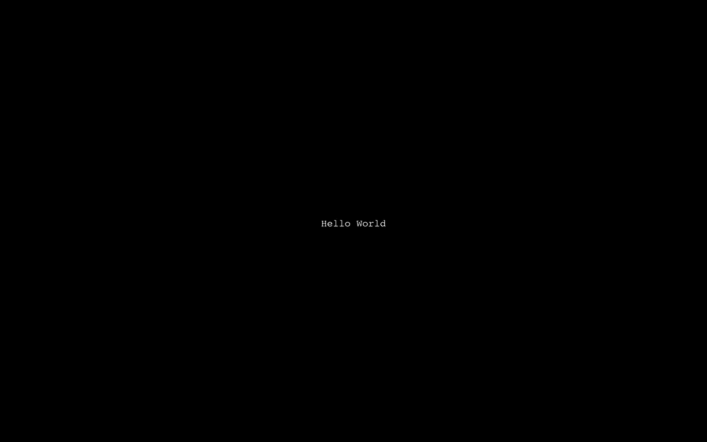
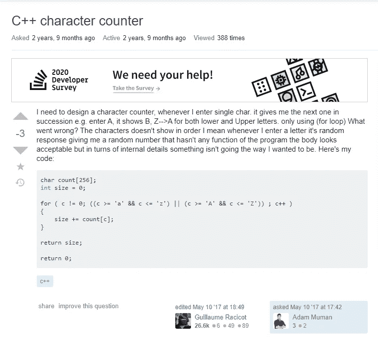
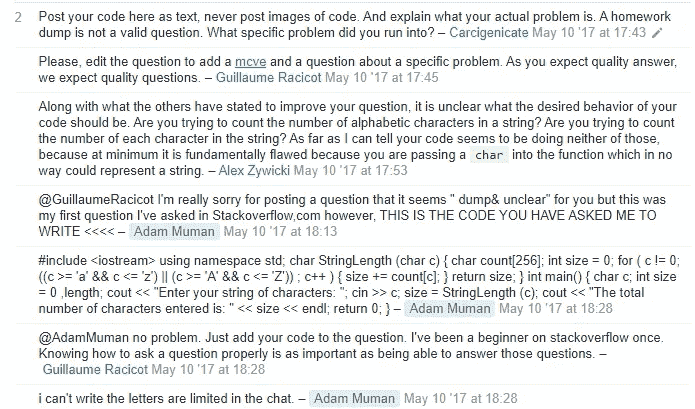

# 我的第一行代码

> 原文：<https://levelup.gitconnected.com/my-first-line-of-code-763bcad822a5>

回想两年前我上大一的时候，我的课程中有一门编程课。这是一门介绍性课程，旨在向学生传授用 C++讲授的编程基础。我将带你经历我的第一行代码的故事，那是我编程生涯的开始。

## **《你好世界》的阴暗面**

编译器黑屏上的 Hello World

在我的第一次编程讲座中，我走进教室看到一群戴着眼镜的极客，那一刻我在想“我到底在这里做什么？”然而，我振作起来，看到一个空的桌面，我坐了下来。我环顾四周，看到了我的老师。她是一位 25 岁左右的年轻女士，刚刚毕业。几分钟过去了，我们开始互相介绍。我意识到她很友好，你可能认为一切都很好，这就是故事的结局，哦不不不！

不知从哪儿冒出来的，她让我们打开电脑，为编程测试做准备——这让我们大吃一惊。我感觉就像一个闪电击中了我，她告诉我们写一个程序，在黑屏上显示“你好，世界”。你必须在期末前完成它。在当时的课程材料中，我们使用的是 TurboC 编译器，这是一种在 DoS 下编程的旧编译器，需要一个仿真器来运行编译器。TurboC 拥有蓝灰色的用户界面颜色，更不用说记录编译代码的黑屏监狱，甚至没有鼠标光标导航。

我吓坏了，不知道该怎么办。我对自己说“我到底要怎么做呢？”我被甩了出去，试图解决它，我的头撞在墙上，我在想编程是很难的，需要聪明的人来编码！但是我开始花更多的精力和时间去理解和学习我犯的每一个错误。很快我开始越来越多地解决问题，我对情感上的回报感到惊讶。我开始对编程有了不同的看法。我想写代码并没有那么难。

## 我的第一叠**溢出**题！

我关于 StackOverflow(字符计数器)的第一个问题

学期中的一天，我的老师给我们出了一道题，当她开始解释这道题时，已经是周末了。铃声响了，下课了。每个人都开始收拾行李，准备离开，但我决定多呆一会儿，继续完成这项任务。

我记得那一天，问题是我唯一的想法。我打开我的笔记本电脑，开始挖掘问题，试图解决它。在两天的碰壁无果后，我开始在谷歌上搜索这个问题。我第一次发现 [*StackOverflow*](https://stackoverflow.com/) 。我对此感到惊讶。我不知道在一个平台上有一个遍布全世界的程序员社区，所以我在 stack overflow 写了我的第一个问题。你猜怎么着，那是**可怕的**。

关于堆栈溢出问题的回复

我把整个代码片段贴在了评论区，每个人都开始愤怒，因为这违反了 StackOverflow 的规则。我已经从错误中吸取了教训。很多人都给出了答案，但大多数都与我的问题无关，直到一个人给了我解决问题的关键伪代码。当时我对这个解决方案非常满意。

第二天在学校，这是一周的开始，是时候提交问题的解决方案了。令人惊讶的是，我发现只有我一个人解决了。这是生命中的一个时刻，我觉得我已经取得了一些特别的成就。

现在，每当我回顾这些记忆时，我都会怀念我对编程的热情是如何与我一起成长的，这是不断推动我学习和发现的动力。