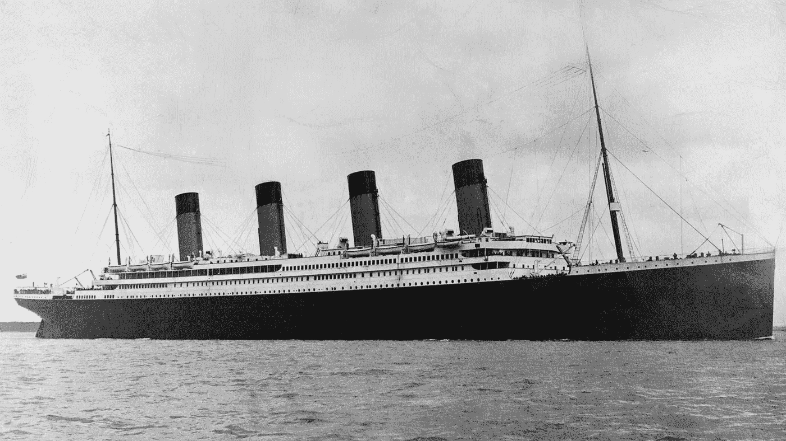
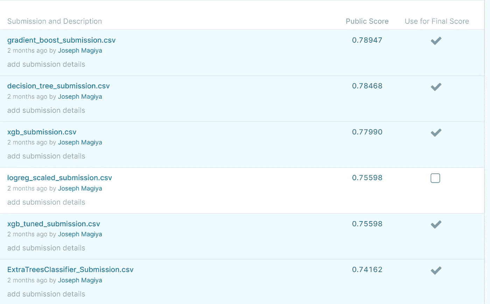

# 我的第一次机器学习竞赛——预测泰坦尼克号乘客幸存者

> 原文：<https://levelup.gitconnected.com/my-first-ml-competition-titanic-74686e0a37a7>



泰坦尼克

什么是 Kaggle？Kaggle 是一个由数据科学家和机器学习者组成的在线社区。Kaggle 允许用户查找和发布数据集，探索和构建模型，与其他数据科学家合作，并参加竞赛以解决数据科学挑战。

> Kaggle 是数据科学家的 AirBnB，这是他们度过夜晚和周末的地方。

😆

我于 2016 年加入 Kaggle，当时我刚刚进入数据科学领域——[请在 Kaggle](https://www.kaggle.com/josephanyona) 、 [LinkedIn](https://www.linkedin.com/in/joseph-magiya/) 上查看我的信息。首先出现的是泰坦尼克号比赛，我报名参加了。不幸的是，直到最近我才开始尝试解决这个难题。现在比当时更令人兴奋。如果你是一名数据科学家，正在阅读这篇文章，或者想学习机器学习——注册吧，这是免费的。抓住这个机会，我保证你会从这个过程中学到超乎你想象的东西。

泰坦尼克号在与冰山相撞后沉没了。不幸的是，没有足够的救生艇容纳船上的每个人，导致 2224 名乘客和船员中的 1502 人死亡。虽然幸存有一些运气成分，但似乎某些群体比其他群体更有可能幸存。作为一名数据科学家，这立即激起了我的兴趣。

比赛的目标很简单:使用机器学习来创建一个模型，预测哪些乘客在泰坦尼克号沉船事件中幸存。

我认为这是分析后的下一步。在我的研究和分析过程中，我遇到了大量的[笔记本](https://www.kaggle.com/c/titanic/notebooks)，它们帮助我找到了正确的方向。我在 PowerBI 中做了我的分析——它在可视化和分析数据方面更容易、更快捷。

我也看了竞赛的[教程](https://www.kaggle.com/c/titanic/overview/tutorials)部分，我看到 Excel 里面有机器学习！💥我必须在未来的某个时候尝试这个(从今天起不到 3 年的时间内)。

如果你是一名数据科学家/机器学习大师，或者甚至只是想成为一名数据科学家/机器学习大师，Kaggle 是一个很好的开始平台——尤其是在泰坦尼克号挑战中。

我花了大约两周的时间制作这个模型，并提交了我的作品。我喜欢学习不同的方法和模型。我提交了几份申请，试图得到最好的分数

我最好的模型如下所示。



在为这项挑战构建不同的模型时，准确度得分如下:

```
accuracy = accuracy_score(y_test, y_pred)
```

*   随机森林— 78.48%
*   XGBoost — 82.96%
*   XGBoost(超参数调优后)— 82.06% —这里我明显漏掉了一些东西。
*   决策树分类器— 82.06%
*   超调决策树分类器— 81.17%
*   特征比例决策树分类器— 79.82%
*   套袋— 75.34%
*   超调套袋——80.27%
*   特征比例装袋— 80.27%
*   梯度提升— 91.03%
*   额外树分类器— 98.21%
*   逻辑回归— 77.13%
*   特征比例逻辑回归— 76.68%

正如你已经知道的，建立模型时的准确性分数与 Kaggle 分数非常不同。大多数时候，我们使用 *accuracy_scores* 来衡量我们模型的性能，从上面可以非常明显地看出，这不足以真正判断我们的模型。在现实世界中，我们可能需要测试不同的东西，看看哪个适合我们的场景——不要害怕尝试。

如果你需要看一下我的笔记本——里面有比我上面列出的更多的信息，这里有[链接](https://github.com/JosephMagiya/Kaggle---Titanic-Competition)