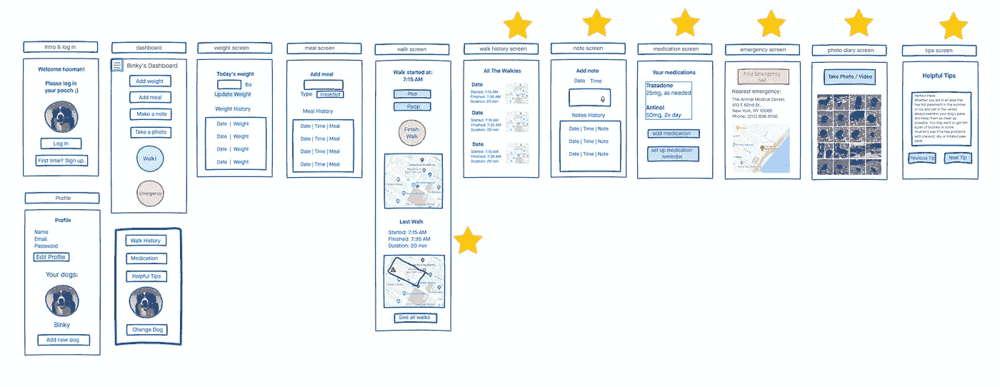
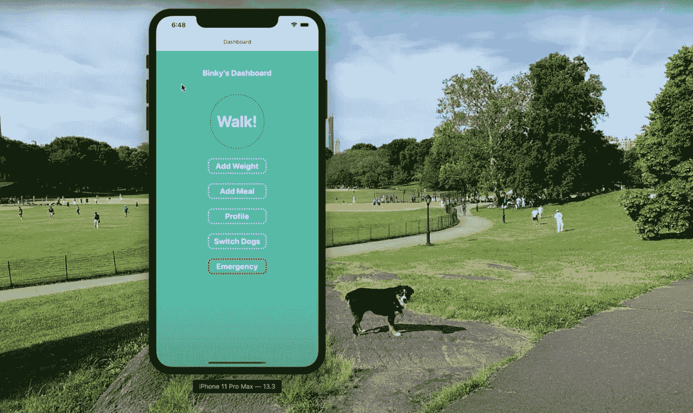
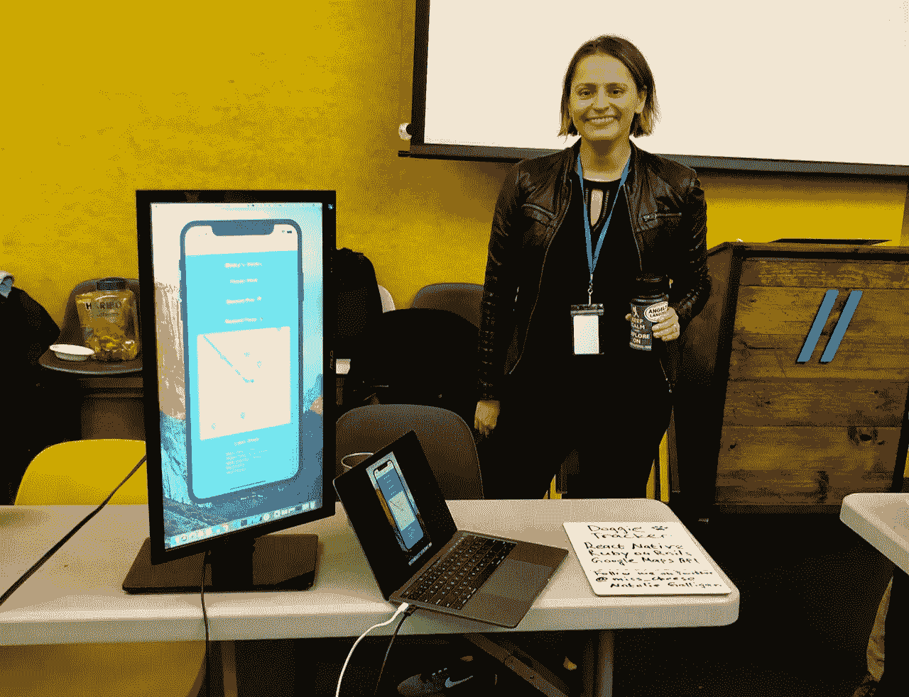
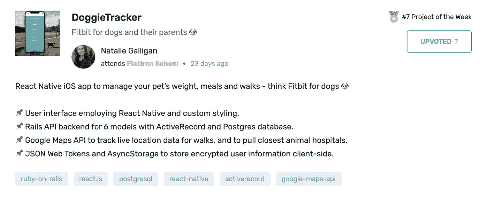

# 我的第一个 React 原生应用

> 原文：<https://levelup.gitconnected.com/my-first-react-native-app-c4f5b7392311>

## 或者我如何建立 DoggieTracker，为狗设计的 Fitbit🐶

在熨斗学校的项目结束时，每个人都必须建立一个个人项目。你有三周时间做你想做的事。说真的，没有讲座，实验室，或代码挑战。只有你和你的项目。

[安德鲁·尼尔](https://unsplash.com/@andrewtneel?utm_source=unsplash&utm_medium=referral&utm_content=creditCopyText)在 [Unsplash](/s/photos/creative-project?utm_source=unsplash&utm_medium=referral&utm_content=creditCopyText) 上拍照

## 怎么选择建什么？

在你希望未来工作的领域里做些事情是有意义的。例如，如果你想在金融科技行业工作，你会开发一个预算/投资应用程序，或者如果你想在一家特定的公司工作，你会使用他们的技术来熟悉它，以便将来面试。

或者有一种不同的方法——做你喜欢的事情，因为你应该在接下来的三周(或者需要多长时间)享受你正在做的事情。如果你不喜欢你正在做的事情，很可能你会厌倦它。我听说过这样的故事，有些人直到毕业几个月后才能看到自己的项目。我不想和他们一样。

那我喜欢什么？我喜欢记录我的活动、睡眠、锻炼的次数等等。我是量化自我的海报小孩(除了计算卡路里，我就是做不到！).我也爱狗，也养了一只，也经常把自己当成直升机狗妈。😁那么，为什么不开发一个应用程序来跟踪你的狗的体重、饮食和散步呢？如果你使用这个应用程序来跟踪行走，那么它应该是移动的，这样你就可以在旅途中使用它。这就是我决定构建 React 原生应用的原因。

你好未来狗狗追踪应用！

你好！

这个想法被批准后，我开始工作。注意我没有说我开始编码——首先有很多工作要做。

# 在你开始编码之前

有多少次，你对构建新的东西如此兴奋，以至于没有经过深思熟虑就冲进去了？很难不立即编码，但你真的应该停下来，想想你想要实现什么，以及如何实现。

## 你应该从以下问题开始:

1.  有哪些用户故事？
2.  应用程序会是什么样子？画线框。
3.  你需要什么样的数据库模型，它们之间有什么样的关系？
4.  每个型号都需要什么样的信息？
5.  你的应用程序的组件树会是什么样子？
6.  我需要使用任何 API 吗？

这是我想到的。

## 用户情景—用户应该能够:

1.追踪狗的重量

2.跟踪用餐情况(伸展:设置用餐提醒)

3.赛道行走:

-持续时间(拉伸:距 GPS 的距离)

-记录小便

-记录便便(拉伸:记录数量、颜色和浓度)*狗父母会理解的😉

4.留下笔记(拉伸:添加录音)

5.跟踪药物(拉伸:药物提醒)

6.紧急信息—查找最近的动物医院(伸展)

7.狗狗照片/视频日记(比如 1 秒日常应用，拉伸)

8.有益的狗提示(伸展)

## 线框，或者我希望应用程序看起来像什么:

DoggieTracker 线框。星星标志着挑战目标。

你可以在视觉应用上看到我的项目板[的其余部分。](https://nataliegalligan603398.invisionapp.com/freehand/Doggie-Tracker-Ideas-6TZcpvVWu)

在你开始编码之前，把一切都考虑清楚是多么的重要，这一点我怎么说都不为过！你可能认为这没什么大不了的，但是突然你会发现你自己在编码和思考所有的东西应该在哪里，以及它们应该如何工作。事先把它画出来，让你的大脑从做决定的那一刻解放出来，让你专注于编码本身。像制造产品一样思考是很重要的。开发人员通常希望在开始编码时就假设他们知道需要构建什么。线框特征和获得一些反馈有助于定义你实际上想要构建什么。

现在我们可以开始编码了！

# 最棒的部分——编码部分！

## 第一次使用 React Native 的挑战

与 web 开发相比，在移动应用上工作有时非常相似，有时又非常不同。仍然可以使用 VS 代码，但是不运行模拟器是看不到结果的。设置 Xcode 和下载模拟器需要一些时间，但是你只需要做一次。

至于代码本身，React Native 与 React 非常相似，但也有一些不同。你很快就会习惯不同的名字——比如用`<View>`代替`
`，或者用`<TouchableOpacity>`代替`<button>`，但是像 React 本地导航这样的东西与经典的 React 有很大的不同，需要一些时间来适应。

调试也不一样。因为你不是在开发网页，所以没有典型的浏览器控制台。在最初的几天里，我没有连接控制台日志，但是一旦我设置好了，事情就变得非常好了。

## MVP(最低可行产品)目标

我的 MVP 目标是让用户能够记录狗的体重、饮食和行走。为了能够做到这一点，除了 React Native frontend，我还使用 ActiveRecord 和 Postgres 数据库开发了一个 Rails API 后端。

我总是喜欢后端建立起来的那一刻，前端和后端可以毫无问题地相互交流。完成之后，我深入研究了前端编码。我首先关注的是功能性，但是当 MVP 功能完成后，我做了一些样式设计，使它看起来更好。React Native 上的样式也有所不同——每个屏幕都有一个 styles 对象(不像 App.css 那样通常会转储所有样式！)

关于 MVP 的一件有趣的事情是，我想在地图上显示用户的当前位置。我从`@react-native-community/geolocation`开始使用地理定位，然后必须观察那个位置以防用户移动。这无疑是我开发应用程序过程中最具挑战性的时刻之一，值得单独发表一篇博文。

只有在你达到 MVP 目标后，你才能开始努力实现你的延伸目标。

## 延伸目标

我的主要延伸目标是让用户能够根据他们的位置找到最近的动物医院。不幸的是，今年早些时候我们的狗出了点状况。我们必须尽快带他去医院，我们不知道去哪里。谢天谢地，和我们在一起的人都知道并告诉了我们。所以这个特性是第一个实现的，因为我知道它有多重要。出于同样的原因，这是你唯一可以不用登录就能使用的功能。

它是这样工作的。当你点击“Find Emergency Vet”按钮时，前端会向 Google Places API 发送一个请求，请求中包含“animal hospital”。在获取结果时，地图会导航并以结果为中心，所以它就在那里。当你点击标记时，应用程序会带你到手机上的谷歌地图应用程序，这样你就可以做指示，打电话或查看附近的其他动物医院。

我还使用 JSON Web 令牌和 AsyncStorage 实现了身份验证，以便在客户端存储加密的用户信息。

这是该应用程序的最终效果——你可以跟踪你的狗的体重、饮食和行走情况，如果你有不止一只狗，可以切换狗，并在紧急情况下寻找最近的动物医院。

## 我学到了什么

我学到了很多关于 React Native 的东西！我也知道了这个项目的成功与否取决于我。你投入的工作越多，它就越好。这反映了你——你愿意多努力地工作。我觉得我尽了最大努力，并为在演示日展示我的成果而自豪。

熨斗学校的演示日

最近，我的应用程序 DoggieTracker [被评为本周职业因果](https://careerkarma.com/discussions/projects/doggietracker-113/)的最佳项目之一！它能成为特色并得到如此好的反馈真是太好了。

## 下一步是什么？

在我完成目前正在做的项目后，我打算重构这个应用程序，并将其发布到应用商店中。还有很多工作要做，比如为各种不同的屏幕优化布局。我敢肯定，将一个应用发布到应用商店的过程将值得一个完全不同的博客帖子。

我计划在 React Native 中构建另一个项目，如果您对使用 React Native 有任何想法、意见或建议，请告诉我！

# 资源和链接:

[GitHub 前端](https://github.com/Miss-Cheese/Doggie-Tracker--frontend) | [GitHub 后端](https://github.com/Miss-Cheese/Doggie-Tracker--backend) | [演示](https://youtu.be/5CFv1vpwz5E)

[链接到我的 Trello 板](https://trello.com/b/1keDsm1n/final-project)

我的白板上有线框、用户故事、关系图等:

 [## 狗狗跟踪板

nataliegalligan603398.invisionapp.com](https://nataliegalligan603398.invisionapp.com/freehand/Doggie-Tracker-Ideas-6TZcpvVWu)  [## 编写面试问题

### 掌握编码面试的过程

技术开发](https://skilled.dev)