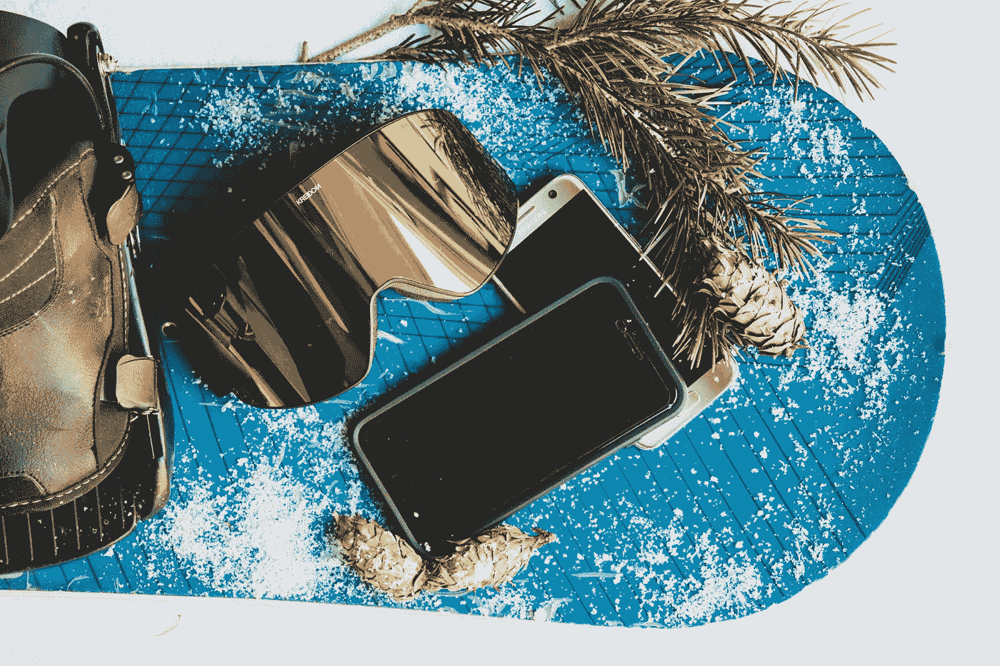

# 我的第一个 React 原生应用——从头到尾

> 原文：<https://levelup.gitconnected.com/my-first-react-native-app-from-start-to-finish-bc5995afd094>



想法总是在最不可能的时候出现。我是在买滑雪板的时候想到的。

当我准备第一次去滑雪时，我问一个朋友，“我怎么知道什么尺寸的滑雪板适合我？”。他回答说，可能有这方面的应用程序。没有。这就是我的应用创意！

> “每个人都应该每天放松一次”——尼尔·德格拉斯·泰森

老实说，我以前也开发过一个 React Native(RN)应用——但是是为了工作。这篇文章的标题应该是“我的第一个副业——项目 React Native App——从开始到结束”,但这似乎太冗长了。

我觉得我必须尽早透露这篇文章的目的，以免浪费任何人的时间。这篇文章的目的是分享我的经历。当其他人发布项目/产品时，我总是对那个人的过程很好奇——他/她的想法的开始，使用的资源，面临的挑战，以及类似的事情。

我是一个充满激情的人，并且一直在寻找新的兴趣，这解释了我的新爱好——滑雪。

在我必须购买的所有新装备/服装中，我发现自己对滑雪板做了很多研究。当然，我可以很快找到一个吸引我眼球的板设计，但选择新板还有其他因素，如你计划做的骑行类型，你的骑行水平，板形状，板弯曲度(如弯曲度)，板的长度和宽度。

[来源:](https://giphy.com/search/giffy)【https://giphy.com/gifs/l0HlMQ6CHdDtpjQre】T2

那是很多因素。

在 iOS/Android 应用商店做了初步搜索，我找不到任何可以帮助我确定合适尺寸滑雪板的东西。完美的应用机会！

虽然我对 RN 的体验还相对较新，但我能够在 2 天的时间内，仅用 12 个小时就创建了这个应用程序！无论如何，这不是一个复杂的应用程序，但它更证明了用 RN 开发是多么容易和愉快。作为一名 Web 开发人员，RN 的力量为我打开了一个全新的开发平台，让我去创造和实验。如果你还没有尝试过，我强烈推荐[。](https://facebook.github.io/react-native/)

自始至终

# **想法/研究**

我有一个想法，我只是需要研究来支持它。我刚刚谷歌了一下“如何确定滑雪板尺寸”，找到了几个来源，如[伯顿](https://www.burton.com/us/en/size-charts)、[埃沃](https://www.evo.com/guides/how-to-choose-a-snowboard-and-size-chart)、[众议院](http://www.the-house.com/helpdesk/snowboard-sizing/)、[穷乡僻壤](https://www.backcountry.com/explore/how-to-size-a-snowboard)、 [proboardshop](http://www.proboardshop.com/helpdesk-sizing-tips.html) 和 [Tactics](https://www.tactics.com/info/snowboard-size-chart-and-buying-guide) ，它们的网站上都有描述决定一个人的滑雪板尺寸的几个因素的页面。有些页面甚至有尺寸图表——完美！

我在这个阶段面临的一个挑战是决定遵循哪个规模图表。他们都是不同的，足以让我想出我自己的。因此，在我那位经验丰富的滑雪板朋友的帮助下，我从几个来源中挑出了我们认为最重要的部分，创造了我们自己的公式。

# 设计

我不是一个真正的设计师，所以我需要一些灵感。要是有一个网站，我可以浏览人们钉在上面的有趣的东西就好了😉

我喜欢简单高效的布局。当我进行编辑时，我想立即看到结果，我想我不是唯一的一个。因此，我决定将用户输入组件与结果组件包含在同一个屏幕中。我的意思是，用户不必导航到其他屏幕进行编辑，然后导航到另一个屏幕查看他/她的输入结果。简单。当然，如果应用程序更复杂，那么将某些功能组织到单独的屏幕中可能更有意义。这是一个用例决策。

> “用户界面就像一个笑话。如果非要解释，也没那么好。”Iconfinder 的马丁·勒布朗

一旦我确定了我的布局，接下来就是决定配色方案了。由于这是一个滑雪板应用程序，我认为白色，蓝色，也许绿色(想到有树的雪山)将是合适的。我在这里发现了一个不错的配色。

# 发展

正如我之前所说，这个应用程序一点也不复杂，我想让这个应用程序尽可能地轻量级，所以我尝试使用已经内置到 react-native 库中的组件。这实际上是我所有依赖项的列表。

```
"dependencies": {
    "react": "16.0.0",
    "react-native": "0.51.0",
    "react-native-animatable": "^1.2.4",
    "react-redux": "^5.0.6",
    "redux": "^3.7.2",
    "redux-logger": "^3.0.6",
    "redux-promise-middleware": "^5.0.0",
    "redux-thunk": "^2.2.0"
  },
```

至于软件，我使用 [React 原生调试器](https://github.com/jhen0409/react-native-debugger)来满足所有调试需求，当然还有 Xcode/Android Studio，Sublime Text 是我首选的文本编辑器。真的就是这样。我确实选择在我的实际手机上运行我的大部分开发，而不是模拟器。我只是使用模拟器来确保它在其他设备上看起来仍然很好。对于 iOS，你需要有一个付费的开发者账户才能在你的设备上进行开发，但是 Android 不需要。

*   苹果开发账户:99 美元/年
*   Android 开发帐户:一次性支付 25 美元

当我继续下去的时候，我遇到了一个与美学相关的挑战——特别是与 iPhoneSE 和 iPhoneX 的风格相关的挑战。我发现 RN v0.50.0-rc+已经为 iPhoneX 提供了一个简单的样式修复，名为[安全查看](https://stackoverflow.com/questions/46884370/react-native-iphone-x-safeareaview)，它基本上只是填充设备的顶部和底部。您可以像使用 View 或 ScrollView 组件一样导入它。

```
import { SafeAreaView } from 'react-native'
```

对于 iPhoneSE，我使用维度和平台组件(内置的 react-native 组件)来确定当前设备是否确实是 iPhoneSE。我做了如下的事情:

```
import { Dimensions, Platform } from 'react-native'const { height } = Dimensions.get('window')
const is_iPhoneSE = Platform.OS === 'ios' && height === 568
```

然后，您可以相应地设计样式，检查设备是否为 _iPhoneSE。

我做的另一个决定是禁用除了纵向模式之外的所有方向选项，这样我就不必担心第一个版本的所有设备上其他方向的样式了。

# 反馈和提交

当你盯着某样东西看了一段时间后，最好有第二双或第三双眼睛来帮助发现你可能忽略的任何简单错误，或者提供你以前没有想过的新观点。甚至非开发人员/非设计人员也能有所帮助。

一旦我觉得应用程序处于稳定状态，并收到了足够多的朋友和家人的反馈，我就准备在 iTunes Connect(上传 iOS 应用程序的地方)和谷歌 Play 商店上提交应用程序。这个过程很简单，也很短。对于截图，我所做的只是简单地在模拟器上拍摄我的应用程序的快照。

提交后，它会得到审查。对于 iOS，如果你选择将其自动发布到 App Store，你的应用将处于“待售”状态，这意味着它在 App Store 上。对于 Android，当您提交的应用程序在谷歌 Play 商店上可用时，其状态将为“已发布”。呜哇呜！！激动人心的时刻！

我听说过各种各样的等待时间，但对我来说，在 iTunes Connect 上花了 1 天，在谷歌 Play 商店上花了 2 天。

如果你已经做到了这一步，我很感谢你花时间阅读这个故事。这也是我的第一个媒体帖子！我对出版这本书也很兴奋！我是那种很难完成兼职项目的人。曾经是。我觉得我正在以正确的方式开始 2018 年。

顺便说一句，如果你正在滑雪或者将要滑雪，请在 [iOS](https://itunes.apple.com/us/app/snowboardsizer/id1329300217?ls=1&mt=8) 和 [Android](https://play.google.com/store/apps/details?id=com.snowboardsizer) 上查看我的应用 SnowboardSizer，并向我发送反馈！

如果你想知道，主要文章横幅图片中的滑雪板是我的新板😃

同样，这个故事的目的是分享我的经历，从开始到结束。在非常高的层次上。我希望我至少以某种方式帮助了一个人。我的过程并不完美，所以如果你有故事要分享，我很乐意阅读并向你学习！我喜欢学习新东西！

> “保持饥饿，保持愚蠢。”—史蒂夫·乔布斯

[](https://levelup.gitconnected.com/)