# 我的 foo.bar 经历

> 原文：<https://levelup.gitconnected.com/my-foo-bar-experience-ac7a5caf867a>

***边注:*** 是的，我知道这不是通常的举例子博文。今天我想分享一些不同的东西，一些基于我经历的东西。

现在，在你像我一样兴奋之前，我必须说我没能完成挑战。我失望了吗？呃，当然。我后悔花时间尝试了吗？呃，当然没有。

**那么，这个 foo.bar 挑战是什么？**

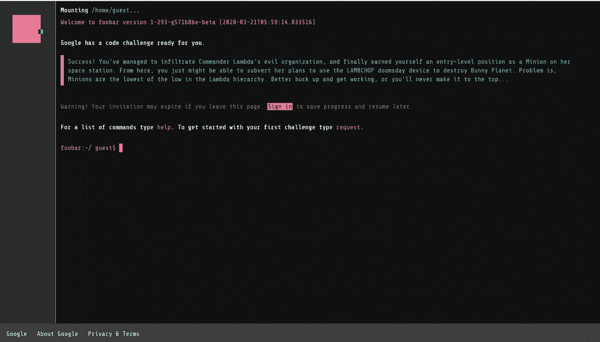

我第一次听说这件事大概是 2 年前，当时我还在上大学。当时我正在准备我的技术编码面试，并听说了这个神秘的谷歌挑战，它在网上流传，你只能根据你的谷歌搜索被邀请参加。我记得当时在想，*“哦，天哪，现在我必须在我的邀请列表中添加我想收到的邀请了”*:

1.  我的霍格沃茨信
2.  这个 foo.bar 挑战

还有什么比邀请我去 foo.bar 更好的方式来结束我在周六晚上的新冠肺炎隔离自我隔离派对的第一周呢。我立即给我的朋友发了消息，告诉她我刚刚收到了一个酒吧的邀请，我非常兴奋能参加。现在回想起来，我意识到收到你朋友的信息是多么令人困惑，他一直生动地告诉每个人呆在家里以保持安全，他们周六晚上要去酒吧，因为他们收到了邀请，但无论如何…

挑战一:太阳能电池板

这些问题的措辞相当“古怪”，而我在任何方面都不“古怪”，所以不得不整理这些“古怪的东西”有点烦人。最终，我解决了给定一片太阳能电池板金属(一个区域)的问题，找出所有太阳能电池板正方形(正方形)的面积总和。

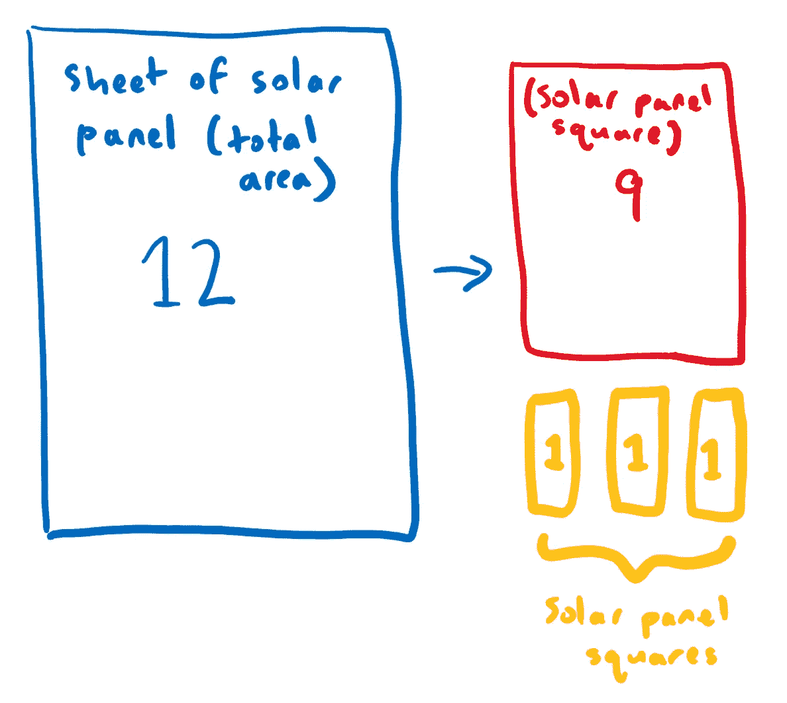

所以他们给我的例子是，如果总面积= 12，找出可以组成 12 的正方形，本质上是[9，1，1，1]。

这个挑战不算太糟。一旦你发现你可以递归地求总面积数的平方根，去掉浮点小数点后的所有内容，取结果的平方，从总面积数中减去它，然后递归地调用函数，使用*那个*作为你新的总面积数。

**让我们看一下这个例子:**

1.  12 的平方根= 3.46410161514
2.  去掉浮点运算，这样 3.14 就变成了 3。48664.66666866661
3.  ***3 的平方= 9***
4.  找出新的总面积，即 12–9 = 3
5.  3 的平方根= 1.73205080757
6.  去掉浮点的东西，这样 1 就变成了 1。58657 . 66867686671
7.  ***1 的平方= 1***
8.  找出新的总面积，即 3–1 = 2
9.  2 的平方根= 1.41421356237
10.  去掉浮点的东西，这样 1 就变成了 1。54667 . 36668666661
11.  ***1 的平方= 1***
12.  找出新的总面积，即 2–1 = 1
13.  ***1 的平方= 1***
14.  没有要删除的浮点
15.  找出 1–1 = 0 的新总面积
16.  哦，我忘了说基本情况是新的总面积小于 1。
17.  所以 0 < 1 and we stop the recursive calls.

***我们返回 9，1，1 和 1 的所有方块。***

**挑战二:**棋盘上的骑士

第一个问题大概花了我一个小时来解决(我有 48 个小时来解决)，所以你可能知道，当我开始挑战第二个问题时，我变得有点自大。对于这个问题，我有 72 小时来解决。我通读了一遍，决定我有足够的时间来解决它，所以我去睡觉了。

第二个挑战结果是比看起来更痛苦。也是我浪费太多时间最后被踢出挑战的那一次。

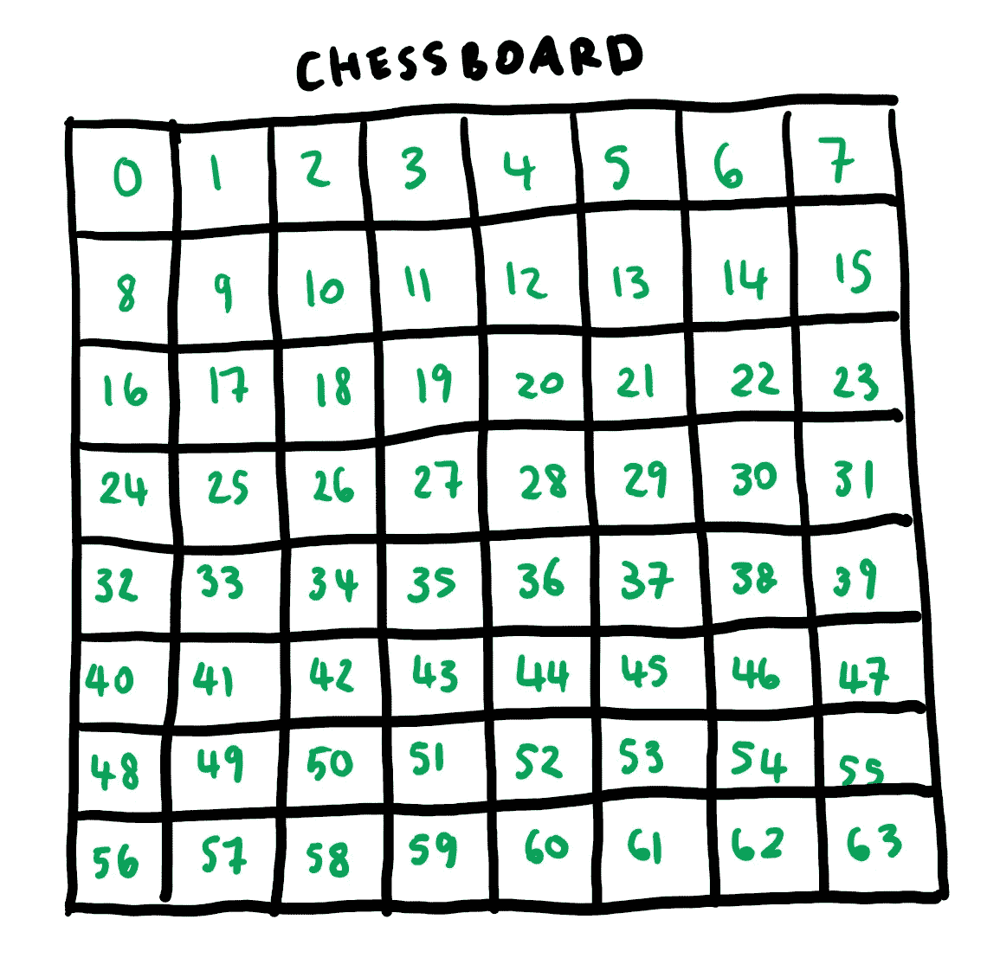

所以基本上，我们得到一个棋盘，每个格子从 0 到 63 编号。注意是 8×8 的棋盘。

现在，如果你熟悉国际象棋游戏，你可能会同意我说的[骑士](https://en.wikipedia.org/wiki/Knight_(chess))棋子处于劣势，也是最难跟踪的棋子。正因为如此，它也是国际象棋中我最喜欢的棋子。

问题本质上是，给定一个源单元格和一个目的单元格，并且您只能进行“骑士”移动，返回从源单元格到目的单元格所需的最少骑士移动次数。

**我举的两个例子是:**

1.  源= 19，目的= 36 ->最小移动= 1
2.  源= 0，目的地= 1 ->最小移动次数= 3

第一个案例很简单，因为 36 岁属于 19 岁的“骑士区”:

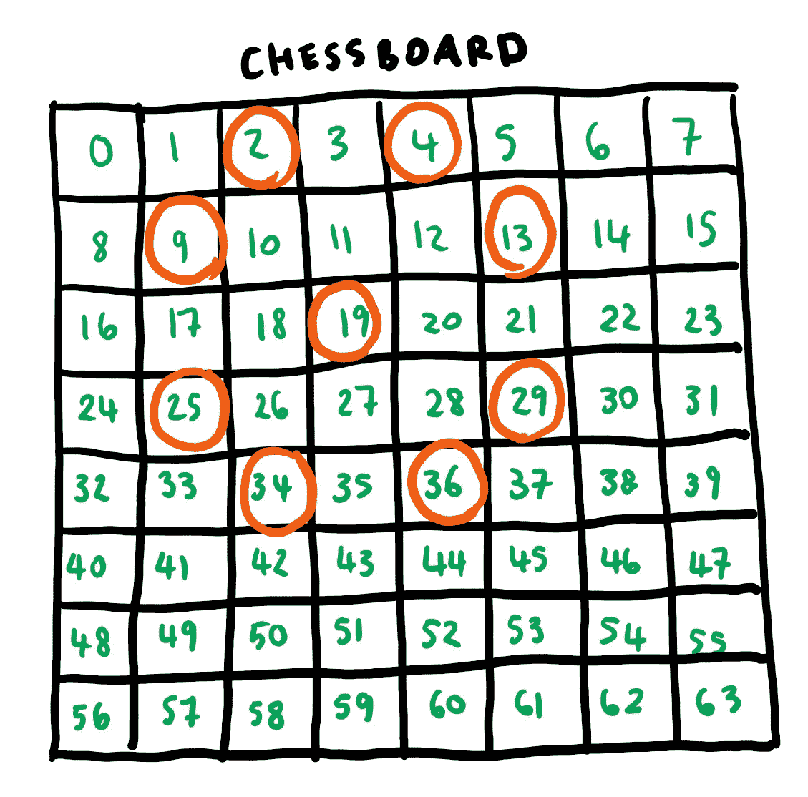

第二个案例让我真正思考。老实说，我在解决问题后找到了案例 2 **的解决方案，而不是手动遍历所有可能的场景。让我告诉你为什么…**

所以我们从 0 开始骑士。这给了我们两个可能的行动。我们可以去 10 号或 17 号牢房:

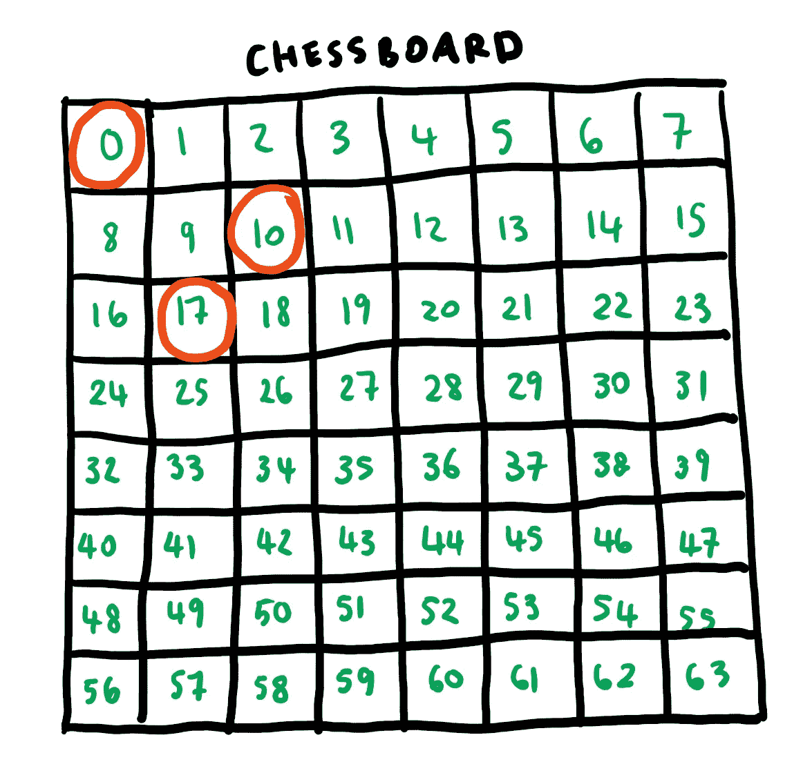

我们选择哪个单元格？

如果我们去了 10 号牢房，我们之后可能会采取以下行动:

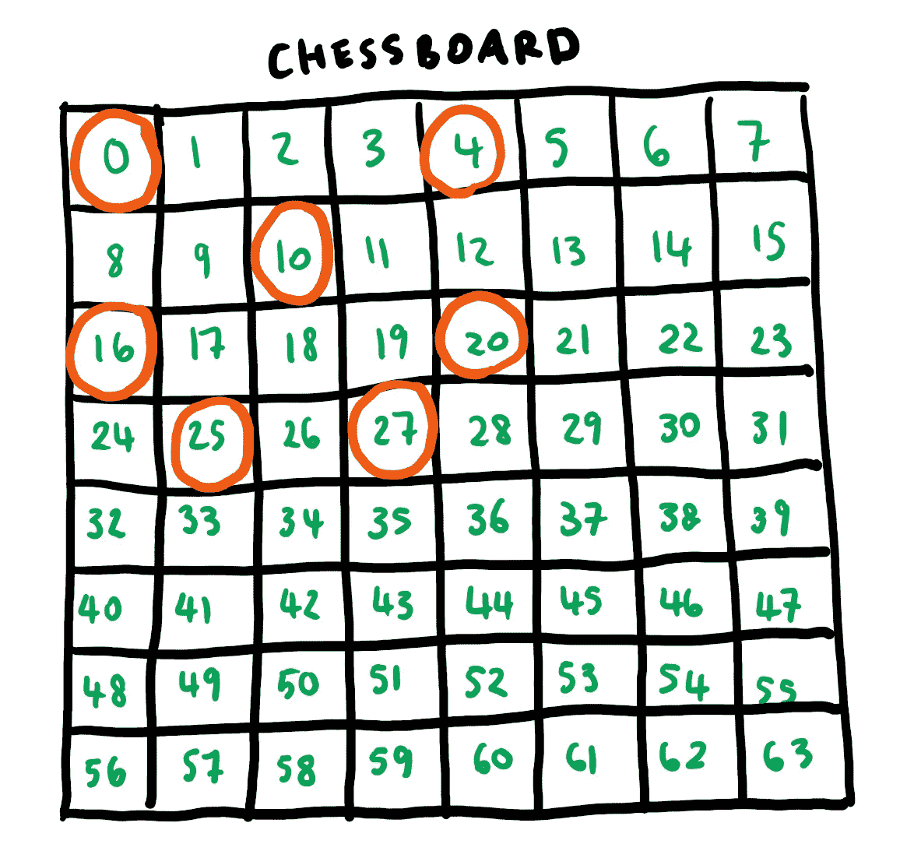

如果我们去 17 号牢房，这些是我们之后可能采取的行动:

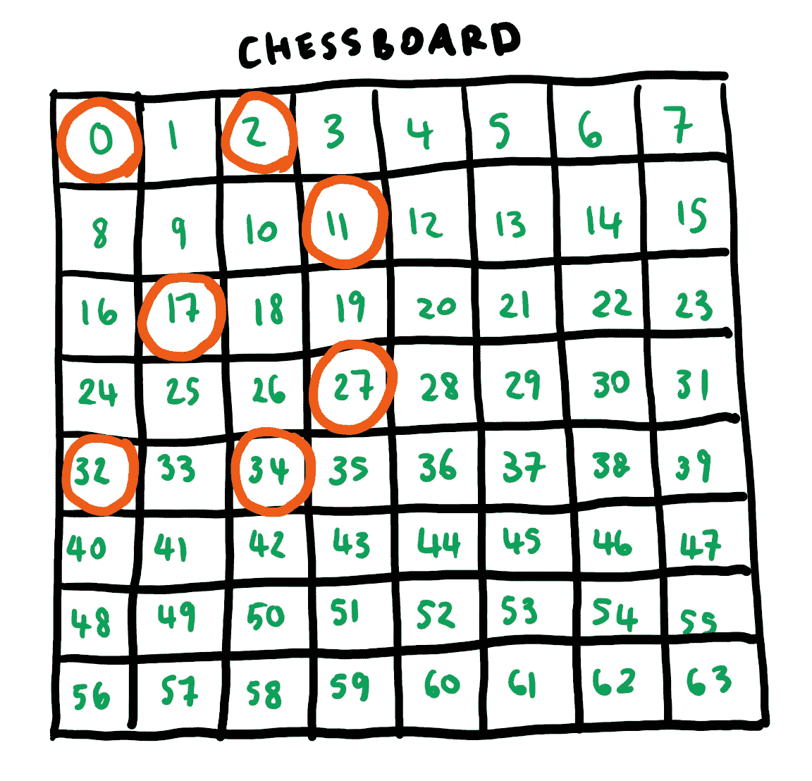

在我给你答案之前，让我带你看一下我的思考过程。

我从全套可能的骑士动作开始。幸运的是，网格是有编号的，这意味着我可以用一组数字来表示这些可能的移动:[-17，-15，-10，-6，+6，+10，+15，+17]。

如果我们再看一下 19 号牢房，你就会明白我是如何得出这个结论的:


*   19–17 = 2
*   19–15 = 4
*   19–10 = 9
*   19–6 = 13
*   19+6 = 25
*   19+10 = 29
*   19+15 = 34
*   19+17= 36

因为 19 号格子处于完美的位置，可以做出所有可能的全套骑士走法，所以我可以算出[-17，-15，-10，-6，+6，+10，+15，+17]。

但是对于 0 号单元格，它不能完成所有的移动，因为它离网格的边界太近了。

因此，我想创建一个边界框来搜索所有可能的值，并丢弃“不可能”的值。

**一个边界框？**

是的，完全正确。一个边界框，但你可以随便叫它什么。我的“边界框”背后的想法是建立一组**实际可能值**，我可以从我的**全套可能值**中选择。

让我们再来看一下 10 号单元格:


如果我们使用[-17，-15，-10，-6，+6，+10，+15，+17]来计算**可能值的完整集合，我们得到:**

*   [10–17, 10–15, 10–10, 10–6, 10+6, 10+10, 10+15, 10+17]
*   [-7, -5, 0, 4, 16, 20, 25, 27]

但是我们知道值-7 和-5 是不可能的。

**为什么？**

因为它们已经出界了。因此，我称它为我的“边界盒”。

**那么我们如何弄清楚这个“边界框”呢？**

啊，我很高兴你想知道，因为我花了一段时间思考这个问题。

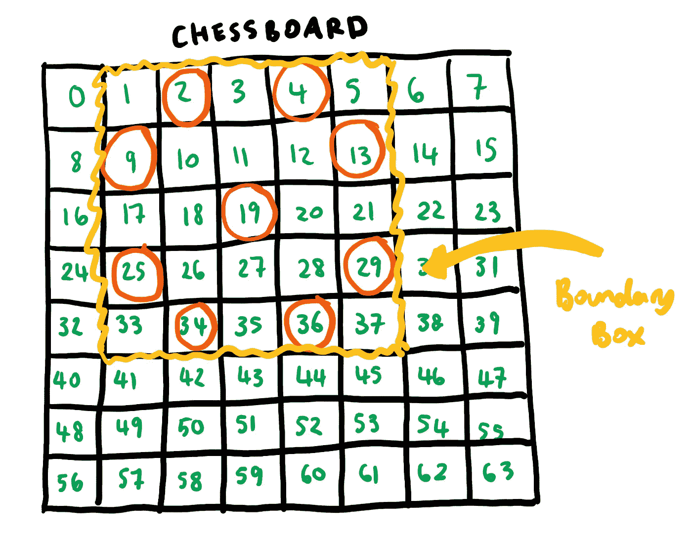

以我们的最佳情况为例，单元格 19，我们知道这个边界框的最大尺寸可能是 5x5 的框，因为可能的骑士移动将总是在单元格左侧 2 列，单元格右侧 2 列，单元格上方 2 行，单元格下方 2 行。

**使用边界框，我们可以将搜索空间缩小到:**

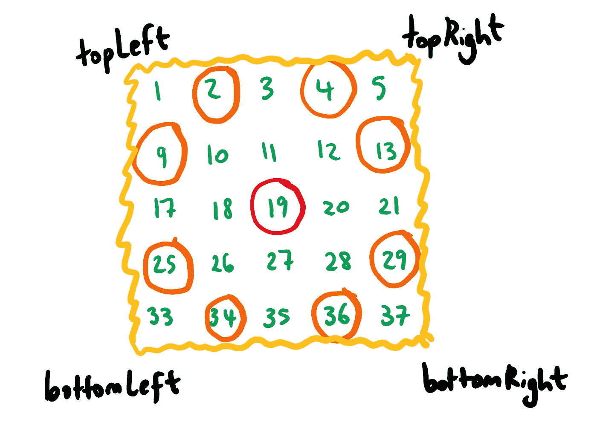

为了算出左上角单元格的坐标，我算出了以下内容:

```
int[] topLeft = new int[2];if((row-2)>=0){
    if((column-2)>=0){
        // (r-2),(c-2) = top-left
        topLeft[0] = row-2;
        topLeft[1] = column-2;
    }
    else{
        // (r-2),(c) = top-left
        topLeft[0] = row-2;
        topLeft[1] = column;
    }
}
else{
        if((column-2)>=0){
           // (r),(c-2) = top-left
           topLeft[0] = row;
           topLeft[1] = column-2;
        }
        else{
           // (r),(c) = top-left
           topLeft[0] = row;
           topLeft[1] = column;
        }
}
```

在最好的情况下，从单元格 19 到单元格 1(因为它是左上角的单元格)，我只需向左移动 2 列(c-2)并向上移动 2 行(r-2)，其中:

*   c =当前单元格列
*   r =当前单元格行

但是，假设我们在单元 0(不是最佳情况)，那么边界框实际上要小得多:

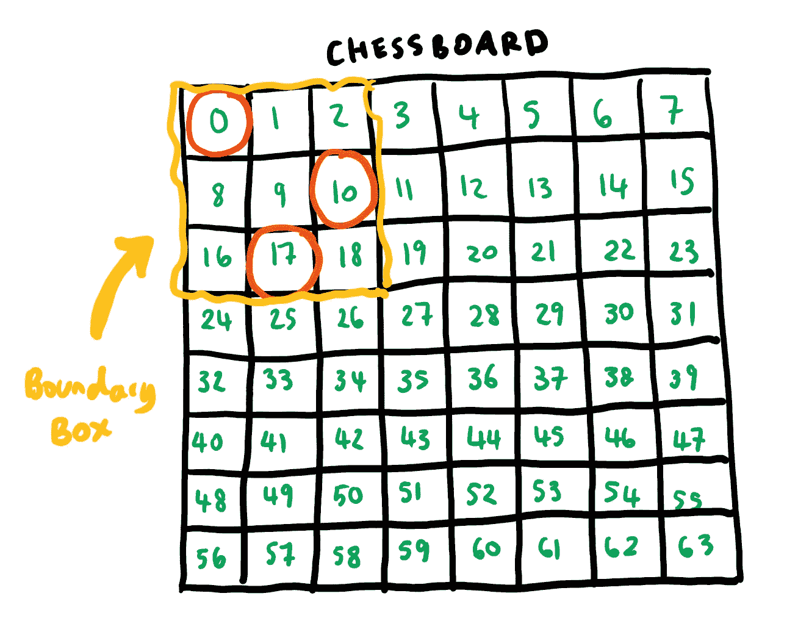

它只是一个 3x3 的盒子，因为其他可能的值都“出界”了。

在单元格 0 中，如果我们向左移动 2 列，我们会到达不存在的列-2。类似地，如果我们向上移动 2 行，我们会到达同样不存在的第 2 行。因此，单元格 0 的左上角边界框最合理的坐标值实际上是单元格 0 本身在(r = 0，c = 0)或(0，0)。

如果行或列超出界限，我们应用相同的逻辑，这意味着左上角的其他合理坐标值是(r-2，c)和(r，c-2)。

总之，左上角可能的坐标值是:

*   r-2，c-2
*   r-2，c
*   r，c-2
*   r、c

现在，如果我们将此逻辑应用于所有其他角，右上角、左下角和右下角，我们将得到以下代码:

```
int[] topLeft = new int[2];
int[] topRight = new int[2];
int[] bottomLeft = new int[2];
int[] bottomRight = new int[2];

        // TOP:
        if((row-2)>=0){
            if((column-2)>=0){
                // (r-2),(c-2) = top-left
                topLeft[0] = row-2;
                topLeft[1] = column-2;
            }
            else{
                // (r-2),(c) = top-left
                topLeft[0] = row-2;
                topLeft[1] = column;
            }
            if((column+2)<8){
                // (r-2),(c+2) = top-right 
                topRight[0] = row-2;
                topRight[1] = column+2;
            }
            else{
                // (r-2),(c) = top-right
                topRight[0] = row-2;
                topRight[1] = column;
            }
        }
        else{
            if((column-2)>=0){
                // (r),(c-2) = top-left
                topLeft[0] = row;
                topLeft[1] = column-2;
            }
            else{
                // (r),(c) = top-left
                topLeft[0] = row;
                topLeft[1] = column;
            }
            if((column+2)<8){
                // (r),(c+2) = top-right
                topRight[0] = row;
                topRight[1] = column+2;
            }
            else{
                // (r),(c) = top-right
                // int topRight = chessboard[row][column];
                topRight[0] = row;
                topRight[1] = column;
            }
        } // BOTTOM: 
        if((row+2)<8){
            if((column-2)>=0){
                // (r+2),(c-2) = bottom-left
                bottomLeft[0] = row+2;
                bottomLeft[1] = column-2;
            }
            else{
                // (r+2),(c) = bottom-left
                bottomLeft[0] = row+2;
                bottomLeft[1] = column;
            }
            if((column+2)<8){
                // (r+2),(c+2) = bottom-right
                bottomRight[0] = row+2;
                bottomRight[1] = column+2;
            }
            else{
                // (r+2),(c) = bottom-right
                bottomRight[0] = row+2;
                bottomRight[1] = column;
            }
        }
        else{
            if((column-2)>=0){
                // (r),(c-2) = bottom-left
                bottomLeft[0] = row;
                bottomLeft[1] = column-2;
            }
            else{
                // (r),(c) = bottom-left
                bottomLeft[0] = row;
                bottomLeft[1] = column;
            }
            if((column+2)<8){
                // (r),(c+2) = bottom-right
                bottomRight[0] = row;
                bottomRight[1] = column+2;
            }
            else{
                // (r),(c) = bottom-right
                bottomRight[0] = row;
                bottomRight[1] = column;
            }
        }
```

*原谅格式不良的缩进。

现在我们有了左上、右上、左下和右下边界框的坐标，我们只需遍历并找出边界框中的所有值。那就是:

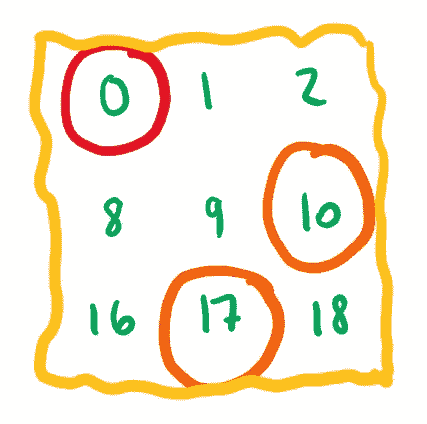

如果我们处理的是单元格 0，那么边界框中的所有值都将是[0，1，2，8，9，10，16，17，18]。

这样，我们就有了完整的可能值和一组实际的可能值。

*   **全套:** [-17，-15，-10，-6，6，10，15，17]
*   **实际设置:**【0，1，2，8，9，10，16，17，18】

所以我们只需找到重叠的值，即 10 和 17。

**我们这里有什么？**

没错，一个骑士从 0 号格移动到下两个可能的格。

然后我们重复这个过程，直到找到目标单元(这是递归部分)。我们可以通过做一点记忆来优化它，以确保我们已经检查过的单元格不会被再次检查。如果你想阅读更多关于递归和记忆化的内容，你可以在这里参考[我的动态编程帖子。对我来说，诀窍是我必须计算出我需要的最少骑士步数。](/explain-by-example-dynamic-programming-776ac2839d8a)

我能够返回它能访问的细胞:

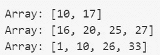

但是由于某种原因，我通过递归调用来跟踪它需要移动的次数的计数器没有增加，所以我就去睡觉了，错过了最后期限。

**趁我还没忘记，我之前承诺的解决方案:**

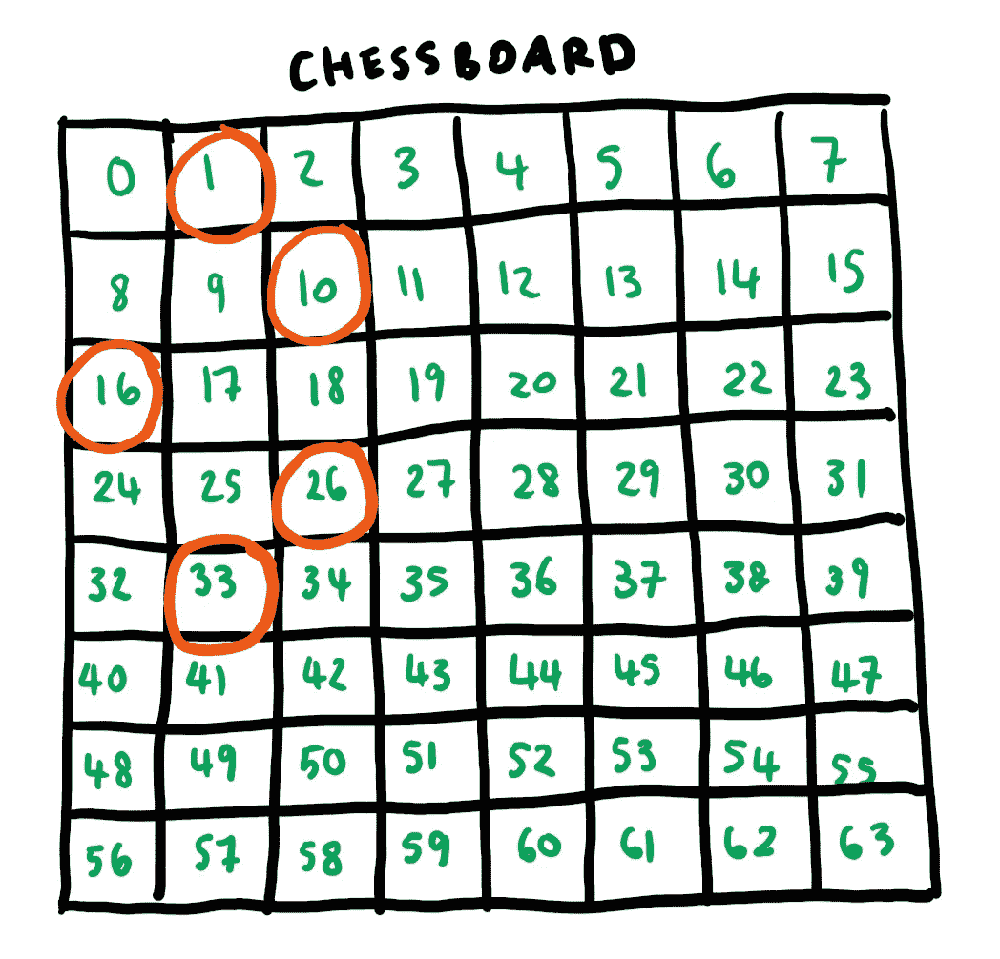

所以如果我们走了 0 号单元格-> 10 号单元格-> 16 号单元格-> 1 号单元格，我们基本上可以通过 3 步从 0 号单元格走到 1 号单元格。

**备选方案为:**

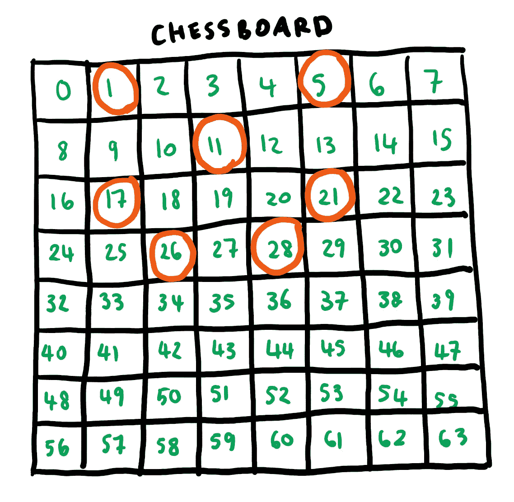

我们也可以从 0 号单元格-> 17 号单元格-> 11 号单元格-> 1 号单元格开始，这也是通过 3 步完成的。

因此，仅使用骑士移动，我们需要从单元格 0 到单元格 1 的最小移动次数是 3。

那么，我从这次失败中学到了什么呢？

1.  不要骄傲/自大。
2.  上床不是解决办法。
3.  有更好的时间管理技巧。
4.  做一些研究，先去看看别人的经验。这本实际上相当不错，作者设法完成了所有 5 关。
5.  不要放弃。

即使我没有完成挑战，我也不气馁再试一次(如果我足够幸运再次被邀请的话)。让我第一次爱上编程的不是代码，而是思考一个问题并解决它的能力。我总是告诉人们，编码是容易的部分，解决问题才是难的部分。但是困难的事情也是有趣的事情，所以继续挑战自己，继续享受乐趣吧！

我知道总有更好、更优化的方法来做事。我上面讨论的解决方案是我对如何解决这两个问题的思考过程，但是如果你有更好更优化的解决方案，**请**告诉我！