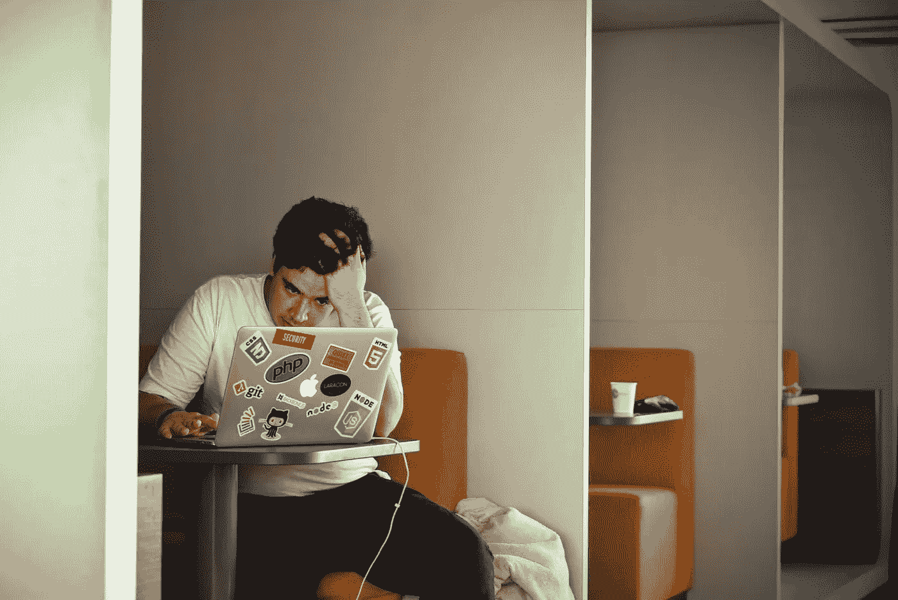

# 我的朋友因为无法承受的精神压力辞职了

> 原文：<https://levelup.gitconnected.com/my-friend-quit-his-job-for-the-overwhelming-mental-pressures-786aead7879f>

## 我们对程序员的心理健康谈论得不够多

蒂姆·高在 [Unsplash](https://unsplash.com/s/photos/stress?utm_source=unsplash&utm_medium=referral&utm_content=creditCopyText) 上拍摄的照片

程序员的心理健康是科技行业中最被低估的话题之一。我还没有在社区或办公室看到足够的讨论或行动。

每个工作都有压力，对吗？但说到编程，我经常看到它比其他大多数职业都更令人沮丧，这是因为它的性质。

程序员是有激情的。抑郁和激情是密切相关的。另一个因素是缺乏人际互动。我们整天坐在电脑前工作。

# 缺乏社交生活是主要原因

很多程序员的社交生活往往不是很健康。根据一些[研究](https://www.nature.com/articles/s41598-020-58297-9)，社会孤立是抑郁症背后的主要原因之一。有时候我们想和人交往，想和人出去玩，但是因为社交能力或者其他原因做不到。

我的朋友总是告诉我他感到孤独，他不喜欢他的工作。他一个人住，闲暇时看网飞。他告诉我，我是他最好的朋友之一，我和他在一起的时间比他任何一个朋友都多。

当我听到这个的时候，我很疑惑，因为我们很少说话或者出去玩。我们大概一个月出去一次。我问他在办公室里是否有朋友。

他说他有一个朋友，但是她一个月前为了更好的工作辞职了。我为他感到难过。因为他每周约我出去玩两次，但我没办法安排好时间。

# 他讨厌他的工作

他几次告诉我他讨厌他的工作。我问他是办公室的原因还是工作的原因。他说两者都有。虽然环境和设施都很好，但他感到孤独。

他几乎不能完美地完成任何任务。他直接告诉我他讨厌编程，他想辞职。我知道他的经济状况。我劝他不要辞职。

我还告诉他接受一些专业帮助。他半天没听进去。

我告诉他要专业地接受这项工作。人们可以在工作场所找到朋友，但这并不一定。有时我们的同事会成为我们的朋友。大多数时候，它不会发生。

但确实，在工作中被冷落仍然让我们感觉很糟糕。

一开始，他所有的抱怨在我看来都很幼稚。但后来我明白了，有时候我们直到面对别人的问题和孤独，才意识到。

# 他的成绩在下降，他辞职了

编程是一项脑力劳动。如果你没有精神上的平静，你就不能全力以赴。

同样的事情也发生在我的朋友身上。他是个优秀的程序员。但是他没有努力提高自己的成绩。我不知道细节，因为我是从他那里听到整个故事的。

他告诉我他不能集中精力工作。他错过了几个截止日期。他的公司每月评估一次每个开发者的表现。他的表现连续两个月低于平均水平。

他说他不喜欢做编程，怎么可能付出更多的努力。所以他决定辞职。但辞掉工作后，他更加抑郁了。

他甚至不再和我一起玩了。我联系了他几次，都没有得到合适的回应。辞职三个月后，有一天，他打电话给我。他说他已经看了两周的精神病医生了。

对于 covid 的情况，我们现在并不经常出去。但是昨天，我在 LinkedIn 上看到他找到了一份工作。我很为他高兴。

# 外卖食品

工作与生活的平衡是我们生活中的一个重要因素。抑郁症背后有很多原因。作为一个程序员，作为一个创业者，我抑郁了几百次。

但是我意识到我们需要更多的讨论。我们需要告诉我们的朋友和同事，他们在抑郁症联盟中并不孤独。如果有必要的话，我们需要专业的帮助，公司应该认真调查这件事。

如果不热爱编程，整天坐在电脑前工作是非常无聊的。而我们大多数人都没有。很正常。对我们大多数人来说，工作是谋生的方式。仅此而已。

所以我们的精神状态取决于我们下班后做什么。它决定了我们是什么样的人，决定了我们的社交能力和快乐程度。

就我个人而言，我觉得与人互动、与朋友闲逛比玩游戏或沉迷于网飞系列节目更令人愉快。

如果你无法平衡工作和生活，我请求你从今天开始努力，即使你并不擅长。

**别忘了订阅** [**我的媒体简介**](https://abrarmasum.medium.com/subscribe)