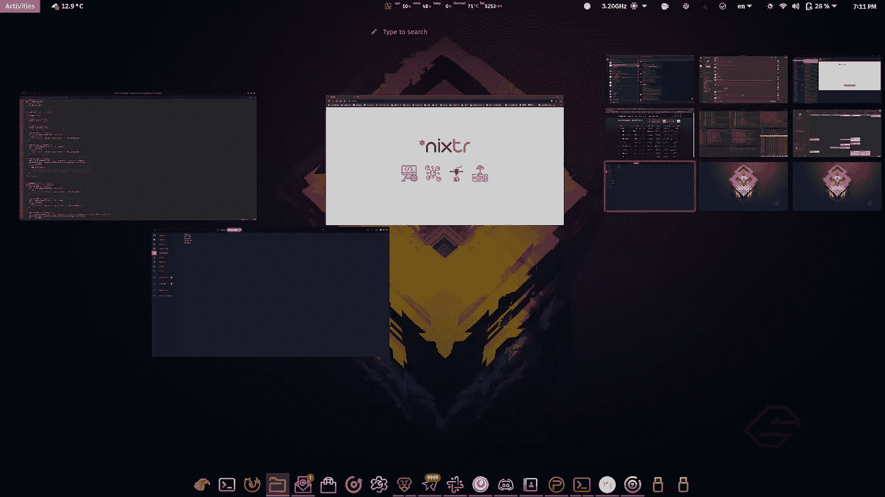
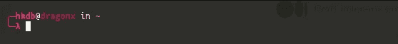
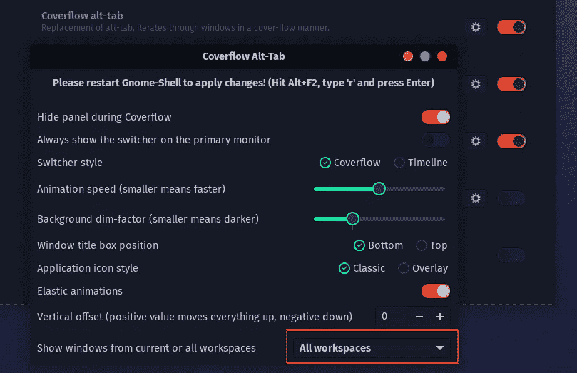
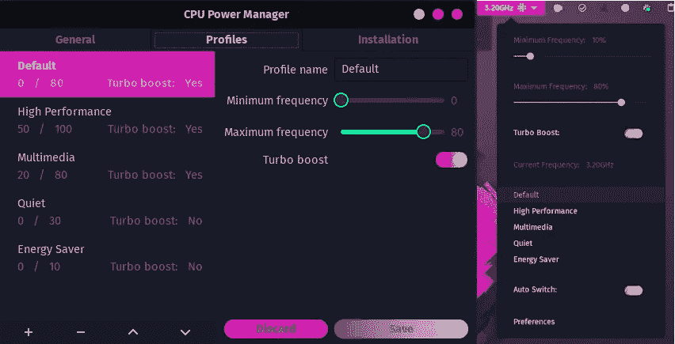
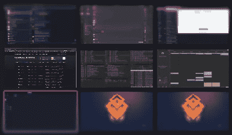

# 我的哥鲁达 Linux 调整

> 原文：<https://levelup.gitconnected.com/my-garuda-linux-tweaks-eb8eeecc6e26>

## 安装后的 10 个自定义调整



如果你读了我以前的一篇文章，关于哥鲁达 Linux 被质疑是最好的 Linux 发行版，你可能已经听够了我说的“一切都是开箱即用的”和“维护人员是如何做得如此好，在安装时预配置了一些很棒的可用性调整”。因此，让我们来谈谈我做了哪些调整，使这个桌面环境真正成为我自己的。

## 终点站

哥鲁达 Gnome 默认自带 Gnome 终端，这很棒，但是如果你曾经尝试过 [Tilix](https://gnunn1.github.io/tilix-web/) ，那就真的很难回头了。所以当我安装任何新的发行版时，我总是做的第一件事就是在上面安装 Tilix 来替换默认的终端模拟器。要安装 Tilix，非常简单:

```
$ sudo pacman -S tilix
```

我们现在有了最好的终端模拟器之一。在每个新的终端会话中出现的巨大的类似 neofetch 的头是怎么回事？当你在一个 1080p 的屏幕上平铺 8 个终端时，它会变得更加烦人。要删除这个头，我们要做的就是在~/中找到下面的代码块。config/fish/config.fish 并注释掉:

```
Run paleofetch if session is interactive
if status --is-interactive
   paleofetch
end
```

现在我们的终端在发布时看起来像这样:



然后是别名。如果您已经有了一个多年来一直在构建的. bash_aliases 文件，要在 fish 上使用它，只需将它放在。bash_aliases 文件，并执行以下命令:

```
echo "source ~/.bash_aliases" >> ~/.config/fish/config.fish
```

退出 shell 并启动一个新的终端后，您的所有别名都应该再次可用。

## 用户界面布局和窗口管理

我的扩展似乎没有正确地放置在顶栏上，最令人恼火的是，每次我收到电报消息，它都会自动将我从我正在做的事情转移到电报桌面应用程序。要分别修复这两个问题，请从 Gnome-Tweaks → Extensions 中关闭以下扩展:

*   [联合起来](https://extensions.gnome.org/extension/1287/unite/)
*   [无异议 V2](https://extensions.gnome.org/extension/2182/noannoyance/)

[CoverFlow Alt-Tab](https://extensions.gnome.org/extension/97/coverflow-alt-tab/) 扩展相当不错，但我希望能够覆盖所有窗口的流程，而不仅仅是虚拟工作区内的流程，所以我在扩展设置中很容易地对其进行了更改，如下所示:



## 电池寿命

电池寿命很大程度上取决于您如何配置您的 CPU 配置文件。为了帮助管理 CPU 配置文件，请安装以下扩展:



[https://extensions . gnome . org/extension/945/CPU-power-manager/](https://extensions.gnome.org/extension/945/cpu-power-manager/)

## 系统监控

知道你一直在使用多少资源总是好的。系统监视器扩展也是我的扩展列表中的必备组件:


https://extensions.gnome.org/extension/120/system-monitor/

安装完扩展后，我总是将显示风格切换到“数字”，以节省一些顶部栏的空间。

## 虚拟工作区

最后但同样重要的是，虚拟工作空间与我的工作流程相关。我喜欢将应用程序组划分到特定的虚拟工作区，以便我可以轻松快速地访问它们。我知道有一个关于水平或垂直工作空间放置的永恒争论，但对我来说，我是一个超级老派，更喜欢网格:



[https://extensions . gnome . org/extension/1485/workspace-matrix/](https://extensions.gnome.org/extension/1485/workspace-matrix/)

*更新~ 2021 年 4 月 9 日:*

*截至昨天，Gnome 升级到 40.0.0。所以这个扩展不再有效。如果你像我一样喜欢工作空间网格，那最好不要更新。如果你做了，不要害怕！BTRFS 和 timeshift 可以让你回到上一个工作状态。*

## 多点触控手势

看起来哥鲁达默认了 xorg，这在很多方面对我来说都是好的，因为我的一些应用程序在韦兰仍然是坏的。然而，默认的 Gnome 手势只在韦兰可用。不要担心……很久以前就有一种变通方法:

```
$ sudo pacman -S ruby
$ gem install fusuma
$ mkdir -p ~/.config/fumusa
```

然后，在~/上添加您的手势设置。config/fumusa/config.yml:

```
swipe:
  3:
    left:
      command: 'xdotool key ctrl+alt+Left'
    right:
      command: 'xdotool key ctrl+alt+Right'
    up:
      command: 'xdotool key ctrl+alt+Up'
    down:
      command: 'xdotool key ctrl+alt+Down'
  4:
    up:
      command: 'xdotool key Super'
```

你可能已经知道了，上面说明了用 3 个手指滑动将上下左右切换工作区，用 4 个手指向上滑动将在当前工作区展开窗口。

现在让我们在~/下创建一个 fusuma.desktop 文件。本地/共享/应用程序，因为出于某种原因，Gnome tweaks 中的“启动应用程序”部分不允许自定义命令:

```
[Desktop Entry]
Name=Fusuma
Comment=Multi-Touch Gestures
Comment[de]=Multi-Touch Gestures
TryExec=/usr/local/bin/fusuma
Exec=/usr/local/bin/fusuma %U
Icon=gnome-mouse
StartupNotify=false
Terminal=false
Type=Application
Categories=System;
```

现在我们有了。桌面文件就位后，我们可以进入 Gnome 调整→“启动应用程序”,然后选择 fusuma 在登录时自动启动。

## 就是这样！

还有其他一些小的调整，但上面总结了我在安装哥鲁达后马上做的最重要的调整。

## 更新—2021 年 5 月 6 日:

您可能也像我一样对设置 X1 Carbon 的电池充电阈值感兴趣，以便延长您的电池寿命:

[](https://hkdb.medium.com/charging-thresholds-for-garuda-linux-ff6b440f57b8) [## 哥鲁达的收费阈值

### 关于联想第六代 X1 Carbon

hkdb.medium.com](https://hkdb.medium.com/charging-thresholds-for-garuda-linux-ff6b440f57b8)