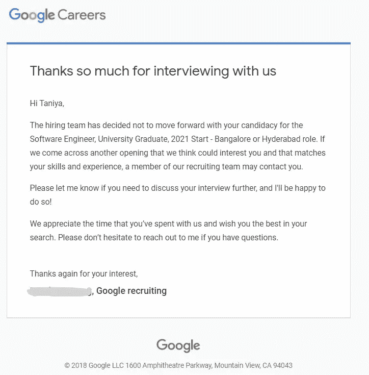

# 我的谷歌面试经历

> 原文：<https://levelup.gitconnected.com/my-google-interview-experience-33dc45e1a671>

> 谷歌是许多软件工程师梦想中的公司。一个月前，我有机会去谷歌面试。虽然我没能成功，但总的来说，在谷歌面试是一次很棒的经历，因为这也是我的第一次面试经历。

图片来自 Unsplash.com

我想解释整个过程和我犯的错误，以便其他程序员在面试时避免那些错误。所以，如果你在接下来的几天要去谷歌面试，一定要读一读！

# 应用

我在谷歌求职网上申请了大学毕业生的职位。一周后，一名谷歌招聘人员联系我，说他们想安排一次初步讨论，以进一步推进我的申请。

在第一次通话之前，他们希望我完成一份问卷，问卷包括以下基本问题:

1.  我的毕业日期是什么时候？
2.  我为什么对谷歌感兴趣？
3.  我还申请了哪些公司(如果有的话)？

# 招聘人员初次致电

最初的电话是为了更好地了解我，评估我的技术能力。这是一次普通的谈话，以双方的简短介绍开始。然后是一轮连珠炮式的提问，由 7-8 个问题组成，重点是 Big-O/数据结构和算法。

*例题分别为(* ***注:*** *这些都是例题，不是精确题。)*

1.  以下哪种排序算法效率最低:插入、冒泡、合并或堆排序~冒泡排序
2.  合并排序和堆排序在空间复杂度上哪个更好？~堆排序

其他 5-6 个问题是关于堆、优先级队列、图形和自平衡二分搜索法树的。

然后，招聘人员问我最强的编程语言。此后，我被问了 1-2 个特定语言的问题(C++)。

*例题:*

1.  当元素不在容器中时，STL find 做什么？~结束
2.  我们能在 C++中就地修改字符串吗？~是的

这是一个基本回合。如果你精通数据结构和算法，这对你来说并不难。在这之后，我被邀请参加一个视频面试。

# 视频采访

面试官是一名软件工程师，在瑞士苏黎世的谷歌搜索团队工作。

面试从基本的问候开始，面试官将问题粘贴到谷歌虚拟面试平台上，我必须在这个平台上写代码。

# 问题

这个问题与字符串有关。这与问题[https://leetcode.com/problems/longest-string-chain/](https://leetcode.com/problems/longest-string-chain/)相似，但形成链条的方式/顺序不同。

> 抱歉，我不能在这里提出确切的问题。:)

# 我提议的解决方案

首先，我问了 2-3 个澄清性的问题，比如:最终形成的链是否必须从索引 0 开始？单词只有小写还是可以大写？有没有可能给定的向量是空的，或者总是至少有一个元素。

我提出了一个强力解决方案，其时间复杂度为 O(n)。面试官澄清了采用解决方案是好还是有更好的方法。

然后，我提出了一种动态编程方法。采访者对这种方法不太满意。他想知道进一步的优化。

此后，我建议使用 Trie 数据结构来解决这个问题。采访者对这种方法非常满意。他问我解的时间复杂度。此外，他还希望我实现一个 Trie 数据结构。

因此，我澄清，我应该先实现 Trie 数据结构，还是先实现逻辑来解决给定的问题。他说，我想怎么做就怎么做，但他肯定希望看到实现。

我想了一下，然后开始先实现数据结构。我开始很好地编码 Trie 数据结构。这里我假设 trie 的输入只有字母，并明确提到了大小。面试官澄清了什么是尺寸变量。我向他解释了。

但是，现在，我想我应该在他澄清之前解释清楚

最后，我编写了 Trie 数据结构。然后他澄清了代码是否能处理错误的输入，即输入的是数字，而不是字符。我回答没有，并建议说，我们可以实现一个函数来检查输入。他说这很好，我们现在不需要实现那个功能。

接下来，我澄清了:我可以假设输入是以 Trie 的形式给出的吗？他说不，告诉我你可以把它当作数组或者向量。

然后我实现了一个基本的函数，这个函数将调用已实现的 trie 函数，并用给定的单词构建 Trie。然后我继续实现给定问题的逻辑，这是我们的主要问题。*但是……..:(*

嘣！他说,“我们的时间不多了，所以我应该用 Trie 来解释给出问题答案的确切逻辑，而不是完成代码。”。

*此时我意识到，我犯了一个大错误，花了很长时间写代码:(*

但是，我很好地解释了这个方法。然后他对一些边缘案例和角落案例进行了澄清。(在这里，我应该根据采访反馈，在他问之前，自己澄清边缘案例。)

然后，他进一步问我有没有问题。我告诉他，我想更多地了解他在谷歌工作的团队/项目。他解释了他的工作，还告诉我，您的招聘人员将在 1-2 周内给出反馈。面试结束。

# 面试反馈

4-5 天后，我收到一封招聘人员的电子邮件，说他们没有继续申请。

谷歌面试反馈截图

我要求详细的反馈。招聘人员预约了一个谷歌会面电话来提供反馈。

**关键点是**:

*   数据结构/算法知识、理解和使用非常好。
*   清楚地表达了我对解决方案的想法。
*   我可以很容易地找到最优解。

**缺点/需要改进的地方**:

*   速度因素—缺乏速度。我花了很长时间才完整地写完代码。(他们对持续时间非常严格，精确到分钟)。
*   沟通——很好，但没有达到标准。在面试过程中，写代码时有沉默的情况。
*   使用的提示——代码中有一些小错误，使用面试官的提示进行了纠正。在被面试官问到之前，我不能报道边缘案例。(那算作一个暗示)

那是我的谷歌面试经历。

> 如果你正在读这篇文章，祝你面试好运！
> 
> 请记住，你最终没有使用面试官的提示，没有写出几乎没有错误的代码，没有很好的沟通，也没有在编写代码时保持速度。

希望你能从我的错误中吸取教训，破解面试！

感谢阅读:)

# 分级编码

感谢您成为我们社区的一员！ [**订阅我们的 YouTube 频道**](https://www.youtube.com/channel/UC3v9kBR_ab4UHXXdknz8Fbg?sub_confirmation=1) 或者加入 [**Skilled.dev 编码面试课程**](https://skilled.dev/) 。

 [## 编写面试问题+获得开发工作

### 掌握编码面试

技术开发](https://skilled.dev)