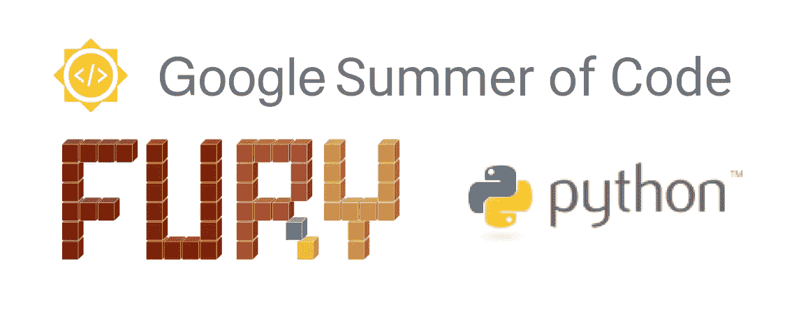
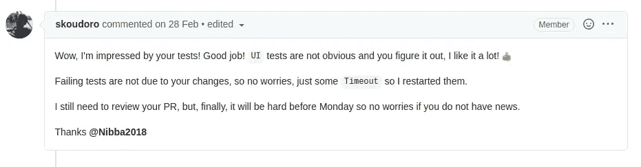
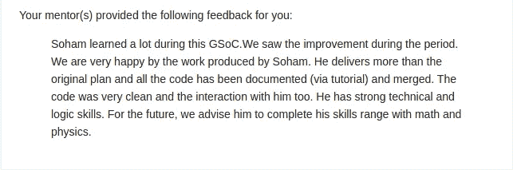

# 我的旅程&谷歌代码之夏指南

> 原文：<https://levelup.gitconnected.com/my-journey-guide-for-google-summer-of-code-7b03e1007c07>

好了， *GSoC '20* 终于结束了，我*非常兴奋地告诉大家，我已经成功地完成了这个项目。我入选了 GSoC' 20 at 子组织 [**FURY**](https://github.com/fury-gl/fury) 隶属于 [**Python 软件基金会**](https://www.python.org/psf/) 的项目名为“ [*创建新的 UI 小部件&物理引擎集成*](https://summerofcode.withgoogle.com/projects/#6653942668197888)**。在这个博客中，我想分享我在这个令人惊奇的项目中的经历，以及迄今为止我的旅程。***

> 谷歌代码之夏(Google Summer of Code)，通常缩写为 GSoC，是一项国际年度计划，谷歌向在夏季成功完成免费和开源软件编码项目的学生提供津贴。这个项目对 18 岁以上的大学生开放。[维基百科](https://en.wikipedia.org/wiki/Google_Summer_of_Code)

不要担心，最后我还会分享一些技巧和窍门来帮助你通过 gsoc 申请。我被其他 GSoC 有志者问及的大多数问题在本质上都非常相似，我最终大部分时间都在重复自己。所以我决定在这里全部回答**。**

# 我的旅程

## 第一步

我第一次听说 GSoC 是在一篇关于自由和开源软件的在线文章中。从高中时代起，我就是一个开源爱好者，我是那种喜欢开源而不是付费和专有的人。我当时不太确定 GSoC 和 FOSS 是什么关系，但我知道我必须参与其中，以满足我对开源的热爱。

我第一次接触编程是在我 11 年级的时候。我们被教导用 Turbo C++编写代码(是的，这个 20 岁的 16 位编译器仍然在许多印度学校和学院中用于教授编程)。最初我不擅长这个，因为我无法获得编码所需的思维方式，Turbo C++的蓝屏也没有多大帮助。最终我设法学会了如何编码，我也在这个阶段开始接触 OOP。我仍然记得自己成功编写第一个程序来检查回文字符串的那一天。事实上，一台电脑按照我的指示去做，这让我感觉自己就像一个上帝，在那一刻，我意识到这就是我想要在余生中做的事情！

## 你可以拖延，但时间不会。

后来当我进入大学，我完全忘记了 GSoC。我被我所接触到的新环境迷住了。2019 年 1 月的某个时候，我在我的新闻订阅中收到了一篇关于 GSoC 的文章建议，我意识到我有一个要实现的目标。提案提交的截止日期是 3 月左右，所以愚蠢的我决定推迟。最后，在最后期限的前一周，我决定着手我的提案，并在网上查找了一些样本。令我惊讶的是，它们非常详细，我意识到提案是我应该在夏天做的工作，而不是随机的。我感到士气低落，不想申请了。

## 再次尝试

时间快进到 2020 年 1 月，我带着更多的热情和认真回来了。我的一个大学学长和另一个大学的学长为我提供了一些指导，他们之前被选中参加 GSoC。这一次我下定决心要被选中。从 2020 年 1 月开始，我开始列出我的组织名单。我创建了一个组织的[电子表格](https://docs.google.com/spreadsheets/d/12ObKQ8K2KyB-2FiZVBb1KAaKdGZXdL-tkaJ0WJeegMQ/edit?usp=sharing),这些组织的主要项目都是使用 python 构建的。我一直在筛选名单，直到我剩下大约 3 个组织，即*姜戈*、 *Sympy* 和 *Pitivi* 。我试图为他们的项目做出重大贡献，但我没能做到。此时，官方选定的组织已经宣布，我给了 **Python 软件基金会**最后一次机会。

## 一线希望

Python 软件基金会通常作为一个伞式组织参与 GSoC，这意味着它是其他几个子组织的代表。我开始浏览他们的子组织列表。子组织列表看起来丰富而复杂，但只有一个吸引了我的眼球。真是**怒**。直到今天，我也不确定为什么我选择了 fury，但是我跟随了我的直觉。当我知道弗瑞的时候，已经很晚了。**所有**初学者友好问题都已解决，并且正在积极开发中。我加入了 FURY 的 slack 频道，并介绍了自己，受到了社区的热烈欢迎。我持续跟踪这个项目一周，试图理解它的代码库，直到我注意到一个分配的[问题](https://github.com/fury-gl/fury/issues/108)是不活动的。几天来，我一直像掠夺者一样追踪这个问题，最后问我的导师(当时是维护者)我是否可以解决这个问题，幸运的是他让我继续。我知道这是我对 GSoC 的最后希望，我不会让它白白溜走。

## 这不是代码的问题，而是社区的问题

我仍然在努力理解代码库，所以我的进展相当缓慢。我知道在分配给别人之前，我必须做一个有重大变化的公关。经过几个不眠之夜，我终于做了一次公关。一点也不完美。从视觉上看，它很接近，但从功能上看，它却遥不可及。我让自己保持冷静，更加努力地解决这个问题，最终成功地实现了这个特性。我仍然怀疑我的实现，但我的导师批准了。由于我是开源和现实世界软件项目的新手，我不知道 PEP8、CI 甚至单元测试是什么意思。所以我的导师建议我清理我的代码，并为新添加的功能编写测试，哦，天哪，测试是一个全新的世界。它们巨大无比。每个功能都有自己的测试。有时我会弄不清我正在看的代码实际上是不是 python。但我知道我必须这么做。我已经成功地实现了这个特性，我不应该害怕实现各自的测试。经过一些长时间的调试，我终于能够对一个现有的测试进行逆向工程，并且在推动我的更改后，我从我的导师那里得到了这样的回应:

读完这篇文章后，我欣喜若狂。我在房间里跳来跳去，像个疯子一样发出奇怪的声音。感觉好像我已经清除了 GSoC。在这一刻，我意识到开源不仅仅是关于代码，而是关于社区。我的导师和社区的礼貌和欢迎行为是我坚持下去的动力。如果是另外一种情况，我早就放弃了。

在这之后不久，我被核心团队叫去参加 Zoom 面试。我们交换了自己的信息，并详细讨论了愤怒计划的目标。我还被要求展示我的一个个人项目，他们问我关于我计划为 GSoC 工作的想法。

## 保持连胜

我一直为这个项目做贡献，直到 GSoC 的正式日期。到那时，我已经能够做出 7 个主要的代码贡献，并且我也是那个库的前 5 个贡献者(提交数量)之一。剩下的就是历史了。

总之，我很幸运能够成为 GSoC 的一员。这对我来说是一次改变人生的经历，现在我从完全不同的角度观察和解释一切。自从 GSoC 以来，我已经成长为一个更好的开发人员和个人。我要感谢我所有的导师，尤其是 Serge，感谢他的大力支持和指导。

# 关于 GSoC 的常见问题

好吧，如果你做到了这一步，感谢你阅读我的博客，现在是时候给你好东西了。以下是我经常被问到的关于 gsoc 的一些问题:

## 你多久贡献一次？

我在 2020 年 2 月中旬选择了我的组织，并一直积极地为其做出贡献，直到 2020 年 5 月初的学生公告日。因此，在被 gsoc 选中之前，我总共为 7 个 PRs 积极工作了 4 个月。

## 你如何准备提案？

准备一份强有力的提案对 GSoC 来说非常重要。它应该详细描述你将如何在夏天为这个项目做出贡献。不一定要花里胡哨，但你提到的内容非常重要，应该仔细考虑。典型的提案由以下标题组成:

*   关于我
*   联系信息
*   以前的代码和项目贡献
*   项目信息
*   延伸目标
*   项目时间表
*   承诺和可用性

简单地说，**关于我**将是你自我介绍的部分，你将解释你的选择将如何有利于你申请的组织。这类似于申请工作或实习时写的求职信。

**联系信息**基本上会包含你的姓名、电子邮件等，以及你的 IRC/Discord/Slack 用户名。

**以前的代码和项目贡献**是你可以提及你以前对各自组织的贡献的部分。确保只选择重要的和相关的。

**项目信息**将是您详细解释项目想法的部分。

**延伸目标**是如果您在项目早期完成的话，您将参与的子项目。

**项目时间表**是您解释为实现项目理念而制定的活动/承诺/截止日期的地方。它基本上是项目子部分完成的时间估计。

**承诺和可用性**将是您提及需要遵守 GSoC 的任何额外承诺的部分(主要指学期考试、假期等)。请记住，每周至少要为 GSoC 奉献 40 个小时是一项要求。

## 如何让自己在竞争中脱颖而出？

*   遵循适当的开源道德，贡献代码而不是文档。
*   确保你遵循了组织推荐的编码和编写测试的标准，这样指导者就不必审查你的代码并一次又一次地建议相同的修改。你应该知道项目想要什么，并事先做好准备。
*   在寻求帮助之前，确保你已经对一个问题做了广泛的研究。提供足够的数据/信息，帮助他人缩小问题范围。
*   **不要问要问**。你有时会在 IRC 上听到这个短语，意思是“请只问你的问题，不要说‘我能问个问题吗？’首先。"
*   谷歌希望这是新贡献者加入开源世界的一种方式。最有可能被选中的学生是那些参与社区活动并希望继续参与几个月以上的学生。成为一名优秀的社区成员比成为一名优秀的程序员更重要。
*   您应该帮助在社区聊天中与您互动的其他社区成员。TL；博士无论你做什么，首先考虑社区，做一个正派的人，就这样。

## 我如何选择一个组织？

选择一个项目或一个组织是非常个人化的选择。你应该选择你想做的事情**，我不能告诉你具体会是什么。我建议你选择一个尊重开源本质的组织，并遵循适当的开源道德，例如不允许比赛，提供友好的环境等。**

## 如何处理看起来很难实现的项目想法？

回答这个问题的唯一方法是为与特定项目想法相关的问题贡献代码。例如，如果一个项目想法与 UI 元素相关，那么你应该贡献与 UI 元素相关的代码(执行错误修复或添加新功能)。一旦你开始贡献，你会明白实施细节。

## 加入一个组织的第一件事是什么？

我建议在公共聊天中介绍你自己，并随时提及你想参加 GSoC。

## 主要关注哪些问题？

*   只关注**代码贡献**，即**错误修复**或**特性增加**。文档或打字错误的修复最初是好的，但是它们不会给你的应用程序增加任何有用的东西。
*   除了代码贡献之外，您还可以通过创建教程来以用户友好的方式解释新添加的功能。

## 如何准备 GSoC？

除了我上面提到的，你应该很好的掌握版本控制系统，比如 **git** 。像重置基础、堆叠、分支等命令应该触手可及。你也应该很好地掌握**面向对象编程**的概念，因为它们在大多数项目中被广泛使用。编程语言或框架取决于你打算申请的组织。

## 在这个项目中很难被选中吗？

来自 121 个国家的 6626 名学生为今年(2020 年)的项目提交了 8903 份申请，其中只有 1199 份申请/学生从 66 个国家中被选中。[来源](https://opensource.googleblog.com/2020/06/google-summer-of-code-2020-statistics.html)。

## 开源怎么入门？

*   选择一个开源项目
*   尝试解决初学者友好的问题
*   与社区互动
*   解决与错误修复或特性添加相关的更难的问题。
*   成为该项目的指导者或维护者
*   重复

## 我想知道精通 ML 领域的人是否可以申请？

任何通过 GSoC 资格标准的人都可以申请。不管你是不是 ML 出身。

## 贡献 PSF (python 软件基础)需要的 Python 熟练程度如何？

我会让 PSF [来回答这个问题。](https://python-gsoc.org/students.html#knowledge)

## 目标是多少组织？

在宣布组织之前，尽可能多地尝试你想要的组织，但是一旦官方名单出来，确保只关注一个组织。

## 我应该开始竞争性编程还是应该专注于项目？

我建议你将更多的注意力放在项目上，因为你将会接触到多个框架或库，这些框架或库可能会对你有所帮助，同时对一个开源项目有所贡献。了解竞争性编程是好事，但我看不出它在 GSoC 环境中有什么好处。

## 我有点不知所措，不知道该学什么，你能给我指一条正确的路吗？

如果你喜欢解决问题，那么我建议你更多地关注竞争性编码。但是如果你更喜欢项目，那就去做开发编码。

## 为开源做贡献，我必须学习哪些编程语言？你学了哪些？

同样，这取决于你想参与的项目。为了给 JS 项目做贡献，你需要学习 JS，为了给 python 项目做贡献，你需要学习 python。我注意到 GSoC 中的大多数项目都是基于 python 和 JS 的。 **Python** 到目前为止从未让我失望过。

## 如果我拿到了 CSE 分支，我是必须明确学习上述语言还是将它们包含在课程中？

我不建议你依赖你的大学。如果你想学点新东西，那就自己去学吧。网上有大量免费资源。

## 你对选择提案的标准有什么想法吗，因为我假设每个组织都会收到多份提案？他们是否专注于项目的某个特定方面，比如 UI/UX 或特性添加？

这完全是组织的决定，但所有提到的项目想法都被给予同等的优先权。有时他们可能会放弃项目想法，只是因为他们没有足够好的候选人。

## 开放源码软件过去的贡献，特别是对该组织的贡献有多重要？

拥有过去的 OSS 经验对你的应用非常有益。它证明你了解基本的软件开发工具和术语。对于大多数组织来说，在申请 GSoC 之前，对他们的项目做出贡献是**的义务。**

## 如果我学习一门语言，例如。Python 和它的 ds-algo 真的很好，这就够了吗？

除此之外，你还需要对*面向对象编程*有很好的了解，因为大多数 OSS 项目都遵循这些概念。版本控制的知识非常重要。根据您申请的组织，您可能需要掌握该语言的特定框架或库。

## 就像我们有各种练习 ds-algo (codechef，codeforces，leetcode)的网站一样，有没有这样的网站可以让我们练习，进而提高我们在开发代码领域的理解力？如果是，请说出它们的名称。如果没有，我们如何练习它们？

这是一个非常好的问题。为了获得与开源或开发编码相关的经验，我建议你参加类似于 GSoC 的开源项目，这种项目全年都有。举几个例子(不分先后):

*   GirlScript 代码之夏
*   美国职业黑客联盟
*   开源黑客
*   黑客啤酒节
*   MSP 代码之夏
*   代码的冬天
*   KDE 的季节
*   丰富的夏季开源
*   ESA 代码之夏
*   外展
*   Rails 女孩代码之夏
*   还有更多！

我故意没有提供任何链接，因为它们不断变化，新的程序不时出现，所以最好自己去找。同样，如果你喜欢，你可以直接为一个 OSS 项目做贡献，而不考虑这些项目。这里有一些[你可能会感兴趣的东西。](https://github.com/tapaswenipathak/Open-Source-Programs)

# 开源/GSoC 的注意事项

最后，我想提供一份你应该遵循的注意事项清单:

## Do 的

*   遵循组织提到的适当的项目指南。
*   积极与社区互动。帮助那些需要帮助的人，不要犹豫去寻求帮助。
*   礼貌地请求允许处理某个问题。
*   (几乎)在公共频道讨论一切。
*   在最终提交之前，请导师对你的提案进行审核并提供反馈。
*   根据他们的反馈修改你的提议。
*   养成称赞他人工作的习惯。如果你正在完成其他人的工作，确保你的 PR 放在那个人的分支之上，而不是复制粘贴他们的工作。
*   尊重社区成员。

## 不要

*   不要劫持别人的问题。分配问题是有原因的。匆忙解决一个问题只会导致低效的代码，并且对于维护人员来说，管理混乱的局面是很烦人的。
*   不要过多地 ping 你的导师/维护者来检查你的代码。他们会收到回购中发生的所有活动的通知。
*   你应该尊重他们的时间和可用性。
*   不要问来问去。想问什么就直接问。

最后，我想说的是，对你计划参与的项目要有热情。你的热情会让你坚持到最后。把这个项目看作是你自己的，而不仅仅是帮助你入选 GSoC 的商品。

最后，我祝愿每个人在即将到来的 GSoC 项目中好运，我希望你们的梦想成真！！