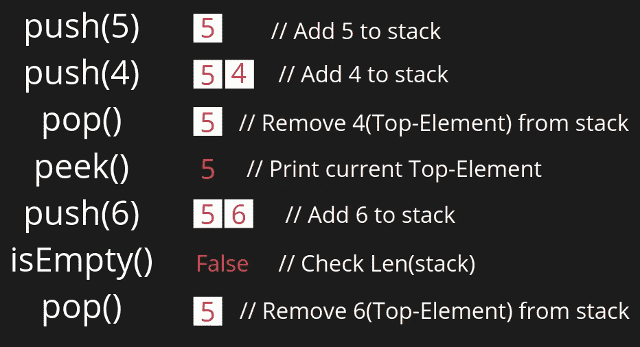

# 我从零开始学习数据结构的旅程—堆栈

> 原文：<https://levelup.gitconnected.com/my-journey-to-learning-data-structures-from-scratch-stacks-1179494fd8f2>

## 这是#100DaysOfDSA —堆栈数据结构的第 1 天

[来源](https://cdn.programiz.com/sites/tutorial2program/files/stack.png)

Stacks 就是单词“stack”的字面意思——一堆东西或一堆东西放在另一堆的上面。那么，你将如何得到处于最底层的东西呢？你将不得不删除所有上述元素，然后访问它，对不对？堆栈数据结构也是如此。放在堆里最后的东西将首先被访问。它被称为**a L**ast-**I**n-**F**first-**O**ut 属性。比如 MS word *(假设)*上的撤销/重做操作，任何代码中的函数调用都是在后端实现 stack 的很多地方的一部分。

用于处理这种数据结构的常见操作有—

*   **Push** —在堆栈中插入元素的别名。
*   **Pop** —从堆栈中删除元素的别名。
*   **Peek** —从堆栈中获取最顶层元素的别名。
*   **isEmpty** —检查堆栈是否为空。
*   **大小** —返回堆栈的大小(元素的数量)。

让我们举个例子，直观地理解所有上述操作的工作原理—

堆栈操作的图示视图

栈可以实现为数组、链表、字符串等，任何你可以实现并控制 LIFO 属性的东西，本质上都是一个栈。

因为，我将用 Python 写所有练习题代码。所以列表别名是，

*   **推** == L.append()
*   **Pop** == L.pop()
*   **isEmpty** == len(L)==0
*   **Peek** == L[-1]
*   **尺寸** ==长度(L)

上面提到的所有操作的时间复杂度都是 O(1 ),因为所有的运动只发生在一侧端。

因此，必须作为实现一部分的一些边缘情况是检查**下溢**和**上溢**问题。下溢是指在栈已经为空的情况下试图弹出或访问。当你试图插入一个已经满了的栈时，就会发生溢出。溢出相对不太可能发生，因为大多数库实现已经将动态分配作为包的一部分实现了。但是，如果你自己编写堆栈类，那么要小心。

> 当使用单链表表示堆栈时，在头部而不是尾部执行所有的操作，以避免任何类型的链表遍历，并保持 O(1)复杂度。如果你不知道什么是链表，那么现在忽略它。我们将在未来的博客中再次看到它。

## 要记住的要点

1.  自然界中最早的 **L** ast **I** n **F** 最早的 **O** ut。
2.  处理**下溢和上溢。**
3.  总是**删除**用于**空间管理的链表实现中的悬空节点。**

# 练习题

请启动并克隆我的 GitHub 存储库—“[从头开始学习数据结构](https://github.com/prakhar21/Learning-Data-Structures-from-Scratch)”，以便在我下次更新存储库时得到通知。

 [## prak har 21/从头开始学习数据结构

### 从零开始学习数据结构#100DaysOfDSA GitHub 是 5000 多万开发人员的家园，他们共同努力…

github.com](https://github.com/prakhar21/Learning-Data-Structures-from-Scratch) 

*P.S .截至目前，我已经加了 2 道练习题。在接下来的 3 天里，我会做一些与堆栈相关的问题，并在 GitHub 库中更新它们，作为博客的一部分，我会发布问题陈述。*

> 另外，如果你也像我一样对机器学习/自然语言处理等领域感兴趣。请务必在我的 YT 频道查看详细的[研究论文演练。](https://www.youtube.com/channel/UCoz8NrwgL7U9535VNc0mRPA/)

干杯！