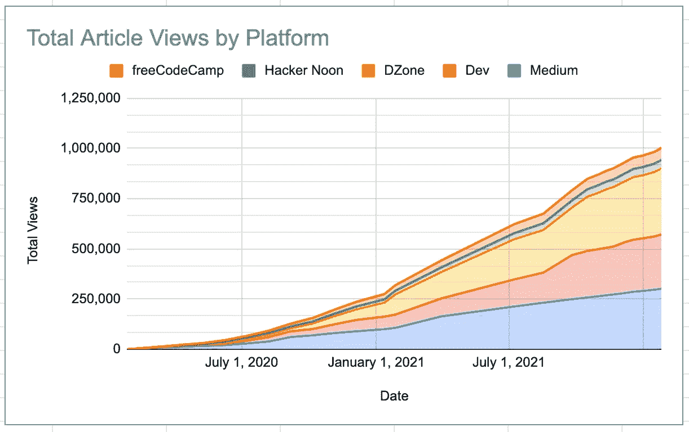
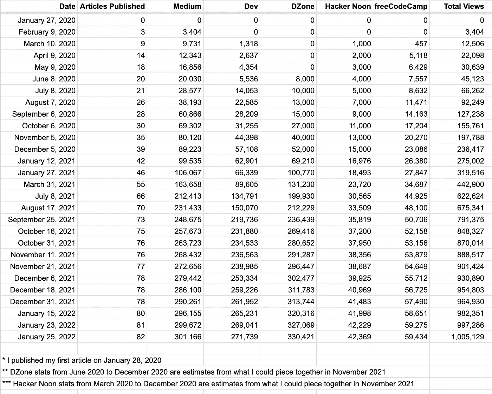

# 我的百万文章浏览量之旅

> 原文：<https://levelup.gitconnected.com/my-journey-to-one-million-article-views-a4bfe6909c5e>

## 对新作者的系统和目标的建议

[菠萝供应公司](https://unsplash.com/@pineapple?utm_source=medium&utm_medium=referral)在 [Unsplash](https://unsplash.com?utm_source=medium&utm_medium=referral) 上的照片

写了两年，点击了一百万的文章浏览量。从我开始写作的那天起，这就是我耐心期待的一个重要里程碑。

值得等待吗？是也不是。我想借此机会反思过去两年，为什么我写作，为什么实现你的目标并不像你想象的那么令人兴奋。

# 旅程:过去和现在

早在 2020 年 1 月，我几乎是心血来潮开始写作的。我一直喜欢教学和演讲，所以写作似乎是这种激情的自然延伸。教 100 名工程师很有趣，但为什么不是 10 万名工程师呢？写作可以让你接触到你正常社交圈之外的观众。

当我开始写作时，我每天都焦虑地查看我的统计数据。我庆祝获得一个新的关注者或有 100 人阅读一篇文章的小胜利。你可以想象，最初的几个月进展缓慢。

你可以在下面看到一些我在过去两年里追踪的详细数据。我在各种平台上发表文章，它们都提供了关于你的文章进展的分析。我将这些合并到我自己的电子表格中，并在此基础上创建了一些图表。

下面是结果图表:

图表:按平台分类的文章总浏览量

这是支持这个图表的数据:

表:按平台列出的文章总浏览量

2020 年 1 月 28 日我发表了第一篇文章。我在 2022 年 1 月 25 日点击了一百万次，就在我两周年写作纪念日的前三天。

令我兴奋的是指数增长。你看到的不是一条直线，而是一条曲线。这是有道理的，因为随着时间的推移，你写了更多的文章，更多的追随者阅读你的作品。

如果你是一名新作家，我希望这些数据能让你对写作世界有一个比较现实的看法。不要期望在第一天就像病毒一样传播。建立一个坚实的基础需要时间、努力和坚持。

# 成功可能会令人失望

我达到了一百万次浏览的里程碑。现在怎么办？下一步是什么？两百万的浏览量？

目标驱动的问题在于，你大部分时间都生活在沮丧之中。在追求一个目标的时候，你还没有实现它。一旦你实现了你的目标，你下一步会做什么？嗯，你设定了另一个目标，并开始追求它。成功的时刻短暂而转瞬即逝。

这就是为什么大多数人惊讶地发现，一旦他们实现了目标，他们就会感到空虚。你付出了这么多努力，为了什么？短暂的庆祝，然后是“现在怎么办？”

当跳远运动员罗伯特·比蒙参加 1968 年奥运会比赛时，目前的跳远世界纪录是 27 英尺 4 英寸。他跳了 29 英尺 2 英寸。他以将近两英尺的优势打破了记录！你可能会认为他会欣喜若狂，他确实是，但只是一小会儿。在后来的一次采访中，他回忆道:“当我走向颁奖台时，我说，‘我该怎么办？“我已经达到了一个阶段，那么我人生中的下一个巅峰体验是什么？”此后不久，他注册了一个研究社会学的硕士学位项目，并慢慢淡出了运动领域。

作为一个不那么引人注目的例子，想想《海底总动员》中*牙医诊所鱼缸里的鱼。它们每天醒着的每一分钟都在计划如何逃到海里。在片尾演职员表的场景中，他们成功了，穿过一条繁忙的街道，降落在海里。然后，当他们在海水中坐了一会儿，一条鱼说，“……现在怎么办？”。*

# 关注系统而不是目标

雄心勃勃的人很难克服目标驱动的问题。你可以像一系列里程碑一样生活，实现一个又一个目标。但是总会有别的东西，更多的东西。更多的追随者，更多的名声，更多的钱。

这就是为什么关注系统而不是目标是至关重要的。目标是一个具体的里程碑，是你完成的事情。另一方面，系统是你做的事情。这是一个过程。

与其关注特定数量的关注者或观点，不如关注过程本身。你为什么要做你所做的事情，你如何使它可持续发展，而不是无休止地进行老鼠赛跑？

# 我为什么写作

我写作是因为我喜欢它。它为我提供了一个媒介来阐明我的想法并把它们展示给别人。它让我能够教书，我觉得很有成就感。

在专业上，写作为我打开了许多机会。我认识了数百个有趣的新人。我得到了几十个有趣主题和技术的自由写作合同。我作为嘉宾接受了几个播客的采访。它甚至为我打开了一些说话的机会。

写作是远远少于我的文章浏览量或追随者的数量。相反，这是关于做我想做的事情。