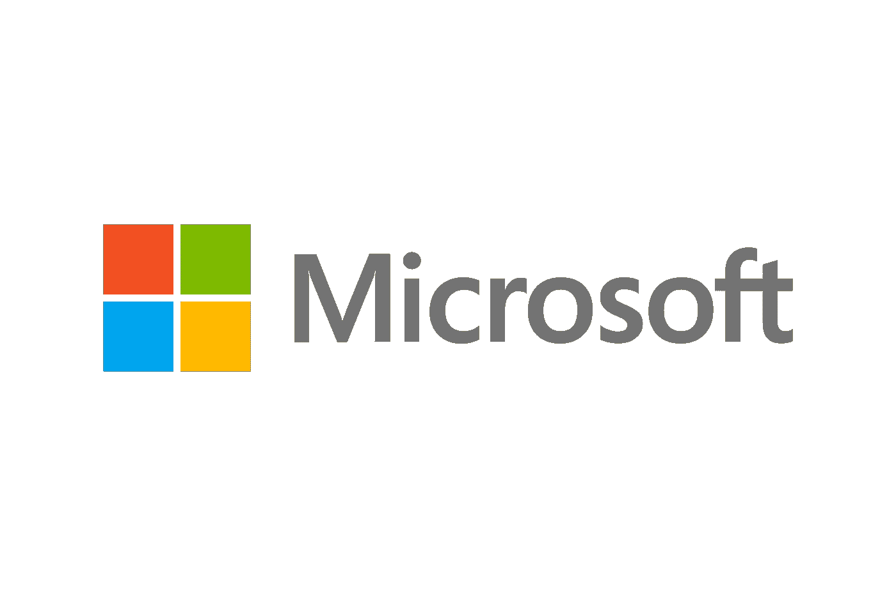

# 我暑期实习的微软面试经历

> 原文：<https://levelup.gitconnected.com/my-microsoft-interview-experience-for-summer-internship-4c8ff98db556>

我 2022 年暑期实习的微软面试经历。面试包括两轮技术面试和一轮技术+人力资源面试。

# 技术回合 1

1.  给定一个按升序排序的链表，构造平衡二叉查找树。
2.  对链表进行排序。

# 技术回合 2

1.  给你一个 0 和 1 的矩阵，你必须返回矩阵中唯一行的总数。这个问题有两个最优解。1)字符串散列 2)使用 Trie
2.  *后续问题:—现在，您需要打印所有唯一的行。*
3.  给你一个单词字典，一个源单词和目的节点。在任何时候，您只能更改当前节点的一个字符。找出源单词和目的单词之间最短路径的长度。如果不存在路径，则返回-1。
4.  给你一个字符串数组，你需要返回所有最短的唯一前缀来表示每个单词。

# 技术+人力资源第三轮

1.  基于项目和场景的问题
2.  简历中的问题

## 人力资源问题

1.  说说你自己吧。
2.  你最感兴趣的是什么。
3.  我得到了一个构建项目的场景，以及我需要做的基本要求和优化是什么。

> 希望你觉得有用。感谢阅读:)