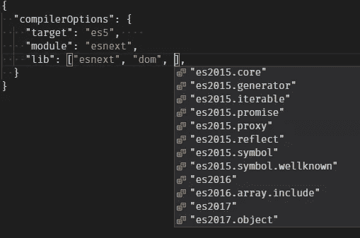
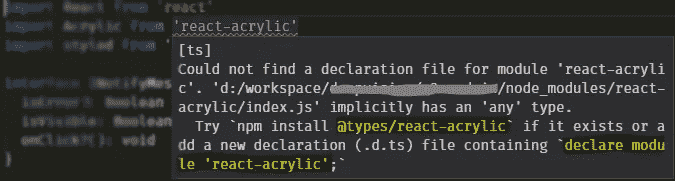

# 我的新好朋友打字稿

> 原文：<https://levelup.gitconnected.com/my-new-best-friend-typescript-2a5ca8399622>

## 对于 JavaScript 开发人员来说，TypeScript 还不是默认的选择，但它正在慢慢成为默认选择。我想分享我的旅程，以及我不想回去的原因。我觉得自己又活过来了！

由[罗伯特·科林斯](https://unsplash.com/@robbie36?utm_source=medium&utm_medium=referral)在 [Unsplash](https://unsplash.com?utm_source=medium&utm_medium=referral) 上拍摄的照片

# 过去

我说回去是什么意思？嗯，巴别塔周围有一个生态系统，这是目前普遍利用 ES2015+的主要方法。为了类型安全， [FlowType](https://flow.org/) 几乎可以和 Babel 一起工作。我使用这两种技术有一段时间了，这并不是说我不开心，而是有一些模糊的感觉，有些事情不对劲。

让我再倒回去一点。TypeScript 并不完全是一个新的播放器，我记得大约两年多前看着它，我想:“什么？它不能做这做那？”。那是在 ES6 成为现实的时候，Babel 在功能实现方面遥遥领先。TypeScript 在很多方面都有所欠缺，而且类型安全也不觉得离开 ES6 有多重要。谁会放弃曾经学习和热爱过的胖箭头函数呢？

# 现状

回到当下。发现 TypeScript 实际上跟上了最新的 ECMAScript 特性是一个相当令人震惊的发现，这让我非常感兴趣。我对 FlowType 并不完全满意，对类型安全的日益增长的渴望最终改变了我。

不要误解我——我并不是为了减少代码中的错误而寻求类型安全。[不是这样的](https://medium.com/javascript-scene/you-might-not-need-typescript-or-static-types-aa7cb670a77b)。我相信这句话已经说过很多次了，但还是让我们重复一遍吧。

> 静态类型检查不会保护你免受运行时错误的影响。

我只是想让我的生活更轻松。我可能变得又老又懒，但是为了使用我一个月前写的一些函数，总是不得不检查它的源代码，这有点烦人。更不用说当有一些深度嵌套的对象时，我必须找出我现在需要的值在哪里。不得不这么做一点也不酷。

[弗兰基·k .](https://unsplash.com/@frankie_k?utm_source=medium&utm_medium=referral)在 [Unsplash](https://unsplash.com?utm_source=medium&utm_medium=referral) 上的《挂在装饰环上的蓝色羽毛》

肯定有一些关于 TypeScript 的神话让人觉得如此可怕，以至于用户宁愿完全避免它。下面是其中的一些(从[这个演讲](https://kamranicus.com/presentations/demystifying-typescript/#/6)中借用)。

## 我必须学习一门全新的语言

不，没什么特别要学的，只是 JavaScript，真的。

## TypeScript 不能与 JavaScript 互操作

我不知道 TypeScript 中有什么东西不是 ECMAScript 规范的一部分。如果我错了，请在评论中纠正我，但是我认为可以很有把握地说，一旦去掉类型注释，至少 95%的 TypeScript 将与 ECMAScript 兼容。

## TypeScript 就像 CoffeeScript 或 Dart 或 Babel 或 Flow 等。

那实际上是有几分真实的。TypeScript 就像巴别塔+心流。TypeScript 是一个单独包中的编译器/类型检查器。它负责将您的 ES20##代码转换成您需要的任何目标(ES3 和更高版本)。并且它会一直进行类型检查。但最重要的是，它开箱即用！几乎不需要任何配置，您就可以开始了。

基本配置为 TypeScript 的 tsconfig.json 文件。

当配置预置和插件时，这可能感觉类似于巴别塔。不同的是**你不需要安装任何额外的包**，都包含在 TypeScript 里了。使用 VSCode，您甚至不需要查看文档，它会告诉您可以在那里使用什么。

## 您只能在 Windows 中使用 TypeScript

没有。TypeScript 与平台无关。这可能是因为它是微软的产品。嗯，他们当然已经变了；)

## 单元测试将消除对类型脚本的任何需求

恰恰相反。TypeScript 可以帮助您编写单元测试。这对于 TDD 方法来说可能是有问题的，但是除此之外，它是一个很好的资产。请记住，TypeScript 不会将您从运行时错误中解救出来。这就是为什么你既需要单元测试又需要 TypeScript。

# 肮脏的东西

[杰西·奥里科](https://unsplash.com/@jessedo81?utm_source=medium&utm_medium=referral)在 [Unsplash](https://unsplash.com?utm_source=medium&utm_medium=referral) 上的《一个双手沾满泥巴的男人》

## 入门指南

你开始使用 TypeScript 时是否认为在使用它之前需要理解类型系统？个人建议，不要从一开始就启用类型守卫，这可能是相当压倒性的。只需进行[基本配置](https://www.typescriptlang.org/docs/handbook/typescript-in-5-minutes.html)，一旦你对 TypeScript 正在检查和传输你的代码感到满意，请阅读 [TypeScript 深度剖析](https://basarat.gitbooks.io/typescript/content/docs/getting-started.html)。

我建议在正式文件发布之前阅读这本书，因为这本书有时会有点混乱。例如，他们在任何地方都使用`let`,这很容易让人觉得那里不存在`const`。或者像`import m = require("mod")`这样的陈述感觉像 CommonJS 和 ESM 的奇怪组合。所以，是的，先读读那本书，让自己不要紧张；)

## 林挺

我相信你已经学会喜欢 ESLint，因为它为你节省了许多分钟甚至几个小时来发现问题，否则很难跟踪这些问题。怎么委婉地说呢…忘了 ESLint 吧！

仅仅是类型检查当然有助于发现各种各样的错误。然后还有一个 [TSLint](https://palantir.github.io/tslint/) 对应项，它覆盖了一些遗漏的检查。就插件而言，它不是那么健壮，但是你可以在那里找到 ESLint 的大多数重要规则。说实话，我还没探索到那么深。至于造型规则，好吧，就用[更漂亮](https://prettier.io/)就可以欢乐起舞了。

## 自定义类型

在很短的一段时间内，你将会发现所有的东西都输入得很好，而且你最喜欢的 IDE 一直在给你有用的提示。然后，您遇到了一些您确实想使用的第三方库，您可能想知道如何为其获取类型。基本上有三种情况。

*模块是用 TypeScript 编写的或者包含类型定义文件——您已经完成了，不需要额外的工作
*有一个您可以安装的`@types/*`模块(使用 [TypeSearch](https://microsoft.github.io/TypeSearch/) )
*您必须自己创建一个类型存根

在后面的两个场景中，TypeScript 甚至会给你一个有用的提示。只要跟着它走，你就是金色的。

当缺少第三个模块的声明时，Typescript 会给出建议。

这再容易不过了。在项目的任何地方创建文件，输入行`declare module 'react-acrylic'`，你就可以开始了。这被称为环境模块，它像一个全局声明一样工作，不需要导入任何东西，无论它位于何处(在项目文件夹中)，TypeScript 都会找到它。

当您熟悉了类型系统后，您可以慢慢地在代码中扩展定义。看看我的第一次尝试在图书馆打字。那个文件只是放在我的项目中，每当我想使用一些非类型化的特性时，我就把它添加到那里。最终，我甚至可能会把它出版给 DefinitelyTyped.org。

# 现实

照片由[Niketh ve lanki](https://unsplash.com/@thenikyv?utm_source=medium&utm_medium=referral)在 [Unsplash](https://unsplash.com?utm_source=medium&utm_medium=referral) 上拍摄

就我个人而言，我还没有真正尝试过将现有项目转换为 TypeScript。这可能是大多数开发人员不愿采用的主要原因。可以肯定的是，你不会遇到语言本身的任何问题。如今，您可以在 Babel 中使用的所有内容都可以在 TypeScript 中使用。当你依赖一些奇怪的/模糊的/定制的巴别塔插件时，事情会变得不稳定。您可能想要[查看这篇文章](http://artsy.github.io/blog/2017/11/27/Babel-7-and-TypeScript/)以获得关于该用例的帮助。

在基本配置中，TypeScript 将计算出您在那里拥有的大部分内容。其他的一切都将是非类型化的，等着你在对你有意义的时候添加那些类型。你肯定想这么做。这是你换工作的主要原因，对吗？可以肯定的是，TypeScript 不会阻止你运行你的非类型化代码，除非有明显的违规，例如，将数字传递给一个明显需要布尔值的函数。

然后你启用各种类型的守卫，修复一些问题，也许再次禁用他们，直到你觉得准备好下一轮。冲洗和重复，直到一切都很好地输入和安全。你添加的任何类型注释当然会起作用，当你违反它们时会对你大喊大叫。

不要试图对 TypeScript 撒谎，告诉它这个苹果实际上是一个橙子，后来( *runtime* )发现它确实是那个苹果。在寻找由此引起的细菌时，你的头可能会受伤。如果你想要一个类型安全的代码，努力找出一个正确的类型，而不是到处散布`any`。

这里我想提到的最后一点是，Babel 和 TypeScript 都有对 JSX 的一流支持，但是使用 TypeScript，您不需要安装任何额外的东西，只需在配置文件中启用该选项。如果你是一名 React 开发人员，你将会对此非常满意。在以后的文章中，我将更多地关注 React 应用程序的类型检查，敬请关注；)