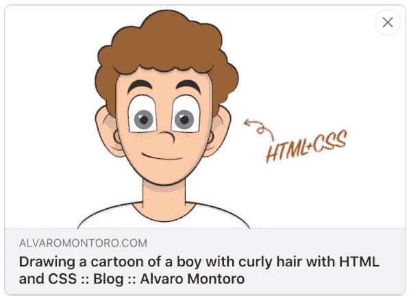

# 我的 og:图像 Bug

> 原文：<https://levelup.gitconnected.com/my-og-image-bug-5226f2fd9311>

## 由于社交媒体处理数据的方式不同，我网站上的一个 bug 在脸书(而不是 Twitter)上分享时引起了一个问题。


这是我在开发我的博客时发现的一个 bug 的故事。这让我困惑了一段时间，直到我发现一个看似无关的问题导致了这个问题。这可能有点傻，但也可能很有趣，因为它展示了社交网络处理页面元数据的不同之处。

# 问题是

当在社交媒体上分享我的博客链接时，缩略图在 Twitter 或 Linkedin 上看起来没问题，但在脸书上就不一样了。Twitter 卡片上有博客文章的缩略图，但脸书卡片上显示的是普通网站的缩略图:


左边的卡片来自 Twitter，上面有正确的图片。右边的卡片来自脸书，它显示的是一个普通网站的缩略图。

我用相同的信息填充 OpenGraph 和 Twitter 卡元数据。所以应该是同一个图像。

这不可能是图像不符合脸书的标准。我分享了用同样的格式和压缩方式生成的大小相似的图片。此外，脸书的文件中没有任何东西表明我做错了什么。发生了什么事？

# 根本原因

我开始挖掘代码，发现这是博客文章的元信息(代码减少了):

```
<meta property="og:title" content="The Simpsons in CSS" />
<meta property="og:type" content="website" />
<meta property="og:url" content="https://alvaromontoro.com/blog/" />
<meta property="og:image" content="https://alvaromontoro.com/images/blog/the-simpsons-in-css.png" />
<meta property="og:description" content="This is a personal project..." />

<meta name="twitter:card" content="summary" />
<meta name="twitter:url" content="https://alvaromontoro.com/blog/" />
<meta name="twitter:title" content="The Simpsons in CSS" />
<meta name="twitter:description" content="This is a personal project..." />
<meta name="twitter:image" content="https://alvaromontoro.com/images/blog/the-simpsons-in-css.png" />
```

匹配值:`og:title`与`twitter:title`相同，`og:url`与`twitter:url`、`og:description`与`twitter:description`、`og:image`与`twitter:image`相似。OpenGraph 和 Twitter 元数据都是如此。

然后我意识到`og:url` / `twitter:url`不是正确的那个。两者都匹配，但它指向了错误的 URL:它不是博客文章，而是博客本身。但是对缩略图来说重要的是`og:image` / `twitter:image`值...对吗？

不对！我运行了一个快速测试，纠正了 URL，也修复了缩略图错误！不幸的是，我陷入了与我在上一篇文章中描述的[相同的错误。](https://alvaromontoro.com/blog/67844/web-confusion)

当 **Twitter 和 Linkedin 正在提取** `**og:image**` **数据并使用它来显示缩略图时，脸书正在使用** `**og:url**` **值作为索引，并从缓存/数据库**中提取图像信息，而不是使用`og:image`。导致了这个问题。

# 解决方案

知道了这个问题，解决方案很简单:**确保** `**og:url**` **与实际的页面 URL** 匹配。不管怎样，这是正确的做法:

```
<meta property="og:title" content="The Simpsons in CSS" />
<meta property="og:type" content="website" />
<meta property="og:url" content="https://alvaromontoro.com/blog/67971/the-simpsons-in-css" />
<meta property="og:image" content="https://alvaromontoro.com/images/blog/the-simpsons-in-css.png" />
<meta property="og:description" content="This is a personal project..." />

<meta name="twitter:card" content="summary" />
<meta name="twitter:url" content="https://alvaromontoro.com/blog/67971/the-simpsons-in-css" />
<meta name="twitter:title" content="The Simpsons in CSS" />
<meta name="twitter:description" content="This is a personal project..." />
<meta name="twitter:image" content="https://alvaromontoro.com/images/blog/the-simpsons-in-css.png" />
```

现在，脸书卡片也显示了正确的图像:



这就是我博客上关于`og:image` bug 以及我如何解决它的故事。感谢阅读:)

*原载于 2021 年 8 月 17 日*[*https://alvaromontoro.com*](http://alvaromontoro.com/blog/67985/my-og-image-bug)*。*