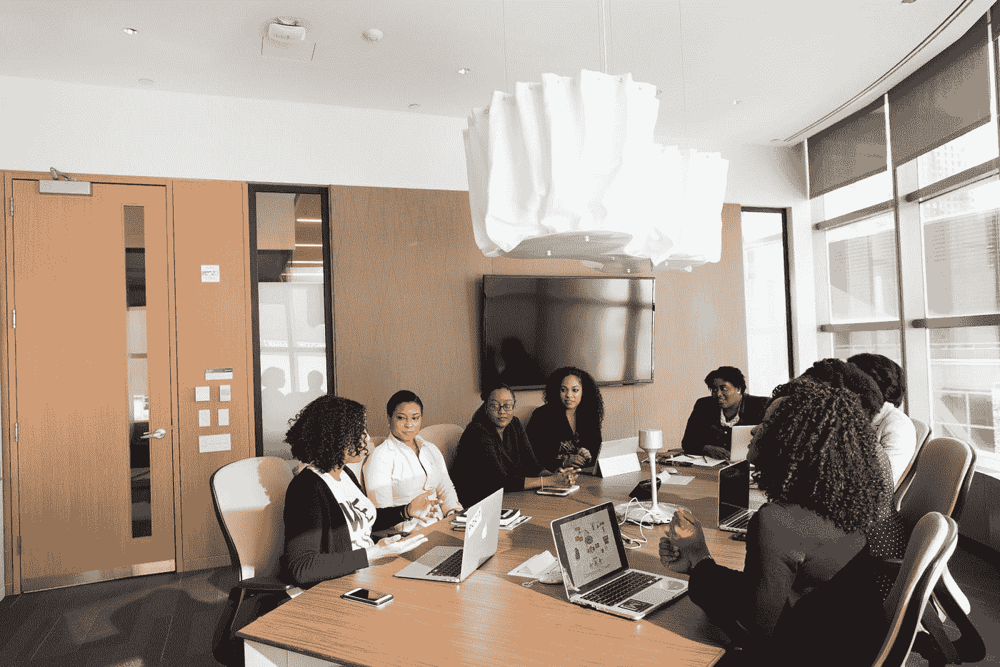

# 我召开有效会议的策略

> 原文：<https://levelup.gitconnected.com/my-playbook-to-run-effective-meetings-78e625c17585>

## 也适用于远程工作的场景

克里斯蒂娜@ wocintechchat.com 在 [Unsplash](https://unsplash.com?utm_source=medium&utm_medium=referral) 上的照片

> “大多数会议都太长、太无聊、太没有成效——而且是企业生活中太多不能放弃的部分”
> 
> —洛伊丝·威斯

在工作中，我们花了无数个小时开会。我们讨论了一大堆话题，有几个相关的，也有很多不相关的。

这些会议中有许多只是没完没了地开着，没有达成一致的结论。有些会议时间很短，在会议结束时才开始行动。

自从疫情事件爆发以来，随着在家工作成为强制性的，我们花在会议上的时间急剧增加。音频/视频电话会议成为与同事联系的唯一方式。

为了减少我们花在会议上的时间并有效地召开会议，我们开始采取一些措施。这是最重要的几个—

# 保持简短

> "会议越长，完成的就越少。"
> 
> 蒂姆·库克

总是开一个有时间限制的会议。与会者无休止地讨论任何事情。我们想解决这个问题。

一个简单的解决方法是定义会议何时结束，并严格遵守。这有助于我们减少会议时间，并使每个人的注意力都集中在会议议程上。

# 带着议程走

> "你开会是为了做决定，而不是决定这个问题。"
> 
> —比尔·盖茨

这是你应该采取的另一个措施，永远不要参加没有议程的会议。

你不想参加一个没有有意义结论的会议。正确的问题是得出结论的唯一途径。要做到这一点，你需要议程来提供方向。

议程将会议引向可衡量的结果。你不会想参加一个没有结果的会议。

# 会议应该只有合适的人参加

> "会议应该有尽可能少的人，但所有合适的人."
> 
> 查尔斯·沙夫

我见过有人邀请很多人参加会议，却不考虑需要谁出席。如果你不能参加会议，那就减少参加会议的次数。如果你邀请了其他人，要注意会议中需要谁。

# 拒绝不必要的会议

> “会议是糟糕的组织的症状。会议越少越好。”
> 
> ——彼得·德鲁克

任何可以通过电子邮件或聊天解决的事情都不应该带到会议上。

我参加过很多次根本不需要的会议。一封邮件或一个聊天线程就能解决的小事，被拉长成了一场会议。

# 少说话

> "人们想得越少，说得越多。"
> 
> ——查尔斯·德·孟德斯鸠

这是真的，在我的职业生涯中，我见过很多话多的人。这样的人贡献较少，会不必要地延长会议。

这样的与会者会惹恼其他人，使环境变得有毒。当你说得多的时候，你想得少。如果你是这样的人，先思考再说话。如果你有这样的同事，你需要让他们不要离题，避免不必要的谈话。

# 包扎

谈到工作，会议是一个非常重要的方面。多亏了疫情和 WFH，会议现在可以在线进行了。

会议消耗了我们很多时间。他们占用了我们的工作时间。我使用上述措施来减少会议次数和我们在会议上花费的时间。

我希望你喜欢读这篇文章。如果你愿意支持我当作家，请我喝杯咖啡，可以考虑注册 [***成为中等会员***](https://singhamrit.medium.com/membership) ***。每月只需 5 美元，你就可以无限制地使用 Medium。***