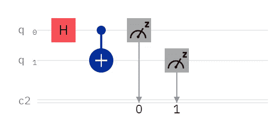

# 我的量子电路比你的小

> 原文：<https://levelup.gitconnected.com/my-quantum-circuit-is-smaller-than-yours-d4db70135844>



“你好，量子世界！”

# 我怎么知道呢？

在你从事基于门的量子计算一段时间后，你会学到一些关于量子电路的东西，比如:

*   电路深度不好。
*   多量子位操作是必不可少的，但是不好。
*   忽视连通性是不好的。

诸如此类。

如果你是手动设计电路，这并不可怕。你的电路可能相对较小，你可以学习如何手动优化量子位选择，删除不必要的门，并尽量减少保持相干所需的时间。

但是，当您开始使用工具来优化电路时，会发生什么呢？哪些工具单独使用效果最好，如果一起使用，哪些工具以何种顺序组合使用效果最好？

对于 Qiskit，以下是一些有用的函数:

*   所有操作的计数
*   circuit.count_ops()['cx'] #喜欢出错的 CNOTs 的计数
*   circuit.depth() #电路深度

一种方法是在之前和之后都运行这些，这可能是我在以后的文章中要做的事情。但是当我不写文章的时候，我是以编程的方式来做的:

```
# https://github.com/Qiskit-Partners/mapomatic
trans_qc_list = transpile([qc]*20, provider.get_backend('ibm_auckland'), optimization_level=3)
best_cx_count = [circ.count_ops()['cx'] for circ in trans_qc_list]
```

这段代码可以很容易地修改，在 *trans_qc_list* 中添加更多的 transpiled 电路，然后第二行仍然为你做艰苦的工作。这段代码使用 Qiskit 的 Pass Manager，我通常在合奏中使用 Quantinuum 的 TKET。但是，我正在改变我的合奏，所以这篇文章是那篇后续文章的前奏，那篇后续文章将有希望揭开我可能组装的最好的织补合奏。