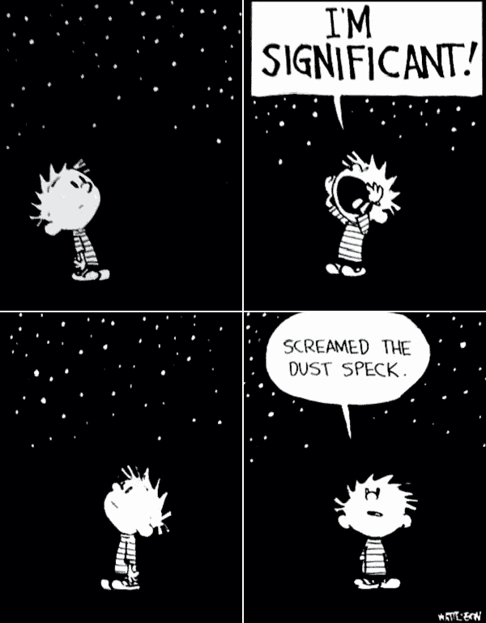
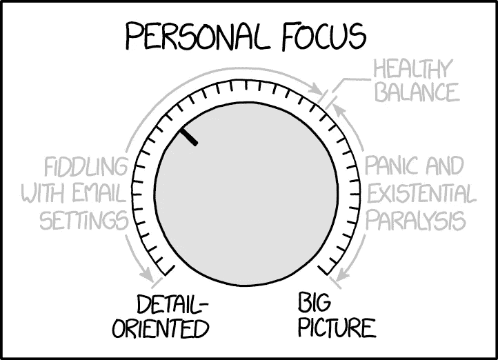
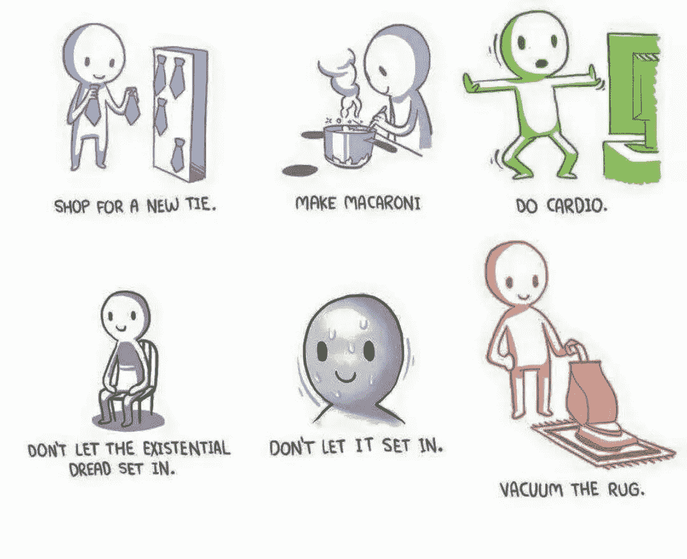
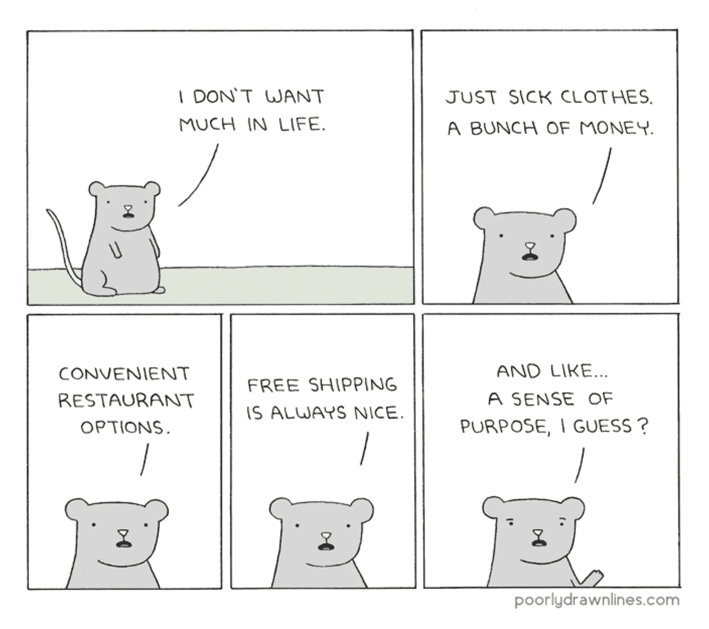

# 作为一名软件工程师，我反复出现的生存危机

> 原文：<https://levelup.gitconnected.com/my-recurring-existential-crisis-as-a-software-engineer-2d5b3df94794>

## 在工作中寻找意义

我很重要(来源:[卡尔文和霍布斯](https://i.redd.it/wl1oxh6icv751.jpg))

我发现自己大约每六个月就会在工作中遇到一次生存危机。

“我这一生在做什么？”

“我是在浪费时间吗？”

“我现在做的事重要吗？”

在过去的十年里，不管我在为哪家公司工作，我在做什么项目，或者我的职位是什么，这些问题不断浮现在我的脑海中。我对这些问题的回答每月都在波动，每年都在波动。

我发现，随着时间的推移，我的工作动机已经发生了变化。我不确定他们是朝着一个更高的目标进化，还是没有明确最终目标的简单改变，但事实上他们正在改变。

个人重点(来源: [xkcd](https://xkcd.com/1796/)

有时候我会被工作本身所激励。这项工作在技术上有挑战性吗？它能推动我学习和成长吗？我对将要使用的工具和编程语言感兴趣吗？我在解决复杂的问题吗？有时候，只要有可以让你迷失的工作就足够了。为学习而学习可能很有趣。

也许这一切只是为了分散注意力。

不要让存在主义的恐惧降临(来源:[蓝椅子](https://www.webtoons.com/en/slice-of-life/bluechair/ep-59-busy-work/viewer?title_no=199&episode_no=61&webtoonType=WEBTOON&ogTagImageUrl=%2F20180704_274%2F1530671424149pCCxu_JPEG%2F04_EC9E91ED9288EC8381EC84B8_mobile.jpg%3Ftype%3Dcrop540_540)

其他时候，我更关注公司的使命。作为一家公司，除了为股东赚钱之外，我们是否正在朝着以某种有意义的方式为世界做出贡献的目标努力？我相信公司正在做的事情吗？我对我们正在产生的影响和我们正在开发的产品感到兴奋吗？

尼采曾经说过，“一个有理由活下去的人几乎可以忍受任何事情。”

我对生活的要求不多(来源:[画得不好的线](https://poorlydrawnlines.com/comic/not-much/))

最近我对人更感兴趣了。我有机会以积极的方式影响他人的生活吗？这可能是通过管理或领导机会，也可能是正式或非正式的指导关系。

或者我正在以积极的方式影响我们客户的生活吗？也许公司的使命或产品并不能改变世界，但它至少在某个小方面让人们的生活变得更好或让他们的工作变得更容易了吗？

木星给了地球一个月亮(来源: [wawa wiwa](https://www.wawawiwacomics.com/)

我不确定这些目的中是否有哪一个比其他的更好，或者它们只是不同。也许它们没有遵循自然的进程，在它们之间循环是正常的。

许多人根本找不到工作的意义，而是在生活的其他追求中找到目标。那也可以。家庭、朋友、爱好、宗教、运动和志愿者工作都赋予了我们生活的意义。

你的工作不应该定义你是谁。作为软件工程师，我们应该庆幸自己能够认为自己的工作是有意义的。