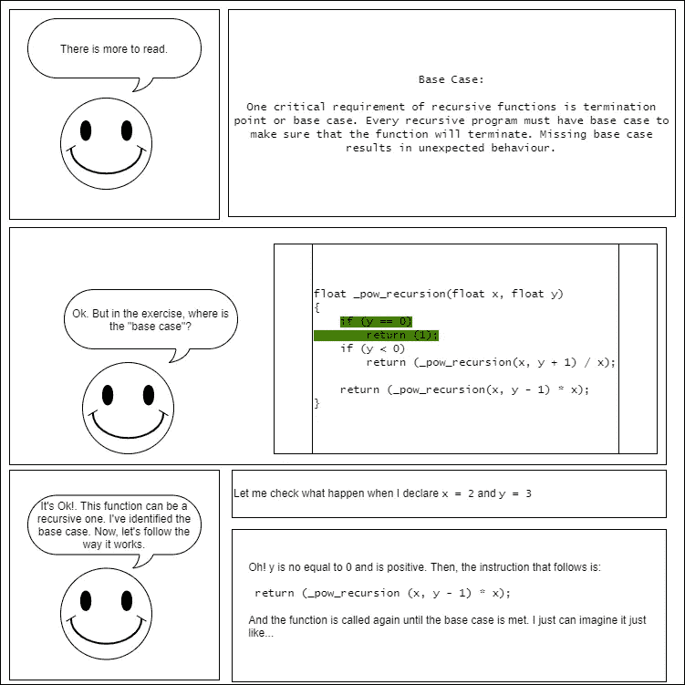
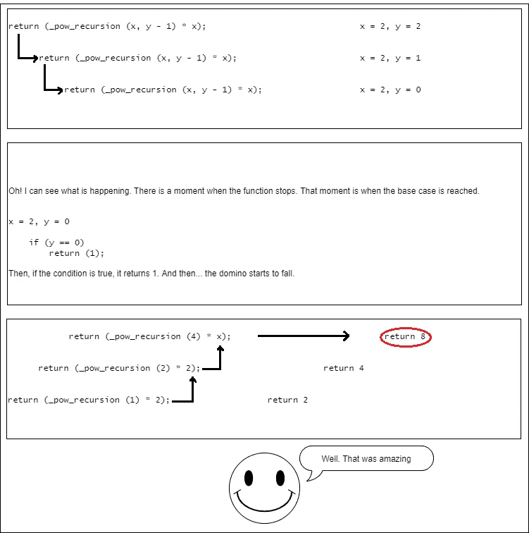

# 我的递归漫画

> 原文：<https://levelup.gitconnected.com/my-recursion-comic-2456e7b0a36b>

我如何通过漫画理解递归？

第 1 页

第 2 页

第 3 页

参考文献。

 [## 递归函数- GeeksforGeeks

### 递归:在编程术语中，递归函数可以被定义为直接调用自身的例程或…

www.geeksforgeeks.org](https://www.geeksforgeeks.org/recursive-functions/)