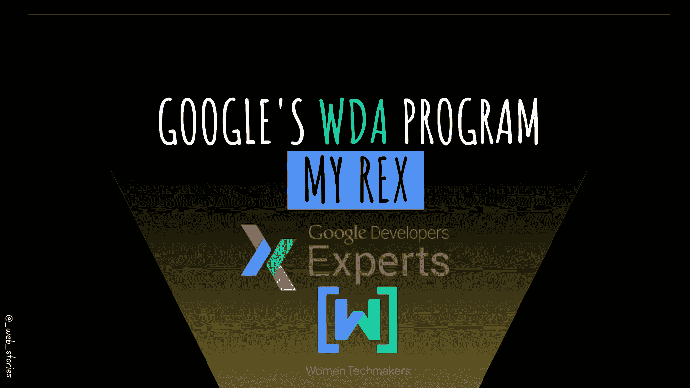
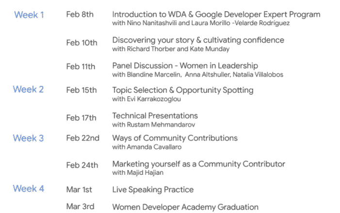
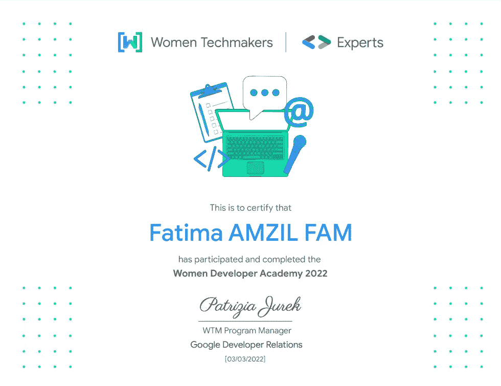

# 我对谷歌女性开发者学院的看法

> 原文：<https://levelup.gitconnected.com/my-rex-about-googles-women-developer-academy-90890b748e58>

## WDA 计划的所有行踪！

作者:FAM

你好👋

我最近成为了欧洲谷歌 2022 年 WDA 计划的一部分。我很高兴有这样的经历，并决定分享它是如何发生的。从中得到什么？以及我对此的反馈！

我真的很兴奋告诉你这件事！

在告诉你整个事情是如何发生的之前，你可能需要先了解一下 WDA(女性开发者学院项目)。

# WDA 是什么？

> 女性开发者学院培养女性技术人员成为行业领导者

3 个月前，我得到了黛比·奥布赖恩的链接，她是一位热爱分享和学习的杰出女性。多亏了 React 2022 大会，我和黛比取得了联系。我非常感谢我订阅并被选中成为这个项目的一部分。

该计划于 2 月 8 日启动。我们是来自欧洲的 107 名参与者，来自超过 24 个国家的技术女性。我们有机会拥有 60 多位导师。

为什么我想成为这个项目的一部分

> 喜欢分享他们的知识和对技术的热情的人。

# 程序是什么样子的

这是 2022 年 WDA 项目的时间表。

**第一周:**我们从一个温和的介绍、项目背景以及来自有经验和有才华的人的问题/回答开始。

第二周:我们学习了如何选择话题。如何发现机会，如何准备技术报告(当然，因为我们都是科技世界的女性)

**第 3 周:**利用上一周学到的知识，通过使用不同的方式和推销自己作为贡献者来为社区做出贡献。

第 4 周:最令人兴奋的一周是你将运用你所学的知识，并通过 5 分钟的现场演讲进行练习，并从导师和观众那里获得新鲜和实时的反馈。

谷歌的 WDA 欧洲项目

毕竟，毕业了！

作者:吉菲

## 等一下。毕业是要遵守一些规则的，尽管…

*   至少参加 **80%的课程**
*   至少参加两次导师会议(是的，你有你的私人导师 🥰)
*   选题练习
*   博客文章-撰写
*   演讲者简介/简历
*   5 分钟现场演讲。

# 有很多，真的有很多要学。

作者:吉菲

# 我的反馈

## ❤️I 喜欢…

*   环境是健康的，有积极的氛围。
*   从你所在的地方开始的核心理念(你不需要已经做出贡献，博客或演讲者，你需要的只是你学习的动力和作为一名女性在科技世界中发光发热)
*   节目主旨:“ ***我们在这里互相鼓励，互相拔高*** ”。
*   做的开心点！
*   获得人才的多年经验的成果。真的不是给定的东西。

## 🔥我学会了…

*   如何展示和推销自己
*   如何展示和创建技术演讲
*   如何发现机会并找到谈论的话题
*   这一切都是从讲述一个故事开始的，这个故事是我的博客和 youtube 视频(网络故事)的主要内容，所以我很高兴我走上了正确的道路！
*   我学到了有趣的策略和算法来找到合适的话题来写/说。

## 专业人士使用的🧰Tools/技巧…

*   【https://www.katacoda.com/ 
*   [https://www.promodo.com/](https://www.promodo.com/)
*   [https://habitica.com/](https://habitica.com/)
*   [https://hacktoberfest-projects.vercel.app/repos/javascript?q =角度](https://hacktoberfest-projects.vercel.app/repos/javascript?q=angular)
*   [https://www.linkedin.com/sales/ssi](https://www.linkedin.com/sales/ssi)
*   [https://accounts.coschedule.com/login?服务=headlineStudio](https://accounts.coschedule.com/login?service=headlineStudio)
*   [https://dev.to/chibichibibr/work-and-study-routine-28bg](https://dev.to/chibichibibr/work-and-study-routine-28bg)
*   [Metricool](https://metricool.com/)
*   [https://www.planoly.com/](https://www.planoly.com/)
*   [https://www.hootsuite.com/](https://www.hootsuite.com/)
*   [https://www.powtoon.com/](https://www.powtoon.com/)
*   [https://shotcut.org/](https://shotcut.org/)
*   [https://sessionize.com/](https://sessionize.com/)

## ✔️My 建议…

*   视频是录的但不是聊的(有很多大家分享的有趣的东西，复制/粘贴保存在某个知道你可能需要的地方也不错；)
*   只要会议继续，你就要准备好为每个会议写笔记(我个人使用 OneNote)。这个策略将帮助你强化你刚刚学到的东西，并把你的新想法保存在某个安全的地方，这样你就可以在需要的时候回去阅读它们。
*   最后下载所有支持和录制的视频。每周五，组织者都会发送带有驱动链接的计划简讯来获得这些宝贵的支持，但是谁知道会发生什么呢？最好在程序结束时在本地保留一份副本。
*   在现场演讲中重播你自己的记录，并建立一个建设性的批评家。(对我来说，我讲的题目是理智的，需要很大的勇气。那对我来说是最困难的部分。我很惊讶，对于我的英语来说，已经很久没有说英语了，这很好，所以我真的很高兴😜)

# 轮到你了！

我不能具体说明我从每周和每节课中学到了什么。不然这篇文章就太长了，读不下去！所以请在评论区告诉我你对什么更感兴趣，在此基础上我会写一篇详细的文章。

# 🎓最后，我的 WDA 毕业证书🎇

作者:吉菲

WDA 认证

# 🙏🏻特别感谢…

)(我)(们)(都)(不)(知)(道)(,)(我)(们)(还)(不)(知)(道)(,)(我)(们)(还)(不)(知)(道)(,)(我)(们)(还)(不)(知)(道)(,)(我)(们)(还)(是)(不)(知)(道)(,)(我)(们)(还)(不)(知)(道)(,)(我)(们)(还)(不)(知)(道)(,)(我)(们)(还)(不)(知)(道)(。 )(我)(们)(都)(不)(知)(道)(,)(我)(们)(还)(不)(知)(道)(,)(我)(们)(还)(不)(知)(道)(,)(我)(们)(还)(不)(知)(道)(,)(我)(们)(还)(不)(知)(道)(,)(我)(们)(还)(不)(知)(道)(,)(我)(们)(还)(不)(知)(道)(,)(我)(们)(还)(不)(知)(道)(。

特别感谢所有**有才华的参与者和导师**，通过这次令人敬畏和难忘的经历，我认识了他们。

非常感谢你让我成长！

# ⏭️Next 步…

我的下一步将是响应 [***莫妮卡【贾诺塔】***](https://www.linkedin.com/feed/update/urn%3Ali%3Aactivity%3A6910061966430539776) 命题申请*💪*

> *顺便说一下，谢谢你给我这个绝佳的机会💌*

*我非常感谢女性技术人员、[谷歌](https://www.linkedin.com/company/google/)和[谷歌开发专家](https://www.linkedin.com/company/experts-program/)给了我们❤️这个惊人的机会*

*今天就到这里，看阿雅🙋*

*如果您有任何问题或反馈，请点击评论或通过 LinkedIn 联系我— **我洗耳恭听！***

*[**想给我买杯咖啡吗？☕️**](https://www.buymeacoffee.com/fatimaamzil)*

> **如果你喜欢我的文章，* [***订阅***](https://famzil.medium.com/subscribe) *获取我的最新。如果你自己喜欢体验中等，可以考虑通过**[***报名会员***](https://famzil.medium.com/membership) *来支持我和其他几千个作家。它只需要花费***每月 5 美元，它支持我们，作家，你也有机会用你的写作* ***赚钱*** *。当然，你可以随时取消会员资格。通过报名* [*这个链接*](https://famzil.medium.com/membership) *，你就直接用你的一部分费用支持我，不会多花你钱。如果你这样做了，万分感谢！****

***让我们在 [**上**取得联系****](https://medium.com/@famzil/)**[**Linkedin**](https://www.linkedin.com/in/fatima-amzil-9031ba95/)**[**脸书**](https://www.facebook.com/The-Front-End-World)**[**insta gram**](https://www.instagram.com/the_frontend_world/)**[**YouTube**](https://www.youtube.com/channel/UCaxr-f9r6P1u7Y7SKFHi12g)**或*************

********* [## 通过我的推荐链接——FAM 加入 Medium

### 作为一个媒体会员，你的会员费的一部分会给你阅读的作家，你可以完全接触到每一个故事…

famzil.medium.com](https://famzil.medium.com/membership)*********