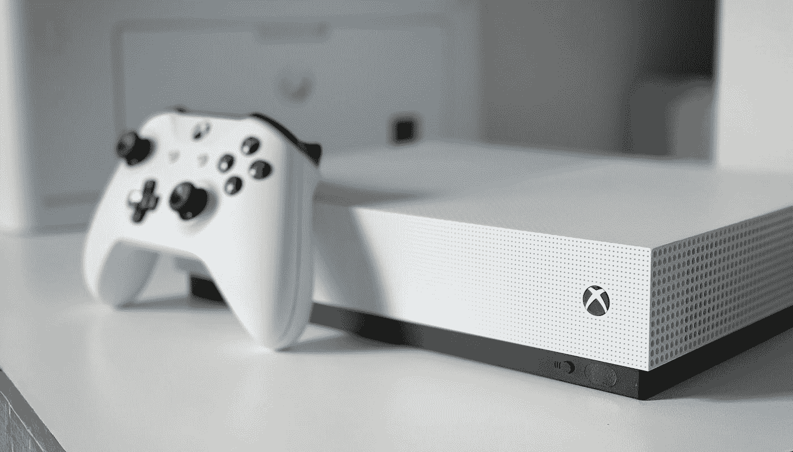
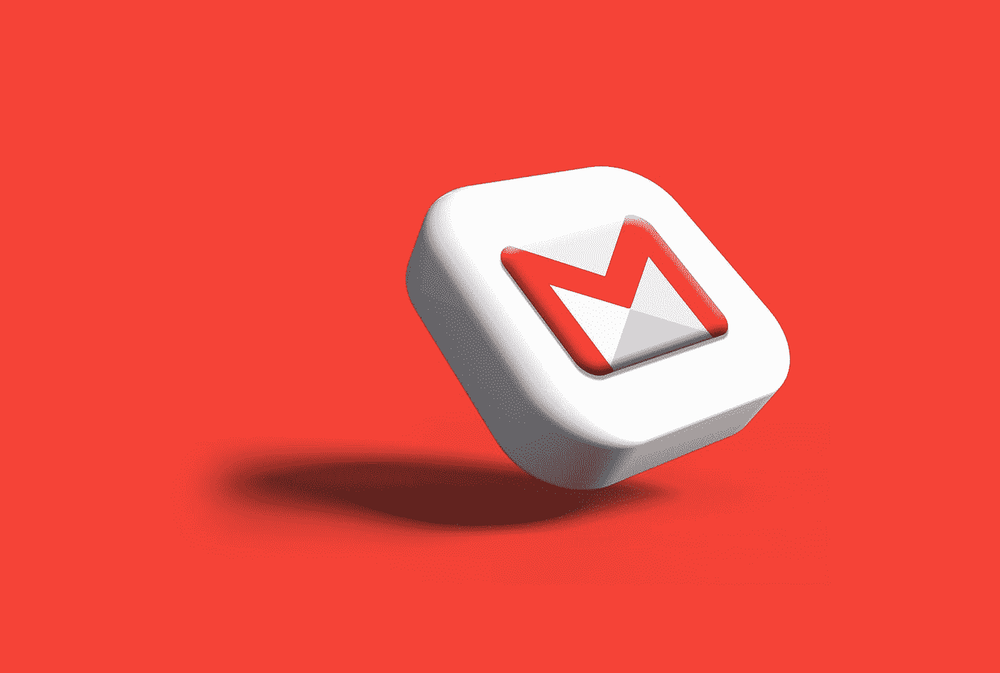

# 亚马逊、微软、谷歌的薪酬明细

> 原文：<https://levelup.gitconnected.com/my-salary-progression-from-amazon-microsoft-google-ec58d0c3ba01>

你要么在学习，要么在赚钱

2020 年开始职业生涯是软件工程。这些年来，我的基本工资是这样增长的:

亚马逊(*2020*):11.2 万美元

**微软**(*2021*):12.3 万美元

谷歌**(*2022*):16.9 万美元**

我不是数学专业的学生，但这些涨幅似乎远不止 7%的同比涨幅。下面是人们在这三者之间不谈的更深入的分析。

# 三个薪酬类别

在大科技公司的大多数软件工程项目中，薪酬方案遵循以下结构

## 底薪

基本工资是你税前的年薪。大多数公司只为你的职位提供基本工资。这通常是每两周支付一次，一个月支付两次，或者一个月支付一次。

## 签约奖金

签约奖金通常是一次性支付给加入公司的新员工。公司需要额外的激励让你转行。这通常有一年的承诺，如果你在一年前离开，你必须偿还全额或按比例的金额。

## **股权**

公平是一个复杂的话题，值得单独写一篇文章。一家公司会承诺给你一定数量的公司股票，但你什么时候能拿到取决于你的出价。一般是 4 年每年 25%，最终用完。

如果一家公司给你 100，000 美元，并在 4 年内每年分配 25%,预计在你工作一周年时，你的股票经纪公司会有价值 25，000 美元的公司股票。

## 绩效奖金

技术报价可能包括一年一次发给员工的绩效奖金。这总是主观的，取决于你的表现和预算。我只见过在 0%到 20%之间。

现在你知道了，当工程师分享他们的总薪酬时，通常包括:

> *基本工资+签约+(总权益)/4 +平均绩效奖金*

# **亚马逊:(TC: 150k)**

照片由[阿尼鲁德](https://unsplash.com/@lanirudhreddy?utm_source=medium&utm_medium=referral)在 [Unsplash](https://unsplash.com?utm_source=medium&utm_medium=referral) 拍摄

## 基本工资结构

亚马逊的薪酬结构已经很奇怪了，它在每个月的第一个工作日每月给西雅图的员工发一次工资。这可能会节省公司的处理和支付报表，但我总是宁愿早点拿到钱。

该公司过去的基本工资上限为 16 万美元，但今年刚刚提高到 35 万美元，以与其他科技公司竞争。

## 绩效奖金

亚马逊没有绩效奖金，所以你可以随意工作，想拿多少钱就拿多少钱。这对亚马逊来说是明智的，因为对该公司来说，不承诺无法兑现的奖金更安全。

## 签约奖金

奇怪的是，亚马逊在两年内提供了两项签约奖金。你开始工作的第一年可以得到 20，000 美元，第二年开始可以得到 15，000 美元。这听起来很棒，但可能是为了弥补该公司更奇怪的股权结构。

如果你在第一年内离职，你将欠下全部奖金；如果你在工作一周年后离职，你将欠下按比例分配的第二年奖金。

## 股权

大多数公司喜欢每年 25%、25%、25%、25%的可预测股权结构。亚马逊采取了另一种股权方式，这种方式在最后变得很重，看起来像是:

*   第一年 5%
*   第二年 15%
*   之后每 6 个月 20%

我和我的同事曾经推测，这种结构是为了让员工留得更久。

# 微软(TC: 185k)

由[路易·菲利浦·波伊特拉斯](https://unsplash.com/@lppoitras?utm_source=medium&utm_medium=referral)在 [Unsplash](https://unsplash.com?utm_source=medium&utm_medium=referral) 上拍摄的照片

## 基本工资结构

微软的薪酬结构很简单，每两周一次。正常没什么不好。

## 绩效奖金

在我的录用函中，有一个条款明确提到了 0%到 20%之间的绩效奖金。这听起来不错，每个人都会很高兴期待在年底再有 10%的薪水。

但是误导性的媒体报道奖金预算增加了一倍会让一些员工不高兴，因为预算增加一倍并不意味着每个人实际上都得到了两倍于预期的奖金。我仍然只得到 2022 年平均成绩的 10%。

## 签约奖金

微软的签约奖金是任何人开始职业生涯时典型的一次性支付。但是合同可以要求员工在公司工作两年。你必须要求协商一年。如果你早点离开，这是按比例分配的，所以听起来很公平。

## 股权

微软是那些拥有标准的 25%股权结构的公司之一。除非你是新毕业生。

那样的话，它会是

*   6 个月后为 25%
*   之后每年 25%

新毕业生将在 3.5 年内获得全部股权，而不是 4 年。也许这是为了让新毕业生呆得更久，但我只能猜测。

## 谷歌(TC: 30 万)

鲁拜图·阿扎德在 [Unsplash](https://unsplash.com?utm_source=medium&utm_medium=referral) 上的照片

## 基本工资结构

谷歌的薪酬结构也是一周两次。这不是盯着看，这只是正常的。

## 绩效奖金

谷歌的要约信将明确分享目标奖金是 15%。很高兴没有看到金额上限，但这并不意味着我不会收到 0%。比微软的 10%多一点，比亚马逊的 0%多很多。

## 签约奖金

谷歌只提供一年以上的单点登录奖励。如果合同只要求一年，那么我可以考虑在没有任何其他承诺的情况下转到另一家公司。

没有亚马逊的两个签约奖金酷，但我猜其余的包可能会扯平。

## 股权

我们讨论了亚马逊的尾部重薪酬结构，所以看到谷歌的前端重股权结构可能会让你感到惊讶

年度结构细分如下

*   33%第一年
*   33%第二年
*   22%第三年
*   第四年 12%

这里的猜测是吸引人们来到谷歌，并在他们逗留的地方感到足够舒适。但这只是猜测。

# 结束语

希望你从这篇文章中学到了更多关于这三家公司不同的薪酬结构。

考虑到刷新者、401k 福利和其他公司折扣额外津贴，总有更多要谈的，但我希望这突出了这三家公司之间已经存在的差异。

你看到点击并按住拍手按钮会发生什么了吗？

帮我拿到亚马逊和谷歌的[**【4 美元简历包**](https://alexcancode.gumroad.com/l/fullresumekit)

我的来自谷歌、微软和亚马逊的 [**真实报价信**](https://alexcancode.gumroad.com/l/offerletters)

如果你喜欢这种体验，考虑成为[会员](https://medium.com/@alexcancode/membership)以获得更多类似的内容！

Twitter 上有 1000 人在关注！

关注我在 LinkedIn 上的 10 万名粉丝