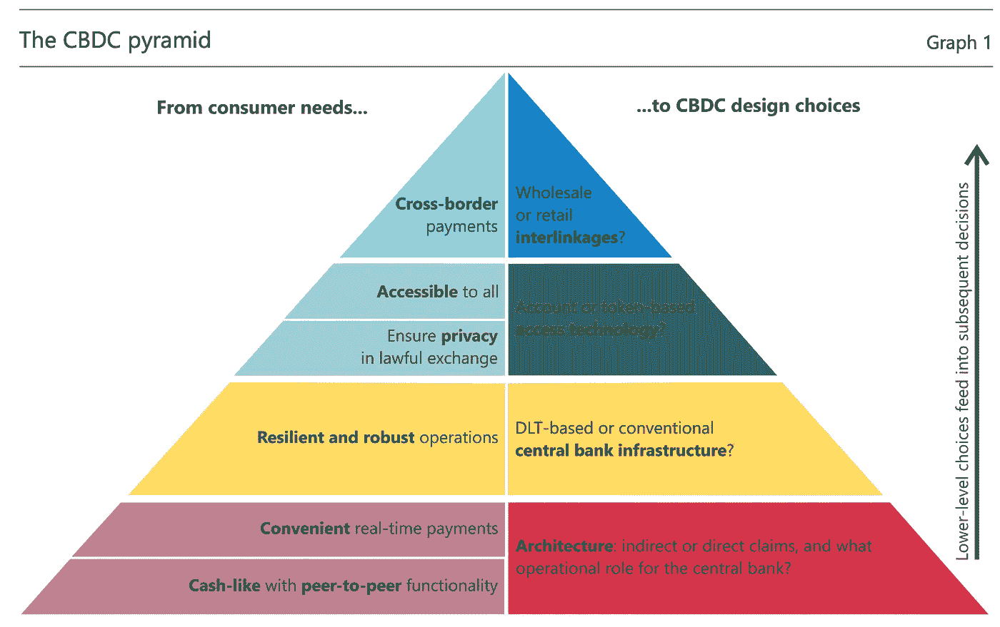
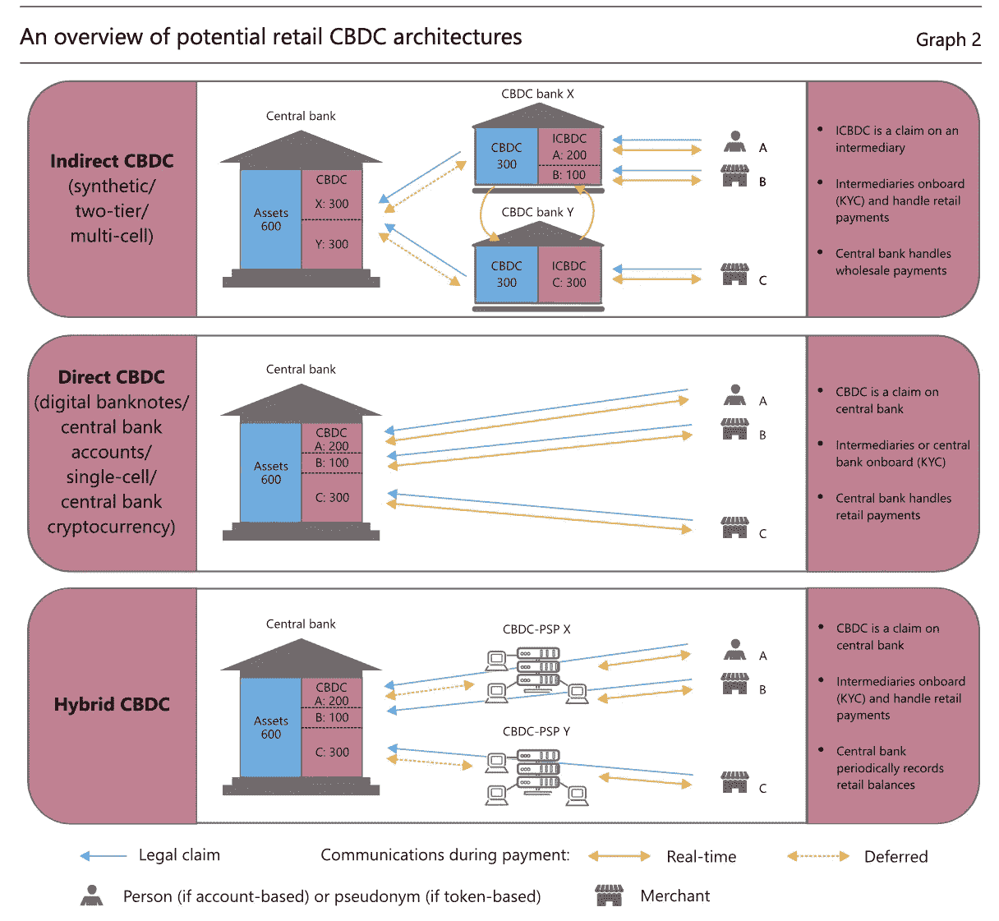

# 我对“零售”CBDC 背后的法律结构的简短看法

> 原文：<https://levelup.gitconnected.com/my-short-take-on-the-legal-structure-behind-a-retail-cbdc-ae6fbd2bc191>

## 了解间接、直接和混合 CBDCs 之间的差异

数字货币:新的金融秩序？来源:[总账洞察](https://www.google.com/url?sa=i&url=https%3A%2F%2Fwww.ledgerinsights.com%2Fbank-of-japan-boj-cbdc-central-bank-digital-currency%2F&psig=AOvVaw2ZE2PMd6tbc9udRN_L4Wmq&ust=1618842492765000&source=images&cd=vfe&ved=0CA0QjhxqFwoTCKCU7cSAiPACFQAAAAAdAAAAABAD)

D 看到最近对密码世界的深远热情，毫不奇怪，各国央行不愿意在能够塑造银行业的新的颠覆性支付工具的竞争中落后。

国际清算银行(BIS)一直在对中央银行发行的数字货币进行有趣的研究，世界各地的中央银行开始欢迎关于 CBDCs 的新举措。根据一项涉及 63 家央行的最新调查，三分之一的商业银行将国家开发银行视为一个可能的中长期项目。

值得注意的是，中国人民数字货币研究所领导了各种广泛使用 [eCNY](https://www.nytimes.com/2021/03/01/technology/china-national-digital-currency.html) 的试验，并被证明相当成功。然而，中国是试图在全球金融秩序中领先，还是数字人民币的唯一目的是以研究为导向，以更雄心勃勃的长期结果为目标？

现实情况是，中国的监管机构和政策制定者必须应对来自私营金融部门的巨大压力，就电子支付在这个亚洲国家的份额而言，私营金融部门正变得稍微重要一些。中国“两大”民营金融服务提供商支付宝和微信支付正在日益扩大其电子业务。此外，西方也可能会考虑中国寻求美元的替代品，美元是世界上最优秀的法定货币，因为哥伦比亚广播公司的大部分储备都是以美元为主，以及 SWIFT，从而将欧洲大陆从西方资本主义规则主导的时代解放出来。

虽然数字元不是本简报的主要目的，但强调中国在电子支付行业取得的令人难以置信的进步是很重要的，这样才能理解西欧和美国在不久的将来可能发行的“零售”CBDC 的相似性。在。在这篇文章的剩余部分，我解释了与 CBDC 设计相关的三种主要类型。

## **设计选择:CBDC 金字塔**

CBDC 的技术设计考虑与家庭(消费者)在决定使用哪种支付工具时的需求和偏好有关。图一描述了消费者需求(RHS)和 CBDCs (LHS)最佳设计选择之间的关系。我们必须记住,“零售”CBDC 只是体现了对可转换债券的一种“类似现金”的要求权，可转换债券将成为这种法定货币的唯一发行人和最终控制人。尽管如此，中央银行可能允许第三方进入，这可能保证家庭对“匿名”的异质偏好，因此，在交易中为 CBs 提供部分匿名。

CDBC 的建筑也非常重要；分布式账本技术(DLT)或中央控制基础设施之间的选择可能取决于每个商业银行自己的政策(Auer R .，hme R .，2020)。

> CBDC 是对可转换债券的直接索赔，还是通过支付中介的间接索赔？“商业银行和私营部门中介机构在日常支付中的运作角色是什么？”

图一. CBDC 金字塔。消费者需求到 CDBC 设计选择的映射。资料来源:(奥尔·罗，伯姆·罗，2020 年)

由于 CBDCs 的核心原则依赖于现金的**相似性**及其使用的**便利性**——如图一中第一和第二个底层所示，整个运营架构将取决于这两个需求。

然而，设计选择将受到奥尔等人提出的两个主要问题的影响。*' CBDC 是对可转换债券的直接索赔，还是通过支付中介的间接索赔？“商业银行和私营部门中介机构在日常支付中的运作角色是什么？”*

## CBDC 的金字塔底层:间接还是直接主张？

我们必须考虑 CB 的性质，它是发行和赎回这些数字货币的唯一实体。此外，如下图二所示，CBDC 系统的技术架构也可能改变我们是处理基于账户的货币还是基于代币的货币，这可能需要不同的操作基础设施。

图二。CBDC 的法律结构。资料来源:(奥尔·罗，伯姆·罗，2020 年)

1.  **“合成 CBDC”或“间接 CBDC”**

第一个 CBDC 模型被称为“合成 CBDC”(Adrian and Mancini-Griffoli，2019)或“间接 CBDC”，顾名思义，它代表消费者对可转换债券的间接索赔。作为中介的第三方(在模型中标记为“CBDC 银行”)承诺通过其实际持有的存放在 CB 账户中的法定货币(可能是 CBDC 或任何其他类型的法定货币)支持零售消费者(家庭和公司)的每个间接 CBDC(标记为 ICBDC)。

正是通过这种中介渠道，哥伦比亚广播公司将放弃其在系统中的部分主导地位，并将其服务外部化，从而提供部分匿名性(如前所述，这是主要家庭的偏好之一)。然而，这可能会引发 CBs 的关键成本，因为它们将不再完全控制金融交易记录，即个人索赔——它们将只记录**批发控股**。

**2。“直接 CBDC”:以匿名为代价的简单性**

另一方面，消除对第三方的依赖可能会阻止消费者使用类似现金的 CBDC，因为它缺乏匿名性。在由商业银行直接经营的 CBDC 下，账户将完全由该机构管理，成为迄今为止唯一的处理机构。

来自私营部门的声音提醒中央银行在了解你的消费者(KYC)服务方面经验不足，因此，强调了它们的主要立场，即主要和完全由中央银行策划的 CBDC 系统是不可行的。

在这种情况下，第三种法律主张开始发挥作用:“混合 CBDC”。

**3。“混合 CBDC”:最优决策？**

在这种情况下，CBDC 仍将被视为对中央银行的债权，但也存在对合法债权有部分影响的中介机构。但是，这些支付服务提供商(PSP)将由 CBs 间接“管理”;如果一个 PSP 失败了，中央银行会选择另一个功能性 PSP，将大量债权从失败的 PSP 转移到新的 PSP。

## **三类索赔的总体结论**

中央银行作为中央银行发展中国家的唯一发行者，将拥有选择 CBDC 最优设计的最终决定权，同时考虑到它们的约束最大化问题，即在家庭使用支付工具时对匿名和安全的异质偏好的约束下，最大化福利国家。

直接 cbdc 可能看起来非常安全(注意，这将取决于我们是处理基于账户的 cbdc 还是基于令牌的 cbdc ),但在支付中缺乏匿名性。诚然，通过发行间接 CBDC，中央银行可以放弃对可追溯性的部分控制，但代价是失去可能导致不法行为的电子交易的痕迹。

除此之外，尽管混合型 CBD 看起来很有前途，但这种类型的个人债权的主要缺点之一是，将中央银行视为主要发行人和中介机构的整个系统非常复杂。这可能会加剧 CBDC 的两个核心基本价值，在**‘CBDC 金字塔’**中有所陈述:易用性**和运营弹性**。

CBDC 的设计和架构是当前的研究主题，对该问题的进一步研究可能有助于评估集中式数字货币的实际可行性。其他功能方面也可能取决于 CBDC 是否计息，以及它在多大程度上类似于传统的实物现金或银行存款。两个极端都可能威胁到支付工具的多样性，从而威胁到可持续的支付系统；采用类似现金的中央银行的国家可以减少对现金的需求，直到现金由于强大的网络效应而消失——正如现在瑞典正在发生的那样，而类似存款的中央银行可能导致存贷款利率上升，引发银行对家庭和企业贷款的收缩。然而，如果各国央行发行附息 CBDC，它们可以通过调整利率来避免这种情况。这是我在下一篇文章中努力的另一个研究方向。

**参考文献**

(Auer R .，hme R .，2020)《零售央行数字货币的技术》。国际清算银行季度回顾，2020 年 3 月

Popper N .和 Li c .(2021 年 3 月 1 日)“中国用国家数字货币冲锋在前”。纽约时报。