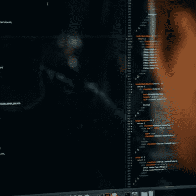
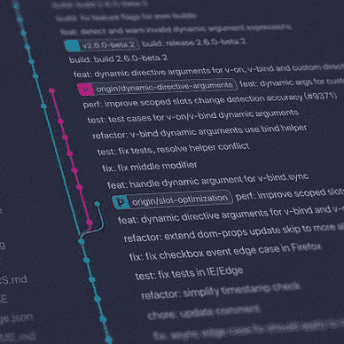

# 我的建议——实现强大的代码审查文化

> 原文：<https://levelup.gitconnected.com/my-takeaways-implementing-a-strong-code-review-culture-21dbe795618b>

## [代码评审](https://medium.com/@anasanjaria/list/code-reviews-6dc76dbc03ea)

## 代码审查不是为了捕捉 bug。而是和你的同伴讨论一个解决方案。


由 [charlesdeluvio](https://unsplash.com/@charlesdeluvio?utm_source=medium&utm_medium=referral) 在 [Unsplash](https://unsplash.com?utm_source=medium&utm_medium=referral) 上拍摄的照片

我在代码评审中偶然发现了这个优秀的视频。

以下是我学到的一些东西。

*   代码审查不是为了捕捉 bug。
*   而是和你的同行讨论你的代码。

因为它是关于讨论的，所以有两个参与者。

*   拉请求的作者。
*   提取请求的审阅者。

# 演员的交战规则

## 作为一个作者…

我已经学会了给提交消息添加上下文。意思是:

*   我们的提交消息解释了在这个特定的提交中“做了什么”。
*   但并没有解释“为什么”。这个“为什么”就是语境。

我们的改变是为了解决一个特定的问题，但是如果我们加上“为什么”，那么我们的同行可以对问题有更好的理解，并且可以提供更好的解决方案。

这可能会改变整个局面。此外，它将在我们的提交历史中被很好地记录。

## 作为评论者…

规则是…

> 问，不要说

事实上，我已经意识到这个规则，并正在遵循它。我已经在我的文章[中详细介绍了这一点，我作为一个代码评审者学到的经验](https://medium.com/@anasanjaria/lessons-i-learned-as-a-code-reviewer-1c60a13974)。

> 在请求改变拉动式请求时，没有“你”的态度

那么，我们如何开始一场健康的辩论呢？

以下是视频中为评论者提供的一些关于如何参与和开启健康讨论的技巧。

> 你认为……怎么样？
> 
> 你考虑过…？
> 
> 你能澄清一下吗？

最后，演示者强调了强大的代码评审文化的主要好处，如下所示。

*   更好的代码
*   更好的开发者
*   团队所有权
*   健康的辩论

感谢阅读。

如果你喜欢这篇文章，你可能也会喜欢下面的系列文章。


[阿纳斯·安贾里亚](https://medium.com/@anasanjaria?source=post_page-----21dbe795618b--------------------------------)

## 代码审查

[View list](https://medium.com/@anasanjaria/list/code-reviews-6dc76dbc03ea?source=post_page-----21dbe795618b--------------------------------)6 stories

```
**Want to connect?** [Facebook](https://www.facebook.com/anas.anjaria.kh) | [LinkedIn](https://www.linkedin.com/in/anasanjaria/) | [Newsletter](https://medium.com/subscribe/@anasanjaria) | [Twitter](https://twitter.com/anasanjaria)
```