# 我的前 15 个 Atom 包

> 原文：<https://levelup.gitconnected.com/my-top-15-atom-packages-cf03fd16764a>

## 编程；编排

## 用于可破解编辑器的可破解包

[GitHub](https://github.com/) 上 [Atom](https://github.com/atom/atom) 的照片

 [## 21 世纪的可破解文本编辑器

### 当开发人员一起工作时，伟大的事情就会发生——从教学和分享知识到构建更好的软件…

atom.io](https://atom.io/) 

Atom 是 21 世纪的可破解文本编辑器。与其他文本编辑器相比，它为插件提供了更多的功能。编辑器的大部分功能来自插件，有时，插件甚至有能力创建一个全新的应用程序。也许这就是它“可被黑客攻击”的原因。关于黑客攻击 atom 的更多信息，Atom 手册中有一个章节可以通过点击链接[这里](https://flight-manual.atom.io/hacking-atom/)进入。本文将涵盖 Atom 包的完整列表，希望在某个时候能派上用场。😃

## TL；速度三角形定位法(dead reckoning)

1.  [文件图标](https://atom.io/packages/file-icons)乘[文件图标](https://atom.io/users/file-icons)
2.  [wakatime](https://atom.io/packages/wakatime) 乘 [wakatime](https://atom.io/users/wakatime)
3.  [棉绒](https://atom.io/packages/linter)由[钢脑](https://atom.io/users/steelbrain)
4.  [极小地图](https://atom.io/packages/minimap)由[原子极小地图](https://atom.io/users/atom-minimap)
5.  [颜料](https://atom.io/packages/pigments)由 [abe33](https://atom.io/users/abe33) 组成
6.  [高亮-由](https://atom.io/packages/highlight-selected) [richrace](https://atom.io/users/richrace) 选择
7.  [原子钟](https://atom.io/packages/atom-clock)由 [b3by](https://atom.io/users/b3by)
8.  [项目经理](https://atom.io/packages/project-manager)由[丹尼尔·布朗丁](https://atom.io/users/danielbrodin)
9.  [通过](https://atom.io/packages/autocomplete)[原子](https://atom.io/users/atom)自动完成
10.  [电传打字机](https://atom.io/packages/teletype)通过[原子](https://atom.io/users/atom)
11.  [git-plus](https://atom.io/packages/git-plus)by[akon wi](https://atom.io/users/akonwi)
12.  [原子美化](https://atom.io/packages/atom-beautify)由 [Glavin001](https://atom.io/users/Glavin001)
13.  [原子不和谐](https://atom.io/packages/atom-discord)由[hello world 17](https://atom.io/users/HelloWorld017)
14.  [自动更新包](https://atom.io/packages/auto-update-packages)作者 [yujinakayama](https://atom.io/users/yujinakayama)
15.  [由](https://atom.io/packages/sync-settings) [atom-community](https://atom.io/users/atom-community) 进行同步设置

> 主题

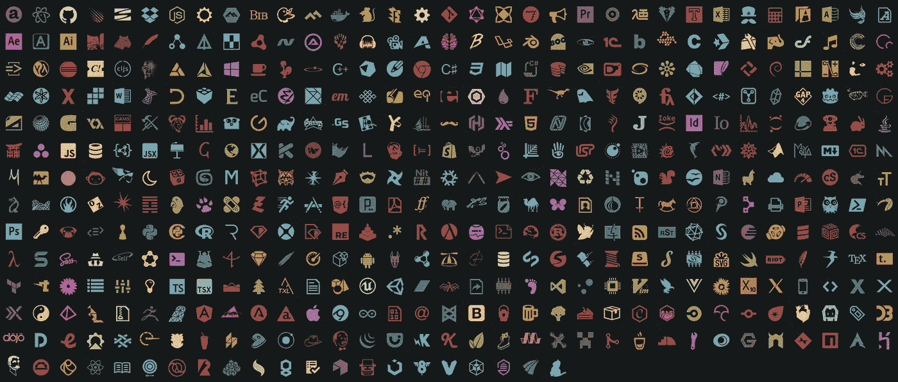

来源: [Atom 包](https://atom.io/packages)上的[文件图标](https://atom.io/users/file-icons)

## 1.[文件图标](https://atom.io/packages/file-icons)通过[文件图标](https://atom.io/users/file-icons)

我个人是 Atom One 黑暗主题的粉丝，所以其他的我真的不推荐。不过，一些文件夹图标会很有帮助，所以这里有一些！

> 生产力

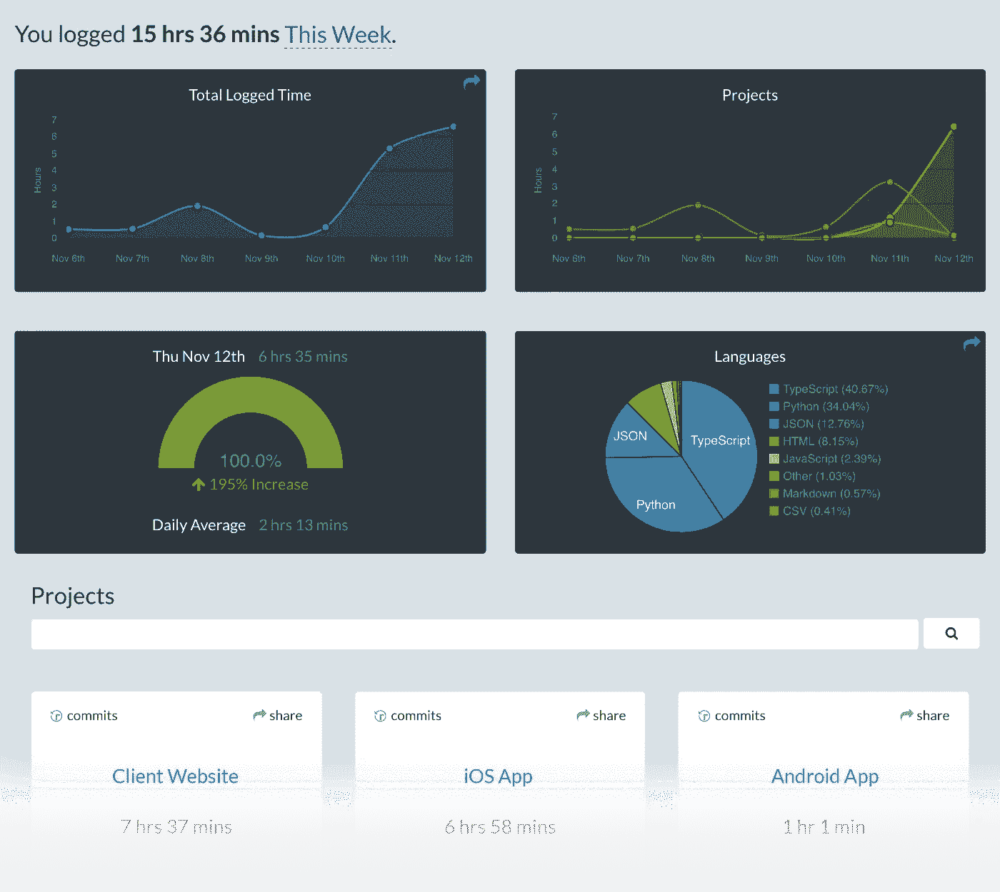

来源:[原子包](https://atom.io/users/wakatime)[上的](https://atom.io/packages)Waka time

## 2. [wakatime](https://atom.io/packages/wakatime) 由 [wakatime](https://atom.io/users/wakatime) 提供

还有什么比知道你花在工作上的时间更有效率的呢？Atom 的 wakatime 扩展跟踪你花在 Atom 编码上的时间，但是还有其他的扩展用于 [Visual Studio 代码](https://marketplace.visualstudio.com/items?itemName=WakaTime.vscode-wakatime)等等。这样你就可以在多个编辑器中跟踪自己。

如果你使用 Visual Studio 代码，为什么不看看我下面的另一个故事呢😄：

 [## 我的前 20 个 VS 代码扩展

### 扩展。重新定义。

levelup.gitconnected.com](/my-top-20-vs-code-extensions-7f42f0f051f3) 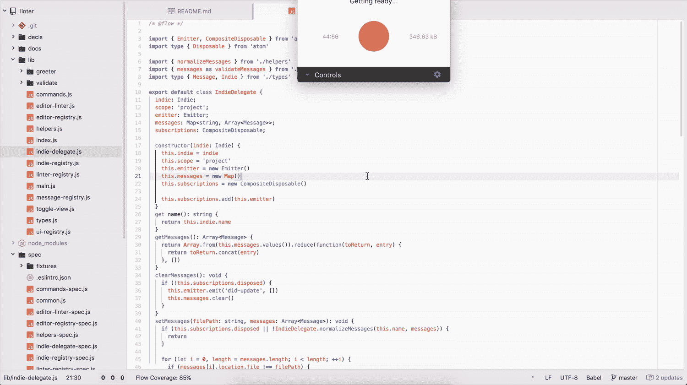

来源:[steel brain](https://atom.io/users/steelbrain)on[Atom Packages](https://atom.io/packages)

## 3.[棉绒](https://atom.io/packages/linter)由[钢脑](https://atom.io/users/steelbrain)

Linter 是可破解的 [Atom 编辑器](http://atom.io/)的基本 linter 提供者。另外，你需要为你的语言安装一个特定的 linter。你会在 [atomlinter.github.io](http://atomlinter.github.io/) 上找到完整的列表。

它为其消费者提供了一个顶级 API，以便他们可以轻松地可视化错误和其他类型的消息。

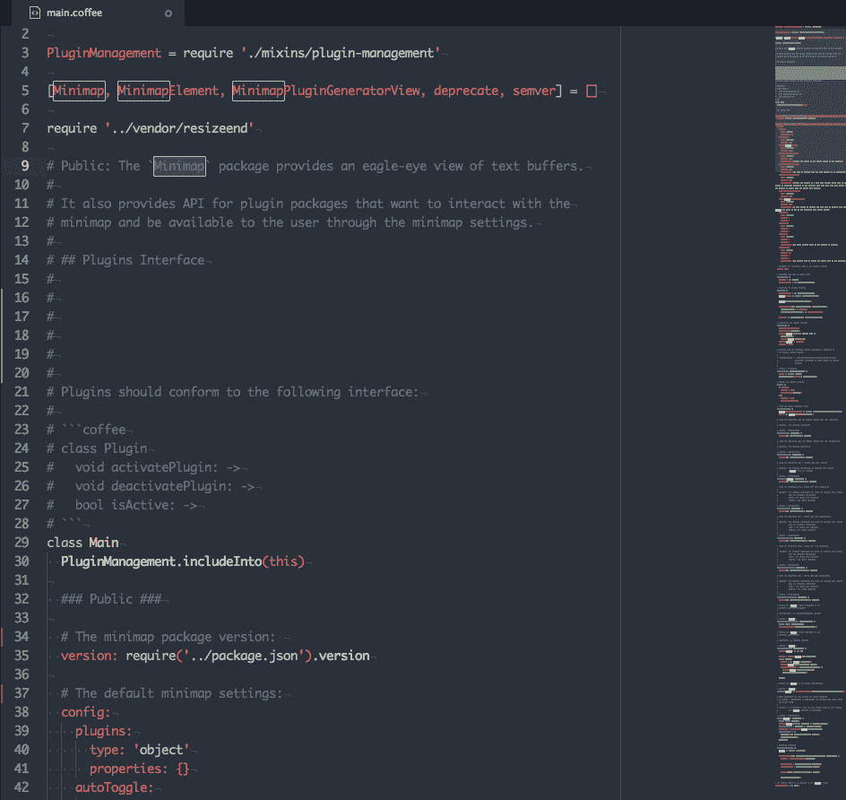

来源: [atom-minimap](https://atom.io/users/atom-minimap) 关于 [Atom 包](https://atom.io/packages)

## 4.[极小地图](https://atom.io/packages/minimap)乘[原子极小地图](https://atom.io/users/atom-minimap)

在编辑器旁边预览您的完整代码。让自己置身于一个项目中并看到棉绒工作总是很好的。

设置包括:

*   显示代码突出显示
*   在左侧显示小地图
*   字符高度(1 像素，2 像素，4 像素)
*   字符宽度(1px，2px)
*   印刷于行间
*   不透明
*   滚动指示器

还有更多！

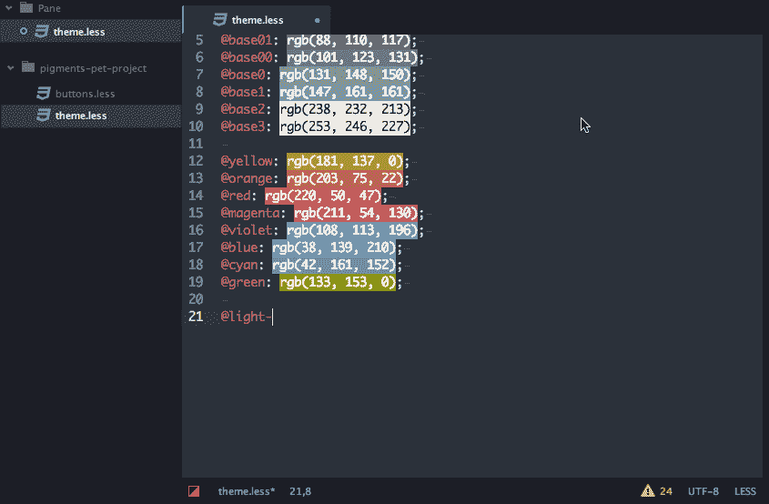

来源:[原子包](https://atom.io/packages)上的 [abe33](https://atom.io/users/abe33)

## 5.[颜料](https://atom.io/packages/pigments)由 [abe33](https://atom.io/users/abe33) 组成

以简单而美丽的方式预览您选择的颜色。作为一个额外的好处，你甚至可以搜索颜色，将`#hex`改为`rgba`，等等。

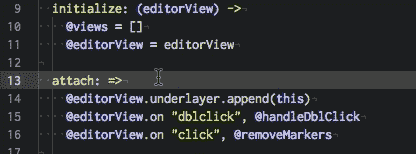

来源: [Atom 包](https://atom.io/packages)上的 [richrace](https://atom.io/users/richrace)

## 6.[高亮-由](https://atom.io/packages/highlight-selected) [richrace](https://atom.io/users/richrace) 选择

双击以突出显示任何内容。不再需要拖动你的光标了！🎉

来源: [Atom 包](https://atom.io/packages)上的 [b3by](https://atom.io/users/b3by)

## 7.[原子钟](https://atom.io/packages/atom-clock)由 [b3by](https://atom.io/users/b3by)

在你的状态栏显示一个可定制的时钟。再也不会忘记时间了！

> ⭐️右击时钟复制当前时间到你的剪贴板。

格式包括:

*   `H:mm` (24 小时)
*   `h:mm a` (12 小时)
*   `DD/MM/YYYY, H:mm`(短日期格式)
*   `MMMM Do, dddd, h:mm:ss a`(长日期格式)
*   `[Quarter] Q, MMMM Do YYYY, ddd, h:mm a`(太空垃圾格式)

不仅如此，它还支持多种语言！

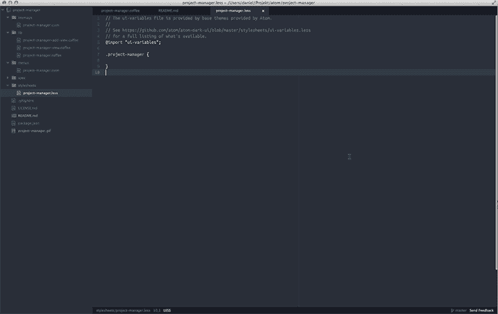

来源:[原子包](https://atom.io/users/danielbrodin)上的[丹尼尔·罗丹](https://atom.io/packages)

## 8.[项目经理](https://atom.io/packages/project-manager)由[丹尼尔·罗丹](https://atom.io/users/danielbrodin)

在 Atom 中打开项目可能相当痛苦，尤其是当您同时处理多个项目时。别担心，进来的是项目经理！在一个地方管理和打开您的所有项目文件夹，而不必再触摸 Finder 或文件资源管理器！(当然，除非你正在打开一个新项目🤷‍♂️)

来源: [Atom 包](https://atom.io/packages)上的 [atom](https://atom.io/users/atom)

## 9.[通过](https://atom.io/packages/autocomplete)[原子](https://atom.io/users/atom)自动完成

用`ctrl + space`获得自动完成选项列表。

> 远程工作和源代码控制

来源:[原子包](https://atom.io/packages)上的[电传](https://atom.io/packages/teletype)

## 10.[电传打字机](https://atom.io/packages/teletype)通过[原子](https://atom.io/users/atom)

谷歌文档，但代码。

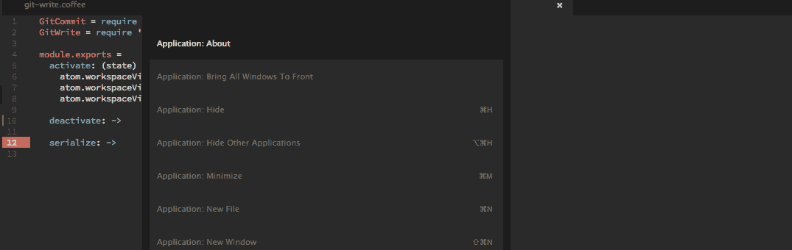

来源: [Atom 包](https://atom.io/packages)上的 [akonwi](https://atom.io/users/akonwi)

## 11.[git-plus](https://atom.io/packages/git-plus)by[akon wi](https://atom.io/users/akonwi)

Git，内置于 Atom 中。提交、合并、推送、重定基础，所有这些都不需要终端。

> 美学

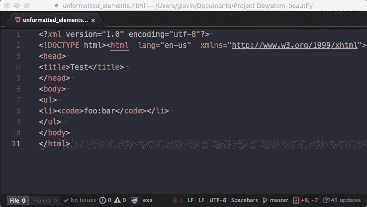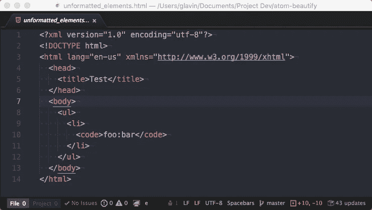

原创 vs 美化(来源:[glavin 001](https://atom.io/users/Glavin001)on[Atom Packages](https://atom.io/packages))

## 12.[原子美容](https://atom.io/packages/atom-beautify) by [Glavin001](https://atom.io/users/Glavin001)

美化 HTML，CSS，JavaScript，PHP，Python，Ruby，Java，C，C++，C#，Objective-C，CoffeeScript，TypeScript，Coldfusion，SQL 等等 Atom。

> 其他人

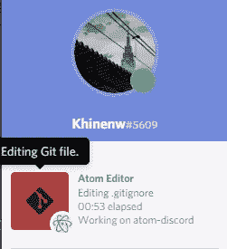

来源: [Atom 包](https://atom.io/packages)上的 [HelloWorld017](https://atom.io/users/HelloWorld017)

## 13.[原子不和谐](https://atom.io/packages/atom-discord)作者[hello world 17](https://atom.io/users/HelloWorld017)

凭借不和谐的神奇力量，向他人展示您正在 Atom with atom-discord 上进行的项目。

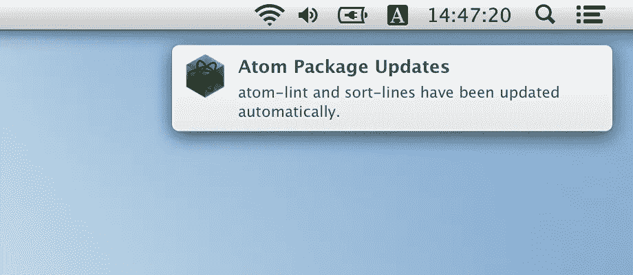

来源: [yujinakayama](https://atom.io/users/yujinakayama) 关于 [Atom 软件包](https://atom.io/packages)

## 14.[自动更新包](https://atom.io/packages/auto-update-packages)作者 [yujinakayama](https://atom.io/users/yujinakayama)

始终保持您的软件包最新！

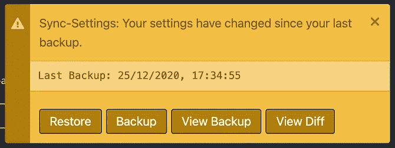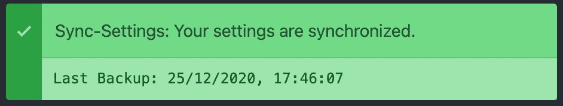

[同步设置](https://atom.io/packages/sync-settings)由 [atom-community](https://atom.io/users/atom-community)

## 15.[同步设置](https://atom.io/packages/sync-settings)由 [atom-community](https://atom.io/users/atom-community)

现在您已经设置好了编辑器，是时候将所有内容同步到 GitHub 了，这样您就可以轻松地在您拥有的每个 Atom 实例之间传递您的偏好。玩得开心！