# 我的前 20 个 VS 代码扩展

> 原文：<https://levelup.gitconnected.com/my-top-20-vs-code-extensions-7f42f0f051f3>

## 编程；编排

## 扩展。重新定义。

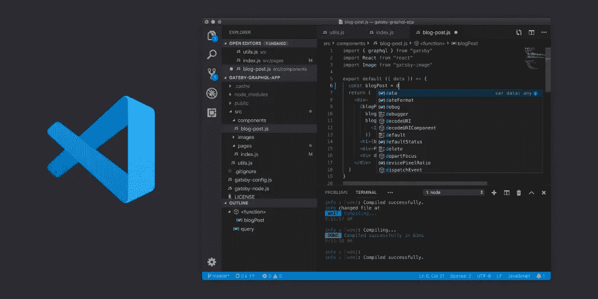

图片由 [Visual Studio Code](https://code.visualstudio.com/) 提供

 [## Visual Studio 代码-代码编辑。重新定义的

### Visual Studio Code 是一个重新定义和优化的代码编辑器，用于构建和调试现代 web 和云…

code.visualstudio.com](https://code.visualstudio.com/) 

我们都喜欢好的代码编辑器。它加快了我们的工作流程，提高了我们的生产力，让我们的生活变得更加轻松。每个人都喜欢 Visual Studio 代码的一点是，它不仅速度快，而且还留有很大的空间，让人们可以根据自己的个人喜好来设计代码。Visual Studio 市场有数千个(甚至可能是数万或数十万个，谁知道呢🤔)的扩展，这里有 20 个扩展是你不可或缺的！

## TL；速度三角形定位法(dead reckoning)

1 + 2.原子[一光](https://marketplace.visualstudio.com/items?itemName=akamud.vscode-theme-onelight) & [一暗主题](https://marketplace.visualstudio.com/items?itemName=akamud.vscode-theme-onedark)

3.[素材主题](https://marketplace.visualstudio.com/items?itemName=Equinusocio.vsc-material-theme)作者 [Mattia Astorino](https://marketplace.visualstudio.com/publishers/Equinusocio)

4.[时髦加](https://marketplace.visualstudio.com/items?itemName=akarlsten.vscode-snazzy-akarlsten)由 [akarlsten](https://marketplace.visualstudio.com/publishers/akarlsten)

5.[素材图标主题](https://marketplace.visualstudio.com/items?itemName=PKief.material-icon-theme)作者[菲利普·基夫](https://marketplace.visualstudio.com/publishers/PKief)

6. [WakaTime](https://marketplace.visualstudio.com/items?itemName=WakaTime.vscode-wakatime) 由 [WakaTime](https://marketplace.visualstudio.com/publishers/WakaTime)

7.[文件大小](https://marketplace.visualstudio.com/items?itemName=zh9528.file-size)由 [zhcode](https://marketplace.visualstudio.com/publishers/zh9528) 决定

8.[支架对着色机 2](https://marketplace.visualstudio.com/items?itemName=CoenraadS.bracket-pair-colorizer-2) 由[协同](https://marketplace.visualstudio.com/publishers/CoenraadS)完成

9 + 10.[自动关闭标签](https://marketplace.visualstudio.com/items?itemName=formulahendry.auto-close-tag) & [自动重命名标签](https://marketplace.visualstudio.com/items?itemName=formulahendry.auto-rename-tag)由[韩军](https://marketplace.visualstudio.com/publishers/formulahendry)

11. [CSS Peek](https://marketplace.visualstudio.com/items?itemName=pranaygp.vscode-css-peek) 作者 [Pranay Prakash](https://marketplace.visualstudio.com/publishers/pranaygp)

12.[路径智能感知](https://marketplace.visualstudio.com/items?itemName=christian-kohler.path-intellisense)作者[克里斯蒂安·科勒](https://marketplace.visualstudio.com/publishers/christian-kohler)

13.[项目经理](https://marketplace.visualstudio.com/items?itemName=alefragnani.project-manager)由[亚历山德罗·弗拉格纳尼](https://marketplace.visualstudio.com/publishers/alefragnani)

14.[直播服务器](https://marketplace.visualstudio.com/items?itemName=ritwickdey.LiveServer)由 [Ritwick Dey](https://marketplace.visualstudio.com/publishers/ritwickdey)

15.[更好的评论](https://marketplace.visualstudio.com/items?itemName=aaron-bond.better-comments)由[伦邦](https://marketplace.visualstudio.com/publishers/aaron-bond)

16. [GitLens](https://marketplace.visualstudio.com/items?itemName=eamodio.gitlens) 作者[埃里克·阿莫迪奥](https://marketplace.visualstudio.com/publishers/eamodio)

17. [Git 历史](https://marketplace.visualstudio.com/items?itemName=donjayamanne.githistory)作者[唐·贾亚曼](https://marketplace.visualstudio.com/publishers/donjayamanne)

18.[更漂亮——代码格式化器](https://marketplace.visualstudio.com/items?itemName=esbenp.prettier-vscode)由[埃斯本·彼得森](https://marketplace.visualstudio.com/publishers/esbenp)制作

19.【更新】 [Polacode-2020](https://marketplace.visualstudio.com/items?itemName=jeff-hykin.polacode-2019) 作者[杰夫·海金](https://marketplace.visualstudio.com/publishers/jeff-hykin)

20.[设置同步](https://marketplace.visualstudio.com/items?itemName=Shan.code-settings-sync)由[单于](https://marketplace.visualstudio.com/publishers/Shan)

> 主题

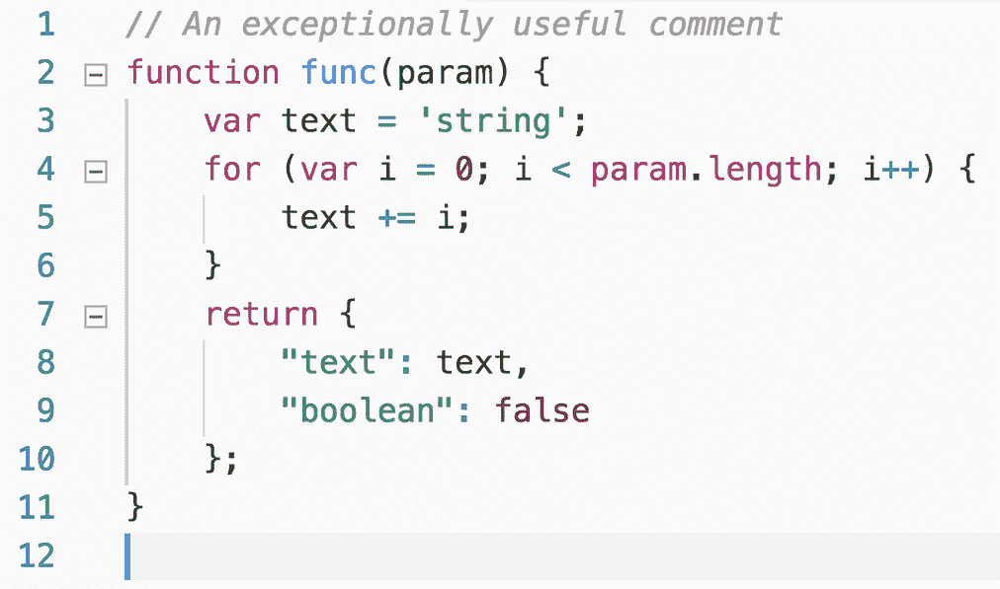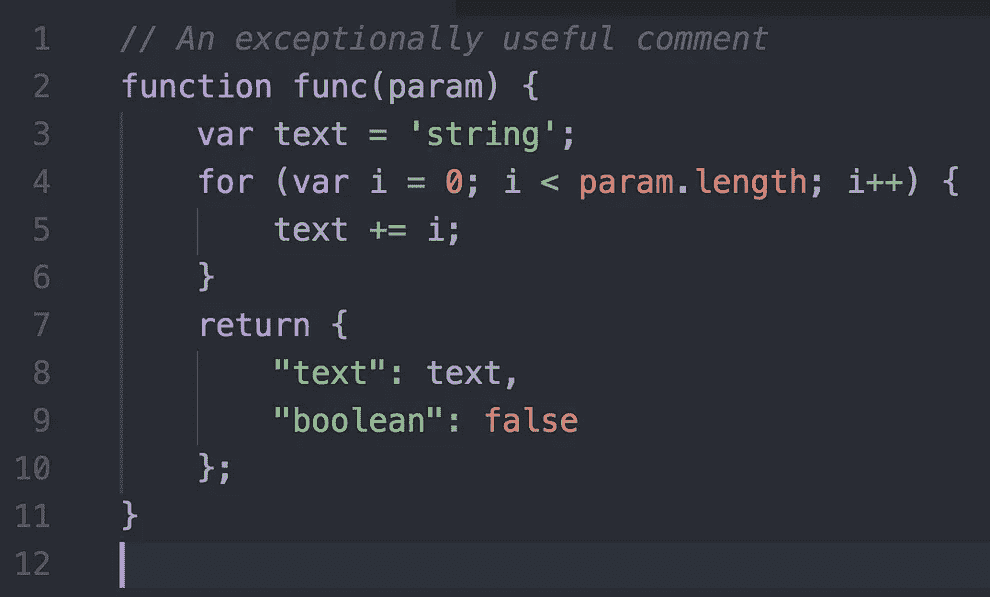

VS 代码的 Atom One UI(来源:[Visual Studio market place](https://marketplace.visualstudio.com/publishers/akamud)[上的 Mahmoud Ali](https://marketplace.visualstudio.com/) )

## 1 + 2.原子[一亮](https://marketplace.visualstudio.com/items?itemName=akamud.vscode-theme-onelight) & [**一暗主题**](https://marketplace.visualstudio.com/items?itemName=akamud.vscode-theme-onedark) 作者[马哈茂德·阿里](https://marketplace.visualstudio.com/publishers/akamud)

在跳槽之前，我用 Atom 做主要编辑🚢到 VS 代码。也许这将使从 Atom 到 VS 代码的过渡更加容易。🤷‍♂

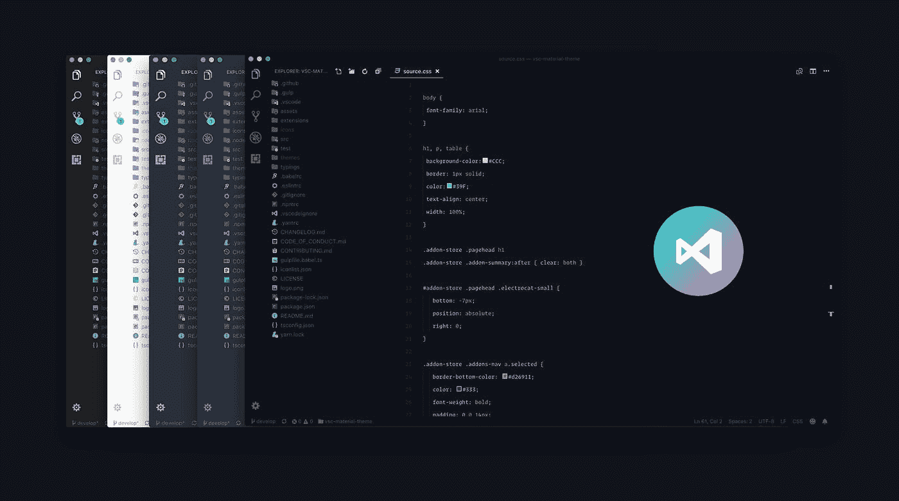

VS 代码的素材主题(来源:[开放集合](https://opencollective.com/vsc-material-theme)

## 3.[素材主题](https://marketplace.visualstudio.com/items?itemName=Equinusocio.vsc-material-theme)作者 [Mattia Astorino](https://marketplace.visualstudio.com/publishers/Equinusocio)

对于物质题材爱好者来说。

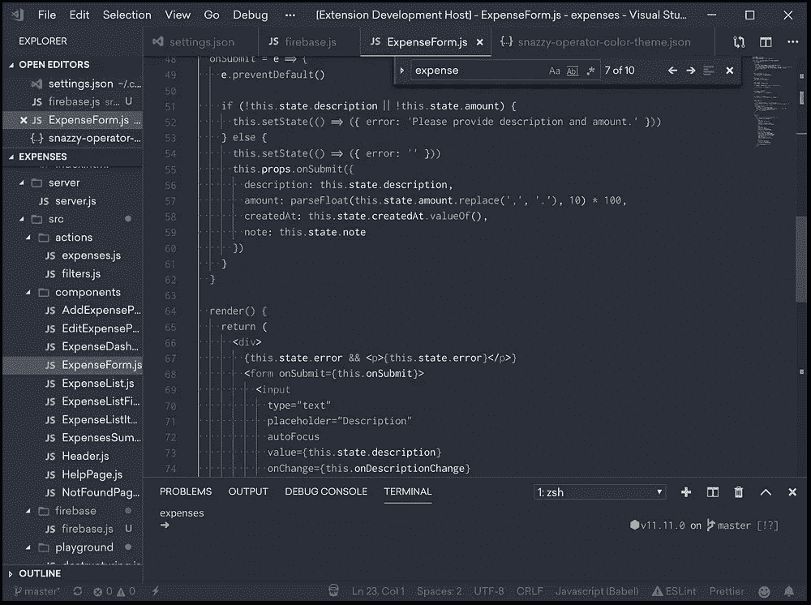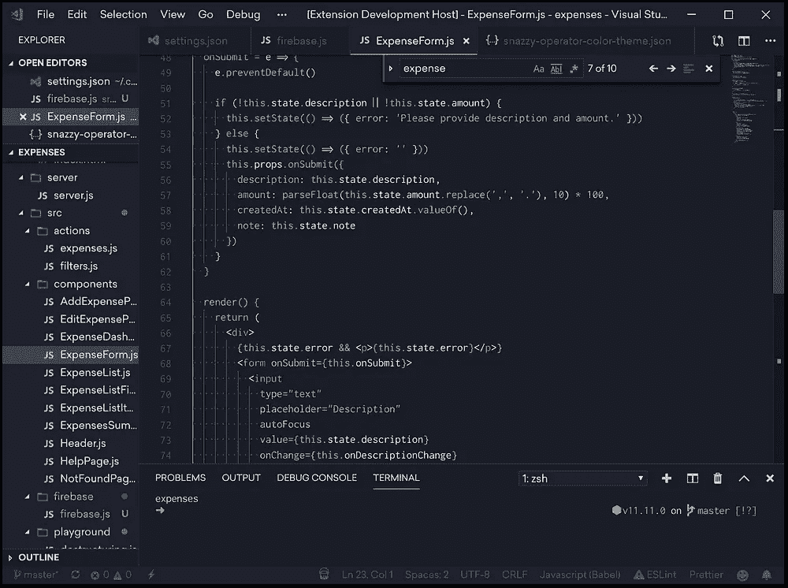

时髦加上黑暗和黑暗(来源: [akarlsten](https://marketplace.visualstudio.com/publishers/akarlsten) 在 [Visual Studio Marketplace](https://marketplace.visualstudio.com/)

## 4.[时髦加](https://marketplace.visualstudio.com/items?itemName=akarlsten.vscode-snazzy-akarlsten)由[阿卡尔斯顿](https://marketplace.visualstudio.com/publishers/akarlsten)

这是一个非常酷的主题，语法突出。这是我最喜欢的 VS 代码之一。不是一个常见的，但绝对是一个你应该尝试。

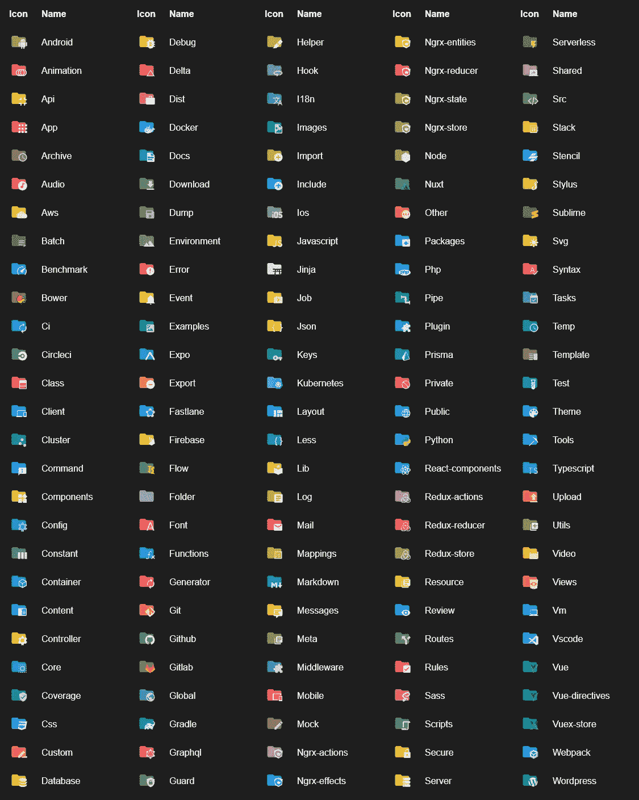

材料图标——它们看起来是不是很棒！(来源: [Philipp Kief](https://marketplace.visualstudio.com/publishers/PKief) 在[Visual Studio market place](https://marketplace.visualstudio.com/)上)

## 5.[素材图标主题](https://marketplace.visualstudio.com/items?itemName=PKief.material-icon-theme)作者[菲利普·基夫](https://marketplace.visualstudio.com/publishers/PKief)

为你的文件和文件夹设计漂亮简单的图标。我经常低估这一点有多重要——这不仅仅是审美的问题。它有助于更容易地整理您的文件和文件夹！

> 生产力

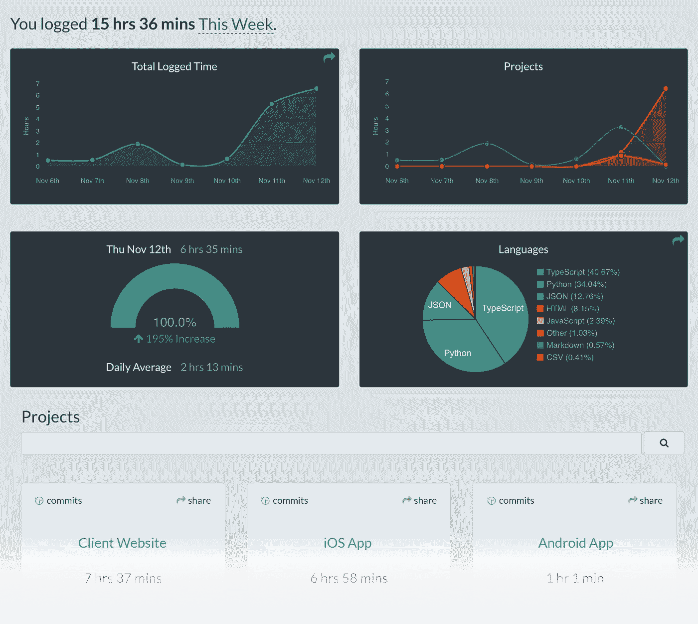

跟踪您的编程进度——多酷啊！(来源:[在](https://marketplace.visualstudio.com/publishers/WakaTime)[Visual Studio market place](https://marketplace.visualstudio.com/)上的

## 6.[Waka time](https://marketplace.visualstudio.com/items?itemName=WakaTime.vscode-wakatime)by[Waka time](https://marketplace.visualstudio.com/publishers/WakaTime)

看看你花了多少时间编程和构建，并质疑你是否是一个真正多产的程序员。似乎我不是。👀

如此简单。也可配置！

## 7.[文件大小](https://marketplace.visualstudio.com/items?itemName=zh9528.file-size)由 [zhcode](https://marketplace.visualstudio.com/publishers/zh9528) 决定

在状态栏中显示您正在处理的文件的大小。超级有用！

再也不迷茫了！(来源:[在](https://marketplace.visualstudio.com/publishers/CoenraadS) [Visual Studio Marketplace](https://marketplace.visualstudio.com/) 上发布

## 8.[支架对上色器 2](https://marketplace.visualstudio.com/items?itemName=CoenraadS.bracket-pair-colorizer-2) 由[上色器](https://marketplace.visualstudio.com/publishers/CoenraadS)上色

消除大量括号造成的混乱。🌊 😳

完美解决所有网站开发的单调！(来源:[韩军](https://marketplace.visualstudio.com/publishers/formulahendry)在[Visual Studio market place](https://marketplace.visualstudio.com/)上)

## 9 + 10.[自动关闭标签](https://marketplace.visualstudio.com/items?itemName=formulahendry.auto-close-tag) & [自动重命名标签](https://marketplace.visualstudio.com/items?itemName=formulahendry.auto-rename-tag)由[韩军](https://marketplace.visualstudio.com/publishers/formulahendry)

自动重命名成对的 HTML/XML 标签。超级简单，却超级有效！

加速你的网络开发(来源: [Pranay Prakash](https://marketplace.visualstudio.com/publishers/pranaygp) 在[Visual Studio market place](https://marketplace.visualstudio.com/)

## 11. [CSS Peek](https://marketplace.visualstudio.com/items?itemName=pranaygp.vscode-css-peek) 作者 [Pranay Prakash](https://marketplace.visualstudio.com/publishers/pranaygp)

在 HTML 文件中查看 CSS 的悬停图像。消除了在 HTML 和 CSS 之间切换的所有麻烦！

来源:[克里斯蒂安·科勒](https://marketplace.visualstudio.com/publishers/christian-kohler)在[视觉工作室市场](https://marketplace.visualstudio.com/)

## 12.[路径智能感知](https://marketplace.visualstudio.com/items?itemName=christian-kohler.path-intellisense)作者[克里斯蒂安·科勒](https://marketplace.visualstudio.com/publishers/christian-kohler)

自动完成文件名和路径，再也不用担心大型项目中的路径问题。

从你的边栏加载你的项目！(来源: [Alessandro Fragnani](https://marketplace.visualstudio.com/publishers/alefragnani) 在[视觉工作室市场](https://marketplace.visualstudio.com/)

## 13. [**项目经理**](https://marketplace.visualstudio.com/items?itemName=alefragnani.project-manager) 由[亚历山德罗·弗拉格纳尼](https://marketplace.visualstudio.com/publishers/alefragnani)

有了这个扩展，您可以轻松有效地在项目之间快速切换。再也不需要通过 Finder/File Explorer 导航来重新打开您正在处理的项目。

来源: [Ritwick Dey](https://marketplace.visualstudio.com/publishers/ritwickdey) 在[Visual Studio market place](https://marketplace.visualstudio.com/)

## 14.[直播服务器](https://marketplace.visualstudio.com/items?itemName=ritwickdey.LiveServer)由 [Ritwick Dey](https://marketplace.visualstudio.com/publishers/ritwickdey)

在为 web 开发时，再也不用刷新页面了！每当您进行更改时，Live Server 都会刷新您的浏览器。这么简单！

来源: [Aaron Bond](https://marketplace.visualstudio.com/publishers/aaron-bond) 在[Visual Studio market place](https://marketplace.visualstudio.com/)

## 15.[更好的评论](https://marketplace.visualstudio.com/items?itemName=aaron-bond.better-comments)由[伦邦](https://marketplace.visualstudio.com/publishers/aaron-bond)

有了更好的注释，您可以将您的注释分类为

*   警报
*   问题
*   托多斯
*   突出

生产力📈

> 版本控制

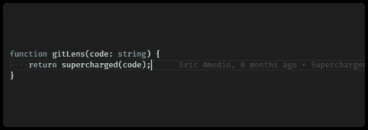

当前行责备，GitLens 的众多特性之一(来源: [Eric Amodio](https://marketplace.visualstudio.com/publishers/eamodio) 在 [Visual Studio Marketplace](https://marketplace.visualstudio.com/)

## 16. [GitLens](https://marketplace.visualstudio.com/items?itemName=eamodio.gitlens) 作者 [Eric Amodio](https://marketplace.visualstudio.com/publishers/eamodio)

GitLens 帮助你更好的理解代码。快速浏览一行或代码块被更改的人、原因和时间。回顾历史，深入了解代码是如何以及为什么进化的。

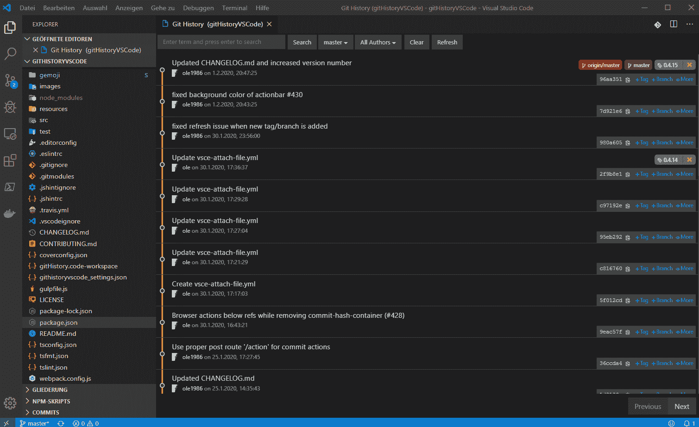

(来源:[唐·贾亚曼](https://marketplace.visualstudio.com/publishers/donjayamanne)在[Visual Studio market place](https://marketplace.visualstudio.com/)上)

## 17. [Git 历史](https://marketplace.visualstudio.com/items?itemName=donjayamanne.githistory)作者[唐·贾亚曼](https://marketplace.visualstudio.com/publishers/donjayamanne)

显示提交历史的美丽的线形图，比较文件，提交，等等！

> 美学

来源: [Esben Petersen](https://marketplace.visualstudio.com/publishers/esbenp) 在[Visual Studio market place](https://marketplace.visualstudio.com/)

## 18.[更漂亮——代码格式化程序](https://marketplace.visualstudio.com/items?itemName=esbenp.prettier-vscode)作者[埃斯本·彼得森](https://marketplace.visualstudio.com/publishers/esbenp)

漂亮是一个固执己见的代码格式化程序。它通过解析代码并使用自己的规则重新打印代码，在必要时包装代码，从而在代码中实施一致的风格。但是，请注意支持的语言。

漂亮(来源: [P & P](https://marketplace.visualstudio.com/publishers/pnp) 上[Visual Studio market place](https://marketplace.visualstudio.com/))

## 19.【更新】 [Polacode-2020](https://marketplace.visualstudio.com/items?itemName=jeff-hykin.polacode-2019) 作者[杰夫·海金](https://marketplace.visualstudio.com/publishers/jeff-hykin)

对你的代码进行美学截图。再也不用担心在会议上如何漂亮地展示你的代码了。

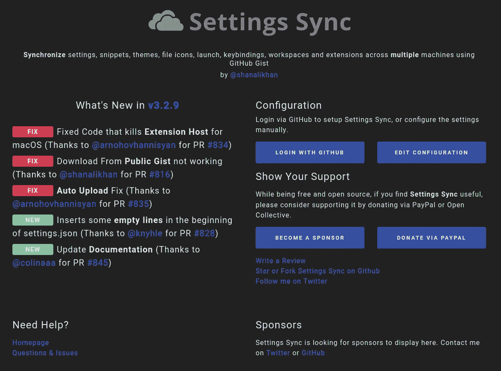

来源:[单于](https://marketplace.visualstudio.com/publishers/Shan)在[视觉工作室市场](https://marketplace.visualstudio.com/)

## 20.[设置同步](https://marketplace.visualstudio.com/items?itemName=Shan.code-settings-sync)通过[单于](https://marketplace.visualstudio.com/publishers/Shan)

现在你已经设置好了你的编辑器，是时候将所有东西同步到 GitHub 了，这样你就可以很容易地将你的偏好转移到另一台电脑上。玩得开心！