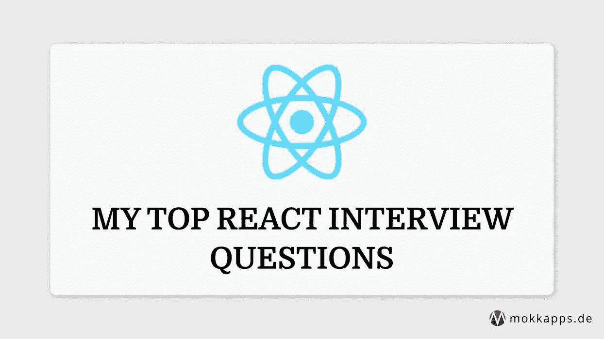

# 我最常反应的面试问题

> 原文：<https://levelup.gitconnected.com/my-top-react-interview-questions-c31b95a60471>



这篇文章总结了一系列我会问应聘者的问题，也是我在面试中经常被问到的问题。

# 1.什么是反应？

[React](https://reactjs.org/) 是一个“用于构建用户界面的 JavaScript 库”,由脸书于 2011 年开发。

它是 MVC(模型-视图-控制器)中的 V，所以它是一个开源的 UI 库，而不是一个框架。

# 2.React 的优势是什么？

*   良好表现:由于 VDOM，见 [#17](https://mokkapps.de/blog/my-top-react-interview-questions/#7-what-is-the-virtual-dom) 。
*   简单易学:有了基本的 JavaScript 知识，你就可以开始构建应用程序了。像 Angular 这样的框架需要更多关于其他技术和模式的知识，比如 RxJS、TypeScript 和依赖注入。
*   单向数据流:这种流也称为“父到子”或“从上到下”,可以防止错误并方便调试。
*   可重用组件:在代码的其他部分甚至在不同的项目中重用 React 组件只需很少或不需要修改。
*   巨大的社区:该社区提供了大量可用于构建 React 应用程序的库。
*   很受开发者欢迎。

# 3.React 的缺点是什么？

*   由于 React 只提供了 MVC 模型的视图部分，所以在你的项目中你还会依赖其他技术。因此，每个 React 项目可能看起来非常不同。
*   有些人认为 JSX 太难把握，太复杂。
*   React 及其库的文档通常很差。

# 4.什么是 JSX？

JSX (JavaScript XML)允许我们在 JavaScript 中编写 HTML。[官方文件](https://reactjs.org/docs/introducing-jsx.html)将其描述为“JavaScript 的语法扩展”。

React 推荐使用 JSX，但是也有可能根本不使用 JSX 来创建应用[。](https://reactjs.org/docs/react-without-jsx.html)

一个简单的 JSX 例子:

```
const element = <h1>Hello, world!</h1>;
```

# 5.如何在组件之间传递数据？

1.  使用 props 将数据从父节点传递到子节点。
2.  使用回调将数据从子节点传递到父节点。
3.  使用以下任一方法在同级之间传递数据:

*   综合上述方法。
*   使用 [Redux](https://redux.js.org/) 。
*   利用 [React 的上下文 API](https://reactjs.org/docs/context.html#api) 。

# 6.功能组件和类组件有什么区别？

[钩子](https://reactjs.org/docs/hooks-intro.html)在 React 16.8 中引入。在以前的版本中，功能组件被称为无状态组件，不提供与类组件相同的功能(例如，访问状态)。钩子使功能组件具有与类组件相同的特性。没有从 React 中移除类组件的计划。

所以让我们来看看它们的区别:

# 声明和道具

## 功能成分

功能组件是 JavaScript 函数，因此可以使用 arrow 函数或`function`关键字来声明。Props 是简单的函数参数，可以直接在 JSX 内部使用:

```
const Card = (props) => {
 return(
 	<h2>Title: {props.title}</h2>
 )
}

function Card(props){
 return(
	<h2>Title: {props.title}</h2>
 )
}
```

## 类别组件

使用 ES6 `class`关键字声明类组件。需要使用`this`关键字来访问道具:

```
class Card extends React.Component{
 constructor(props){
   super(props);
 }

 render(){
   return(
	<h2>Title: {this.props.title}</h2>
   )
 }
}
```

# 处理状态

## 功能组件

在功能组件中，我们需要使用`useState`钩子来处理状态:

```
const Counter = (props) => {
	const [counter, setCounter] = useState(0);

	const increment = () => {
		setCounter(++counter);
	}

	return (
		<div>
			<p>Count: {counter}</p>
			<button onClick={increment}>Increment Counter</button>
		</div>
	)
}
```

## 类别组件

在类组件中不能使用 React 钩子，因此在类组件中状态处理是不同的:

```
class Counter extends React.Component {
	constructor(props){
    	super(props);
        this.state = {counter : 0};
        this.increment = this.increment.bind(this);
    }

	increment {
		this.setState((prevState) => {
			return {counter: prevState.counter++};
		});
	}

	render() {
	return (
			<div>
			<p>Count: {this.state.counter}</p>
			<button onClick={this.increment}>Increment Counter</button>
		</div>
		)
	}
}
```

# 7.什么是虚拟 DOM？

虚拟 DOM (VDOM) 是一个轻量级的 JavaScript 对象，它包含了真实 DOM 的副本。


# 8.影子 DOM 和虚拟 DOM 一样吗？

不，他们是不同的。

影子 DOM 是一种浏览器技术，主要用于在 web 组件中定义变量和 CSS。

虚拟 DOM 是一个由浏览器 API 之上的 JavaScript 库实现的概念。

# 9.什么是“反应纤维”？

纤程是 React 16 中新的协调引擎。

它的主要特点是增量渲染:能够将渲染工作分成块，并分散到多个帧上。

[阅读更多](https://github.com/acdlite/react-fiber-architecture)。

# 10.状态和道具有什么区别？

道具和状态都是普通的 JavaScript 对象。

props(properties 的缩写)是由父组件传递给组件的任意输入的对象。

状态是由组件初始化和管理的变量，并且在该组件的特定实例的生存期内发生变化。

Kent C. Dodds 的这篇文章提供了更详细的解释。

# 11.受控组件和非受控组件有什么区别？

受控 React 组件中输入元素的值由 React 控制。

不受控制的 React 组件中输入元素的值由 DOM 控制。

# 12.受控组件和非受控组件有什么区别？

React 类组件提供了这些生命周期方法:

*   `componentDidMount()`:组件输出渲染到 DOM 后运行。
*   `componentDidUpdate()`:更新发生后立即运行。
*   `componentWillUnmount()`:在组件从 DOM 中卸载后运行，用于清理内存空间。

还有一些其他[很少使用的](https://reactjs.org/docs/react-component.html#rarely-used-lifecycle-methods)和[遗留的](https://reactjs.org/docs/react-component.html#legacy-lifecycle-methods)生命周期方法。

钩子用在功能组件中，而不是上面提到的生命周期方法。效果挂钩`useEffect`增加了例如执行副作用的能力，并提供与`componentDidMount`、`componentDidUpdate`和`componentWillUnmount`相同的功能。

# 13.如何提高 React 应用的性能？

*   使用[反应。PureComponent](https://reactjs.org/docs/react-api.html#reactpurecomponent) 是一个类似`React.Component`的基类，但是在某些情况下，如果它的`render()`函数在给定相同的属性和状态的情况下呈现相同的结果，它会提供性能提升。
*   使用 [useMemo 钩子](https://reactjs.org/docs/hooks-reference.html#usememo)来记忆在每次渲染时执行昂贵计算的函数。只有当其中一个依赖项(传递给钩子)发生变化时，它才会重新计算内存化的值。
*   状态托管是将状态移至您需要的位置的过程。一些 React 应用程序在其父组件中有许多不必要的状态，这使得代码更难维护，并导致许多不必要的重新呈现。[本文](https://kentcdodds.com/blog/state-colocation-will-make-your-react-app-faster)提供了关于状态托管的详细解释。
*   延迟加载组件以减少应用程序的加载时间。反应[暂停](https://reactjs.org/docs/react-api.html#suspense)可以用来延迟加载组件。

# 14.React 中的键是什么？

React 需要键来识别哪些元素被更改、添加或删除。数组中的每一项都需要有一个提供稳定标识的键。

如果项的顺序可能改变，不建议对键使用索引，因为这会对性能产生负面影响，并可能导致状态问题。如果没有为列表项指定显式键，React 将使用索引作为键。

查看罗宾·波科尔尼的文章，深入了解使用指数作为关键字的负面影响。如果你有兴趣了解更多，这里有另一个[关于为什么钥匙是必要的](https://reactjs.org/docs/reconciliation.html#recursing-on-children)的深入解释。

# 15.什么是高阶元件？

[高阶分量(HOC)](https://reactjs.org/docs/higher-order-components.html#use-hocs-for-cross-cutting-concerns) 是取一个分量并返回一个新分量的函数。

它们是 React 中重用组件逻辑的高级技术，本质上它们不是 React API 的一部分。它们是从 React 的组合性质中显现出来的一种模式:

```
const EnhancedComponent = higherOrderComponent(WrappedComponent);
```

一个组件将 props 转换成 UI，而一个更高级的组件将一个组件转换成另一个组件。

# 16.什么是误差边界？

React 16 引入了“错误边界”的新概念。

[错误边界](https://reactjs.org/docs/error-boundaries.html#gatsby-focus-wrapper)是 React 组件，它捕捉子组件树中任何地方的 JavaScript 错误，记录这些错误，并显示一个回退 UI，而不是崩溃的组件树。错误边界在渲染期间、在生命周期方法中以及在它们下面的整个树的构造函数中捕捉错误。

# 17.为什么要引入钩子？

*   钩子允许你在不改变组件层次结构的情况下重用有状态逻辑。
*   钩子允许您根据相关的部分将一个组件分成更小的功能(比如设置订阅或获取数据)。
*   钩子让你不用类就可以使用更多的 React 特性。
*   它消除了在类组件中处理关键字`this`的复杂性。

[阅读更多](https://reactjs.org/docs/hooks-intro.html#motivation)

# 18.useEffect 钩子的用途是什么？

[效果挂钩](https://reactjs.org/docs/hooks-reference.html#useeffect)让我们在功能组件中执行副作用。它帮助我们避免在一个类组件的不同生命周期方法中出现冗余代码。它有助于对相关代码进行分组。

# 19.React 中的合成事件是什么？

[SyntheticEvent](https://reactjs.org/docs/events.html) 是围绕浏览器本地事件的跨浏览器包装器。它与浏览器的本地事件具有相同的 API，包括`stopPropagation()`和` preventDefault()，除了这些事件在所有浏览器中的工作方式相同。

# 20.参考文献有什么用？

一个 [Ref](https://reactjs.org/docs/glossary.html#refs) 是一个可以附加到任何组件的特殊属性。它可以是由`React.createRef()`创建的对象、回调函数或字符串(在遗留 API 中)。

要直接访问 DOM 元素或组件实例，可以使用 ref 属性作为回调函数。该函数接收底层 DOM 元素或类实例(取决于元素的类型)作为其参数。

在大多数情况下，引用应该少用。

# 结论

我希望这份 React 面试问题清单能帮助你获得下一个 React 职位。如果你知道任何其他重要的面试问题，请给我留言。

如果你喜欢这篇文章，请在 Twitter 上关注我，从我这里获得关于新博客文章和更多内容的通知。

如果你在寻找更多的面试问题，你应该看看这个[500 个面试问题的列表&答案](https://github.com/sudheerj/reactjs-interview-questions)。

*原发布于*[*https://www . mokkapps . de*](https://www.mokkapps.de/blog/my-top-react-interview-questions)*。*