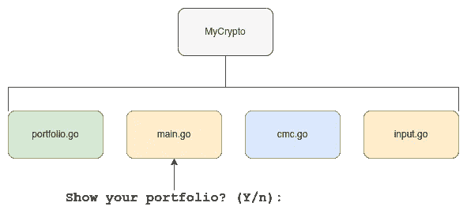
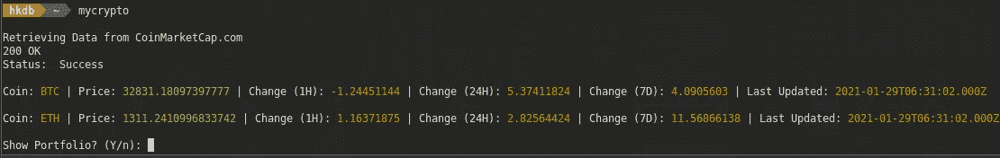

# MyCrypto 模板改进

> 原文：<https://levelup.gitconnected.com/mycrypto-template-improvements-3645b4e16c95>

## 更好的逻辑分离&使投资组合显示可选

对于那些没有读过我之前关于 MyCrypto 的短文的人来说，我建议你先读一读，这样你就能了解这个项目的背景。以下是帖子:

 [## 基于终端的 BTC/联邦理工学院投资组合跟踪模板

### 用 GoLang 和 CoinMarketCap.com API 建造

levelup.gitconnected.com](/a-terminal-based-btc-eth-portfolio-tracker-template-6931b45656ea) 

在使用 MyCrypto 近 2 周后，我遇到了一个用例，它可能需要在交付输出的方式上做一点小小的改变。我发现有时我不一定想在屏幕上显示我的投资组合，但仍然想从终端上查看 BTC 和瑞士联邦理工学院的价格。想象一下，当你和你与之互动的任何人都想知道 BTC 和瑞士联邦理工学院的最新价格时，你坐在一位同事旁边，或者进行在线会议屏幕共享。这些天来，我的自然本能是在终端中键入“mycrypto ”,这样它就可以显示出来。然而，因为它自动显示我的投资组合和位置，我当然不愿意这样做，我最终去了 CoinMarketCap.com，而不是检查哪一个比我想做的更多的点击，打字和等待，特别是当我再次很可能已经在终端中或可以通过快速快捷键打开一个新的终端时。

## 可选投资组合展示

所以快速解决方案是显而易见的。我决定在显示最新价格后插入一个快速问题，询问用户是否想显示他/她的投资组合。如果用户点击回车，默认答案是“是”，但如果用户不想显示他/她的作品集，用户只需输入“n”，点击回车，程序就退出了。然而，我仍然对默认应该是什么持观望态度，因为默认为“否”也是有意义的，因为它可以防止意外输入。如果我改变主意的话，这很容易解决，所以我现在就不做了。另外，这是模板。任何喜欢不同默认值的人只需要对代码库做一个超级小的编辑。

## 受欢迎的副作用

也许一个受欢迎的副作用是，随着我的交易数量的增长，价格滚动到可视区域的右侧，而通过这一新的“可选显示”功能，它会自动停止，并在前进之前等待用户输入，这为用户提供了一种在继续查看他们的投资组合之前先查看价格的方式。当然，这并不是最终的解决方案，因为随着时间的推移，纯粹的事务可以很容易地通过可视区域，所以我仍然在考虑如何长期处理这个问题。

## 代码结构

因为我已经在做了，所以我决定做一些清理工作，让代码结构变得更容易处理，或者更具伸缩性。毕竟，一个糟糕的基础永远不会产生一个好的应用程序，对不对？所以我决定将我之前拥有的一个大的 main.go 文件逻辑上分成 4 个独立的文件。

*   main.go —主流程和环境处理留在这里
*   cmc.go —处理 CoinMarketCap API 和显示原始数据的所有逻辑都在这里
*   input . go——它处理用户输入，这是新的“可选显示”特性所在的位置
*   portfolio.go —处理读取 CSV、显示交易和计算用户位置的所有代码都在这里。

这种新的结构显然允许更容易地导航代码库，以找到我正在寻找的特定块，以及平铺多个文件，以便我可以在这个项目上工作时引用代码的不同部分。当然，我可能会用不同的方式或更细的粒度将它们分开，但对于项目的规模来说，我认为这对我来说已经足够了。

最后但同样重要的是，我还在等式中添加了 [Go 模块](https://blog.golang.org/using-go-modules),以便更容易管理依赖关系。

现在你知道了。这大概总结了我今晚短暂的“娱乐”黑客会议。所有最新的更改都可以在以下网站的主分支中找到:

 [## hkdb/mycrypto

### 维护者:hkdb@3df.io 这是一个基于终端的加密货币(目前仅适用于 BTC 和瑞士联邦理工学院)投资组合跟踪系统…

github.com](https://github.com/hkdb/mycrypto) 

# 更新(2021 年 12 月 27 日)—一个更加完善的版本:

 [## MyCrypto v0.1.0 改进

### 使其成为相对更完整的解决方案

hkdb.medium.com](https://hkdb.medium.com/mycrypto-v0-1-0-improvements-c251dcfc4cfc)