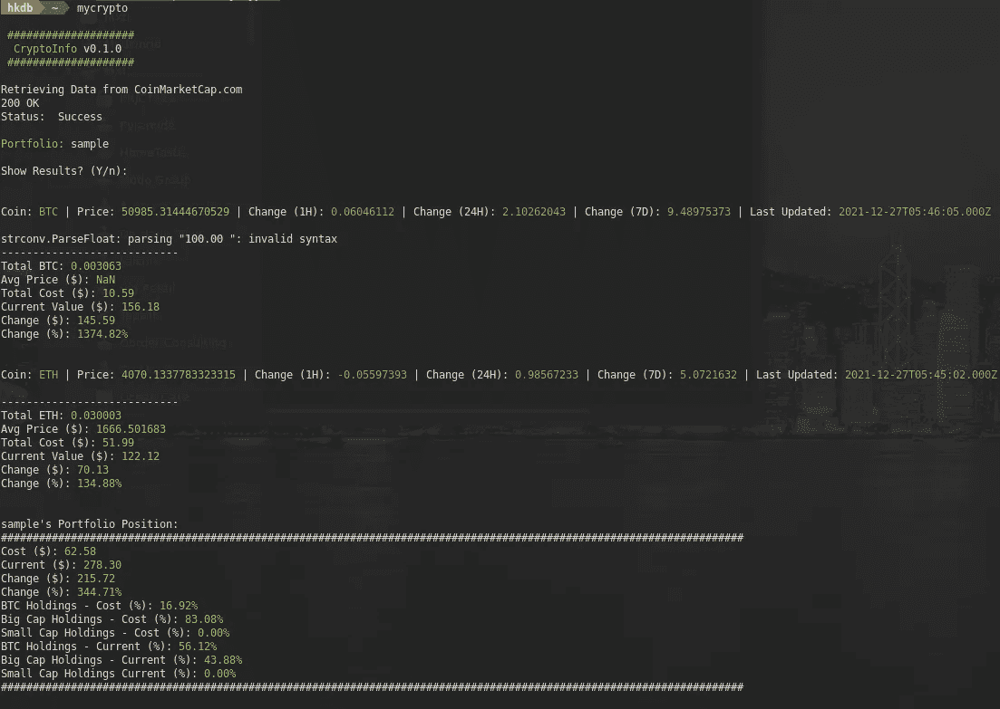
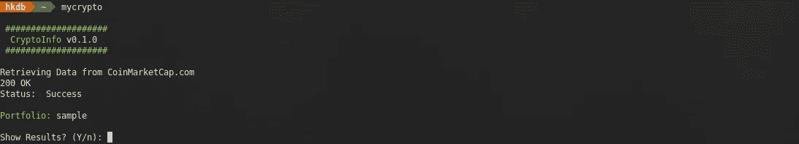
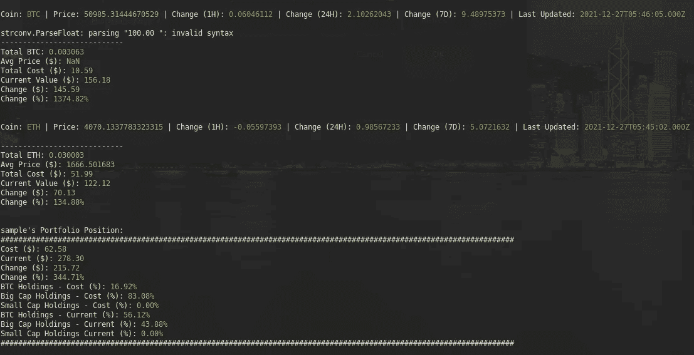
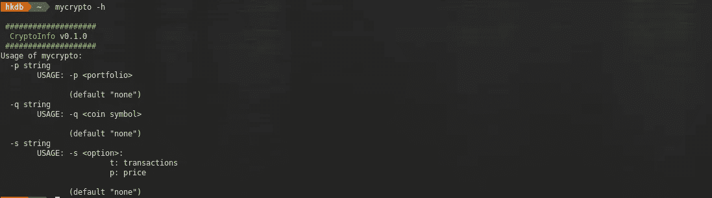
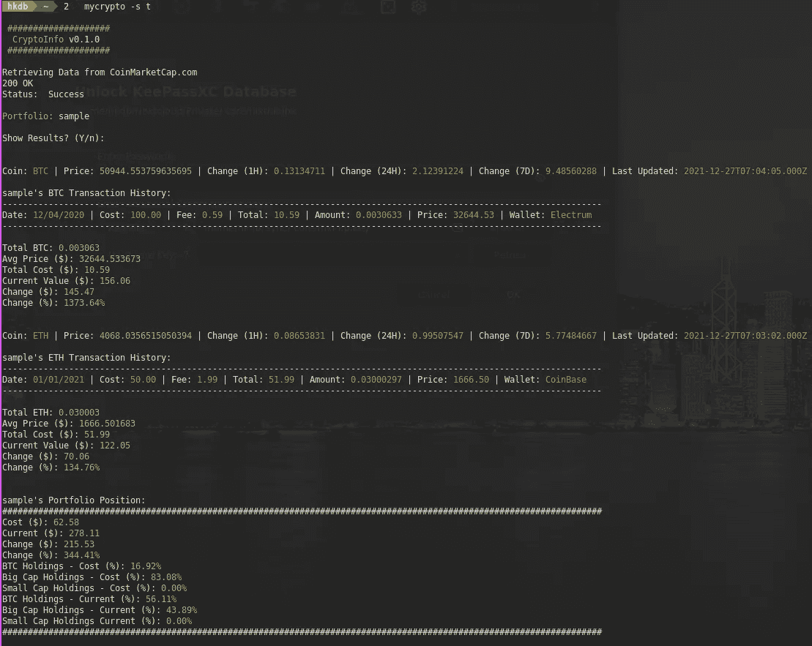
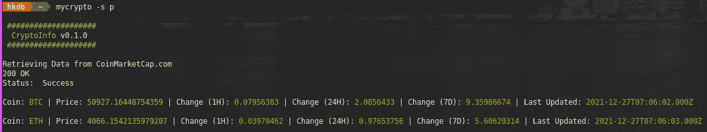
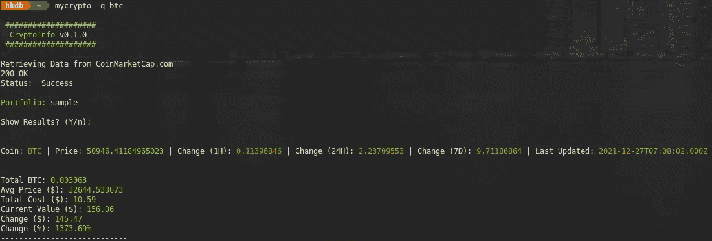
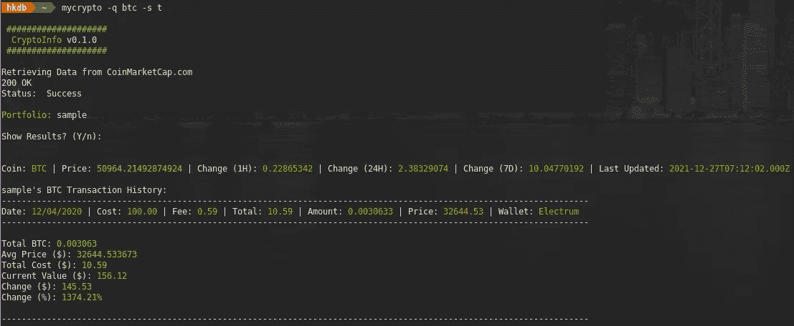
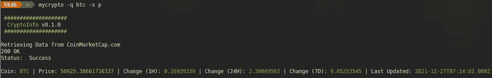
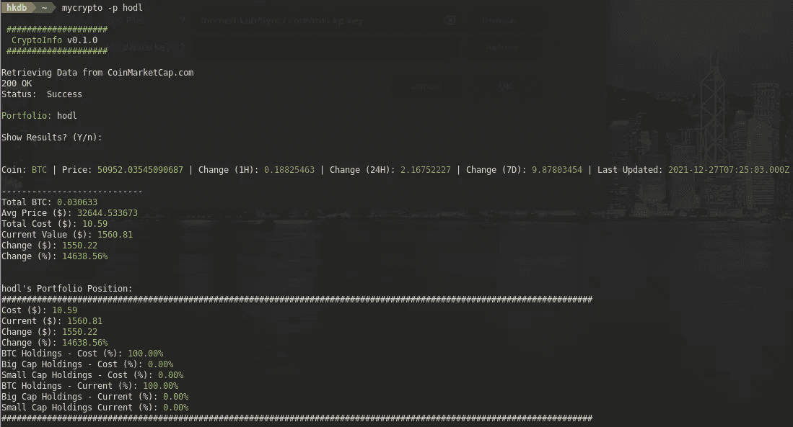

# MyCrypto v0.1.0 改进

> 原文：<https://levelup.gitconnected.com/mycrypto-v0-1-0-improvements-c251dcfc4cfc>

## 使其成为相对更完整的解决方案



## 背景

在专注于一个 IDO、致力于启动一个新的分散式云项目的早期阶段，以及工作中的许多不同事情之间，我已经有一段时间没有时间在这里写帖子或做任何个人编码/探索了。所以在寒假期间，我决定花些时间来报复一下，希望能解渴。

由于我们在加密市场上有了一个小型的圣诞老人泵，我想是时候让我的基于终端的投资组合跟踪器焕然一新了，我之前就开始工作了。当我第一次做它的时候，有很多小的快速/肮脏的攻击，我不太满意，还有一些缺失的功能，我希望看到它成为一个更完整的解决方案，所以鉴于时间限制，它看起来是一个完美的项目，因为由于我的工作情况，我今年的假期会有点短。

经过一个下午的玩耍和第二天的修饰，结果如下:

*   将变量类型从 struct 更改为 map，以存储 api 响应，然后通过它们循环计算结果，这样我只需在一个地方添加新硬币，而不是在多个地方对每个硬币进行硬编码，然后重新编译应用程序
*   增加了 settings.conf 和 portfolio.conf 来设置查询 CMC 数据的硬币，而不是硬编码并在之后重新编译
*   支持多种投资组合
*   仅检查价格数据
*   仅检查特定硬币的价格数据
*   微小的外观/流动改进
*   一般随机改进

你可以在这里看到代码:

[](https://github.com/hkdb/mycrypto) [## GitHub - hkdb/mycrypto:一个基于终端的加密货币(BTC/ETH)投资组合跟踪工具

### 维护者:hkdb@3df.io 这是一个基于终端的加密货币投资组合跟踪器，用于跟踪加密…

github.com](https://github.com/hkdb/mycrypto) 

我敢肯定，有相对更多的人对这个应用程序感兴趣，不一定很关心上面的胡言乱语，所以相反，让我们展示它在行动中的样子。

## 让我们看看它的实际效果

让我们运行没有任何标志的应用程序:

```
mycrypto
```



如果从 CMC 获取价格数据时没有看到任何错误，并且想要查看结果，请按 enter:



现在我们已经看到了默认选项，让我们看看更高级的选项是什么:

```
mycrypto -h
```



如果您想在基本投资组合数据的基础上查看您过去的买入/卖出数据，您可以尝试:

```
mycrypto -s t
```



如果有人在看你的屏幕，而你还想快速查看价格，我们也可以只显示价格数据:

```
mycrypto -s p
```



如果您的硬币列表变得越来越大，并且您想要关注某个特定的硬币:

```
mycrypto -q btc
```



当然，您也可以通过添加额外的标志来显示特定硬币的交易:

```
mycrypto -q btc -s t
```



您也可以只查看某个硬币的价格:

```
mycrypto -q btc -s p
```



最后但同样重要的是，您可以通过指定投资组合名称来检查您拥有的其他投资组合。假设我有一个名为“hodl”的文件夹和相关的 CSV 文件，如 hodl-btc.csv:

```
mycrypto -p hodl
```



如果您将所有其他标志添加到-p hodl 之后，如-s t 或-q btc，它们也可以工作。

就是这样…我还没有解决的唯一问题是，一旦用户在交易记录中有任何销售，我可能没有正确计算 DCA 美元成本(平均价格),但无论如何，对我来说这是一个非常有趣的小会议。让我知道你们所有人的想法！

干杯！