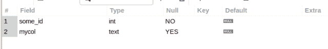
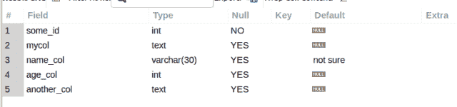

# MySQL ALTER TABLE —添加多列

> 原文：<https://levelup.gitconnected.com/mysql-alter-table-add-multiple-columns-e68b6ee3490e>

我最近需要在一个现有的表中添加多个列来存储汇总数据计算，我想知道是否可以用一条 MySQL `ALTER TABLE`语句来完成。事实证明你可以。而且，超级简单。也方便。继续阅读，学习我所学到的…


图片来自 [Pixabay](https://pixabay.com/?utm_source=link-attribution&utm_medium=referral&utm_campaign=image&utm_content=2728121) 的 [Gerd Altmann](https://pixabay.com/users/geralt-9301/?utm_source=link-attribution&utm_medium=referral&utm_campaign=image&utm_content=2728121)

收到一本我的电子书，*“给每个人的 10 个 MySQL 技巧”*， ***绝对免费*** 当你[订阅](http://openlamptech.substack.com)***OpenLampTech***时事通讯。

## MySQL 变更表

在 MySQL 中，要向现有表中添加新列，`ALTER TABLE`语法如下所示:

```
ALTER TABLE table_name ADD COLUMN column_name column_definition;
```

让我们尝试在一个命令中添加多个列。

我有一个包含两列的任意表格:

```
DESC a_tab;
```



☕☕☕

如果你在这篇文章中发现了价值，你可以表达你的感激，并请我喝杯咖啡。这是我最喜欢的饮料！

☕☕☕

我们先从**的*开始，像平常一样修改表 table_name 添加列*和**。然后指定我们想要的列数，并用括号括起每个列所需的定义。

再次检查表定义，我们可以看到添加了 3 个新列，都是用一个`ALTER TABLE`命令:

```
DESC a_tab;
```



维奥拉。很简单，对吧？

需要学习 MySQL 吗？刚刚起步，对如何查询一个表，获取自己需要的数据感到困惑？出于这个特殊的原因，我正在创建优质的 MySQL 初学者内容。来帮助那些想学习 MySQL 基础知识却不知道从何入手的人。了解更多关于我开发和发布的优质博客文章的信息。

喜欢你读过的？看到什么不正确的吗？请在下面评论，感谢阅读！！！

# 行动的号召！

感谢你花时间阅读这篇文章。我真心希望你发现了一些有趣和有启发性的东西。请在这里与你认识的其他人分享你的发现，他们也会从中获得同样的价值。

访问[投资组合-项目页面](https://wp.me/P28ctb-3KD)查看我为客户完成的博客帖子/技术写作。

[**用咖啡支持我的工作！**](https://ko-fi.com/joshlovescoffee)

要在最新的博客文章发表时收到来自本博客(“数字猫头鹰散文”)的电子邮件通知(绝不是垃圾邮件)，请点击“点击订阅！”按钮在首页的侧边栏！(请随时查看 [Digital Owl 的散文隐私政策页面](https://wp.me/P28ctb-3gI)，了解您可能有的任何问题:电子邮件更新、选择加入、选择退出、联系表格等……)

请务必访问[“最佳”](https://joshuaotwell.com/where-blog_post-in-digital-owls-prose-best-of/)页面，收集我的最佳博客文章。

作为一名 SQL 开发人员和博客作者，Josh Otwell 热衷于学习和成长。其他最喜欢的活动是让他埋头于一本好书、一篇文章或 Linux 命令行。其中，他喜欢桌面 RPG 游戏，阅读奇幻小说，并与妻子和两个女儿共度时光。

免责声明:本文中的例子是关于如何实现类似结果的假设。它们不是最好的解决方案。所提供的大多数(如果不是全部)示例都是在个人发展/学习工作站环境中执行的，不应被视为生产质量或就绪。您的特定目标和需求可能会有所不同。使用那些最有利于你的需求和目标的实践。观点是我自己的。

从[***OpenLampTech***](http://openlamptech.substack.com/)出版页面、[书籍推荐— SQL 反模式](https://openlamptech.substack.com/p/book-recommendation-sql-antipatterns)查看这篇文章。

*有什么事吗？*

*   *你想开一个博客吗？我用 WordPress 写博客。让我们都在提供的计划上省钱吧。💸*
*   *从[我的 Etsy 商店](https://www.etsy.com/shop/digitalowlsprose/)获取一个 Gmail HTML 电子邮件签名模板，让你的电子邮件显得与众不同。✉️*
*   *需要托管你的下一个网络应用程序或 WordPress 网站吗？我使用并强烈推荐 [Hostinger](https://www.hostg.xyz/aff_c?offer_id=6&aff_id=94641) 。他们有很好的价格和服务。*
*   *我喜欢每天早上在你的收件箱里阅读《网络的本质》。免费订阅。通过我的推荐链接为您自己[注册，帮助我获得高级订阅。](https://refind.com/joshua-otwell?invite=5440c95e39)*
*   *抓住一个[免费包的手机*创作者*壁纸](https://click.convertkit-mail4.com/d0uvkov9k4s0h22640am/p8hehqu9xxnm2zbr/aHR0cHM6Ly9zcGFya2xwLmNvL2pvc2h1YWMwM2U2Mw==)。*
*   *刚入门还是想学 MySQL？在这里找到我的[高级博客文章和 MySQL 初学者系列](https://digitalowlsprose.ck.page/03da7bb182)。*

****披露*** :本帖中部分服务和产品链接为附属链接。在没有额外费用给你，你应该通过点击其中一个购买，我会收到佣金。*

*用提示支持我的内容[。非常感谢！！！](https://digitalowlsprose.ck.page/products/appreciation-support)*

*当您[订阅 ***OpenLampTech*** 时事通讯时，***绝对免费*** 收到一本我的电子书。](http://openlamptech.substack.com)*

**原载于 2022 年 3 月 30 日 https://joshuaotwell.com**[*。*](https://joshuaotwell.com/mysql-alter-table-add-multiple-columns/)**