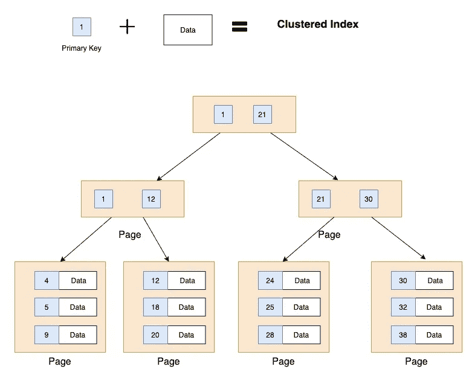
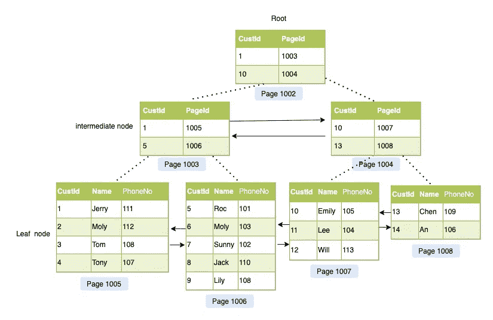

# MySQL 数据库索引的概念，你可能不完全理解

> 原文：<https://levelup.gitconnected.com/mysql-database-index-concepts-you-probably-dont-fully-understand-1a084573904e>

## 索引背后的一些重要概念


数据库索引

**索引**用于快速查找具有特定值的行。

如果一个表中有相关列的索引，MySQL 可以快速确定在数据文件中间查找的位置，而不必查看所有数据。这比顺序读取每一行要快得多。

在本帖中，我们将看看索引背后的一些重要概念。

# 例子

让我们首先创建一个 MySQL 表。

```
CREATE TABLE Customer( 
  `custId` INT,
  `name` VARCHAR(50),
  `mobileNo` VARCHAR(11)
);ALTER TABLE `Customer` ADD PRIMARY KEY (`custId`);ALTER TABLE `mobileNo` ADD UNIQUE INDEX (`MobileNo`);
```

假设我们有一个客户表，它有三个字段:`custId`、`name`和`mobileNo`。`CustId`是表的主键，`mobileNo`是唯一的二级索引。

下表显示了一些数据记录。

```
+--------+--------+---------+
| CustId |  Name  | PhoneNo |
+--------+--------+---------+
|      1 | Jerry  |     111 |
|      2 | Moly   |     112 |
|      3 | Tom    |     108 |
|      4 | Tony   |     107 |
|      5 | Roc    |     101 |
|      6 | Moly   |     103 |
|      7 | Sunny  |     102 |
|      8 | Jack   |     110 |
|      9 | Lily   |     108 |
|     10 | Emily  |     105 |
|     11 | Lee    |     104 |
|     12 | Will   |     113 |
|     13 | Chen   |     109 |
|     14 | An     |     106 |
+--------+--------+---------+
```

# 主关键字🔑

**主键**是关系数据库中的一个键，**唯一地**指定一个记录，如驾照号码、电话号码或车辆识别号(VIN)。

它有很多属性:

*   每个表有且只有一个主键
*   **每行唯一**
*   **不为空**

# 一个聚集索引



聚集索引

聚集索引的思想是在一个 **B 树**结构中存储一个完整的表。

聚集索引是一个*物理*概念，有了*聚集索引*，主键和数据记录本身就被**聚集在一起**。**数据记录全部按主键顺序存储**。这就是我们称之为聚集索引的原因。

> 主关键字🔑+Data = B+树聚集索引

聚集索引定义了数据在表中的物理存储顺序。表数据在*中只能以一种方式*排序，因此，每个表只能有一个聚集索引。

## MySQL 如何选择聚簇键？

1.  当有一个**主键**时，使用它作为聚集键。
2.  当没有主键时，使用第一个**非空唯一键**作为聚集键。
3.  如果以上都不是，InnoDB 将生成一个隐藏列作为聚集键。

# 数据页与索引页

在聚集索引中，叶节点包含基础表的 ***数据页*** 。

根节点和中间层节点包含保存索引行的 ***索引页*** 。每个索引行都包含一个键值和一个指针，指向 B 树中的中间级别页或索引的叶级别中的数据行。



聚集索引的 B +树结构

每一级索引中的页面都链接在一个**双向链表中。**


# **二级指标**


非聚集索引的 B +树结构

二级索引结构类似于聚集索引的 B+树结构，但是叶节点只包含索引列的值和指向实际数据行的 PK 列的副本。

二级索引类似于书中的索引。数据存储在一个地方，索引存储在另一个地方，索引有指向数据存储位置的指针。

当然，我们可以在一个表中有许多二级索引。像书在开头有一个单独的索引指向章节的位置，在“结尾”有另一个索引指向常用词的位置。

我希望这篇文章能帮助你更好地理解 MySQL 索引