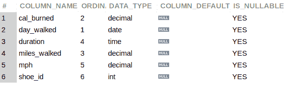
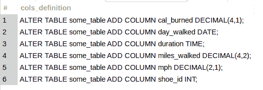

# MySQL 元数据查询—列表中的列结构和定义

> 原文：<https://levelup.gitconnected.com/mysql-metadata-queries-column-structure-and-definition-with-the-columns-table-84596da0a6b3>

`INFORMATION_SCHEMA`数据库充满了关于数据库的信息和元数据。列是必需的，它们的定义确保了良好的存储和数据完整性。使用`COLUMNS`表格了解所有相关信息。


图片由 [Gerd Altmann](https://pixabay.com/users/geralt-9301/?utm_source=link-attribution&utm_medium=referral&utm_campaign=image&utm_content=797274) 来自 [Pixabay](https://pixabay.com//?utm_source=link-attribution&utm_medium=referral&utm_campaign=image&utm_content=797274)

## PHP 和 MySQL 开发人员的时事通讯

当你[订阅 ***OpenLampTech*** 时事通讯](http://openlamptech.substack.com)的时候，就可以收到一本我的电子书*《给每个人的 10 个 MySQL 技巧】。*

💡**澄清**:图中的`INFORMATION_SCHEMA` ' *表*实际上是`VIEWS`。

## 信息 _ 方案列表

虽然有几列组成了`COLUMNS`表，但在这个查询中，我将`SELECT`只列出几列来让您了解可用的内容:

```
SELECT COLUMN_NAME, ORDINAL_POSITION, DATA_TYPE, COLUMN_DEFAULT, IS_NULLABLE
FROM COLUMNS
WHERE TABLE_SCHEMA = 'walking'
AND TABLE_NAME = 'walking_stats';
```



像往常一样，检索您感兴趣的特定行的关键是基于`WHERE`子句条件。

**相关** : [用 WHERE 子句限制行数— MySQL 初学者系列](https://joshuaotwell.com/limit-rows-with-the-where-clause-mysql-beginner-series)

在`COLUMNS`表中，根据`TABLE_SCHEMA`和`TABLE_NAME`列过滤行。

**推荐初学者书籍**:我强烈推荐《学习 SQL:生成、操作、检索数据 》这本书，适合 SQL 初学者。这是我的第一本真正的 SQL 书籍，帮助我巩固了许多概念。你不会失望的。

## 用于脚本的信息 _ 模式列表

您可能会发现从`COLUMNS`表中的数据创建一些*基础脚本*很有用。当然还有其他方法可以为你的表格创建[数据定义语言](https://en.wikipedia.org/wiki/Data_definition_language) (DDL)脚本，但是你可以自己制作一些。

```
SELECT
CONCAT('ALTER TABLE some_table ADD COLUMN ' ,COLUMN_NAME, ' ',
CASE WHEN UPPER(DATA_TYPE) = 'DECIMAL' THEN CONCAT(UPPER(DATA_TYPE),'(', NUMERIC_PRECISION,',', NUMERIC_SCALE, ')')
ELSE UPPER(DATA_TYPE) END,
';') AS cols_definition
FROM COLUMNS
WHERE TABLE_SCHEMA = 'walking'
AND TABLE_NAME = 'walking_stats';
```



使用 SQL 创建 SQL 是非常强大和方便的。虽然上面的例子产生了一个'*粗略脚本*'的开始，但是您已经了解了一些 SQL 脚本的概念，您可以使用`COLUMNS`表中的信息来执行这些脚本。

喜欢你读过的？看到什么不正确的吗？请在下面评论，感谢阅读！！！

# 行动的号召！

感谢你花时间阅读这篇文章。我真心希望你发现了一些有趣和有启发性的东西。请在这里与你认识的其他人分享你的发现，他们也会从中获得同样的价值。

访问 [Portfolio-Projects 页面](https://wp.me/P28ctb-3KD)查看我为客户完成的博客帖子/技术写作。

[**帮忙支持一下我的内容，和某咖合作！**](https://ko-fi.com/joshlovescoffee)

要在最新的博客文章发表时收到来自本博客(“数字猫头鹰散文”)的电子邮件通知(绝不是垃圾邮件)，请点击“点击订阅！”按钮在首页的侧边栏！(如有任何问题，请随时查看 [Digital Owl 的散文隐私政策页面](https://wp.me/P28ctb-3gI):电子邮件更新、选择加入、选择退出、联系表格等……)

请务必访问[“最佳”](https://joshuaotwell.com/where-blog_post-in-digital-owls-prose-best-of/)页面，收集我的最佳博文。

[Josh Otwell](https://joshuaotwell.com/about/) 作为一名 SQL 开发人员和博客作者，他热衷于学习和成长。其他最喜欢的活动是让他埋头于一本好书、一篇文章或 Linux 命令行。其中，他喜欢桌面 RPG 游戏，阅读奇幻小说，并与妻子和两个女儿共度时光。

免责声明:本文中的例子是关于如何实现类似结果的假设。它们不是最好的解决方案。所提供的大多数(如果不是全部)示例都是在个人发展/学习工作站环境中执行的，不应被视为生产质量或就绪。您的特定目标和需求可能会有所不同。使用那些最有利于你的需求和目标的实践。观点是我自己的。

*有何贵干？*

*   *免费 [MySQL 查询语法真言 PDF](https://ko-fi.com/s/3631fc7d00) 备忘单。记住这个咒语的查询语法顺序。*
*   *你想开一个博客吗？我用 WordPress 写博客。让我们都在提供的计划上省钱。*
*   *通过在 ***OpenLampTech*** 时事通讯中投放价格合理的分类广告，让您的品牌、产品或服务获得所需的关注[。](https://ko-fi.com/s/7dfe9ce108)*
*   *需要托管你的下一个网络应用程序或 WordPress 网站吗？我使用并强烈推荐 [Hostinger](https://www.hostg.xyz/aff_c?offer_id=6&aff_id=94641) 。他们有很好的价格和服务。*
*   *[作为一名自学成才的开发人员，我逐渐认识到的 5 个事实](https://ko-fi.com/post/5-Truths-Ive-Come-To-Realize-As-a-Self-taught-Dev-R5R2BL9J6)*
*   *今天就在我的 [Kofi 商店](https://ko-fi.com/joshlovescoffee#)发现优质的 MySQL 学习资料吧！*

****披露*** :本帖中的一些服务和产品链接是附属链接。在没有额外费用给你，你应该通过点击其中一个购买，我会收到佣金。*

*当您[订阅***【OpenLampTech】***简讯](http://openlamptech.substack.com)时，收到一本我的电子书*《给每个人的 10 个 MySQL 技巧】****绝对免费*** 。*

*通过在 ***OpenLampTech*** 时事通讯中投放价格合理的分类广告，让您的品牌、产品或服务获得其所需的关注度[。谢谢大家的支持！](https://ko-fi.com/s/7dfe9ce108)*

**原载于 2022 年 9 月 14 日*[*【https://joshuaotwell.com】*](https://joshuaotwell.com/mysql-metadata-queries-columns-table/)*。**