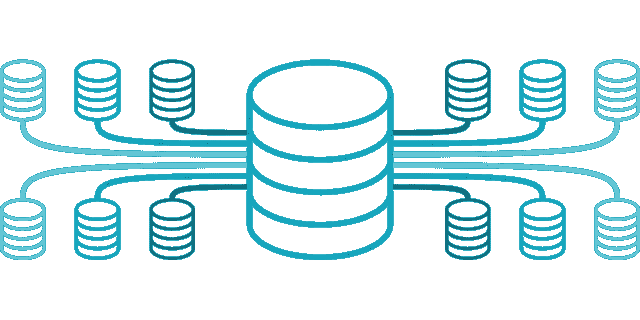

# MySQL SELECT 和 WHERE 子句列存在

> 原文：<https://levelup.gitconnected.com/mysql-select-and-where-clause-column-existence-8516b075fa1f>

我正在分享另一个技巧给那些想了解 MySQL 和如何使用它的人。这篇文章介绍了一个例子，说明了在`WHERE`子句中指定的列之间的差异，而不是在`SELECT`子句中指定的，反之亦然



图片来自 [Pixabay](https://pixabay.com/?utm_source=link-attribution&utm_medium=referral&utm_campaign=image&utm_content=7216774)

当你[订阅 ***OpenLampTech*** 时事通讯](http://openlamptech.substack.com)时，就能收到一本我的电子书*《给每个人的 10 个 MySQL 技巧】】。*

## 在 WHERE 子句而不是 SELECT 子句中命名的列

用作`WHERE`子句条件过滤器 ***的一部分的任何列不一定要在`SELECT`列列表中列出*** 。但是，它 ***应该出现在`FROM`子句命名表中的*** 。为清楚起见，请参见以下示例查询。

```
SELECT category_id, last_update
FROM category
WHERE name = 'Action';
```

您可以看到，`WHERE`子句使用了条件过滤器`*name = ‘Action’*`，这是完全有效的，尽管`SELECT`语句列表不包括‘name’列。

📰在 ***OpenLampTech*** 时事通讯中投放价格合理的分类广告，让您的品牌、产品或服务获得其所需的关注度[。谢谢大家的支持！](https://ko-fi.com/s/7dfe9ce108)

## WHERE 子句中不存在的列

然而，如下一个示例查询所示，您不能在`WHERE`子句条件过滤器中指定不存在的列名，否则您将得到一个*‘未知列’*错误:

```
SELECT name, category_id, last_update
FROM category
WHERE first_name = 'Action';
Error Code: 1054\. Unknown column 'first_name' in 'where clause'
```

同样，列在`SELECT`列表中但不存在于命名的`FROM`子句表中的列也会返回错误:

```
SELECT first_name, category_id, last_update
FROM category
WHERE name = 'Action';
Error Code: 1054\. Unknown column 'first_name' in 'field list'
```

请继续关注更多 MySQL 和 PHP 技巧和内容。🙂

喜欢你读过的？看到什么不正确的吗？请在下面评论，感谢阅读！！！

# 行动的号召！

感谢你花时间阅读这篇文章。我真心希望你发现了一些有趣和有启发性的东西。请在这里与你认识的其他人分享你的发现，他们也会从中获得同样的价值。

访问 [Portfolio-Projects 页面](https://wp.me/P28ctb-3KD)查看我为客户完成的博客帖子/技术写作。

要在最新的博客文章发表时收到来自本博客(“数字猫头鹰散文”)的电子邮件通知(绝不是垃圾邮件)，请点击“点击订阅！”按钮在首页的侧边栏！(如有任何问题，请随时查看[数字猫头鹰的散文隐私政策页面](https://wp.me/P28ctb-3gI):电子邮件更新、选择加入、选择退出、联系表格等……)

请务必访问我的最佳博客文章的收集页面。

[作为一名 SQL 开发人员和博客写手，Josh Otwell](https://joshuaotwell.com/about/) 热衷于学习和成长。其他最喜欢的活动是让他埋头于一本好书、一篇文章或 Linux 命令行。其中，他喜欢桌面 RPG 游戏，阅读奇幻小说，并与妻子和两个女儿共度时光。

免责声明:本文中的例子是关于如何实现类似结果的假设。它们不是最好的解决方案。所提供的大多数(如果不是全部)示例都是在个人发展/学习工作站环境中执行的，不应被视为生产质量或就绪。您的特定目标和需求可能会有所不同。使用那些最有利于你的需求和目标的实践。观点是我自己的。

***有什么可以帮你的*** ？

***披露*** :本帖部分服务和产品链接为附属链接。在没有额外费用给你，你应该通过点击其中一个购买，我会收到佣金。

当你[订阅 ***OpenLampTech*** 时事通讯的时候，就可以收到一本我的电子书*《给每个人的 10 个 MySQL 技巧】*。](http://openlamptech.substack.com)

📰通过在 ***OpenLampTech*** 时事通讯中投放价格合理的分类广告，让您的品牌、产品或服务得到应有的关注[。谢谢大家的支持！](https://ko-fi.com/s/7dfe9ce108)

*原载于 2022 年 6 月 29 日*[*【https://joshuaotwell.com】*](https://joshuaotwell.com/mysql-select-and-where-clause-column-existence/)*。*

# 分级编码

感谢您成为我们社区的一员！更多内容见[升级编码出版物](https://levelup.gitconnected.com/)。
跟随:[推特](https://twitter.com/gitconnected)，[领英](https://www.linkedin.com/company/gitconnected)，[通迅](https://newsletter.levelup.dev/)
**升一级正在改造理工大招聘➡️** [**加入我们的人才集体**](https://jobs.levelup.dev/talent/welcome?referral=true)