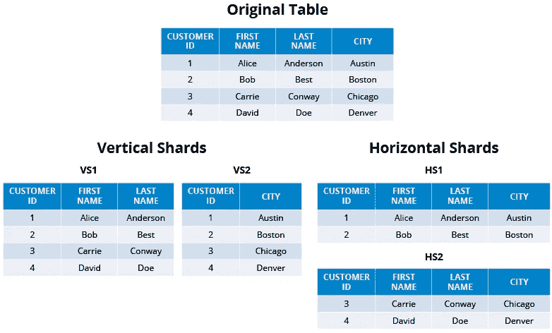
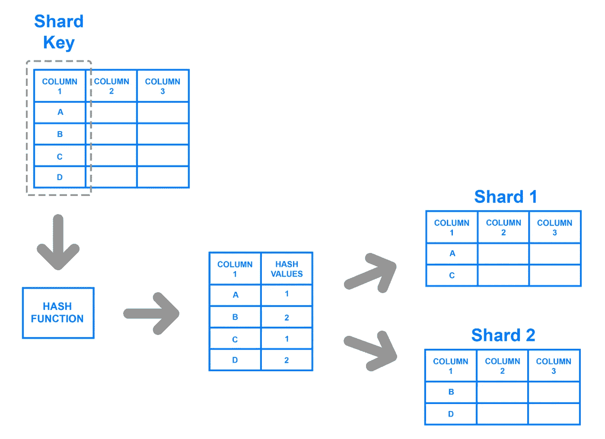

# MYSQL 分片教程

> 原文：<https://levelup.gitconnected.com/mysql-sharding-tutorial-7340d2c26a3e>

# 简介:

近年来，大多数公司已经开始成为数据驱动型企业。这意味着他们使用数据驱动的决策来设计营销、增长、业务发展和产品开发等部门的未来计划。各业务部门必须确保以适合分析的格式收集基本数据，并且这些数据易于获取，以便进行准确的分析。因为目标是提供准确的分析，所以收集了大量数据，使得在单个系统上存储不可行。数据库分片就是由此诞生的。

## 什么是分片？

随着存储数据量的增长，依赖整体关系数据库管理系统(RDBMS)的企业将会遇到瓶颈。由于受限的 CPU 能力、内存、存储容量和吞吐量，响应时间将不可避免地恶化。垂直扩展可以在这些场景中使用，但是它有自己的限制，并且在某个点之后提供递减的回报。

当处理大量数据时，水平缩放是理想的选择。如果表被水平分区并在许多服务器之间共享，那么每个服务器上的负载将会减少，并且许多服务器并行执行单个查询将会缩短响应时间。

分片是一种向外扩展的技术，在这种技术中，数据库表被分区，每个分区托管在自己的 RDBMS 服务器上。对于 MySQL，这意味着每个节点都是自己的 MySQL RDBMS，有自己的一组数据分区。由于这种数据分离，应用程序可以同时在许多服务器上分发查询，从而实现并行性，并因此提高工作负载的规模。然而，数据和服务器的分离引入了一些问题，例如分片键选择、模式设计和应用程序重写。

一个[碎片](https://www.interviewbit.com/mysql-interview-questions/#what-is-sharding-in-sql)是一个水平的数据分割，包含原始数据集的一部分。因此，它只负责整个工作负载的一部分。在发生意外停机时，也可以使用分片来确保数据可用性。如果非共享数据库的服务器因任何原因关闭，将没有可用的数据。另一方面，分片数据库有几个分片，数据在这些分片中被拆分。这意味着，在发生意外停机时，只有停机碎片中的数据可用。那些当前活跃的将仍然能够适当地响应。



https://hazelcast.com/

**分片的好处:**

在单个系统上运行关系数据库并根据需要通过升级机器的处理能力来扩展它是相对容易的。最后，任何非分布式数据库都会受到存储和处理能力的限制，因此水平扩展的能力增加了设置的灵活性。

一些人选择分片数据库架构的另一个原因是为了减少查询响应时间。当您向尚未分片的数据库提交查询时，它可能需要搜索您正在查询的表中的每一行，以找到您想要的结果集。

分片还可以通过减少停机的影响来帮助提高应用程序的可靠性。如果您的程序或网站依赖于非共享数据库，失败可能会导致整个应用程序不可访问。另一方面，分片数据库中的中断很可能只影响一个分片。

## MySQL 分片:

如果要执行 MySQL 分片，必须在应用层手动完成，这需要大量的工程带宽，因为必须建立一个完整的分片逻辑来确定如何分发和获取数据。

由于实施必须手动完成，因此必须考虑某些设计因素。以下是必须做出的决定:

*   选择 MySQL 分片密钥。
*   模式更改的处理。
*   物理服务器、分片和 MySQL 分片键之间的映射。

**选择 MySQL 分片密钥**

MySQL 分片键决定了如何在分片之间共享数据。在 MySQL 中部署分片时，应该仔细选择 MySQL 分片密钥，因为错误的密钥可能会导致以后的系统不灵活。如果父行和子行保存在不同的片上，引用完整性(即由关系数据库管理系统(RDBMS)维护的表之间的父/子关系)将不会自动保留。

选择分片密钥的另一个原因是，替换一个就地分片密钥可能会很耗时且不方便。如果可能的话，通常会避免分片键更改，因为它们可能会对应用程序、数据位置和跨节点的事务性(也包括 ACID)产生连锁反应。

以下是两种类型的 MySQL 分片密钥:

*   智能分片键有助于避免跨节点事务，但它们更容易出现偏斜。例如，如果用户表是按 user_id 分片的，那么最好将关于该用户的任何相关信息(如用户交互、用户联系点等)放在同一个分片上，以避免跨节点连接。如果大量用户相互链接，这可以很好地发挥作用。
*   散列化的分片键自动分布在整个分片中，尽管它们更容易受到跨节点事务的攻击。例如，如果分片密钥是散列分布的，则相关联的用户信息也将是散列分布的。这是一种分散负载的好方法，尤其是因为新用户会导致增长激增。但是，跨用户组的频繁交互将需要跨节点加入和/或跨节点复制，从而导致持续的延迟和/或由于复制滞后而可能过时的数据。



图片来源:[链接](https://assets.digitalocean.com/articles/understanding_sharding/DB_image_2_cropped.png)

## **模式变化的处理**

MySQL 数据库中的表模式创建后，用户可以随时修改它们。每个 MySQL 碎片无疑可以进行在线模式更改，确保不会丢失任何事务。但是问题不在于 RDBMS 的支持；相反，它协调所有碎片的 DDL 更新和应用程序状态。

在启用采用新模式的应用程序代码之前，每个碎片必须成功完成它们的在线模式更改。如果不是应用程序失败，即使其中一个碎片没有完成修改，也会发生数据不一致。几个 MySQL 实例之间的这种级别的合作是一个耗时的过程，会使应用程序面临失败和停机的风险。因此，大多数分片阵列管理员尽可能地防止模式更改。

## 物理服务器、分片和 MySQL 分片键之间的映射

如果在物理服务器、分片和 MySQL 分片键之间没有正确的映射，MySQL 分片就无法实现。随着碎片数量的增长和模式的改变，这种映射可能需要经常改变。实际上，数据库上运行的每个查询都必须可以访问这个映射，因此它应该存储在一个允许快速查找的位置。因此，建议将其存储在内存数据库中。

**分片:一个例子**

假设我们有几台服务器，每台服务器运行一个 MySQL 实例，该实例可以有几个数据库。数据分散在各个数据库中。

我们在配置表中跟踪这些碎片位于哪些机器上:

```
[{"range": (0, 255), "master": "MySQL1A", "slave": "MySQL1B"},
 {"range": (256, 511), "master": "MySQL2A", "slave": "MySQL2B"},
 …
 {"range": (512, 754), "master": "MySQL16A", "slave": "MySQL16B"}]
```

只有当我们需要转移碎片或更换主机时，这种配置才会改变。我们可以提升一个奴隶，如果一个主人死了，我们可以培养一个新的奴隶。

每个 shard 中都有相同的表:pencils、box、user_has_pencils、pencil_liked_by_user 等等。

要分发碎片:

```
ID = (shard ID << 45) | (type ID << 35) | (local ID<<0)
```

比如说 MySQL2A 上有一个 shard。我们可以这样开始:

```
conn = MySQLdb.connect(host="MySQL2A")
conn.execute("SELECT data FROM db03429.pencils where local_id=7075735")
```

对象和映射是数据的两种形式。

对象表具有一个 ID(本地 ID，一个自动递增的主键)和一个 blob 数据，其中包含一个 JSON 和所有对象数据，比如铅笔、用户、书籍和评论。

```
CREATE TABLE pencils (
 local_id INT PRIMARY KEY AUTO_INCREMENT,
 data TEXT,
 ts TIMESTAMP DEFAULT CURRENT_TIMESTAMP
) ENGINE=InnoDB;
```

为了修改铅笔，我们使用 MySQL 事务来读-修改-写 JSON:

```
> BEGIN
> SELECT blob FROM db01829.pencils WHERE localId=8325735 FOR UPDATE
[Modifying
 the json blob]
> UPDATE db01829.pencils SET blob='<modified blob>' WHERE localId=8325735
> COMMIT
```

一个映射表连接两个对象，如一个板和它包含的铅笔。MySQL 中的映射表有三列:一个 64 位的“from”ID、一个 64 位的“to”ID 和一个序列 ID。在(from，to，sequence)三元组中，有一些索引键位于“from”ID 的分片上。

```
CREATE TABLE box_has_pencils (
 boxId INT,
 pencilId INT,
 sequence INT,
 INDEX(boxId, pencilId, sequence)
) ENGINE=InnoDB;
```

要查看映射表中的内容:

```
SELECT pencilId FROM box_has_pencils 
WHERE boardId=23468314728651 ORDER BY sequence 
LIMIT 25 OFFSET 100
```

## MySQL 分片的局限性:

虽然对数据库进行分片可能有助于提高伸缩性和性能，但它也会带来某些缺点。由于 MySQL 分片实现的缺点，不建议在大多数应用程序的生产中使用它。

以下是使用 MySQL 分片的限制:

*   正确创建分片数据库架构的复杂性是人们使用分片面临的第一个挑战。如果分片过程不正确，很有可能会丢失数据或损坏表。切分，即使做得正确，也可能对团队的过程产生重大影响。用户必须跨多个碎片位置管理数据，而不是从单个入口点访问和管理数据，这对一些团队来说可能是破坏性的。
*   使用 MySQL 分片，跨多个分片的交叉连接是不可能的。这被广泛认为是 MySQL 分片的一个显著缺点，因为许多公司依赖 SQL 进行分析，如果不使用复杂的连接操作就无法进行分析。
*   另一个明显的缺点是，在对数据库进行分片后，很难将其恢复到原始架构。分割后写入的数据不会包含在分割前进行的任何数据库备份中。因此，恢复原始的非共享架构需要将新的分区数据与旧的备份进行集成，或者将分区数据库改回单个数据库，这两种方式都非常昂贵和耗时。
*   利用任何 SQL 数据库的最重要的好处之一是它是 ACID 兼容的。当启用 MySQL 分片时，数据库不再被认为是 ACID 兼容的，这增加了数据丢失以及错误或不一致数据的风险。[了解更多信息](https://dzone.com/articles/challenges-of-sharding-mysql)

**结论:**

对于那些希望横向扩展数据库的人来说，分片是一个很好的选择。但是，它增加了应用程序的复杂性，并增加了潜在故障点的数量。对于一些人来说，分片可能是必要的，而对于另一些人来说，构建和维护分片架构所需的时间和资源可能会超过收益。

分片实现被认为更适合 NoSQL 数据库。如果分片对于您的公司和数据需求至关重要，最好将所有必要的数据移动到 NoSQL 数据库，然后对其应用分片。