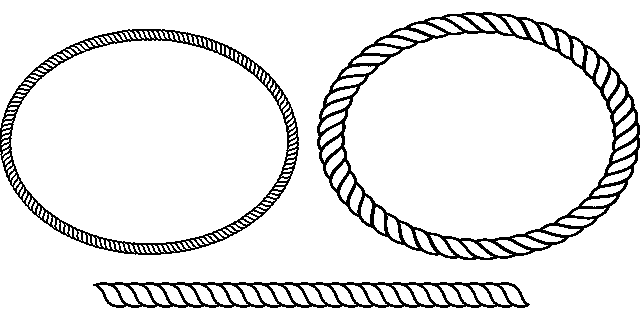
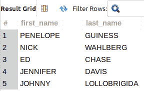
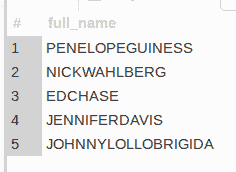
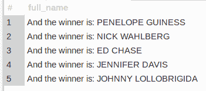

# 用 CONCAT()连接 MySQL 字符串

> 原文：<https://levelup.gitconnected.com/mysql-string-concatenation-with-concat-81bb68591235>

在编程领域，将单个文本数据片段连接成单个字符串并不是什么新鲜事，所有语言都支持某种形式的连接。在 MySQL 中，可以使用`CONCAT()`函数。让我们看看如何…

图片来自 [Pixabay](https://pixabay.com/?utm_source=link-attribution&utm_medium=referral&utm_campaign=image&utm_content=5979560) 亚历杭德罗·冈萨雷斯

当你[订阅 ***OpenLampTech*** 时事通讯](http://openlamptech.substack.com)时，就能收到一本我的电子书*《给每个人的 10 个 MySQL 技巧】*。

自我推销:

如果你喜欢这里写的内容，尽一切办法，把这个博客和你最喜欢的帖子分享给其他可能从中受益或喜欢它的人。既然咖啡是我最喜欢的饮料，如果你愿意，你甚至可以给我买一杯！

## MySQL CONCAT()语法

对于示例查询，我使用了著名的 [Sakila 数据库](https://dev.mysql.com/doc/sakila/en/)中的“actor”表。

MySQL `CONCAT()`函数的语法简单易记:

任何`CONCAT()`函数调用都应该至少传递一个参数，否则会出现错误:

## MySQL CONCAT()用法

作为一种新颖的尝试，我们可以尝试在“actor”表的“first_name”和“last_name”列之间放置一个空格，但是,*不会将这些值连接成一个字符串:*

但是，如果您将' first_name '和' last_name '列作为参数传递给`CONCAT()`，它们将连接成一个字符串:

需要学习 MySQL 吗？刚刚起步，对如何查询一个表，获取自己需要的数据感到困惑？出于这个特殊的原因，我正在创建优质的 MySQL 初学者内容。来帮助那些想学习 MySQL 基础知识却不知道从何入手的人。了解更多关于我开发和发布的优质博客文章。

告诉我更多！

请注意，在前面的示例中,“名字”和“姓氏”值之间没有空格。

然而，`CONCAT()`接受多个参数，所以您可以简单地传入一个空格字符作为其中之一:

在下面的查询中，我向`CONCAT()`传递了 4 个参数，其中 1 个被添加到字符串的开头:

尝试在任何需要字符串连接的查询中使用`CONCAT()`。

今天就用一个小技巧来支持我的博客和内容。感谢您的时间和捐赠🙏

[尖罐子](https://digitalowlsprose.ck.page/products/appreciation-support)

## 相似阅读

除了这篇文章，你还可以阅读以下任何一篇文章:

*   [MySQL 显示表格— 2 种变化](https://openlamptech.substack.com/p/mysql-show-tables-2-variations)
*   [MySQL 初学者系列—选择语句](https://link.medium.com/GAZOwADDSnb)
*   [MySQL 中的 SUBSTRING_INDEX()函数—附实例。](https://joshuaotwell.com/substring_index-function-in-mysql-with-examples/)

喜欢你读过的？看到什么不正确的吗？请在下面评论，感谢阅读！！！

# 行动的号召！

感谢你花时间阅读这篇文章。我真心希望你发现了一些有趣和有启发性的东西。请在这里与你认识的其他人分享你的发现，他们也会从中获得同样的价值。

访问 [Portfolio-Projects 页面](https://wp.me/P28ctb-3KD)查看我为客户完成的博客帖子/技术写作。

咖啡是我最喜欢的饮料，如果你给我买一杯，我会喝的！！！

要在最新的博客文章发表时收到来自本博客(“数字猫头鹰散文”)的电子邮件通知(绝不是垃圾邮件)，请点击“点击订阅！”按钮在首页的侧边栏！(如有任何问题，请随时查看 [Digital Owl 的散文隐私政策页面](https://wp.me/P28ctb-3gI):电子邮件更新、选择加入、选择退出、联系方式等……)

请务必访问[“最佳”](https://joshuaotwell.com/where-blog_post-in-digital-owls-prose-best-of/)页面，收集我的最佳博文。

作为一名 SQL 开发人员和博客写手，乔希·奥特威尔热衷于学习和成长。其他最喜欢的活动是让他埋头于一本好书、一篇文章或 Linux 命令行。其中，他喜欢桌面 RPG 游戏，阅读奇幻小说，并与妻子和两个女儿共度时光。

免责声明:本文中的例子是关于如何实现类似结果的假设。它们不是最好的解决方案。所提供的大多数(如果不是全部)示例都是在个人发展/学习工作站环境中执行的，不应被视为生产质量或就绪。您的特定目标和需求可能会有所不同。使用那些最有利于你的需求和目标的实践。观点是我自己的。

*有何贵干？*

*   *你想开一个博客吗？我用 WordPress 写博客。让我们俩[在提供的计划上省钱。💸](https://wordpress.com/refer-a-friend/yYnZ8Qph6LLrOLgEQb93/)*
*   *从[我的 Etsy 商店](https://www.etsy.com/shop/digitalowlsprose/)获取 Gmail HTML 电子邮件签名模板，让您的电子邮件更加醒目。✉️*
*   *需要托管你的下一个网络应用程序或 WordPress 网站吗？我使用并强烈推荐 [Hostinger](https://www.hostg.xyz/aff_c?offer_id=6&aff_id=94641) 。他们有很好的价格和服务。*
*   *我喜欢每天早上在你的收件箱里阅读 Refind: *网络的精髓。免费订阅*。通过我的推荐链接为您自己[注册，帮助我获得高级订阅。](https://refind.com/joshua-otwell?invite=5440c95e39)*
*   *获取一个[免费的手机*创作者*壁纸](https://click.convertkit-mail4.com/d0uvkov9k4s0h22640am/p8hehqu9xxnm2zbr/aHR0cHM6Ly9zcGFya2xwLmNvL2pvc2h1YWMwM2U2Mw==)包。*
*   *刚入门还是想学 MySQL？在这里找到我的[高级博客文章和 MySQL 初学者系列](https://digitalowlsprose.ck.page/03da7bb182)。*

****披露*** :本帖中的一些服务和产品链接是附属链接。在没有额外费用给你，你应该通过点击其中一个购买，我会收到佣金。*

****OpneLampTech*** 是面向 PHP 和 MySQL 开发者的时事通讯*

*领取一本我的电子书，*《给大家的 10 个 MySQL 小技巧》*，**，*绝对免费*** 当[你订阅了 ***OpenLampTech*** 简讯](http://openlamptech.substack.com)。*

**原载于 2022 年 3 月 16 日*[*【https://joshuaotwell.com】*](https://joshuaotwell.com/mysql-string-concatenation-with-concat/)*。**