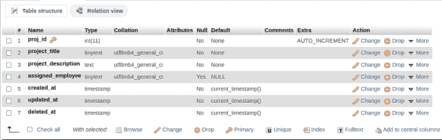
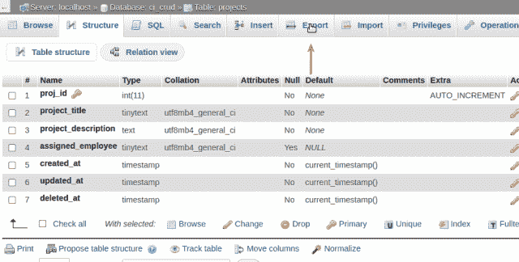
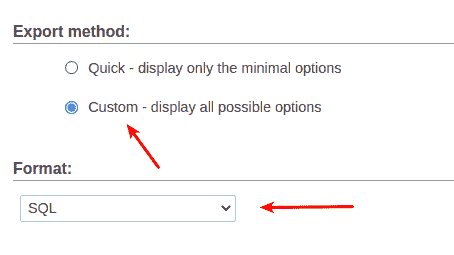
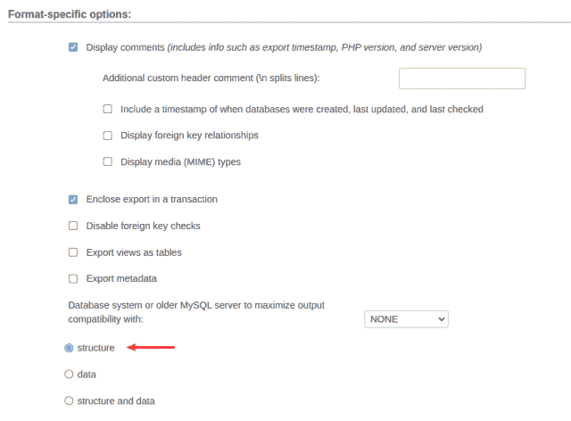
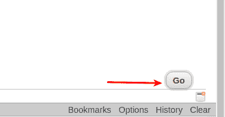

# 使用 phpMyAdmin 的 MySQL 表 DDL 文件

> 原文：<https://levelup.gitconnected.com/mysql-table-ddl-file-with-phpmyadmin-8437c1dd171a>

如果你需要一个*结构只有*。一个 Mysql 表的 SQL 文件[数据定义语言](https://en.wikipedia.org/wiki/Data_definition_language)(DDL)[phpMyAdmin](https://www.phpmyadmin.net/)只需点击几下就能让这变得超级简单。继续阅读，了解如何…

自我推销:

如果你喜欢这里写的内容，尽一切办法，把这个博客和你最喜欢的帖子分享给其他可能从中受益或喜欢它的人。既然咖啡是我最喜欢的饮料，如果你愿意，你甚至可以给我买一杯！

## 为什么要使用 DDL 文件？

为什么你只需要一个结构？sql DDL 文件？

也许您想在另一台服务器上构建一个表结构来引入不同的数据或类似的数据，并希望它不包含任何现有的数据。

与其用手动 MySQL 命令手工创建表*不如使用。DDL 转储文件。*

## 实践数据

我在本文的例子中使用的目标表是一个虚构的**项目**表，其结构如下:

使用 phpMyAdmin 的表结构。

## 如何只创建一个 DDL？带有 phpMyAdmin 的 sql 文件

第一步:

单击 phpMyAdmin 顶部功能区中的**导出**选项卡:

phpMyAdmin 中的导出选项卡。

你是[中级](http://medium.com/)会员吗？如果是这样的话，[每次我发表博客文章时都会收到一封电子邮件通知](https://parabollus.medium.com/subscribe)如果你更喜欢中型平台的话。不是会员？别担心！使用[我的注册链接](https://parabollus.medium.com/membership)(我将获得佣金，无需额外费用)并加入。我真的很喜欢阅读所有伟大的内容，我知道你也会！！！

第二步:

在**导出方法**部分，选择**自定义—显示所有可能选项**单选按钮，并确保**格式**下拉列表设置为 **SQL** :

phpMyAdmin 导出方法。

## 第三步:

在**格式特定选项**部分，点击**结构**单选按钮:

特定于 phpMyAdmin 格式的选项。

## 第四步:

将所有其他配置选项保留为默认值，只需单击位于窗口右下角的 **Go** 按钮即可完成导出:

我每周写一篇关于 SQL/PHP 的时事通讯，这是我正在研究、学习和感兴趣的内容。如果这听起来像是你想参与的事情，[点击这里](https://digitalowlsprose.ck.page/1b35a06295)了解更多信息。谢谢大家！

下面显示的 Github 要点，是整个。sql 转储文件与**项目**表的 DDL:

很简单，对吧？！？

像往常一样，如果您有问题或看到代码中的任何错误，请在评论部分自由分享。建设性的意见帮助我提供准确和有价值的内容，非常感谢！

## 相似阅读

享受我写的类似主题的博客帖子。也请与其他读者分享。谢谢大家！

*   [在 phpMyAdmin 中使用 MySQL 唯一约束](https://joshuaotwell.com/use-mysql-unique-constraint-in-phpmyadmin/)
*   [PHP strtoupper()和 strtolower()字符串函数](https://joshuaotwell.com/php-strtoupper-and-strtolower-string-functions/)
*   [MySQL 的 AUTO_INCREMENT 属性](https://joshuaotwell.com/mysqls-auto_increment-attribute/)

喜欢你读过的？看到什么不正确的吗？请在下面评论，感谢阅读！！！

# 行动的号召！

感谢你花时间阅读这篇文章。我真心希望你发现了一些有趣和有启发性的东西。请在这里与你认识的其他人分享你的发现，他们也会从中获得同样的价值。

访问 [Portfolio-Projects 页面](https://wp.me/P28ctb-3KD)查看我为客户完成的博客帖子/技术写作。

我真的很喜欢一杯咖啡！！！

要在最新的博客文章发表时收到来自本博客(“数字猫头鹰散文”)的电子邮件通知(绝不是垃圾邮件)，请点击“点击订阅！”按钮在首页的侧边栏！(如有任何问题，请随时查看 [Digital Owl 的散文隐私政策页面](https://wp.me/P28ctb-3gI):电子邮件更新、选择加入、选择退出、联系方式等……)

请务必访问[“最佳”](https://joshuaotwell.com/where-blog_post-in-digital-owls-prose-best-of/)页面，收集我的最佳博文。

作为一名 SQL 开发人员和博客作者，Josh Otwell 热衷于学习和成长。其他最喜欢的活动是让他埋头于一本好书、一篇文章或 Linux 命令行。其中，他喜欢桌面 RPG 游戏，阅读奇幻小说，并与妻子和两个女儿共度时光。

免责声明:本文中的例子是关于如何实现类似结果的假设。它们不是最好的解决方案。所提供的大多数(如果不是全部)示例都是在个人发展/学习工作站环境中执行的，不应被视为生产质量或就绪。您的特定目标和需求可能会有所不同。使用那些最有利于你的需求和目标的实践。观点是我自己的。

*原载于 2021 年 10 月 13 日*[*【https://joshuaotwell.com】*](https://joshuaotwell.com/mysql-table-ddl-file-with-phpmyadmin/)*。*