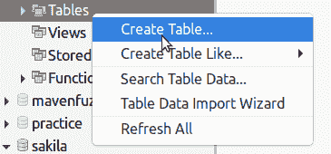
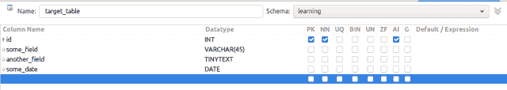
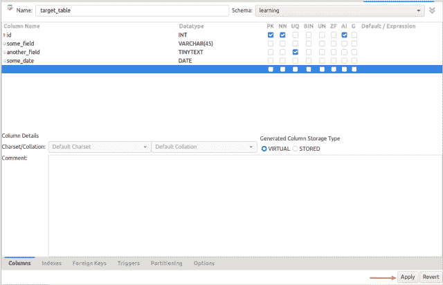
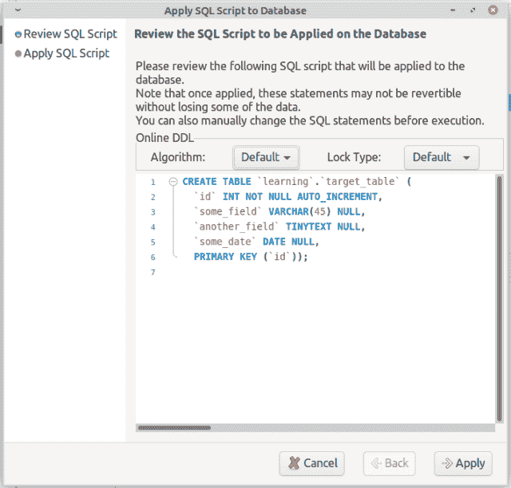
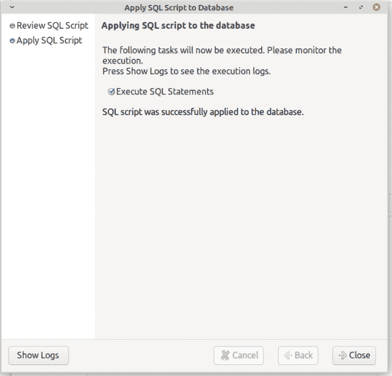
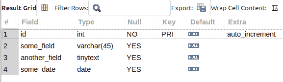

# MySQL Workbench GUI —创建表格

> 原文：<https://levelup.gitconnected.com/mysql-workbench-gui-create-table-3a62f5b44105>

在这篇博文中，您将学习如何使用 MySQL Workbench 提供的各种工具创建一个 MySQL 表，而无需键入任何 SQL 代码。继续阅读，了解如何…

图片由来自 [Pixabay](https://pixabay.com/?utm_source=link-attribution&utm_medium=referral&utm_campaign=image&utm_content=19208) 的 [Larisa Koshkina](https://pixabay.com/users/larisa-k-1107275/?utm_source=link-attribution&utm_medium=referral&utm_campaign=image&utm_content=19208) 拍摄

当你[订阅 ***OpenLampTech*** 时事通讯](http://openlamptech.substack.com)时，就能收到一本我的电子书*《给每个人的 10 个 MySQL 技巧》*。

## 没有 MySQL 代码？

我并不反对 MySQL 代码。事实上，我很喜欢它。这个博客和我的很多内容都是围绕 SQL 展开的。

也就是说，您可以通过使用 MySQL Workbench GUI 和内置的可视化组件来创建一个 MySQL 表。让我们看看如何…

## 如何用 MySQL Workbench 创建表格

第一步

首先，右键单击特定 ***模式*** 或 ***数据库*** 中的**表**菜单项，并单击**创建表……**子菜单项:

## 第二步

下一个对话屏幕提供了许多选项，包括:

*   命名表格
*   选择**模式*模式*模式**
*   添加具有数据类型和其他定义的列
*   设置排序规则、虚拟/生成列(可选)、索引、外键约束等…

## 第三步

设置好所有列和元数据后，单击**应用**按钮继续:

## 第四步

点击**应用**按钮后，下一个对话框除了显示**算法**和**锁类型**选项外，还显示 ***创建表*** DDL 的详细信息。

如果对 ***创建表*** 语句满意，点击**应用**按钮执行该语句。

点击**应用**按钮后，执行 ***创建表格*** 脚本，信息显示在后续对话框中。

最后，完成上述所有操作后，我在 MySQL Workbench 中运行***desc target _ table***命令，我们可以看到表已经创建好了:

通过[加入***【MySQL 学习层】*** 会员](https://ko-fi.com/joshlovescoffee/tiers)，发现优质文章、深度指南、学习和教学视频以及更多内容。拥有此会员资格，您可以访问未在任何地方发布的独家内容。随着新内容的不断增加，继续学习任何级别的 MySQL。

## 相似阅读

享受以下任何类似的文章。

*   [用 MySQL Workbench 导入 CSV 文件](https://joshuaotwell.com/import-csv-file-with-mysql-workbench/)
*   [用 MySQL Workbench 将结果查询到 CSV 中型交叉发布](https://joshuaotwell.com/query-results-to-csv-with-mysql-workbench-medium-cross-post/)
*   [MySQL work bench 中的快速 SQL 片段](https://joshuaotwell.com/quick-sql-snippets-in-mysql-workbench/)

喜欢你读过的？看到什么不正确的吗？请在下面评论，感谢阅读！！！

# 行动的号召！

感谢你花时间阅读这篇文章。我真心希望你发现了一些有趣和有启发性的东西。请在这里与你认识的其他人分享你的发现，他们也会从中获得同样的价值。

访问 [Portfolio-Projects 页面](https://wp.me/P28ctb-3KD)查看我为客户完成的博客帖子/技术写作。

[**如果你给我买咖啡，我绝对会喝！**](https://ko-fi.com/joshlovescoffee)

要在最新的博客文章发表时收到来自本博客(“数字猫头鹰散文”)的电子邮件通知(绝不是垃圾邮件)，请点击“点击订阅！”主页边栏上的按钮！(如有任何问题，请随时查看 [Digital Owl 的散文隐私政策页面](https://wp.me/P28ctb-3gI):电子邮件更新、选择加入、选择退出、联系方式等……)

请务必访问[“最佳”](https://joshuaotwell.com/where-blog_post-in-digital-owls-prose-best-of/)页面，收集我的最佳博文。

作为一名 SQL 开发人员和博客写手，Josh Otwell 有着学习和成长的热情。其他最喜欢的活动是让他埋头于一本好书、一篇文章或 Linux 命令行。其中，他喜欢桌面 RPG 游戏，阅读奇幻小说，并与妻子和两个女儿共度时光。

免责声明:本文中的例子是关于如何实现类似结果的假设。它们不是最好的解决方案。所提供的大多数(如果不是全部)示例都是在个人发展/学习工作站环境中执行的，不应被视为生产质量或就绪。您的特定目标和需求可能会有所不同。使用那些最有利于你的需求和目标的实践。观点是我自己的。

*有何贵干？*

*   *免费 [MySQL 查询语法真言 PDF](https://ko-fi.com/s/3631fc7d00) 备忘单。记住这个咒语的查询语法顺序。*
*   *你想开一个博客吗？我用 WordPress 写博客。让我们都在提供的计划上省钱。💸*
*   *从[我的 Etsy 商店](https://www.etsy.com/shop/digitalowlsprose/)获取 Gmail HTML 电子邮件签名模板，让您的电子邮件更加醒目。✉️*
*   *需要托管你的下一个网络应用程序或 WordPress 网站吗？我使用并强烈推荐 [Hostinger](https://www.hostg.xyz/aff_c?offer_id=6&aff_id=94641) 。他们有很好的价格和服务。*
*   *🔒[作为一名自学成才的开发人员，我逐渐认识到的 5 个事实](https://ko-fi.com/post/5-Truths-Ive-Come-To-Realize-As-a-Self-taught-Dev-R5R2BL9J6)*
*   *今天就在我的 [Kofi 商店](https://ko-fi.com/joshlovescoffee#)发现优质的 MySQL 学习资料吧！*

****披露*** :本帖部分服务和产品链接为附属链接。在没有额外费用给你，你应该通过点击其中一个购买，我会收到佣金。*

*当你[订阅 ***OpenLampTech*** 时事通讯](http://openlamptech.substack.com)时，收到一本我的电子书*《给每个人的 10 个 MySQL 技巧》**

**原载于 2022 年 4 月 13 日 https://joshuaotwell.com**[*。*](https://joshuaotwell.com/mysql-workbench-gui-create-table/)**