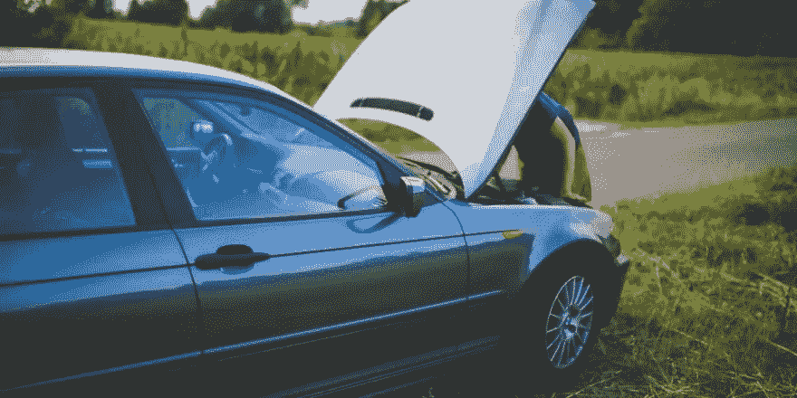
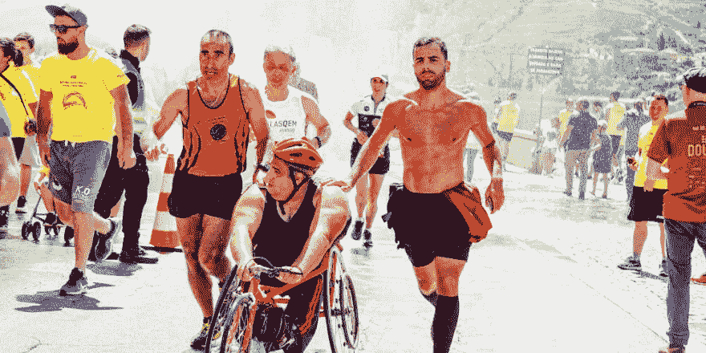
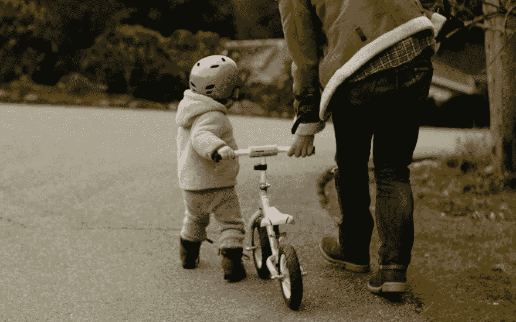

# 关于网页可访问性的神话

> 原文：<https://levelup.gitconnected.com/myths-about-web-accessibility-58b66c74ba1>

## 关于网页可访问性的十个常见误解


Web 可访问性是每个 web 开发项目的必备条件，然而对于许多 web 开发人员来说，它似乎仍然是一个谜。好像这是一种传奇，而不是工作所需的基本技能。

围绕网页可访问性有许多误解，大多数时候是由于缺乏这方面的知识(或兴趣)造成的。本文收集了一些关于可访问性的误解或神话。

内容:

*   可达性很难
*   可及性是昂贵的
*   可访问的网站很难看
*   辅助功能适用于盲人/屏幕阅读器
*   无障碍是为残疾人士而设的
*   自动化测试对于可访问性来说已经足够了
*   可访问性覆盖足以确保网页的可访问性
*   默认情况下，可以访问 HTML
*   没有咏叹调>糟糕的咏叹调
*   偏好减少运动意味着没有运动

# 可达性很难

当项目处于高级阶段且不可及时，我们经常会听到这个术语。“无障碍难！”好像这是一个正当的理由，因为他们正在经历的所有延误。

但事实并非如此。**无障碍并不难。**你知道什么是困难吗？奥林匹克级别的跑步。更有甚者，光是跑步就很难。婴儿需要 12 个月才能开始爬行、行走，最后开始奔跑。这是一个缓慢的过程，需要加强肌肉，获得协调，练习，练习，再练习。


Alt 文字难？试着在 10 秒内跑完 100 米(图片:[安德里亚·皮亚卡迪奥](https://www.pexels.com/photo/young-athletes-preparing-for-running-in-training-hall-3764014/)

另一方面，一个网页开发者可以在几个小时内学会*至少*网页可访问性的基础知识，几天内练习，几周内掌握。当然，他们不会是专家。尽管如此，他们将能够修复和防止 WebAIM 百万报告中强调的许多问题，并避免困扰当今互联网的主要可访问性问题。

显然，网页可访问性不仅仅是基本的东西。学习和掌握更高级的方法需要时间，但在合理的时间内达到足够好的水平是可能的。

# 可及性是昂贵的

时间贵吗？钱贵？他们两个？无论哪种方式，这是一个可疑的声明，在项目结束时可以听到，他们在早期阶段没有考虑网页可访问性…这使得它很昂贵！团队将不得不在事后处理问题，重建解决方案(在某些情况下几乎是从头开始)，这将浪费时间和金钱。如果他们一开始就实现了可访问性，这是可以避免的。

如果你有一辆车，油灯亮了，你就换油。不管是你自己做还是在商店里做，都需要几分钟，而且只需要几美元。然而，如果你不换油，你的引擎很可能会卡住，过一会儿就坏了。修理将花费数百(或数千)美元，并且需要一名机械师使用特殊的工具和零件。更不用说这辆车会停几天或几周。



如果你开着油灯开了 50 英里，不要责怪汽车！(图片: [Kaboompics](https://www.pexels.com/photo/repairing-a-car-6078/) )

**如果你在正确的时间(在项目开始的时候)应用网页可访问性，从长远来看成本会更低，并为团队省去许多麻烦和压力**。但是如果你等到不得不这样做的时候(例如，在用户抱怨或者你被起诉之后)，那么它将是昂贵和痛苦的。此外，这将需要专业人员，而且非常耗时。

考虑到[残疾人拥有 1.3 万亿美元的购买力](https://www.ruhglobal.com/disability-influences-trillion-dollars-david-perez/)(超过 [8 万亿，包括亲戚朋友](https://www.computerworld.com/article/2701645/8-trillion-reasons-to-make-your-technology-accessible.html))，也许是时候停止谈论网页可访问性是一项昂贵的功能，并开始将其作为一项有利可图的功能。

# 可访问的网站很难看

没有什么比这更偏离事实了。易访问性并不能决定一个网站丑不丑。有漂亮的、可访问的网站，也有丑陋的、不可访问的网站。可访问的网站将会像它们被设计的那样丑陋(或美丽)。像其他任何网站一样！

这个流言已经流传很久了。自从网页可访问性成为一件事情(这意味着，基本上从互联网开始)以来，它就已经存在了，它植根于一种误解。以前，可访问性的概念与没有风格、没有动画、没有图像、没有视频……没有任何东西联系在一起。一个乏味、无趣、丑陋的网站。但事实并非如此。

一些可访问性要求确实会限制设计人员和开发人员的创造力(例如，有时找到一个可访问的调色板可能是一个挑战)，但是网上有许多工具可以帮助解决这个问题。另外，不同的标准已经发展到包括许多可访问性特性。

我们需要放弃建立一个网站，然后将其丑化以使其可访问的想法。那是一种老派的心态。易访问的网站从一开始就可以是视觉上引人注目的、生动的、有趣的、互动的网站。优秀的设计师在注入包容性和可访问性方面做得很好。

# 辅助功能适用于盲人/屏幕阅读器

随着最受欢迎的辅助技术被集中在有视觉障碍的人身上，*很容易让人*认为无障碍主要是针对盲人的。

但是还有更多:

*   聋人或聋哑人，
*   使用自动翻页器、自适应铅笔手柄或辅助指针设备的人，
*   前庭失调的人，
*   键盘用户、盲文设备用户、吸喷设备用户等等。

需要网页可访问性的人并不是一个同质的群体。因此，我们不能采用一种一刀切的解决办法，并随其前进。

以不久前发生的网上争议为例:一个盲人组织了一个关于网页可访问性的俱乐部会议。很快，他就遭到了聋人社区的强烈反对，因为俱乐部是一个众所周知的难以接近的平台，而且这个聚会排斥有听力问题的人。

当只关注视觉障碍时，真的有可能谈论可访问性吗？不包括所有相关人员？答案是否定的。

# 无障碍是为残疾人士而设的

这个神话是上述的一个变种。我们已经明确指出，无障碍环境不仅仅是针对盲人的，但我们不能认为它只影响残疾人。其实影响到所有人！

有些[无形的和情境性的残疾](https://userway.org/blog/how-situational-disabilities-impact-us-all)会损害人们，并暂时(甚至永久)限制他们能做的事情。你可以…

*   …打篮球时骨折，无法使用电脑上的鼠标/键盘。
*   …怀孕或有不安分的孩子让你晚上睡不着，然后睡眠不足让你白天无法集中注意力。
*   …耳朵感染，阻碍声音，让你听不到电话。
*   …患有常见的偏头痛，会导致“视力模糊”和注意力不集中。

我们被这样的例子包围着。每天都是。到处都是。注意，你会开始越来越多地注意到它们。



如果我说这些人中有 3 人有残疾。你能告诉我是谁吗？(图片:[跑 4 FFWPU](https://www.pexels.com/photo/group-of-men-running-on-streets-2403057/) )

现在有些人可能会想:

> 那些都是残疾！还有，那太好了…但那不是我。我从未骨折过，我也不打算要孩子，而且我的手机铃声很响……哦，我也会永远年轻。所以网页可访问性对我不适用。

很有信心，但那是错的。即使你是一个完全健康的人，你也可能会发现自己处于网页可访问性对你有帮助的情况。例如，在户外使用你的笔记本电脑，反射光让你无法阅读，难道你不想要更多的对比度吗？在森林里露营和“当一条蛇咬你的时候该怎么办？”文章超时或加载不正确，你不想要一个替代文本来帮助你吗？

还有很多类似的例子:偏远地区的人们，没有先进电脑和电话的人们，因为文本太小无法阅读而向你求助的老奶奶……不要低估网络无障碍的影响。

# 自动化测试对于可访问性来说已经足够了

可访问性的自动化测试是可能的，并且强烈推荐。但是它不能替代手工测试:自动测试只能检测出大约 30%的问题。

即使我们可以用键盘和标签来模拟用户的行为，检查颜色对比或特定的 HTML 结构，仍然有一些测试是我们无法自动化的，也有一些行为是我们无法模拟的。因此，限制了自动化测试的能力。

这并不是说我们应该放弃自动可访问性测试。相反，我们应该拥抱它们，并在我们所有的项目中使用它们。重要的是要记住，它们是补充而不是取代良好的旧的手工测试。

# 覆盖层足以确保网页的可访问性

这在高管和决定购买此类解决方案的人员中更是一种误解。可访问性社区的共识几乎是一致的:覆盖不起作用。[没有一个完全发挥作用](https://overlayfactsheet.com/)。

覆盖图是一种自动化技术，旨在提高网站的可访问性。它可能有许多风格:插件、附加库、工具栏、小部件……但它们的功能是相似的:动态修改页面的源代码*，修复不可访问的代码，用可访问的版本替换它。一些真正诱人的东西，价格适中，只有一行 JavaScript 代码。*

*但是一行 JavaScript 并不能让网站 100%可访问。覆盖层不是万能的魔棒。在某些情况下，结果甚至可能是破坏性的。这一切都只是为了一点点好处，因为残疾人已经在使用一些工具来解决叠加层声称要解决的许多问题。*

*正如我们在上一节中提到的，对于 Web 可访问性，没有一个放之四海而皆准的解决方案。这正是叠加层想要达到的效果。*

*事情可能会改变。虽然目前可访问性覆盖可能不足以确保网页可访问性，但随着人工智能和机器学习的进步，它们可能会在未来成为一种替代选择。但是目前，它们不是一个解决方案。*

# *默认情况下，可以访问 HTML*

*我们多次听到开发人员说，“ *HTML 是开箱即用的*，”似乎 HTML 在字典中的定义是:*

> ****HTML***
> 无障碍。*

*但情况并非总是如此。有些 HTML 元素本身是不可访问的，或者可能会给用户带来挑战。*

*例如，像`[<video>](https://developer.mozilla.org/en-US/docs/Learn/Accessibility/Multimedia)` [或](https://developer.mozilla.org/en-US/docs/Learn/Accessibility/Multimedia) `[<audio>](https://developer.mozilla.org/en-US/docs/Learn/Accessibility/Multimedia)` [这样的元素具有不完全可通过键盘访问的控件](https://developer.mozilla.org/en-US/docs/Learn/Accessibility/Multimedia)，并且这些控件在不同的浏览器之间有很大的差异，从而导致令人沮丧。或者`<input>`元素有许多打开弹出窗口的类型，这可能不是每个人都能访问的。*

*有许多组件和结构不是原生的 HTML 元素(例如，选项卡面板)，一旦我们开始组合 HTML，可访问性问题可能会在交互中出现。*

*《银河系漫游指南》中对 HTML 的定义应该更新为更恰当的定义:*

> ****HTML***
> 大多无障碍。*

*那样看起来好多了，而且肯定更符合现实。*

# *没有咏叹调>糟糕的咏叹调*

*在所有可访问性专家开始叫嚣犯规和诅咒我的名字之前，让我澄清一些事情:**没有咏叹调比糟糕的咏叹调好**。并非所有浏览器/屏幕阅读器都支持 ARIA，它应该是最后的手段。应该尽可能使用语义 HTML。*

*不幸的是，使用语义 HTML 并不总是可行的，也不足以涵盖良好体验所需的所有情况。例如，有些小部件和模式(例如，选项卡面板)不能使用语义元素来完成，在这些情况下，ARIA 是必须的。*

*ARIA(Accessible Rich Internet Applications 的首字母缩写)是 HTML 标记中使用的一组属性，用于使内容更易于访问。它补充了 HTML 元素，并为辅助技术提供了额外的信息，否则这些信息是不可用的。但是，如果开发人员没有正确使用这些属性，他们提供的附加信息可能会令人困惑，并损害用户体验。*

*“没有咏叹调>糟糕的咏叹调”的神话/误解是，它忽略了等式中的一个重要部分:“好的咏叹调”去了哪里？答案其实很简单:*

> ***好的咏叹调>没有咏叹调>不好的咏叹调***

*我们都同意糟糕的咏叹调是糟糕的。但是没有咏叹调也不是理想的:提供糟糕体验(糟糕咏叹调)的解决方案不应该是提供低劣的体验(没有咏叹调)。应该也有不错的体验吧！*

*如果一个孩子正在学骑自行车，挣扎着摔倒了，我们不会告诉他们，“停下来！千万不要骑自行车！”相反，我们教他们。我们鼓励他们不断学习和尝试……直到他们能够自己做到。*

**

*抱歉，提米。你摔过一次。再试一次没有意义。(图片:[塔蒂亚娜·西利科娃](https://www.pexels.com/photo/full-body-of-father-and-child-in-protective-helmet-pushing-bike-along-road-3932890/))*

*“没有咏叹调>糟糕的咏叹调”延续了一个错误的二分法。咏叹调也不错。而我们可以学习咏叹调，练习咏叹调，提高咏叹调……一开始我们不会很好，但随着时间和练习我们会变得更好，提供比没有咏叹调更好的体验。*

# *偏好减少运动意味着没有运动*

*这更多的是开发者基于一种误解的良好意图。我们(包括我自己)找到了一个减少运动的选项，我们“强行”通过它，取消了所有的过渡和动画，就像这样:*

```
*@media (prefers-reduced-motion) {
  *, *::before, *::after {
    animation: none !important;
    transition: none !important;
  }
}*
```

*不是所有的事情都非黑即白。有许多灰色阴影，并不是所有的动画和过渡都不好。[有些比其他的差](https://alistapart.com/article/designing-safer-web-animation-for-motion-sensitivity/)。*

*我们不需要取消网站上的每一个动议。相反，我们需要思考它们，检查什么是合适的，什么是不合适的，并为每个人提供一个扩展的/生动的体验。*

*在另外一次活动中， [Val Head 做了一个关于可访问性和动画的精彩演示](https://aneventapart.com/news/post/making-motion-inclusive-aea-video)。在视频中，她解释了不同的动画和过渡，以及在试图避免引发负面反应时哪些更好:颜色变化，不透明度淡化，小运动…*

*此外，与这个神话相关的是，减少运动不仅仅适用于动画和过渡:当用户选择减少运动时，背景视频、动画 gif 或滚动行为都是需要改变的例子。所以我们不要忘记他们。*

*—*

*感谢[托德·利比](https://twitter.com/toddlibby)、[洛朗·德诺](https://twitter.com/ldenoue)、[克里斯蒂安·迪亚斯](https://twitter.com/ItsCrisDiaz)、[非官方](https://twitter.com/InHuOfficial)和[马切伊·佩兹奇](https://twitter.com/MaciejPedzich)，感谢你们在撰写本文时所有的见解、反馈和(建设性的)批评。*

**原载于 2021 年 9 月 11 日 https://alvaromontoro.com*[](https://alvaromontoro.com/blog/67989/myths-about-web-accessibility)**。***