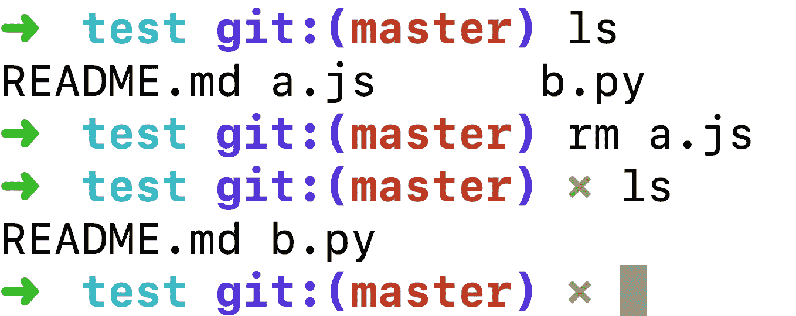
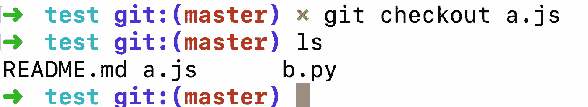
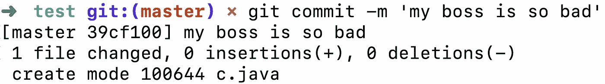
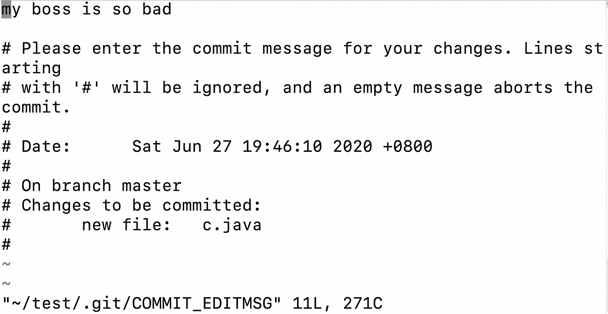
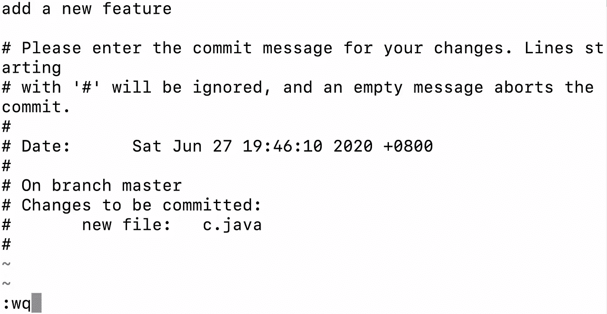
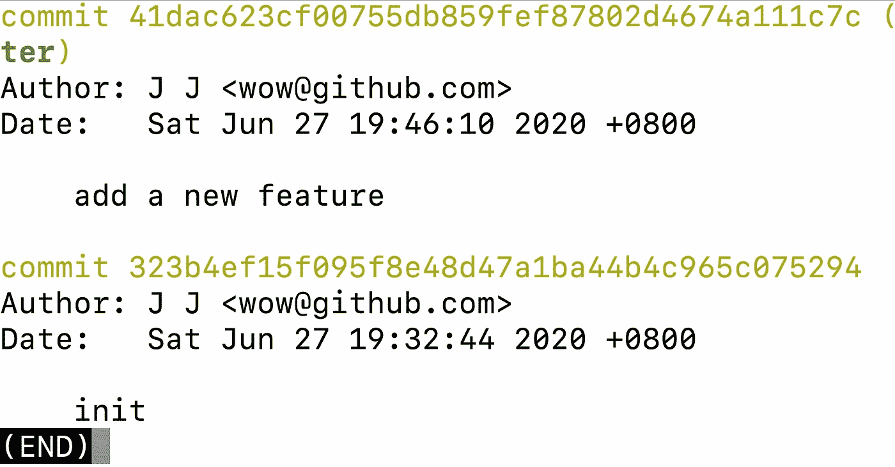
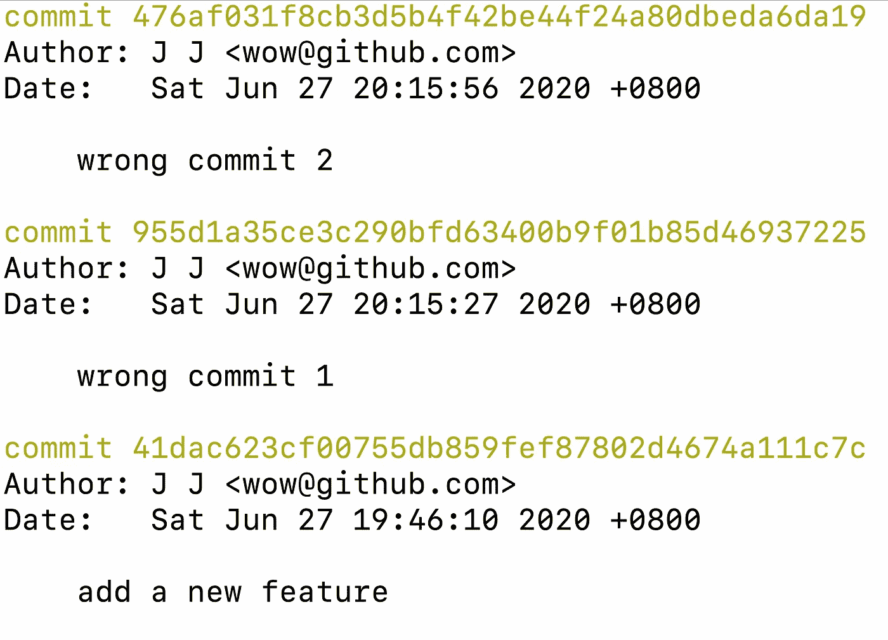
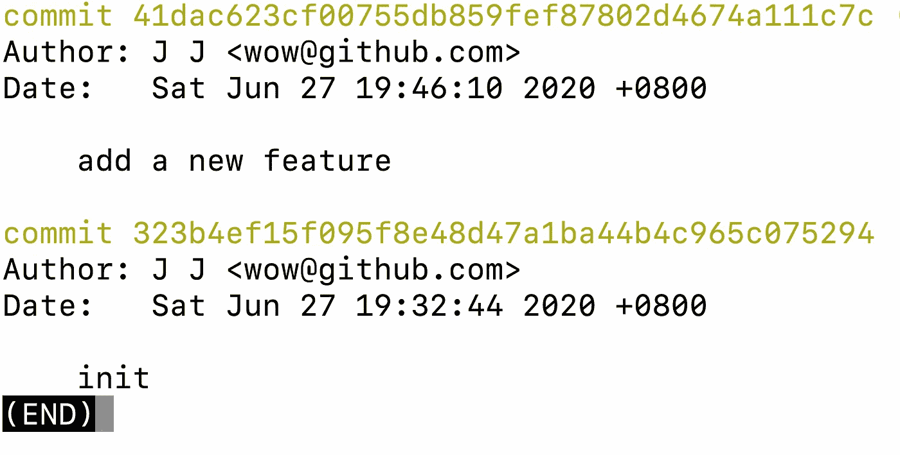
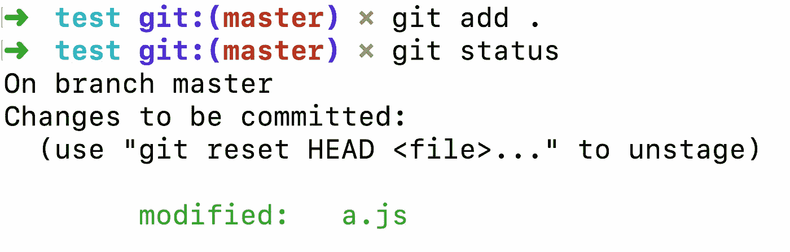
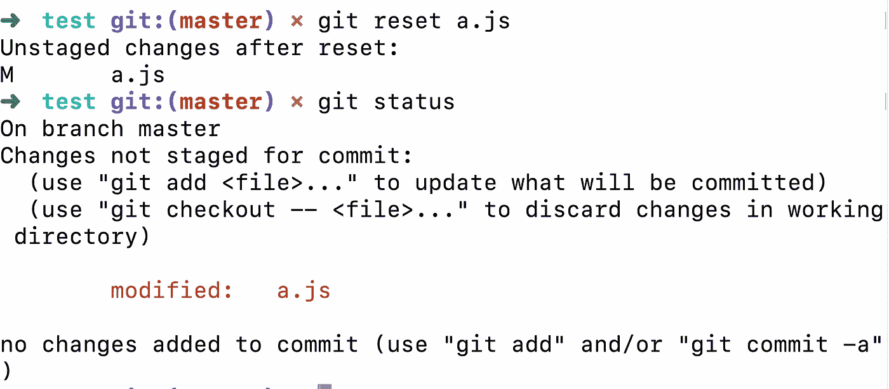

# 在遇到问题之前，我想尽早知道的 4 个 Git 技巧

> 原文：<https://levelup.gitconnected.com/n-git-tricks-id-like-to-know-early-before-i-ran-into-problems-3239c0435026>

## 在问题出现之前解决问题。


[扬西·敏](https://unsplash.com/@yancymin?utm_source=medium&utm_medium=referral)在 [Unsplash](https://unsplash.com?utm_source=medium&utm_medium=referral) 上的照片

Git 是开发人员最常用的工具之一。但是 Git 是一个命令行工具，如果使用不当，会导致各种奇怪的错误。

这里我总结了一些常见问题和解决方法，希望对你有所帮助。

# 恢复删除的文件

在 Git 存储库中，如果我们不小心删除了一个有用的文件，我们如何恢复它？



在上面的例子中，我们无意中删除了`a.js`文件。如果我们想恢复这个文件，我们可以这样做:



```
git checkout <filename/dirname>
```

这个命令撤销我们对文件的任何操作，包括删除操作。

# 修改提交消息

有时候，在我们提交了一个 commit 之后，我们可能会觉得 commit 消息写得不正确，并且想要改变它。我们做什么呢



我们可以使用这个命令来更改提交消息:

```
git commit-amend
```


输入这个命令后，我们进入一个文本编辑界面。



在这里，我们可以修改提交消息。



保存并退出后，如果我们检查提交记录，我们可以看到之前的提交消息已经被修改。



# 撤回提交

在某些情况下，我们可能错误地提交了一个提交，我们可能想要撤销一个或多个提交。我们做什么呢



我们可以使用这个命令来撤销提交:

```
git reset --hard [<commit-id>/HEAD~n>]
```

如果我们想撤销最后两次提交，我们可以这样写:


现在让我们检查提交信息，我们可以看到前两次提交已经被撤回。



# 提交前撤消“git add”

假设我们在修改一个文件后不小心使用了`git add .`命令。你可以看到 git 的 stage 区域已经记录了这个变化，即使你把文件恢复到原来的状态，也无法撤销这个变化。



如果要撤消更改，可以使用以下命令:

```
git reset <file>
```



如我们所见，修改记录已被取消。