# 自然语言处理任务中的朴素贝叶斯分类

> 原文：<https://levelup.gitconnected.com/naive-bayes-classification-in-nlp-tasks-from-scratch-17ac3aab1254>

## 关于如何从头开始在 NLP 任务中应用朴素贝叶斯分类的演练教程。


Unsplash 上的图像

在本教程中，我们将获得每个单词以及整个主题行的贝叶斯得分。分数将指示主题行和/或令牌是“垃圾邮件”的可能性。你可以在这里找到数据集[。我们在](https://drive.google.com/file/d/1A9k6fF8a1ND1v6cTIWQuPWSQMAhIZwMV/view)[垃圾邮件检测器教程](https://predictivehacks.com/example-of-a-machine-learning-algorithm-to-predict-spam-emails-in-python/)中使用了相同的数据集，因此可以随意比较贝叶斯方法和逻辑回归。

**加载库**

```
import pandas as pd 
import numpy as np 
import re from collections 
import Counter import string
```

# 理论和公式

那么，如何训练一个朴素贝叶斯分类器呢？

*   训练朴素贝叶斯分类器的第一部分是确定您拥有的类的数量。
*   您将为每个类创建一个概率。P(Dpos)是文档为正的概率。P(Dneg)是文档为负的概率。
    使用如下公式，并将值存储在字典中:

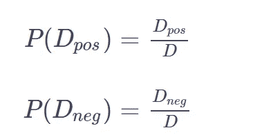

其中 D 是文档或主题行的总数，Dpos 是正 SL 的总数，Dneg 是负 SL 的总数。

**先验和对数先验**

先验概率代表目标人群中 SL 为正对负的潜在概率。换句话说，如果我们没有具体的信息，盲目地从人群中挑选出一个 SL，那么它是正的还是负的概率是多少？那就是“先验”。

先验是概率的比率

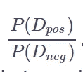

我们可以用先验的对数来重新标度，我们称之为对数先验

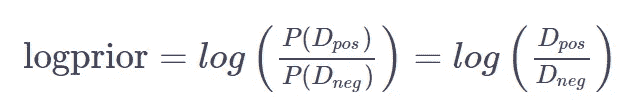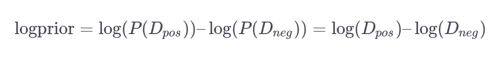

**一个词的正负概率**

为了计算词汇表中特定单词的正概率和负概率，我们将使用以下输入:

*   **freq_pos** 和 **freq_neg** 是该特定单词在正类或负类中的频率。换句话说，一个词的正频率就是这个词被计数的次数，其标签为 1。
*   **N_pos** 和 **N_neg** 分别是所有文档(所有 SLs)的正、负词总数。
*   **V** 是整组文档中唯一单词的数量，对于所有的类，无论是正面的还是负面的。

我们将使用这些来计算特定单词的正概率和负概率，公式如下:

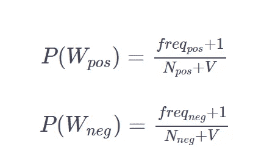

请注意，我们在加法平滑的分子中添加了“+1”。这篇[维基文章](https://en.wikipedia.org/wiki/Additive_smoothing)解释了更多关于加法平滑的内容。

**对数可能性**

为了计算同一个单词的对数似然性，我们可以实现以下等式:

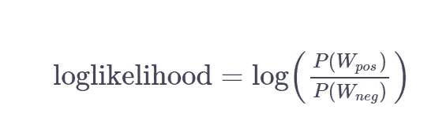

每个 SL 的总概率为:

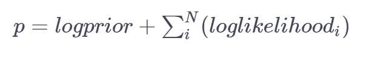

# 编码

让我们通过构建上面的公式来弄脏我们的手。

```
# load the data and set the spam=1 and ham=0
# convert the text into lower case and remove the puncuations
df = pd.read_csv("spam.csv")
df['target'] = df.target.map({'spam':1, 'ham':0})
df['text'] = df.text.apply(lambda x:x.lower())
df['text'] = df.text.apply(lambda x:x.translate(str.maketrans('', '', string.punctuation)))
df
```

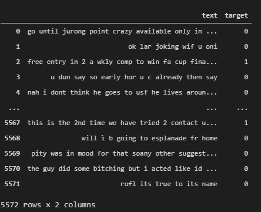

```
# Get the V Freq
V_freq = Counter(" ".join(df['text'].values.tolist()).split(" "))# Get the V
V = len(V_freq.keys())# get the freq_pos
freq_pos = Counter(" ".join(df.loc[df.target==1]['text'].values.tolist()).split(" "))# get the freq_neg
freq_neg = Counter(" ".join(df.loc[df.target==0]['text'].values.tolist()).split(" "))# get the number of positive and negative documents
D_pos = sum(df.target==1)
D_neg = sum(df.target==0)# get the number of unique positive and negative words
N_pos = len(freq_pos.keys()) 
N_neg = len(freq_neg.keys())logprior = np.log(D_pos/D_neg)def word_loglikelihood(w):
    w = w.lower()
    if w in V_freq:
        p_w_pos = (freq_pos.get(w,0)+1 / (N_pos+V))
        p_w_neg = (freq_neg.get(w,0)+1 / (N_neg+V)) 
        return np.log(p_w_pos/p_w_neg)
    else:
        return(0)
```

我们来看看一些词的得分，比如“**讨喜**”、**自由**”。

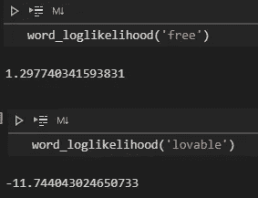

我们可以看到，“免费”这个词的得分很高(> 0)，这意味着这个词与垃圾邮件更相关。相反，“讨喜”这个词得分很低(<0) which means that this word is not related to spam emails.

Let’s create a function that returns the score of the whole subject line by adding up the word likelihood of each word plus the logprior.

```
def text_loglikelihood(mytxt):
    mytxt = mytxt.lower().split(" ")
    score = logprior
    for w in mytxt:
        score+= word_loglikelihood(w)
        # print(w,word_loglikelihood(w))
    return(score)
```

Get the score of the first SL from our data frame:

```
text_loglikelihood(df.iloc[0]['text'])
```

We get:

```
-107.49288547485799
```

which implies that this SL is more likely to be Ham.

# Make Predictions

Let’s say that we want to make predictions for all the SL. We will add two columns. The 【 and the label of the prediction by taking values 0 and 1, where 1 is when the score is positive and 0 otherwise.

```
df['score'] = df.text.apply(lambda x:text_loglikelihood(x)) df['prediction'] = df.score.apply(lambda x:int(x>0)) # confusion matrix df.groupby(['target','prediction']).size().reset_index()
```

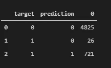

Finally, the accuracy on the train dataset is 99.5%

```
np.mean(df.target==df.prediction)
```

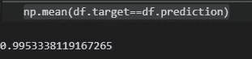

*原载*[*https://predictivehacks.com*](https://predictivehacks.com/naive-bayes-classification-in-nlp-tasks-from-scratch/)*)。*