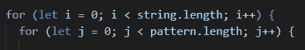

# 朴素模式搜索

> 原文：<https://levelup.gitconnected.com/naive-pattern-search-78bb4a8b8315>

**简单模式搜索**是一种在字符串中搜索特定模式或子字符串的方法。它通过检查模式字符串中的所有字符来做到这一点。在本文中，我们探索了一种使用 JavaScript 实现它的方法。

假设我们想找出一个模式在一个字符串中出现的次数。我们的函数必须接受两个参数:我们要搜索的**字符串**和我们要在主字符串中搜索的由**模式**组成的字符串。设置为计数器的变量也需要在函数的开头定义。

我们从迭代第一个字符串开始，在这个循环中，我们将迭代第二个字符串(模式)。

第二个 *for* 循环的目的是遍历我们的模式，逐个字母地比较，看它是否与字符串匹配。我们从字符串的第一个字符开始。如果它确实匹配我们模式的第一个字符，我们就继续。这个想法是不断检查，直到满足两个条件:

1.  字符不匹配，在这种情况下，我们将不得不跳出循环，继续前进到字符串的下一个字符(由于字符不匹配，这次迭代将不会产生我们的模式的一个实例)。
2.  我们已经达到了模式的长度，因此所有的字符都匹配，我们在字符串中找到了模式的一个实例。在这种情况下，我们将增加我们的计数器。

这就是逻辑的样子:

从这里开始，我们可以简单地在函数的末尾返回计数器，给出模式在字符串中出现的次数。

我们天真的搜索功能

这个函数的时间复杂度是 O( *n * m* ，其中 *n* 是字符串的长度， *m* 是模式的长度。此外，该函数假设模式的长度小于字符串的长度。如果我们想检查边缘情况，我们必须检查以确保模式的长度确实小于函数开头的字符串的长度。