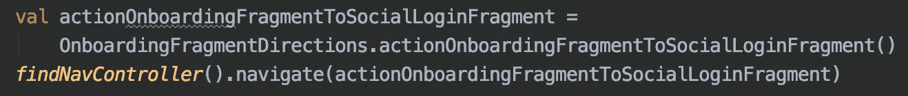

# 命名惯例:较长名称的情况

> 原文：<https://levelup.gitconnected.com/name-convention-the-case-for-longer-names-64c6064d6b5e>

编码是那些奇怪的情况之一，矮通常是最好的……我的意思是，谁不想变得*更高……更大……更长*？

但是当谈到编码的**命名约定**时，我们有一个合法的例子，你可以说*“重要的不是大小，而是你如何使用它！”*不会彻底损害你的声誉。


https://unsplash.com/photos/Z5ViTNhtPRs—[查尔斯·德鲁维奥](https://medium.com/u/35c346c25491?source=post_page-----64c6064d6b5e--------------------------------)在 Unsplash

好吧，让我们认真点。

许多开发人员选择更短的变量和方法名称，因为它们更容易阅读——我同意这一点。

但是让我们记住**我们写代码是为了让其他人理解**，如果另一个人阅读它时需要输入一个方法或类并理解它做什么，那么你的简称就像胡言乱语一样。

比如: *closePiP* 和 *closePictureInPicture* 哪个更好？

两者都很容易阅读，但是第一个**只对已经知道你的应用程序中存在画中画**的人有意义。

**第二个是可搜索的**:一个新加入你的团队的开发者可能会 *ctrl+f'ing* 与画中画相关的东西，它会错过那个该死的 pip。

这也适用于那些不知道代码所代表的概念的开发人员，*谷歌一下*画中画会给我一个准确的结果，但是 pip 不会。我甚至不想想象任何类似于*管道*的东西会在图像上显示什么…

所以，**不要为了使它更短而缩写特定领域的东西**。

让我们以下面的代码片段作为案例研究。

它展示了如何使用*导航组件*在 *android* 上进行屏幕间导航。



第一行是给第二行方法返回的变量名建议 *Android Studio* 。

让我们通过将变量名缩短为 *navigateToSocialLogin* 来改进它，这使得**更短，更容易阅读，同时仍然是描述性的**。

第二行给出了*OnboardingFragmentDirections*，这是一个自动生成的类，包含我的 Onboarding 屏幕的所有导航操作，然后是*actionOnboardingFragmentToSocialLoginFragment*，这是一个自动生成的方法，用于从 OnboardingFragment 导航到 SocialLoginFragment。

我们不能改变它，因为它是自动生成的，但是如果我们在谷歌 工作，我们如何改进它？

*Fragment* 是 android 中使用的一个类，主要用于包含和表示应用程序的屏幕(尽管它也可以用于其他东西)。

保留它是有意义的，有人可能不知道 Onboarding 是一个特定的屏幕， *Fragment* 是一个清楚的指示，任何开发 android 代码的人都会很快了解到 Fragment 是“屏幕”的同义词，所以特定于领域在这里不是一个真正的问题。

现在，*动作*没有告诉我们任何事情，我们需要整个上下文来理解*动作*，在这种情况下，意味着*from onboardingfragment to social login fragment—*，这将是我们为我们的方法选择的名称。

在第三行，我们有 *findNavController* ，Android 的平台方法，用于获取负责导航的类。

这里的缩写不会造成很多问题:

*   从*导航*派生*导航*是很常见的
*   任何想要导航的人都会先点击导航

但是它真正带来了什么价值呢？节省七个字母？

实际上，我会说这对你的项目中良好的命名约定文化是有害的，因为这是无价值缩写的先例。

我们将以以下内容结束:

```
val toSocialLoginFragment = OnboardingFragmentDirections.fromOnboardingFragmentToSocialLoginFragment()
findNavigationController().navigate(toSocialLoginFragment)
```

总结:

1.名字要表达意图；

2.不要使用特定领域的缩写

3.现在你可以考虑长度了😏