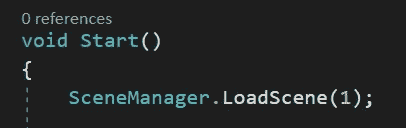

# 名称空间

> 原文：<https://levelup.gitconnected.com/namespaces-fcc82e0f0b1a>

什么是*名称空间*，它们是做什么的？让我们在本文中探索这个分层助手。

*名称空间*是事物层次结构中*类*的下一级。就像你可以使用不同的*类*来组织和存储*函数*一样，名称空间是用来组织整个代码库的。*代码库*是不同*类的集合，*所以当你移动到命令链的顶端*时，你可以看到层次结构是如何进行的。*即使您对编码比较陌生，您也可能已经遇到过名称空间。让我们看一些例子，这样我们就可以直观地了解名称空间到底是什么以及它们做什么。

当在可视化脚本程序中使用 *intellisense* 时，用户在键入时会看到可用的关键字*选项*。如果没有*名称空间*根据需要将它们分成不同的组，选项的数量绝对会是压倒性的。

**Unity 名称空间**

如果你曾经使用过 Unity，你可能会在一个*类*的顶部看到*使用 Unity 引擎*命名空间，让我们就是让我们从 *Mono 行为*继承的*类*。退一步说，Mono 行为使用户能够将脚本附加到游戏对象上。

当我在这里使用 Unity Engine 命名空间注释掉*时，您会看到现在有一个错误，因为 *Mono 行为*不再可用。我也失去了使用关键字*序列化字段*的能力。*

如果我尝试键入关键字*图像*，我得到一个*错误*。

这是因为 Image 关键字需要使用 *UnityEngine。UI* 名称空间。

同样，当试图在*时间线*中访问一个*可播放的*时，我需要使用一个名称空间。

一旦我用 UnityEngine 输入*。时间线*，错误消失，访问被授权。

另一个例子是尝试用 *LoadScene* 关键字加载场景。

为了访问这个，我需要使用 using *UnityEngine。场景管理*名称空间。

**冲突的类名**

使用*名称空间*的一个最重要的方面是避免类名*冲突*，这在使用具有通用名称的*类*时会发生。你可以*而不是*在单个项目中拥有多个*职业*拥有相同的*名称*、*、*而不会出现游戏中断错误。使用*名称空间*来划分这些冲突的类名，是这个问题的解决方案。

假设我下载了一个第三方播放器*包*，里面有一个脚本叫做*播放器*。如果项目中已经有我自己的玩家脚本，我会抛出一个编译器*错误*。

正如这里看到的，Unity 告诉我它已经有了玩家*的定义。我们如何解决这个问题？使用新的*命名空间*！*

让我们转到位于*玩家资产*文件夹中的*玩家*脚本。只需用关键字*命名空间*来声明它，然后给它一个名字！我把这个叫做 *MyPlayerPackage* ，然后打开一些*花括号*。包中的整个*播放器*类被移动到*名字空间声明后的*花括号中。现在，两个播放器脚本被一个名称空间分隔开，不会再引起冲突。

检查控制台告诉我编译器*错误*已经消失，我可以自由使用两个*播放器*脚本。

为了从包中访问*播放器*脚本，我需要在这个*类*的顶部使用那个包的*名称空间*。在这种情况下，使用 MyPlayerPackage 的是*。*

现在，我可以通过键入名称空间 *MyPlayerPackage* ，后跟*点符号*和*播放器*来访问播放器包。

*myPlayer* 变量也可以被*初始化*。

如果你想进一步*组织*你的包脚本，你可以使用进一步的*点符号*并提供关于你正在使用的资产类型的更具体的文字描述。MyPlayerPackage。战士，将使我能够把我所有的战士玩家放入这个*命名空间*。

然后被声明的 *myWarriorPlayer* 可以再次被*初始化*。

如果你有一个制作大型*资产库*的工作室，你可以定制你的名称空间，只要你想让你提供的资产更加具体。我在这里使用了通用名称来说明您可以在自己的名称空间中使用什么。

那么您所需要的就是使用关键字的*，然后是适当的名称空间。*

和往常一样，你可以在准备好的时候初始化变量。

感谢阅读！