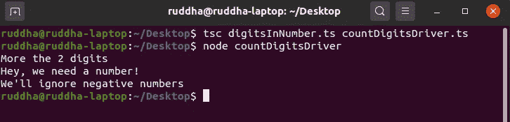

# TypeScript 中的命名空间

> 原文：<https://levelup.gitconnected.com/namespaces-in-typescript-7bab2fa31d75>

您可能在使用 TypeScript 时遇到过术语“命名空间”。您可能想知道名称空间到底是什么？我们将讨论名称空间的基本概念，以及如何使用它们来编写高效的代码。


使用 TypeScript

> 名称空间是标识符的上下文，是程序中使用的名称的逻辑分组。

MDN Web Docs 的这个定义是对名称空间的一个很好的定义。我们应该知道命名空间并不是 TypeScript 的专有概念。像 C++和 Python 这样的语言也有名称空间。然而，在这个故事中，我们将通过记住 TypeScript 来讲述名称空间。

## 先决条件

这篇文章假设你知道如何使用 TypeScript 的基础知识。对我们的代码做了一些小的解释，但是没有详细说明。

此外，如果您已经安装了 Node.js 和 TypeScript，这将很有帮助。你可以试试网上的[打字稿游乐场](https://www.typescriptlang.org/play/index.html)。但是最好使用 Node.js 执行 TypeScript。

你可以参考以前的故事[迈向打字稿的第一步](https://medium.com/@ruddha2001/first-step-towards-typescript-cb14e1b5728f)来学习如何开始打字稿。

## 声明名称空间

声明名称空间的关键字是，嗯，*“名称空间”。*语法如下

```
namespace <name_of_your_space> {
// namespace members go here
}
```

我们将使用标识符" *DigitsInNumber* "声明一个名称空间，并将定义一些我们将在一个单独的文件中使用的函数。

让我们将代码分解成更简单的步骤。

**步骤 1** :我们声明一个名为“ *DigitsInNumber* 的名称空间。我们希望在另一个文件中使用这个名称空间，所以我们将使用 *export* 关键字导出它。

**步骤 2** :我们定义一个函数 *isNumber()* ，它接受一个名为 *value 的参数。*我们不会在文件之外的任何地方直接使用这个函数，所以我们不会导出它。我们只是用参数*值*返回 *isNaN()* 的取反值。

如果*值*不是数字， *isNaN(value)* 将返回真值。否定这一点将导致结果*为假*。所以我们的 *isNumber()* 函数将接受一个值，使用[内置的 *isNaN()* 函数](https://developer.mozilla.org/en-US/docs/Web/JavaScript/Reference/Global_Objects/isNaN)检查它是否是一个数字，并相应地返回一个布尔结果。

**步骤 3** :我们现在定义一个函数，我们将使用它来计算位数。我们将在一个外部文件中需要这个函数，我们将使用*导出*来导出 *countDigits()* 函数。

我们将调用我们的 *isNumber()* 函数来检查我们的值是否是一个数字。然后我们将继续检查它是一位数、两位数还是两位数以上。为了简单起见，我们将忽略所有的负数。根据条件逻辑的结果，返回适当的字符串。

**导入和使用我们的名称空间**

现在我们已经准备好了名称空间，让我们使用它吧！为此，我们将创建一个单独的文件" *countDigitsDriver.ts"* ，我们将使用它来运行我们的代码。

我们将名称空间导入为

```
import {<name>} from “location”
```

所以我们做*从”导入{DigitsInNumber}。/digitsInNumber.ts"* 来导入我们的命名空间。请注意，只有导出的名称空间成员才能在外部文件中使用。因此，虽然我们可以在这里完美地使用 *countDigits()* 函数，但是我们将无法访问 *isNumber()* 函数，因为它没有被导出。

使用名称空间成员的语法是

```
nameSpaceName.functionName()
```

我们使用不同的参数调用我们的*digitsinnumber . count digits()*函数，并使用 *console.log()* 来打印我们的输出。现在，是时候看看我们的代码是如何运行的了。

## 编译和执行

我们将要求 TypeScript 编译器将我们的 TypeScript 代码编译成 JavaScript，以便我们可以使用 Node.js 来运行我们的代码。我们将输入命令*TSC digits number . ts count digits driver . ts*来编译代码。我们将使用*节点 countDigitsDriver.ts* 来执行它。

如果一切顺利，我们应该看到我们预期的输出。



使用 Node.js 执行 countDigitsDriver 时的预期输出

## 结论

我们已经成功地定义、导出和使用了一个名称空间。我们学习了如何只导出命名空间中选定的成员。我们还学习了如何正确使用名称空间的成员。

在接下来的几周里，我们将会在 TypeScript 中看到一些更棒的概念。敬请关注，注意安全。再见。

## 更远的前方

如果您想了解更多关于名称空间之类的东西，这里有一些有用的资源。

*   [维基百科中的名称空间](https://en.wikipedia.org/wiki/Namespace)
*   [名称空间—类型脚本文档](https://www.typescriptlang.org/docs/handbook/namespaces.html)

[](https://skilled.dev) [## 编写面试问题

### 编码面试课程。

技术开发](https://skilled.dev)