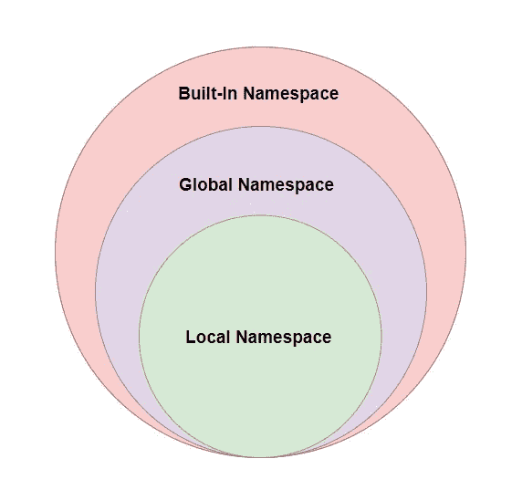

# 名称空间和作用域:Python 中的一堂简单课

> 原文：<https://levelup.gitconnected.com/namespaces-scopes-an-easy-lesson-in-python-13d654a95ee>

Python 是一种面向对象的编程语言。Python 中的一切都是对象，每个对象都有其属性和方法。


照片由 [Hitesh Choudhary](https://unsplash.com/@hiteshchoudhary?utm_source=medium&utm_medium=referral) 在 [Unsplash](https://unsplash.com?utm_source=medium&utm_medium=referral) 上拍摄

# 什么是名称空间？

正如 Python 文档中所定义的:

N命名空间是从名字到对象的映射。

当我们在 Python 中定义对象时，这些对象的名称保存在字典中。

这个字典是一个名称空间。

该字典的*键*是定义对象的名称，而*值*是这些名称引用的对象。

我们举个例子。

我们定义了两个变量叫做`firstName` & `lastName`(记住这些也是对象)。

```
firstName = 'Ashish'
lastName = 'Bamania'
```

为了了解 Python 如何将它们存储在名称空间中，我们将使用`globals`函数。

```
print(globals())
```

其输出将是:

```
{'__name__': '__main__', 'firstName': 'Ashish', 'lastName': 'Bamania'}
```

> 注意，`'__name__' : ‘__main__'`表示应用程序入口点所在环境的名称是`__main__`

你想知道我们从哪里得到的 `**globals**` **函数吗？**来说说吧。


克里斯·里德在 [Unsplash](https://unsplash.com?utm_source=medium&utm_medium=referral) 上拍摄的照片

# 命名空间的类型

命名空间是在不同的时间创建的，具有不同的生存期。

有三种类型的名称空间:

*   内置名称空间
*   全局名称空间
*   本地名称空间



名称空间的类型(按作者分类的图像)

## 内置名称空间

这是名称空间的最高级别。

它是在 Python 解释器启动时创建的，永远不会终止。

要查看这个名称空间的组成，请使用:

```
print(dir(__builtins__))
```

该命令的输出是:

```
['ArithmeticError', 'AssertionError', 'AttributeError', 'BaseException', 'BlockingIOError', 'BrokenPipeError', 'BufferError', 'BytesWarning', 'ChildProcessError', 'ConnectionAbortedError', 'ConnectionError', 'ConnectionRefusedError', 'ConnectionResetError', 'DeprecationWarning', 'EOFError', 'Ellipsis', 'EncodingWarning', 'EnvironmentError', 'Exception', 'False', 'FileExistsError', 'FileNotFoundError', 'FloatingPointError', 'FutureWarning', 'GeneratorExit', 'IOError', 'ImportError', 'ImportWarning', 'IndentationError', 'IndexError', 'InterruptedError', 'IsADirectoryError', 'KeyError', 'KeyboardInterrupt', 'LookupError', 'MemoryError', 'ModuleNotFoundError', 'NameError', 'None', 'NotADirectoryError', 'NotImplemented', 'NotImplementedError', 'OSError', 'OverflowError', 'PendingDeprecationWarning', 'PermissionError', 'ProcessLookupError', 'RecursionError', 'ReferenceError', 'ResourceWarning', 'RuntimeError', 'RuntimeWarning', 'StopAsyncIteration', 'StopIteration', 'SyntaxError', 'SyntaxWarning', 'SystemError', 'SystemExit', 'TabError', 'TimeoutError', 'True', 'TypeError', 'UnboundLocalError', 'UnicodeDecodeError', 'UnicodeEncodeError', 'UnicodeError', 'UnicodeTranslateError', 'UnicodeWarning', 'UserWarning', 'ValueError', 'Warning', 'WindowsError', 'ZeroDivisionError', '__build_class__', '__debug__', '__doc__', '__import__', '__loader__', '__name__', '__package__', '__spec__', 'abs', 'aiter', 'all', 'anext', 'any', 'ascii', 'bin', 'bool', 'breakpoint', 'bytearray', 'bytes', 'callable', 'chr', 'classmethod', 'compile', 'complex', 'copyright', 'credits', 'delattr', 'dict', 'dir', 'divmod', 'enumerate', 'eval', 'exec', 'exit', 'filter', 'float', 'format', 'frozenset', 'getattr', 'globals', 'hasattr', 'hash', 'help', 'hex', 'id', 'input', 'int', 'isinstance', 'issubclass', 'iter', 'len', 'license', 'list', 'locals', 'map', 'max', 'memoryview', 'min', 'next', 'object', 'oct', 'open', 'ord', 'pow', 'print', 'property', 'quit', 'range', 'repr', 'reversed', 'round', 'set', 'setattr', 'slice', 'sorted', 'staticmethod', 'str', 'sum', 'super', 'tuple', 'type', 'vars', 'zip']
```

这个名称空间包括 Python 中默认可用的所有函数。

你不需要导入任何模块来使用这些函数(`max`、`str`、`dir`、`print`等等)。

这也包括例外(`NameError`、`AssertionError`等)。)以及像`True`、`None`和`False`这样的值。

## 全局名称空间

它是内置命名空间之后的下一级命名空间。

它在主程序开始执行时创建，一直持续到程序执行完毕/解释程序退出。

当我们定义一个对象(变量/函数)时，它被存储在全局名称空间中。

让我们定义几个变量和一个函数。

```
firstName = 'Ashish'
lastName = 'Bamania'def print_name(firstName, lastName):
    return firstName + ' ' + lastName
```

我们可以使用`globals`函数(从内置名称空间)访问全局名称空间中的值。

`print(globals())`的输出为:

```
{'__name__': '__main__', '__doc__': None, '__package__': None, '__loader__': <class '_frozen_importlib.BuiltinImporter'>, '__spec__': None, '__annotations__': {}, '__builtins__': <module 'builtins' (built-in)>, '**firstName**': 'ashish', '**lastName**': 'bamania', '**print_name**': <function print_name at 0x0000026ED74A3E20>}
```

## 本地名称空间

这是名称空间的最低/最深层次，是为每个函数创建的。

本地命名空间是在调用函数时创建的，当函数返回或引发函数内未处理的异常时删除。

让我们用两个局部变量`str`和`name`创建一个函数。

我们将使用`locals()`函数(来自内置名称空间)来访问这个函数的本地名称空间中的值。

```
def say_hi():
    str = "Hi"
    name = "Ashish"
    print(str + " " + name + !)
    print(locals()) 
```

调用此函数时的输出是:

```
Hi Ashish!{'**str**':'Hi','**name**':'Ashish'}
```

> 注意，如果我们在函数的上下文之外执行`locals`函数，它将充当`globals`函数。

请记住，当我们编写递归函数或嵌套函数时，每个函数执行都有自己的本地名称空间。

让我们继续讨论示波器！


由[乌列尔·索伯兰斯](https://unsplash.com/@soberanes?utm_source=medium&utm_medium=referral)在 [Unsplash](https://unsplash.com?utm_source=medium&utm_medium=referral) 上拍摄的照片

# 什么是示波器？

根据 Python 文档，

SS*cope*是 Python 程序的一个文本区域，其中可以直接访问名称空间。

简单地说，当我们有多个名称空间时，作用域是一种检查名称空间中的对象并找到其值的机制。

首先，在不同名称空间中定义的变量只能从特定的作用域中访问。

# 范围的类型

有四种类型/级别的范围。这些是:

*   内置范围
*   全球范围
*   封闭范围
*   局部范围

让我们自下而上地学习:

## 局部范围

这是最里面的作用域。

它是在调用函数时创建的，并提供对本地名称空间中定义的本地对象的访问。

对于下面定义的函数，`greeting`是`greet`函数的本地名称空间中的一个变量。

```
def greet():
    greeting= "Hello!"
    print(greeting)
```

当我们从函数外部调用`print(greeting)`时，我们得到以下错误:

```
NameError: name 'greeting' is not defined
```

这是因为`print(greeting)`无权访问本地范围/本地名称空间。

## 封闭范围

这是在一个函数中定义的作用域，该函数中有一个嵌套函数。

它允许内部/嵌套函数访问外部/封闭函数中的所有对象。

看看下面的例子。

```
def func_outer():
    value_outer = 1

    def func_inner():
        value_inner = 2
        **print(value_outer)** func_inner()func_outer()
```

这将输出到`1`。

再看一个例子。

```
def func_outer():
    value_outer = 1
    **print(value_inner)
**    
    def func_inner():
        value_inner = 2 func_inner()func_outer()
```

这将输出到:

```
NameError: name 'value_inner' is not defined
```

## 全球范围

这是局部范围和封闭范围之上的范围级别。

在全局命名空间中定义的所有对象都可以在程序中的任何地方被访问，因为它们在全局范围内。

```
firstName = "ashish"
lastName = "bamania"def print_firstName():
    print(firstName)print_firstName()
```

这将输出到`ashish`。

## 内置范围

这是最高级别的作用域，允许访问内置名称空间中的函数/异常和值。

例如，您可以在程序中的任何地方使用`print`函数，因为内置作用域可以访问内置名称空间。


照片由 [Dzmitry Tselabionak](https://unsplash.com/@tsellobenok?utm_source=medium&utm_medium=referral) 在 [Unsplash](https://unsplash.com?utm_source=medium&utm_medium=referral) 上拍摄

# LEGB 规则和范围解析

> LEGB=本地、封闭、全局和内置

此规则定义如何在名称空间中搜索对象。

据此，Python 解释器将首先搜索最低/最深级别(本地名称空间)中的对象，并且总是向上移动以搜索更高的名称空间(按照 LEGB 的顺序)。

> 因此，**最低/最深的名称空间可以访问上面名称空间中的所有对象。**

这个过程被称为**范围解析**。

在这里阅读更多关于名称空间和作用域的信息:

 [## 9.类- Python 3.10.6 文档

### 类提供了一种将数据和功能捆绑在一起的方法。创建一个新类会创建一个新类型的对象…

docs.python.org](https://docs.python.org/3/tutorial/classes.html#python-scopes-and-namespaces) [](https://www.w3schools.com/python/python_scope.asp) [## Python 范围

### 变量只能在创建它的区域内使用。这就叫范围。在…内部创建的变量

www.w3schools.com](https://www.w3schools.com/python/python_scope.asp) [](https://www.geeksforgeeks.org/namespaces-and-scope-in-python/) [## Python - GeeksforGeeks 中的名称空间和范围

### 名称空间是 Python 中每个对象都有唯一名称的系统。一个对象可能是一个变量或一个…

www.geeksforgeeks.org](https://www.geeksforgeeks.org/namespaces-and-scope-in-python/) 

非常感谢你阅读这篇文章！

[](https://bamania-ashish.medium.com/membership) [## 通过我的推荐链接加入 Medium-Ashish Bama nia 博士

### 阅读 Ashish Bamania 博士(以及 Medium 上成千上万的其他作家)的每一个故事。您的会员费直接…

bamania-ashish.medium.com](https://bamania-ashish.medium.com/membership) 

# 分级编码

感谢您成为我们社区的一员！在你离开之前:

*   👏为故事鼓掌，跟着作者走👉
*   📰查看[级编码出版物](https://levelup.gitconnected.com/?utm_source=pub&utm_medium=post)中的更多内容
*   🔔关注我们:[推特](https://twitter.com/gitconnected) | [LinkedIn](https://www.linkedin.com/company/gitconnected) | [时事通讯](https://newsletter.levelup.dev)

🚀👉 [**加入升级人才集体，找到一份惊艳的工作**](https://jobs.levelup.dev/talent/welcome?referral=true)