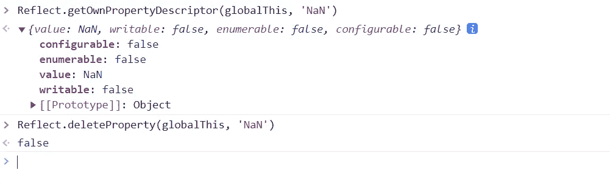
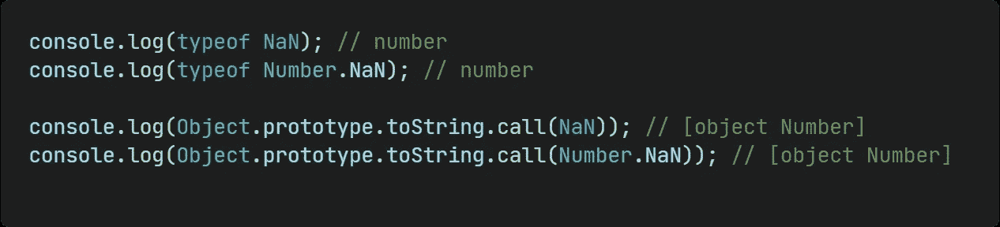
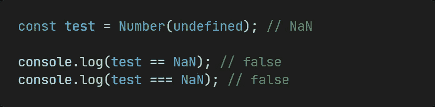
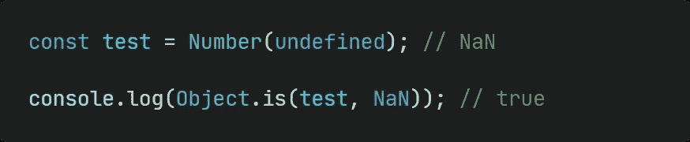
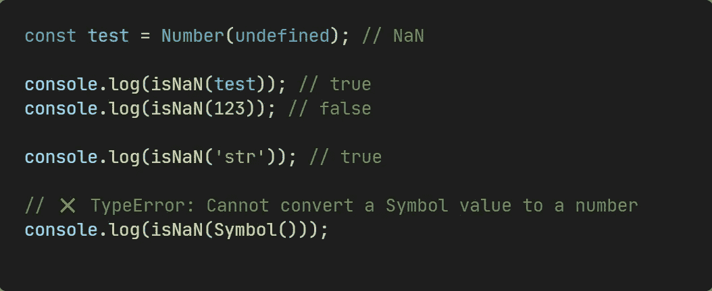
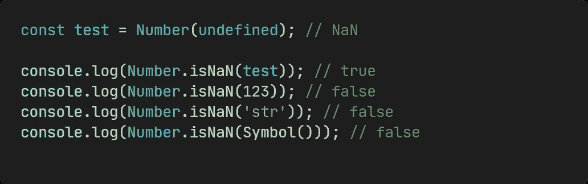
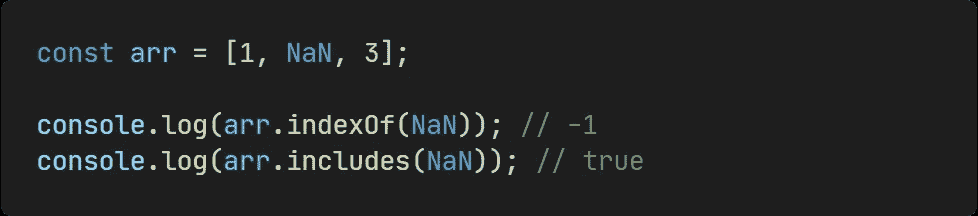

# 你可能不知道

> 原文：<https://levelup.gitconnected.com/nan-you-may-not-know-199616e1a277>

## JavaScript 中‘南’的秘密。


作者图片

本文将带你了解 JavaScript 中`NaN`的秘密，让我们开始吧！

# 南是谁？

`NaN`是一个全局属性，表示**的值，而不是数字**。



当我们使用`Reflect.getOwnPropertyDescriptor`获取`NaN`的属性描述符时，它告诉我们`NaN`是不可删除、不可改变、不可枚举的。所以当我们试图用`Reflect.deleteProperty`删除它时，我们得到 false。

# 怎么得到南？

我们可以直接用字面`NaN`或者`Number.NaN`来得到`NaN`。

在以下情况下也可以得到`NaN`:

*   其中一个操作数是`NaN`，比如`**NaN + 1**`
*   结果不是实数的数学运算，如`**Math.sqrt(-2)**`
*   无法解析的数字，如`**parseInt('str', 2)**`或`**Number(undefined)**`
*   不定形式，如`**undefined + 1**`
*   其中一个操作数属于字符串类型，并且不是加法运算，例如`**'str' - 1**`

# NaN 类型



```
console.log(typeof NaN); **// number**
console.log(typeof Number.NaN); **// number**console.log(Object.prototype.toString.call(NaN)); **// [object Number]**
console.log(Object.prototype.toString.call(Number.NaN)); **// [object Number]**
```

当我们用`typeof`或`Object.prototype.toString.call`确定`NaN`的型号时，它会告诉我们`NaN`是型号。

# **楠===楠**



```
const test = Number(undefined); // NaNconsole.log(test == NaN); **// false**
console.log(test === NaN); **// false**
```

当我们使用`==`、`!=`、`===`和`!==`运算符检查`NaN`是否等于`NaN`时，我们得到 false，因此这些运算符不能确定一个值是否为`NaN`。

# **Object.is(NaN，NaN)**



```
const test = Number(undefined); // NaNconsole.log(Object.is(test, NaN)); **// true**
```

但是我们可以用`Object.is`来确定一个值是不是`NaN`。

# **伊斯南(NaN)**



```
const test = Number(undefined); // NaNconsole.log(isNaN(test)); // true
console.log(isNaN(123)); // falseconsole.log(isNaN('str')); **// true****// ❌ TypeError: Cannot convert a Symbol value to a number**
console.log(isNaN(Symbol()));
```

使用全局提供的`isNaN`函数，我们可以判断`NaN`。当值为`NaN`时，返回 true。

> 当值不是`NaN`，**时，该值将被转换为数字类型，然后被判断为**。

所以你可以看到当我们调用`isNaN('str')`时，它返回 true。

# **号伊斯南(NaN)**



```
const test = Number(undefined); // NaNconsole.log(Number.isNaN(test)); // true
console.log(Number.isNaN(123)); // false
console.log(Number.isNaN('str')); // false
console.log(Number.isNaN(Symbol())); // false
```

`Number.isNaN`是全球`isNaN`的健壮版本。它是由 Number 的原始包装对象提供的方法。你可以看到，使用它，我们可以准确地确定一个值是否是`NaN`。

# **array . prototype . index of vs array . prototype . includes**



```
const arr = [1, NaN, 3];console.log(arr.indexOf(NaN)); **// -1**
console.log(arr.includes(NaN)); **// true**
```

当我们用`Array.prototype.indexOf`或者`Array.prototype.includes`来判断数组中是否包含`NaN`时，那么就会有区别，`**Array.prototype.indexOf**` **不识别** `**NaN**` **，但是** `**Array.prototype.includes**` **可以。**

# **布尔(南)**


```
const test = Number(undefined); // NaNconsole.log(Boolean(test)); **// false**
```

当我们将`NaN`转换为布尔类型时，我们将得到 false。

今天就到这里。我是 Zachary，我会继续输出与 web 开发相关的故事，如果你喜欢这样的故事并想支持我，请考虑成为 [*媒介成员*](https://medium.com/@islizeqiang/membership) *。每月 5 美元，你可以无限制地访问媒体内容。如果你通过* [*我的链接*](https://medium.com/@islizeqiang/membership) *报名，我会得到一点佣金。*

你的支持对我来说很重要——谢谢。