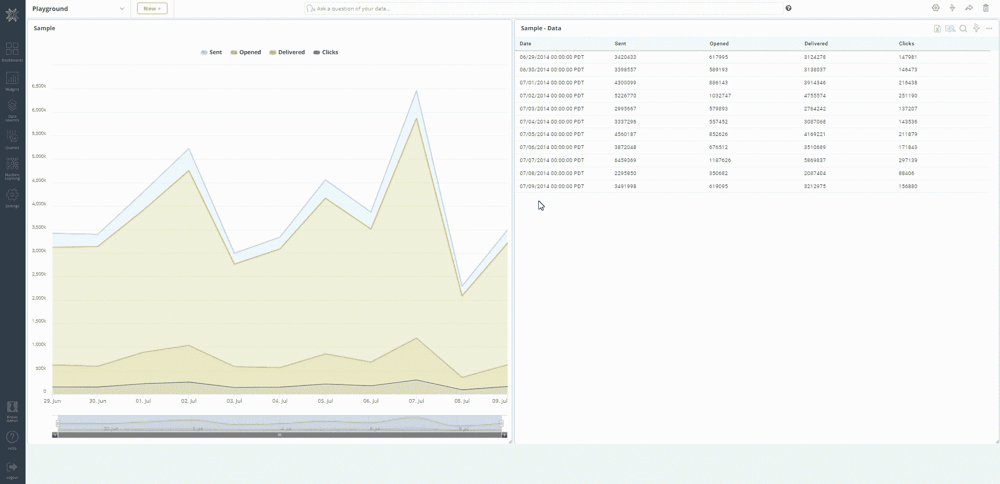

# 使用 Knowi 对 Apache Cassandra 进行本地分析:教程

> 原文：<https://levelup.gitconnected.com/native-analytics-on-apache-cassandra-with-knowi-tutorial-9717f654fada>

作者照片

# **简介**

Apache Cassandra 是一个高度可伸缩、高性能的分布式数据库。它旨在跨许多商用服务器处理大量数据，提供无单点故障的高可用性。Cassandra 的速度、可伸缩性和弹性使其非常适合存储和查询大量数据，尤其是高吞吐量数据。难怪它是流媒体巨头网飞的主干，经常用于物联网分析和实时数据分析用例。

[Knowi](https://www.knowi.com/) 是一个与 Cassandra 原生集成的分析平台，因此您可以利用 Cassandra 的所有查询功能快速可视化大量数据。Knowi 允许您直接使用 CQL 查询 Cassandra，或者使用拖放界面快速构建查询，而无需预先了解查询语法。Knowi 还本机集成了 30 多个 SQL/NoSQL/REST-API 数据源，允许您动态地将您的 Cassandra 数据与这些数据的任意组合结合起来，以创建可用于下游分析的全新数据集。在那里，您可以从大量可视化选项中进行选择，以创建自定义的交互式仪表板，运行即席分析，使用类似谷歌搜索的分析功能从您的数据中提出问题，应用内置的机器学习算法，等等。

> Cassandra 的速度、可伸缩性和弹性使其非常适合存储和查询大量数据，尤其是高吞吐量数据。

对于 [Datastax Analytics](https://www.knowi.com/datastax-enterprise-analytics) ，Knowi 的原生集成还扩展到了 Datastax Astra，Datastax 基于 Apache Cassandra 构建的云原生数据库即服务(DBaaS)。

这篇文章将带你了解使用 Knowi for[Cassandra analytics](https://www.knowi.com/cassandra-analytics)的步骤，包括建立到 Cassandra 数据源的连接，并从中创建交互式可视化。在本次演示中，我们将分析与电子邮件发送活动相关的样本营销数据。我们将讨论的主题包括:

1.  将您的数据 tax Cassandra 数据源连接到 Knowi
2.  编写您的第一个查询
3.  跨多个数据源联接
4.  使用 Cloud9QL 进行后处理
5.  创建您的第一个可视化
6.  添加明细
7.  使用 Knowi 基于搜索的自然语言处理(NLP)

在这里注册一个免费的 Knowi 帐户[开始吧。](https://www.knowi.com/cassandra-analytics)

# 连接到卡珊德拉

Knowi 与其他 NoSQL、SQL、REST-API 和 JSON/CSV 数据源进行了广泛的本地集成。要开始，请选择您的数据源并配置连接。您的数据保留在源中，因此不需要构建 ETL 过程或安装 ODBC 驱动程序。

登录 Knowi 后，我们将开始建立到您的 Datastax Cassandra 数据源的连接。

***步骤* :**

1.  从操场仪表板中，选择侧面板菜单上的“数据源”
2.  从数据源列表中选择数据税
3.  输入您的数据源凭据，并为您的数据源命名
4.  测试连接以确认成功连接到数据源
5.  点击“保存”开始查询你的密钥空间

连接到 datastass(Cassandra)数据源(来源-knowi.com)

# 编写您的第一个查询

一旦连接到 Cassandra 数据源，Knowi 会自动检测其中的表、键和字段。Knowi 还支持 Cassandra 数据类型和集合(即 ascii、blob、counter)以及集合(即 list、map、set)。为了开始构建您的查询，Knowi 通过 UI 使用它的拖放查询构建器为您提供了自动生成查询的选项。这对不熟悉 CQL 的用户尤其有用。对于更高级的 CQL 用户，您还可以选择直接在智能查询编辑器中编写查询，智能查询编辑器是一个多功能的文本编辑器，专门用于编辑代码。

在本例中，我们将选择 ***demo_data*** 表(包含电子邮件发送活动数据)，并从查询构建器自动生成的字段中选择我们想要分析的字段。

***步骤* :**

1.  在“编辑查询”屏幕中，导航至查询构建器部分
2.  在【表格】下拉菜单中，选择 ***demo_data*** 表格
3.  在“指标”下拉菜单中，选择字段 ***客户*** ， ***日期*** ， ***消息 _ 类型*** ， ***已发送*** ， ***已打开*** ， ***已发送*** ，以及 ***转换***
4.  注意，在右边的查询编辑器中，自动生成了一个本地 CQL 查询
5.  如果您已经知道查询语法，您可以直接编写或粘贴它
6.  单击“预览”立即预览结果，结果将以表格形式返回
7.  预览结果后，给你的查询命名，然后点击“保存”

编写您的第一个 Cassandra 查询(来源—knowi.com)

# 跨数据源联接

Knowi 促进了跨多个数据源的连接，以无缝地处理、混合和存储组合结果。传统上，执行从一个数据源到另一个数据源的查找需要工程工作以及结果的映射存储。Knowi 使您能够连接相同或不同的 SQL 或 NoSQL 数据库，将数据拼接成一个结果，并能够存储和跟踪它。支持所有联接类型，包括内部联接、左外部联接、完全外部联接、右外部联接和循环联接。

在本例中，我们将连接到另一个数据源，一个存储客户信息的 MySQL 数据库。一旦连接上，我们将对 MySQL 数据库执行一个连接来提取客户地址。然后，我们将预览连接的每个部分，然后对合并的数据集进行最终预览。

***步骤*** :

1.  重复“连接到 Cassandra”一节中的步骤，这次，选择一个 MySQL 数据库作为数据源
2.  接受 MySQL 默认凭证，测试连接，给它一个名称，然后保存
3.  回到你最初的 Cassandra 查询，点击靠近屏幕底部的“加入”
4.  选择您刚刚保存的 MySQL 数据源作为数据源
5.  这将填充“连接字段”部分以及第一个部分下面的另一个“查询构建器”和“查询编辑器”部分
6.  在【表格】下拉菜单中，选择 ***客户*** 表格
7.  在“指标”下拉菜单中，选择字段 ***【客户】******街道*** 和 ***州***
8.  在“连接字段”部分，单击“连接生成器”。请注意，您也可以通过输入“客户=客户”在文本栏中随意键入连接
9.  检索字段后，选择“内部联接”作为“联接类型”。在“左侧字段”(Cassandra 侧)下，选择关键字段 ***客户*** 。在“右侧字段”(MySQL 端)下，您还将选择关键字段 ***客户*** ，然后保存
10.  *可选* —使用页面左侧每个查询附近的眼睛图标，分别预览每个连接部分的结果
11.  单击“预览”查看新的混合数据集结果

用 MySQL 数据源连接 Cassandra 数据(来源——knowi.com)

# 使用 Cloud9QL 进行后处理

Knowi 还允许您使用 Cloud9QL 来分析和转换这种新的混合数据集，cloud 9ql 是其专有的类似 SQL 的语法，允许用户直接聚合、操作和计算新数据，而不需要额外的数据准备工具。Cloud9QL 特别适用于对返回的数据进行后处理和转换以补充原生查询，从 Know 中的相同数据生成替代视图，以及查询基于文件的数据或查询支持有限的数据存储。请注意，Cloud9QL 并不是底层查询的替代品，而是为返回的结果提供了强大的分析功能。

下面，我们将使用 Cloud9QL 从*和*字段计算电子邮件营销活动的转化率。我们还将应用一个简单的 Cloud9QL 日期操作符从 ***日期*** 字段中提取周值。**

*****步骤*** :**

1.  **导航到屏幕底部的“Cloud9QL Post Query”文本框。这是您编写 Cloud9QL 查询的地方**
2.  **输入以下语法:
    select*，
    (转换率/已交付)*100 作为转换率，
    week(日期)作为周**
3.  **语法分解:
    a .从混合数据集中选择所有字段
    b .返回转换率并创建一个新字段***conversion _ rate*** c .**使用日期运算符 week 提取周值(截断到一周的开始日期—星期一)并创建一个新字段 ***week*******
4.  ****单击“预览”查看更新的结果****
5.  ****完成所有更改后，点击“保存并立即运行”****

********

****用 Cloud9QL 对组合查询结果进行后处理(来源——knowi.com)****

# ****创建您的第一个可视化****

****一旦保存了查询，Knowi 就会从查询结果中创建一个“虚拟数据集”，并将其存储在 Knowi 的“弹性存储”数据仓库中，该数据仓库可以存储和跟踪结果。与需要复杂 ETL 过程和预定义模式的传统仓库不同，弹性存储是一个灵活、可伸缩、无模式的仓库。存储的虚拟数据集是可重用的，并且将是你在 Knowi 中所做的大多数事情的基础，比如创建可视化，将它们添加到仪表板，等等。****

****在本例中，我们将创建一个具有 3 种可视化效果的仪表板:****

*   ****包含原始查询的完整结果的基本数据网格****
*   ****一个堆积柱形图，按消息类型显示每个客户发送的电子邮件总数****
*   ****一个时间序列折线图，按周比较每个客户的平均转换率****

## ****创建新仪表板****

*******步骤*** :****

1.  ****在左侧面板中，单击“仪表板”****
2.  ****点击“+”图标创建一个新的仪表板，并为其命名，然后单击“确定”****
3.  ****将您之前创建的查询中的小部件/报告拖到仪表板中。默认情况下，它将采用网格形式****

********

****在 Knowi 中创建新的仪表板(来源——knowi.com)****

## ****创建堆积柱形图****

*******步骤*** :****

1.  ****在小部件的右上角，单击“自然语言/自助服务分析”图标。这将带您进入分析屏幕****
2.  ****将 ***客户*** 和 ***message_type*** 拖到“分组/维度”部分****
3.  ****将 ***交付的*** 拖至“字段/指标”部分。在“操作”下拉列表中，选择“求和”****
4.  ****在屏幕顶部，单击“可视化”选项卡。这将带您进入可视化设置屏幕。我们要创建一个堆积柱形图，x 轴是 ***客户*** ，y 轴是 ***已交付*** 的总和****
5.  ****在“可视化类型”下拉菜单下的“设置”部分，选择“堆叠柱”****
6.  ****在“选项”部分的“分组/图例”下拉菜单下，选择 ***message_type*******
7.  ****点击右上角的“克隆”图标，从原始数据网格中创建一个新的小部件。这允许我们保留原来的小部件，同时拥有另一个我们可以自由更改的版本****
8.  ****给克隆的 widget 命名，然后将其添加到仪表板。现在，您有了一个新的小部件，它可以可视化每个客户按消息类型发送的电子邮件总数****

********

****在 Knowi 中创建堆积柱形图可视化(来源——knowi.com)****

## ****创建时间序列折线图****

*******步骤*** :****

1.  ****重复前面的步骤，通过单击“自然语言/自助分析”图标返回到数据网格小部件的分析屏幕****
2.  ****将 ***周*** 和 ***客户*** 拖到“分组/维度”部分****
3.  ****将 ***转换率*** 拖到“字段/指标”部分。在“操作”下拉列表中，选择“平均”****
4.  ****在屏幕顶部，单击“可视化”选项卡。这将带您进入可视化设置屏幕。我们要创建一个折线图，x 轴是*周，y 轴是 ***的 avg 转换率********
5.  ****在“可视化类型”下拉菜单下的“设置”部分，选择“折线图”****
6.  ****在“分组/图例”下拉菜单下的“选项”部分，选择 ***客户*******
7.  ****在“Y 轴刻度间隔”文本框中，输入. 10****
8.  ****点击右上角的“克隆”图标，从原始数据网格中创建另一个小部件****
9.  ****给克隆的 widget 命名，然后将其添加到仪表板。现在，您有了另一个小部件，它可以按周显示每个客户的转化率趋势****

********

****在 Knowi 中创建时间序列折线图可视化(来源——knowi.com)****

## ****添加明细****

****明细允许您以强大的方式直观地导航和分析数据。可以将它们设置到另一个小部件、另一个仪表板或同一个仪表板中。由于支持组合不同的钻取模式，钻取可以深入许多级别。来自父小部件的数据可用作深入查看小部件或仪表板的关键字，以过滤特定于所选点的数据。可以使用控制面板中每个小部件上的“明细”菜单选项来配置明细。****

****在本例中，我们将从堆叠柱形图(父级)小部件中设置一个“连接的小部件”明细，当您单击特定客户时，该小部件会过滤控制面板上的数据。****

*******步骤*** :****

1.  ****在堆叠柱形图小工具的右上角，单击“更多设置”图标，然后选择“明细”。将出现明细菜单框****
2.  ****在“明细类型”下拉列表中，选择“连接的小部件”****
3.  ****在“点击时”下拉菜单中，选择 ***客户*******
4.  ****对于“可选明细过滤器”，选择 ***客户*** = ***客户*******
5.  ****点击保存并关闭****
6.  ****转到堆积柱形图窗口小部件，单击代表每个客户(如 Wells Fargo)的任何条形****
7.  ****这将根据客户值“Wells Fargo”过滤仪表板上的所有小部件****
8.  ****要将控制面板恢复到默认状态，请单击控制面板左上角的“后退”按钮****

********

****向您的仪表板添加明细(来源—knowi.com)****

# ****基于搜索的分析和自助分析****

****Knowi 的自然语言功能是一种强大的方式，通过用简单的英语提问来快速推动见解和可视化，从而为非技术用户提供自助分析。这使任何人都能够随时做出更好的数据驱动型决策。该技术通过将您的自然语言查询翻译成 Cloud9QL 语句来解决您的请求。此[基于搜索的分析](https://www.knowi.com/search-based-analytics/)功能可用于仪表盘内的所有数据集和小部件。可以使用小部件上的自然语言/自助分析图标来访问它。****

****下面，我们将使用这个特性从数据中提出一个简单的问题:为每个客户发送的电子邮件总数是多少？然后，我们将根据答案创建一个全新的饼图小部件。****

*******步骤*** :****

1.  ****在仪表板顶部的 NLP 文本栏中，键入“客户发送的总数”****
2.  ****请注意，当您键入时，Knowi 会针对您提出的问题自动给出建议****
3.  ****当结果返回时，您可以检查以确认对 ***发送的*** 字段执行了“求和”操作****
4.  ****在屏幕顶部，单击“可视化”选项卡。您将看到 Knowi 我已经选择了一个饼图作为默认可视化。您可以根据需要更改它****
5.  ****点击“创建小部件”，给它一个名字，然后点击“+创建”和它的仪表板****

********

****使用 Knowi 基于搜索的分析，用简单的英语从你的数据中提问(来源——knowi.com)****

****只需输入问题，您就可以立即分析数据并创建可视化效果。你可以试着自己问下面的问题，以获得更好的感受。****

******简单字段选择:******

> ****“已退回，已发送，客户”
> “显示富国银行的所有信息”
> “已退回，已发送给富国银行”****

******聚合:******

> ****“按客户发送的未结金额总和”
> “按周按客户发送的总计”****

******日期:******

> ****“每周交付总量”
> “每月平均发送量”
> “客户按日期的转换率”****

# ****摘要****

****总之，我们使用 [Knowi](https://www.knowi.com/) 连接到您的 Cassandra(或 Datastax)数据源，并使用动态查询构建器对其进行查询。我们演示了如何在 Cassandra 和 MySQL 数据库之间动态混合数据，使用 Cloud9QL 对混合的数据集应用后处理，从数据集创建多个可视化，以及使用基于搜索的分析提出问题并从数据中即时获得洞察力。****

*****本文最初发表于此:*[***Apache Cassandra 上的原生分析***](https://www.knowi.com/blog/cassandra-analytics-tutorial/)****