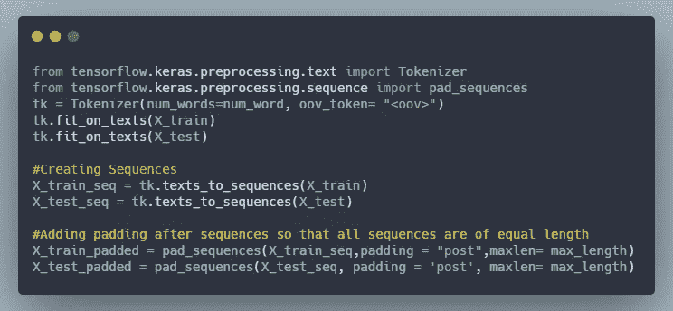
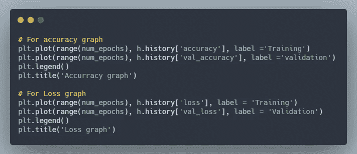

# 使用张量流的自然语言处理和情感分析。

> 原文：<https://levelup.gitconnected.com/natural-language-processing-and-sentiment-analysis-using-tensorflow-c2948f2623f>

自然语言处理(NLP)是人工智能和深度学习的一个领域，它赋予机器阅读、理解和从人类语言中获取意义的能力，并专注于数据科学和人类语言之间的交互。


这次尝试是先睹为快，主要集中在使用 Tensorflow 和 Keras 执行基本的情感分析。一种常用的方法是使用卷积神经网络(CNN)来进行情感分析。然而，Keras 有 **Embedding()** 层、**globaveragepooling1d()**和 **LSTM** 层，可以用来建立一个更加精确的机器学习模型。

Keras 的顺序 API 很容易使用，也很常用于创建层的线性堆栈。它提供了**输入** *层*用于取输入，**密集** 层用于创建单层神经网络，内置 ***tf.losses*** 用于选择一系列损失函数使用，内置****TF . optimizer***，内置***TF . activation***我们可以创建自定义层、损失函数等。*

*从导入 Tensorflow 和其他必需的库和包开始。*

**

# *数据准备和清理。*

*导入数据集或 CSV 文件，并检查包含所有类的列的 value_counts()。*

****

*数据帧的前十行。*

*该数据集没有情感分类栏，这就是为什么我们将使用 df[“评级”]栏来创建熊猫数据框架中可能的情感栏。一种可能的方法是创建一个函数，对于较低的评级返回“负”，对于相对较高的评级返回“正”。目的是创建一个新的数据帧，我们稍后将使用它进行编码。*

**

*为数据执行可视化。WordCloud 总是一个不错的选择，因为 WordCloud 旨在根据单词出现的频率，根据它们的大小来突出它们。*

*用 Python 生成单词云，需要的模块有——matplotlib、pandas 和 word cloud。要安装这些软件包，请运行以下命令:*

```
*pip install matplotlib
pip install pandas
pip install wordcloud*
```

*你可以在这里 查看 WordCloud 的文档:[](https://amueller.github.io/word_cloud/)*

**下一步是预处理和删除停用词。文本清理程序取决于任务。例如，如果您的任务是文本分类或情感分析，那么您应该删除停用词，因为它们不会为建模提供任何信息，但是如果您的任务是语言翻译，那么停用词是有用的。我们将使用 NLTK(自然语言工具包)来下载这些停用词。**

****

# **列车测试分离**

**机器学习就是一般化，这样你的推论对看不见的数据是正确的。如果你不分割它，你将会在所有可用的数据上进行训练。尽管你现在可能已经根据这些数据做出了正确的推论。但是你不能确定，你的推论在看不见的数据上有多好。因此，验证和测试集是分开的，这样您就可以了解模型如何处理看不见的数据。**

****

# **使用记号赋予器和创建填充序列。**

**Tokenizer 允许对文本语料库进行矢量化，方法是根据字数将每个文本转换为整数序列(每个整数是字典中某个标记的索引)或向量，其中每个标记的系数可以是二进制的。**

****

**我已经使用**TF . keras . preprocessing . sequence . pad _ sequences**为句子创建填充序列。这个函数将序列列表(长度为`num_samples`)转换成形状为`(num_samples, num_timesteps)`的 2D Numpy 数组。`num_timesteps`或者是`maxlen`参数(如果提供的话)，或者是列表中最长序列的长度。**

**在这之后，我们还必须对标签进行标记，并为测试数据创建 pad_sequences。因为我们将使用它作为模型训练的验证集。**

# **使用 Keras 构建模型**

****

**在检查了模型和所有可训练参数的概要之后，我们所要做的就是在相当数量的时期内根据训练数据来训练我们的模型。**

****

**在完成训练后，我得到了 0.9032 的训练精度和 0.8742 的验证精度，这很好。此外，差异较小，这表明这不是一个过度拟合的情况。**

****

# **绘制精确度和损耗图。**

****

**这是这些图表的样子。**

********

# **用我们的模型做预测。**

**我们要做的第一件事是标记我们的类，因为我们将使用这些标记作为类列表的索引。显然，第二步是创建一个包含所有这些情感的课程列表。**

**第三步是使用 **model.predict()** 进行预测，这将返回一个数组。为了获得我们预测的令牌或索引，我们将使用 **np.argmax()** ，因为它将以最高的概率返回令牌(这是 softmax 函数发挥作用的地方)。**

****

**这个代码块将允许我们从用户的输入(审查)，并把 word_index 序列。预测将在填充的句子上进行，该句子稍后返回样本文本的预测类别。**

**这就是如何根据看不见的数据做出预测。**

**我们还可以使用 LSTM 和 RNNs 来提高模型的准确性。长短期记忆(LSTM)网络是一种能够在序列预测问题中学习顺序依赖性的递归神经网络。**