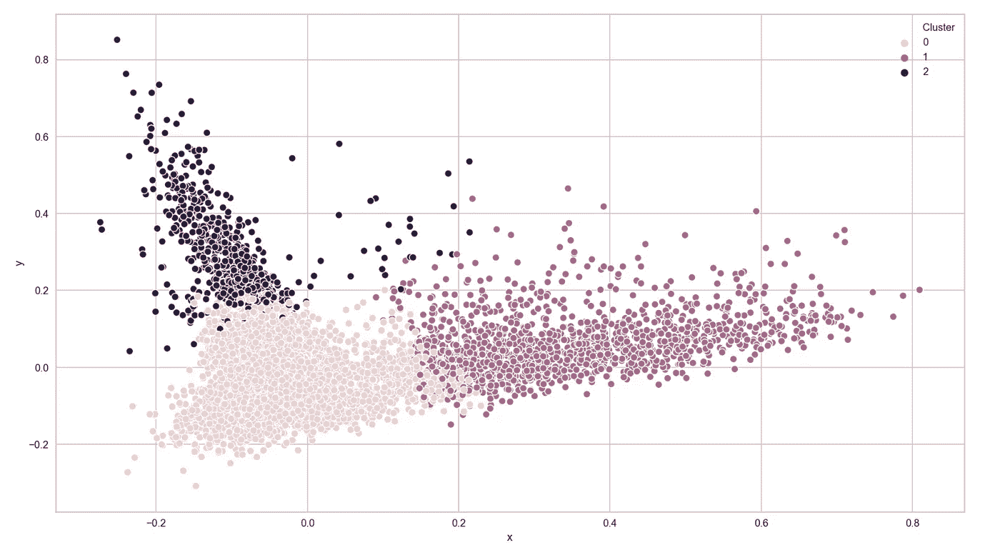

# 用户评论数据集上的自然语言处理和主题建模

> 原文：<https://levelup.gitconnected.com/natural-language-processing-and-topic-modeling-on-user-review-dataset-66599beaa50e>

# 介绍

自然语言处理是计算机科学中的一个热门话题。像句子这样的非结构化数据对人类来说很有意义，但对计算机来说却不是。

为了让机器知道句子的意思，我们需要将人类可以理解的句子编码成机器可以理解的数字。这个过程有点像计算机如何存储图像，使用通道中的像素强度。

我今天要介绍的方法是术语频率-逆文档频率(TF-IDF)，这是一种数值统计，用来描述一个术语对集合中一个文档的重要性。

# 预处理

## 标记化

为了执行 TF-IDF，我们需要首先对文档进行令牌化。

> 标记化是将文本拆分成单个单词或单词序列(N 元语法)的过程。

例如，正文是“汤姆和我上周末去了纽约”。在标记化之后，我们有一个这样的单词列表:

《汤姆》、《和》、《我》、《去了》、《去了》、《纽约》、《最后》、《周末》

这是一个一词标记化的例子。您还可以执行两个字母组合，然后您可以在输出中保留像“New York”这样的短语。

您可能还希望删除像“and”和“to”这样的停用词，并将这些词规范化为所有小写字母，因为大多数情况下停用词和大写字母不会传达太多信息，但会使我们的建模过程变得复杂。

有时候，你可能会觉得一个单词的屈折形式很讨厌，比如“playing”和“played”。实际上，我们可以在这一步通过将“playing”和“played”转换为“play”来阻止单词。这样，我们限制了标记化单词列表中不必要的变化。

要完成这个过程，python 包自然语言工具包(NLTK)非常有帮助。

完成标记化后，我们可以看一看并深入研究 TF-IDF。

## ***【词频-逆文档频(TF-IDF)】***

现在我们有了上一步中的标记化单词列表。我们可以对数据执行聚类算法或主题建模吗？答案是否定的，模型不能直接理解文字。

我们需要一个加权因子来表示一个单词在文档集合中的重要性。而这里就出现了频率-逆文档频率(TF-IDF)这个术语。

数学上，TF-IDF 等于词频和逆文档频的乘积。

TF-IDF(t，d) = TF(t，d) * IDF(t)

对于**词频** TF(t，d)，最简单的选择是文档中某个词的*原始计数*除以文档中的总项数。

TF(t，d) =文档 d 中术语 t 的计数/文档 d 中的总字数

**逆文档频率** IDF(t)是对单词提供多少信息的度量，可以通过取文档总数除以包含该术语的文档数的对数来获得。

IDF(t) = log(语料库中的文档总数/带有术语 t 的文档数)

更常见的是，我们会在分母上加 1，以避免被零除。

我们可以使用 sklearn 库来帮助我们进行 TF-IDF 转换。

这样，我们可以将输入的评审数据矩阵转换成数字矩阵。太好了！最后，我们可以建立一个模型。

# 建模

k 均值和潜在狄利克雷分配(LDA)是无监督的机器学习算法，可以将输入聚类到不同的组中。这就是我们将要在用户评论数据集上做的，找出可能的主题组。

## ***——K 的意思是***

K-means 是一种流行的聚类算法，其目的是将观察值分成组。

K-means 中的主要步骤可以描述如下:

> *K 均值算法*

*   *随机选择 K 个点作为初始质心*
*   ***重复******这两步，直到*** *质心不变或在公差范围内*

*—通过将所有点分配到最近的质心来形成 K 个聚类*

*—重新计算每个簇的质心*

在实践中，我们可以将终止条件设置为最大迭代或容差。

您可以使用 python sklearn 库实现 Kmeans:

> 集群的总数是我们需要在模型中调整的一个超参数。如果给定两个聚类结果，我们如何知道哪一个更好？

**如何评价聚类质量？**

聚类质量有几种数值度量。

*   ***平方和误差(WSSE)*** 是聚类同质性的度量，通过对每个点到其聚类质心的平方距离求和来计算。给定两个集群解决方案，WSSE 较小的解决方案应该是首选。
*   ***【BSSE】***之间的平方和误差是聚类分离的度量。BSSE 是聚类质心和“大平均值”之间的距离的度量。给定两个集群解决方案，应首选 BSSE 较大的解决方案。
*   ***剪影系数*** 结合了同质性和分离性。轮廓系数始终在-1 和 1 之间。越接近 1，聚类质量越好。

通过使用这些指标，我们能够评估我们的集群解决方案的质量。

## ***【潜狄氏分配】***【LDA***)***

潜在狄利克雷分配(LDA)是主题建模的一个例子。它可以通过发现每个文档中的潜在主题将评论分成不同的组。

> 在自然语言处理中，**潜在狄利克雷分配** ( **LDA** )是一种生成统计模型，它允许通过未观察到的组来解释观察集，这解释了为什么数据的某些部分是相似的。(维基百科)

可以使用 python sklearn 库实现**潜在狄利克雷分配**:

# 结果

这是我们模型的可视化结果。基于分析，我们发现聚类 0 包含更多负面评论，而聚类 2 包含更多正面评论。第一组的评论更加中立。

如果想了解更多的实现细节，可以在下面找到 Github 链接。感谢您的阅读！

[https://github . com/韩嫣-si/NLP-and-Topic-Modeling-on-User-Review-Dataset](https://github.com/yanhan-si/NLP-and-Topic-Modeling-on-User-Review-Dataset)