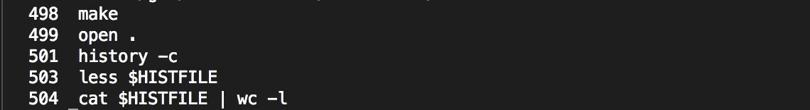
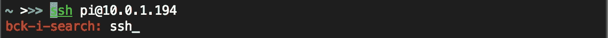
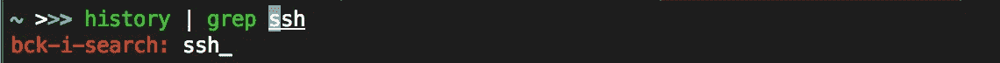

# 像老板一样浏览您的 Unix Shell 历史

> 原文：<https://levelup.gitconnected.com/navigate-your-unix-shell-history-like-a-boss-5722ef45689f>

您的 shell 历史不仅仅是箭头键…


马库斯·斯皮斯克在 [Unsplash](https://unsplash.com?utm_source=medium&utm_medium=referral) 上拍摄的照片

如果您使用 Mac 或 Linux 终端，那么您很可能已经与 shell 历史交互过。我认识的大多数人只是使用向上箭头来查找以前执行过的命令，但是这错过了大量的功能。

在本教程中，我将教你如何像老板一样驾驭历史。

# 历史到底是什么？

大多数 Unix 风格的 shells 都有内置的历史特性。这意味着当您键入一个命令时，shell 会记住它，您可以在以后调用它。

历史不是魔术，命令实际上存储在内存中，随后存储在一个文件中。您可以通过以下方式找到它:

```
echo $HISTFILE
```

对我来说，这张照片:

```
/home/dir/.zhistory
```

要查看文件内容，我们可以运行:

```
cat $HISTFILE
```

我们可以看到这只是一个简单的命令列表。存储的命令数量由两个 shell 变量控制:

*   `HISTSIZE`，决定会话运行时内存中存储的命令数量
*   `HISTFILESIZE`，决定历史文件中存储的命令数量。

要保存最后的 1000 个命令，请将如下内容添加到您的 shell 配置文件中(通常是`~/.bashrc`或`~/.zshrc`):

```
export HISTFILESIZE=1000
export HISTSIZE=1000
```

# 浏览历史

如前所述，可以使用键盘上的箭头键浏览历史记录，按 enter 键执行存储的命令。但是还有比这更大的潜力！

## 编号历史列表

要获取命令的编号列表，请键入:

```
history
```

这将产生如下输出:



## 运行以前的命令

要从我们的历史中运行一个特定的命令，我们可以使用一个`!`后跟命令号。例如:

```
!504
```

这将执行历史列表中的命令`504`。

我们还可以重新执行上次运行的命令:

```
!!
```

要通过文本内容而不是数字来运行前面的命令，我们可以使用:

```
!cat
```

所有上述命令将导致执行相同的命令(504)，给出以下输出:


有时我们想在执行命令之前检查它。为此，我们添加了`:p`。例如:

```
!ssh:p
```

这将打印出如下内容:


我经常使用`!ssh`来恢复我之前的`ssh`会话，而不需要输入完整的命令。另一种方法是:

```
ssh !*
```

操作符`!*`使用历史中上一次调用该命令的参数。在我们的例子中，`!ssh`直接等同于`ssh !*`。

## “反向 I”搜索

在 shell 中键入“ctrl-r”将启动“反向 I”搜索。这使得交互式搜索(反向)通过您的命令历史。

例如，键入“ctrl-r ”,后跟“ssh ”,会得到以下结果:



再次点击“ctrl-r”会给出包含文本`ssh`的下一个命令。



要运行找到的命令，请按 enter 键。要退出反向搜索，请点击“ctrl-g”。

# 额外提示:标记历史

因为 shell 中#字符之后的任何内容都被解释为注释，所以我们可以用它来“标记”某些命令。

例如:

```
ls | grep "some really complicated regex" #mygrep
```

然后，我们可以使用 reverse-i-search 来执行基于标签的命令。我们通过键入以下命令来实现:

*   ctrl-r
*   #mygrep
*   进入

如果您正在使用`zsh`，您可能还需要在您的`.zshrc`中添加下面一行来启用交互式评论，以实现这一功能:

```
setopt interactivecomments
```

感谢阅读！如果你有任何额外的历史提示，我很乐意在评论中听到。